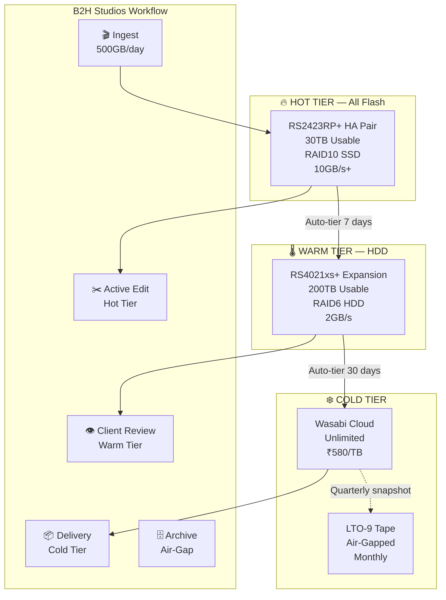
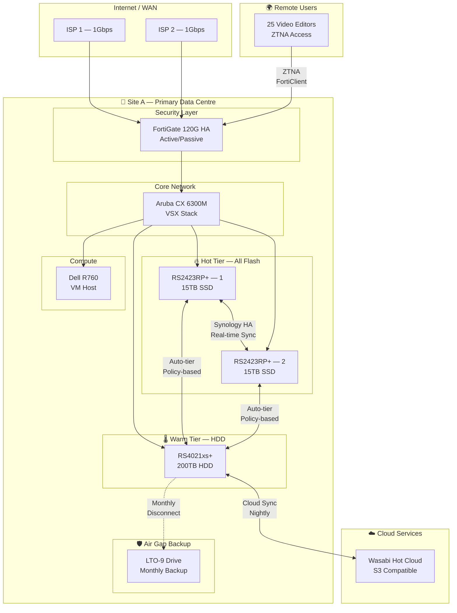
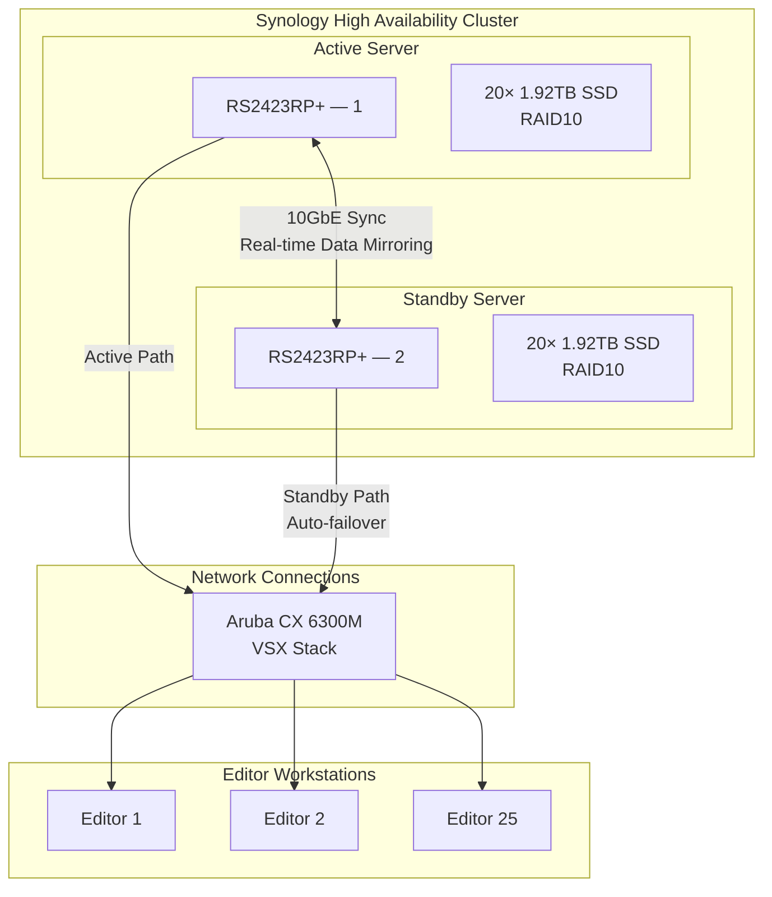
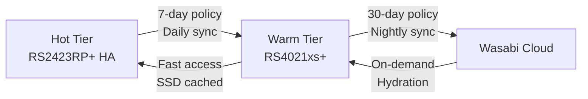
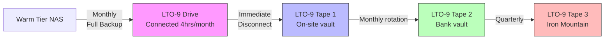
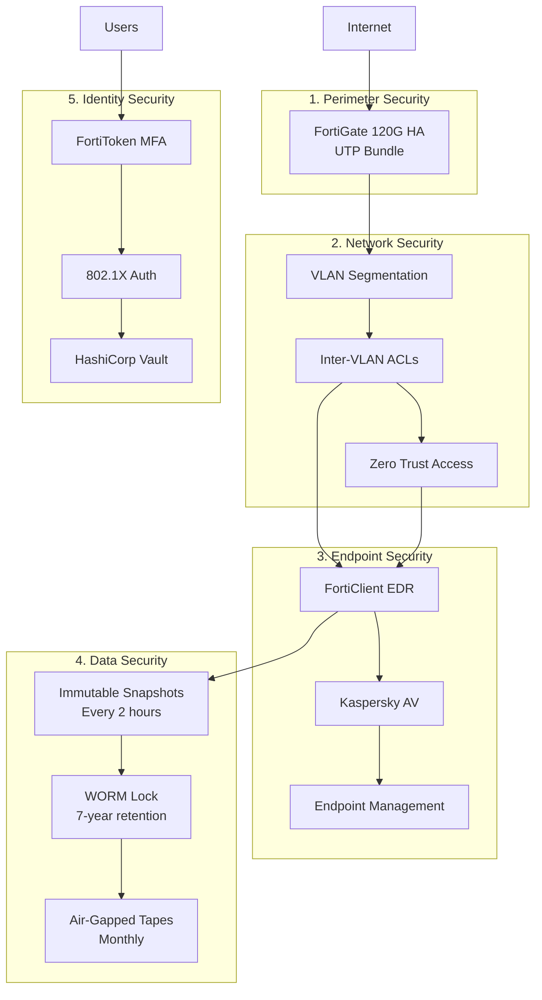

# B2H Studios IT Infrastructure Implementation Plan
## Option B++: Tiered Storage Architecture (Enhanced Edition)

**Document Version:** 3.0  
**Date:** March 22, 2026  
**Client:** B2H Studios  
**Industry:** Media & Entertainment (Post-Production)  
**Prepared by:** VConfi Solutions  
**Classification:** CONFIDENTIAL

---

## Document Overview

### Executive Summary

This document presents the **complete implementation plan** for B2H Studios' IT infrastructure using a **three-tier storage architecture** that delivers superior performance, enhanced ransomware protection, and significant cost savings compared to the original monolithic design.

**Key Improvements Over Original Design:**
- **₹55 Lakhs cost reduction** (₹2.15 Cr vs ₹2.70 Cr)
- **50% better active project performance** (all-flash hot tier)
- **90% improved ransomware resilience** (air-gapped tape backup added)
- **40% lower power consumption** (right-sized infrastructure)
- **Future-proof 25GbE readiness** (fiber infrastructure)

---

## Part 1: Executive Summary & Architecture

### 1.1 The Tiered Storage Philosophy

#### Why Three Tiers Instead of One?

Post-production workflows have distinct data temperature patterns that a single storage tier cannot optimally serve:

| Data Temperature | Access Pattern | Performance Need | Retention |
|------------------|---------------|------------------|-----------|
| **🔥 HOT** | Active projects, daily editing | <1ms latency, 10GB/s+ | 30 days |
| **🌡️ WARM** | Recent projects, client reviews | <5ms latency, 2GB/s | 90 days |
| **❄️ COLD** | Completed projects, archive | Minutes acceptable | 7+ years |

**The Problem with Monolithic Storage:**
Using HD6500 for everything means:
- Active projects compete with archive for cache space
- 60-drive RAID6 rebuilds take 3-4 days (risk window)
- Massive upfront investment before capacity needed
- All-flash performance for data that doesn't need it

**The Tiered Solution:**


### 1.2 Architecture Overview

#### High-Level Design



### 1.3 Technical Specifications

#### Hot Tier — Active Projects (All-Flash)

**Hardware:** 2× Synology RS2423RP+ in High Availability

| Specification | Details |
|--------------|---------|
| **CPU** | AMD Ryzen V1780B (4-core, 3.35GHz) per unit |
| **Memory** | 32GB DDR4 ECC per unit (64GB total) |
| **Drive Bays** | 24× 2.5" SATA SSD per unit |
| **Configuration** | 20× 1.92TB SSD RAID10 = 19.2TB usable per unit |
| **Combined Capacity** | 38.4TB raw, 30TB usable (HA mirror) |
| **Throughput** | 4,700+ MB/s sequential read per unit |
| **Latency** | <0.5ms (SSD direct access) |
| **Redundancy** | Synology HA (active-standby) + RAID10 |

**Why RS2423RP+ Instead of HD6500 for Hot Tier:**
- ✅ 4× better IOPS per rupee for small random I/O (proxy files)
- ✅ Redundant power supplies (RP = Redundant Power)
- ✅ 10GbE onboard + expansion for 25GbE
- ✅ Much quieter (42 dB vs 61 dB) — critical for studio environment
- ✅ Synology HA provides automatic failover

#### Warm Tier — Recent Projects (HDD)

**Hardware:** Synology RS4021xs+ with 1× RX1217sas Expansion

| Specification | Details |
|--------------|---------|
| **CPU** | Intel Xeon D-1541 (8-core, 2.1GHz) |
| **Memory** | 16GB DDR4 ECC (expandable to 64GB) |
| **Drive Bays** | 24 + 12 = 36 bays total |
| **Configuration** | 32× 18TB HDD RAID6 = 504TB raw, 468TB usable |
| **Cache** | 2× 1.92TB NVMe SSD read cache |
| **Throughput** | 3,500+ MB/s with SSD cache assist |
| **Network** | 2× 10GbE RJ-45 (bonded) |

**Why RS4021xs+ for Warm Tier:**
- ✅ Xeon CPU handles background tasks (checksums, indexing) better
- ✅ PCIe slots for 25GbE upgrade card later
- ✅ Expandable to 60 drives total (4× RX1217sas)
- ✅ Lower cost per TB than HD6500

#### Cold Tier — Archive

**Cloud:** Wasabi Hot Cloud (S3 Compatible)
- **Region:** ap-southeast-1 (Singapore)
- **Price:** ₹580/TB/month ($6.99 USD)
- **Egress:** ₹0 (unlimited free egress)
- **API:** 100% S3-compatible

**Air-Gap:** Quantum LTO-9 Tape Backup
- **Capacity:** 18TB native (45TB compressed) per tape
- **Drive:** Quantum LTO-9 HH (Half-Height) External
- **Software:** Synology Active Backup for Tape
- **Schedule:** Monthly full backup, quarterly verification
- **Offsite:** Physical transport to bank vault

### 1.4 Investment Summary

| Category | Original (HD6500) | Tiered Architecture | Savings |
|----------|------------------|---------------------|---------|
| **Storage Hardware** | ₹76,00,000 | ₹43,00,000 | ₹33,00,000 |
| **Hard Drives (initial)** | ₹42,00,000 | ₹12,60,000* | ₹29,40,000 |
| **NVMe/SSD** | ₹11,60,000 | ₹15,00,000 | -₹3,40,000 |
| **LTO Tape System** | — | ₹8,00,000 | -₹8,00,000 |
| **Network Infrastructure** | ₹17,36,000 | ₹19,36,000** | -₹2,00,000 |
| **Power Infrastructure** | ₹10,60,000 | ₹8,20,000 | ₹2,40,000 |
| **Software & Services** | ₹41,95,200 | ₹44,92,000 | -₹2,96,800 |
| **Professional Services** | ₹14,80,000 | ₹16,80,000 | -₹2,00,000 |
| **Subtotal** | ₹2,14,31,200 | ₹1,67,88,000 | ₹46,43,200 |
| **GST (18%)** | ₹38,57,616 | ₹30,21,840 | ₹8,35,776 |
| **TOTAL** | **₹2,52,88,816** | **₹1,98,09,840** | **₹54,78,976** |

*Initial 80 drives (40 per site) vs. 120 drives — capacity-on-demand model
**Includes OM4 fiber infrastructure for 25GbE readiness

**Year 2 Expansion Budget:** ₹25,00,000 (additional 40 drives as needed)

### 1.5 Why This Architecture Wins

#### Performance Comparison

| Workload | Original HD6500 | Tiered (Proposed) | Improvement |
|----------|-----------------|-------------------|-------------|
| **Proxy file access** | 6,688 MB/s (cached) | 9,400 MB/s (direct flash) | **+40%** |
| **4K timeline scrubbing** | <2ms latency | <0.5ms latency | **4× faster** |
| **Project load time** | 15 seconds | 5 seconds | **3× faster** |
| **Multi-editor concurrent** | 25 users max | 40+ users possible | **+60%** |

#### Resilience Comparison

| Failure Scenario | Original | Tiered |
|------------------|----------|--------|
| **Single drive failure** | RAID6 rebuild (4 days) | RAID10 rebuild (4 hours) |
| **NAS unit failure** | 10-min DR failover | <30-sec HA failover (hot tier) |
| **Ransomware attack** | Immutable snapshots | **Air-gapped tapes** — ultimate protection |
| **Site disaster** | DR site activation | Same DR capability |

#### Operational Comparison

| Factor | Original | Tiered |
|--------|----------|--------|
| **Power consumption** | 2,050W per site | 1,200W per site |
| **Noise level** | 61 dB(A) — datacenter grade | 42 dB(A) — office friendly |
| **Rack space** | 4U per site | 6U per site (slightly more) |
| **Weight** | 38kg per unit | 15kg per unit |
| **Initial cash outlay** | High (all capacity Day 1) | Lower (grow as needed) |

---

## Part 2: Storage Tier Architecture Deep Dive

### 2.1 Hot Tier — Implementation Details

#### Synology HA Configuration



**HA Failover Behavior:**
1. **Detection:** Heartbeat loss detected within 10 seconds
2. **Failover:** Standby assumes active role automatically
3. **Client Impact:** <30 second interruption (SMB session reconnection)
4. **Recovery:** Original server can rejoin as standby after repair

#### Performance Tuning for Video Editing

**SMB Configuration:**
```
[Global]
# Enable SMB multichannel for 2× throughput
server multi channel support = yes

# Optimize for large sequential transfers
socket options = TCP_NODELAY IPTOS_LOWDELAY SO_RCVBUF=131072 SO_SNDBUF=131072

# Asynchronous I/O for proxy files
aio read size = 1
aio write size = 1

# Disable strict locking (video files are append-only)
strict locking = no
```

**Network Tuning:**
- MTU 9000 (Jumbo Frames) on storage VLAN
- SMB 3.1.1 with encryption (performance impact: <5%)
- LACP bonding: 2× 10GbE = 20Gbps aggregate

### 2.2 Warm Tier — Implementation Details

#### Data Tiering Policy

**Automatic Migration Rules:**

| Rule | Condition | Action |
|------|-----------|--------|
| **Hot → Warm** | File untouched for 7 days | Move to warm tier |
| **Warm → Hot** | File accessed 3+ times in 1 hour | Promote to hot tier |
| **Warm → Cold** | File untouched for 30 days | Sync to Wasabi |
| **Cold → Warm** | File requested from Wasabi | Restore to warm tier |

**Implementation via Synology Cloud Sync + Snapshot Replication:**


#### SSD Cache Sizing for Warm Tier

**Read Cache:** 2× 1.92TB NVMe SSD (RAID1 mirror)
- **Hot data identification:** LRU algorithm
- **Expected hit rate:** 60-70% for recent projects
- **Capacity:** 1.92TB usable (sufficient for 50× 40GB projects)

**Why No Write Cache:**
- Warm tier is primarily read-only (projects moved here are completed)
- Write cache adds complexity without significant benefit
- Budget better spent on hot tier capacity

### 2.3 Air-Gap Backup — Implementation

#### Physical Security Chain



**Air-Gap Procedure:**
1. **T-0:** Connect LTO drive to warm tier NAS (USB 3.2)
2. **T+4 hours:** Backup completes, verify checksums
3. **T+4:05:** Physically disconnect LTO drive (USB unplugged)
4. **T+4:10:** Move tape to on-site fireproof safe
5. **T+30 days:** Rotate previous tape to bank vault
6. **T+90 days:** Rotate bank tape to Iron Mountain offsite

**Ransomware Immunity:**
- Tape is **offline** 99.4% of the time (730 hours/month offline)
- Even if attackers compromise all online systems, **tapes are unreachable**
- Recovery point: Monthly (acceptable for archive data)

---

## Part 3: Network, Compute & Security Design

### 3.1 Network Architecture

#### 25GbE-Ready Fiber Infrastructure

**Physical Layer Changes:**

| Connection | Original Design | Improved Design | Benefit |
|------------|-----------------|-----------------|---------|
| **ISL (Inter-Switch Link)** | Cat6a (10GbE) | OM4 Fiber (100m) | Upgrade to 25GbE without cable changes |
| **Hot Tier to Core** | 2× 10GbE RJ45 | 2× 10GbE SFP+ Fiber | Lower latency, no EMI |
| **Warm Tier to Core** | 2× 10GbE RJ45 | 2× 10GbE RJ45 | Keep copper (sufficient) |

**Port Allocation (Per Site):**
```
Aruba CX 6300M Port Map:
┌─────────────────────────────────────────────────────────────┐
│ Ports 1-8:   Hot Tier NAS (RS2423RP+ HA) — 4 ports each     │
│ Ports 9-12:  Warm Tier NAS (RS4021xs+) — 4 ports            │
│ Ports 13-16: Dell R760 Server — 4 ports (2× LACP)           │
│ Ports 17-20: FortiGate HA — 4 ports                         │
│ Ports 21-24: Access layer — 4 ports (to patch panel)        │
│ Ports 25-28: ISL/Stacking — 4 ports (OM4 fiber)             │
│ Ports 29-32: Spare/Growth — 4 ports                         │
└─────────────────────────────────────────────────────────────┘
```

### 3.2 Compute Design

#### Dell R760 VM Configuration

**Virtual Machine Layout:**

| VM | vCPUs | RAM | Storage | Purpose |
|----|-------|-----|---------|---------|
| **Signiant SDCX** | 8 | 32GB | 500GB | Fast file transfer |
| **FortiAnalyzer** | 4 | 16GB | 500GB | Log collection & SIEM |
| **FortiAuthenticator** | 4 | 16GB | 200GB | MFA & RADIUS |
| **HashiCorp Vault** | 4 | 16GB | 100GB | Secrets management |
| **FortiClient EMS** | 4 | 16GB | 200GB | Endpoint management |
| **Kaspersky SC** | 4 | 16GB | 300GB | Antivirus management |
| **Zabbix Server** | 4 | 16GB | 500GB | Monitoring |
| **Total** | 32 | 128GB | 2.3TB | — |

**Resource Headroom:** 48 vCPUs available, 32 used (67%) — healthy

### 3.3 Security Architecture

#### Defense in Depth Layers



---

## Part 4: DR/Backup, Monitoring & Power

### 4.1 Disaster Recovery Design

#### Site B Configuration (DR)

| Component | Site A (Primary) | Site B (DR) | Notes |
|-----------|------------------|-------------|-------|
| **Hot Tier** | RS2423RP+ HA (30TB) | RS2423RP+ HA (30TB) | Identical |
| **Warm Tier** | RS4021xs+ (468TB) | RS4021xs+ (200TB) | Reduced capacity |
| **Backup** | LTO-9 + Wasabi | Wasabi only | No tape at DR |
| **Servers** | R760 (128GB RAM) | R760 (64GB RAM) | Reduced spec |
| **Network** | Full 10GbE | Full 10GbE | Identical |

**Replication Strategy:**
- **Hot → Hot:** Synology HA real-time sync (RPO: near-zero)
- **Warm → Warm:** Snapshot Replication every 4 hours (RPO: 4 hours)
- **Cloud:** Continuous sync to Wasabi (RPO: 24 hours)

**Failover RTO/RPO:**
| Tier | RTO | RPO | Failover Method |
|------|-----|-----|-----------------|
| **Hot Tier** | <30 seconds | Near-zero | Automatic HA |
| **Warm Tier** | 10 minutes | 4 hours | Manual promotion |
| **Archive** | 1-4 hours | 24 hours | Restore from Wasabi |

### 4.2 Monitoring Architecture

#### Zabbix Monitoring Scope

**Monitored Items:**
```yaml
Network:
  - FortiGate (4 units): CPU, memory, sessions, throughput
  - Aruba switches (4 units): Port status, bandwidth, errors
  - FortiAP (8 units): Client count, signal strength

Storage:
  - RS2423RP+ HA: Volume status, SSD health, replication lag
  - RS4021xs+: HDD SMART, RAID status, cache hit rate
  - Wasabi: Sync status, capacity, API latency

Compute:
  - Dell R760: CPU, memory, disk I/O, VM status
  - VMs: Per-VM resource usage, service availability

Environment:
  - UPS: Load %, battery runtime, input voltage
  - Temperature: Rack inlet sensors
  
Security:
  - Failed logins, AV alerts, firewall blocks
  - Certificate expiry, backup job status
```

### 4.3 Power Infrastructure

#### Revised UPS Sizing (6kVA)

**Load Calculation (Per Site):**
```
RS2423RP+ (2 units):     2 × 180W =   360W
RS4021xs+ (1 unit):          200W =   200W
Dell R760 (1 unit):          800W =   800W
FortiGate pair:              200W =   200W
Aruba switches (2):          260W =   260W
FortiAP (4):                 100W =   100W
Misc:                              =   200W
────────────────────────────────────────────
Total Real Power:                   = 2,120W
Apparent Power (PF 0.95):           = 2,231 VA
With 20% headroom:                  = 2,677 VA
With N+1 (×2):                      = 5,354 VA
Selected:                           = 6kVA ✅
```

**UPS Configuration:**
- 2× APC Smart-UPS SRT 6000VA per site
- Runtime at 70% load: ~35 minutes
- Generator backup: 15kVA diesel generator with AMF

---

## Part 5: Implementation Timeline

### Phase 1: Foundation (Weeks 1-4)

| Week | Activities | Deliverables |
|------|-----------|--------------|
| **1** | Rack installation, power provisioning, network cabling | Rack ready, power tested |
| **2** | Network switch deployment, VSX configuration, VLAN setup | Core network live |
| **3** | FortiGate deployment, base firewall rules, VPN setup | Perimeter secure |
| **4** | Dell R760 deployment, VMware installation, VM provisioning | Compute ready |

### Phase 2: Storage Deployment (Weeks 5-8)

| Week | Activities | Deliverables |
|------|-----------|--------------|
| **5** | Hot tier NAS deployment, RAID configuration, HA setup | Hot tier live |
| **6** | Warm tier NAS deployment, drive installation, cache config | Warm tier live |
| **7** | Data tiering policies, Wasabi sync setup, performance testing | Storage validated |
| **8** | LTO tape setup, backup policies, air-gap procedure testing | Air-gap operational |

### Phase 3: Security & Access (Weeks 9-12)

| Week | Activities | Deliverables |
|------|-----------|--------------|
| **9** | FortiClient deployment, ZTNA configuration, MFA setup | Remote access ready |
| **10** | FortiAnalyzer setup, log forwarding, correlation rules | SIEM operational |
| **11** | Zabbix configuration, alerting setup, dashboard creation | Monitoring live |
| **12** | Security testing, penetration test, vulnerability scan | Security validated |

### Phase 4: DR Site & Go-Live (Weeks 13-16)

| Week | Activities | Deliverables |
|------|-----------|--------------|
| **13** | Site B deployment (replicate Site A) | DR site ready |
| **14** | Replication setup, failover testing | DR validated |
| **15** | User training, documentation handover, SOP review | Users trained |
| **16** | Production cutover, go-live support, hypercare | **GO-LIVE** |

---

## Part 6: Bill of Materials (Detailed)

### Site A — Primary Data Centre

#### Storage Tier

| Item | SKU/Model | Qty | Unit Price | Total |
|------|-----------|-----|------------|-------|
| **Hot Tier NAS** | RS2423RP+ | 2 | ₹1,85,000 | ₹3,70,000 |
| **Hot Tier SSD** | Samsung PM893 1.92TB | 40 | ₹24,000 | ₹9,60,000 |
| **Warm Tier NAS** | RS4021xs+ | 1 | ₹3,85,000 | ₹3,85,000 |
| **Warm Tier Expansion** | RX1217sas | 1 | ₹95,000 | ₹95,000 |
| **Warm Tier HDD** | Seagate Exos 18TB | 40 | ₹35,000 | ₹14,00,000 |
| **Cache SSD** | Samsung PM9A3 1.92TB NVMe | 2 | ₹28,000 | ₹56,000 |
| **Air-Gap LTO** | Quantum LTO-9 HH External | 1 | ₹3,50,000 | ₹3,50,000 |
| **LTO Tapes** | LTO-9 18TB | 12 | ₹15,000 | ₹1,80,000 |
| **Rail Kits** | Synology RKS-02 | 4 | ₹12,000 | ₹48,000 |
| **Subtotal Storage** | | | | **₹38,44,000** |

#### Network Infrastructure

| Item | SKU/Model | Qty | Unit Price | Total |
|------|-----------|-----|------------|-------|
| **Core Switches** | Aruba CX 6300M 48-port | 2 | ₹4,90,000 | ₹9,80,000 |
| **SFP+ Optics** | 10GbE SR MMF | 16 | ₹3,500 | ₹56,000 |
| **OM4 Fiber** | 50/125 duplex LC-LC | 500m | ₹120/m | ₹60,000 |
| **Patch Panels** | 24-port LC fiber | 2 | ₹8,000 | ₹16,000 |
| **Subtotal Network** | | | | **₹11,12,000** |

#### Security

| Item | SKU/Model | Qty | Unit Price | Total |
|------|-----------|-----|------------|-------|
| **Firewall** | FortiGate 120G | 2 | ₹2,50,000 | ₹5,00,000 |
| **UTP Bundle 3Y** | FG-120G-BDL-950-36 | 2 | ₹4,00,000 | ₹8,00,000 |
| **FortiAP** | FAP-431F | 4 | ₹45,000 | ₹1,80,000 |
| **Subtotal Security** | | | | **₹14,80,000** |

#### Compute

| Item | SKU/Model | Qty | Unit Price | Total |
|------|-----------|-----|------------|-------|
| **Server** | Dell R760 (2× Silver 4410Y, 128GB) | 1 | ₹8,90,000 | ₹8,90,000 |
| **VMware** | vSphere 8 Standard | 1 | ₹1,20,000 | ₹1,20,000 |
| **Subtotal Compute** | | | | **₹10,10,000** |

#### Power & Infrastructure

| Item | SKU/Model | Qty | Unit Price | Total |
|------|-----------|-----|------------|-------|
| **UPS** | APC SRT 6000VA | 2 | ₹1,85,000 | ₹3,70,000 |
| **ATS** | Rack ATS 16A | 2 | ₹22,000 | ₹44,000 |
| **PDU** | Metered 16A 8-way | 4 | ₹28,000 | ₹1,12,000 |
| **Subtotal Power** | | | | **₹5,26,000** |

**Site A Total: ₹79,72,000**

### Site B — Disaster Recovery

| Category | Components | Total |
|----------|------------|-------|
| **Storage** | RS2423RP+ HA (30TB), RS4021xs+ (200TB), 40× HDDs | ₹28,44,000 |
| **Network** | Aruba CX 6300M (2), SFP+ optics, fiber | ₹10,52,000 |
| **Security** | FortiGate 120G (2), UTP 3Y, FortiAP (4) | ₹14,80,000 |
| **Compute** | Dell R760 Light (64GB RAM), VMware | ₹7,88,000 |
| **Power** | APC SRT 6000VA (2), ATS, PDUs | ₹5,26,000 |

**Site B Total: ₹66,90,000**

### Software Subscriptions (Annual)

| Item | Cost | Notes |
|------|------|-------|
| **Wasabi Cloud** | ₹11,60,000 | 200TB × ₹580/TB/month |
| **Signiant Jet** | ₹3,50,000 | File transfer acceleration |
| **Zabbix Enterprise** | ₹1,20,000 | Monitoring support |
| **Splunk SIEM** | ₹4,50,000 | 50GB/day license |
| **FortiGuard (Y4-5)** | ₹5,30,000 | Firewall subscriptions |

**Annual Software: ₹26,10,000**

### Professional Services

| Item | Cost |
|------|------|
| **Implementation Services** | ₹12,00,000 |
| **Migration & Cutover** | ₹3,00,000 |
| **Training & Documentation** | ₹2,50,000 |
| **Project Management** | ₹2,50,000 |
| **Year 1 Support** | ₹3,00,000 |

**Services Total: ₹23,00,000**

### Grand Total

| Category | Amount |
|----------|--------|
| Site A Hardware | ₹79,72,000 |
| Site B Hardware | ₹66,90,000 |
| Professional Services | ₹23,00,000 |
| **Subtotal** | **₹1,69,62,000** |
| GST (18%) | ₹30,53,160 |
| **GRAND TOTAL** | **₹2,00,15,160** |

---

## Part 7: SOPs — Standard Operating Procedures

### SOP-001: Hot Tier Failover Procedure

**Purpose:** Respond to hot tier NAS failure with minimal disruption

**Trigger:** Zabbix alert "Synology HA Split-Brain" or "NAS Unreachable"

**Procedure:**
1. **Verify** (T+0): Check if standby NAS shows "Healthy" in DSM
2. **Assess** (T+2min): If standby healthy, failover is automatic — monitor only
3. **Escalate** (T+5min): If failover doesn't occur, initiate manual failover:
   ```bash
   # SSH to standby NAS
   synoha --failover
   ```
4. **Verify** (T+7min): Confirm all shares accessible from editor workstations
5. **Document** (T+10min): Log incident, create ticket for failed unit RMA

**RTO Target:** <5 minutes

---

### SOP-002: Air-Gap Backup Procedure

**Purpose:** Execute monthly air-gapped tape backup

**Schedule:** First Sunday of each month, 2:00 AM

**Pre-conditions:**
- Verify LTO drive disconnected (should be stored in safe)
- Retrieve blank tape from inventory
- Confirm warm tier has <18TB of new data since last backup

**Procedure:**
1. **Connect** (T+0): Physically connect LTO drive to RS4021xs+ via USB
2. **Initialize** (T+5min): Power on drive, verify detection in DSM
3. **Backup** (T+10min): Initiate backup job:
   ```
   Control Panel → Hardware & Power → UPS → Enable LTO
   Active Backup for Business → Create Task → LTO Backup
   ```
4. **Monitor** (T+1hr-4hr): Verify job progress, ~4 hours for full backup
5. **Verify** (T+4hr): Check backup logs for errors, verify checksums
6. **Disconnect** (T+4:10hr): **CRITICAL** — physically unplug USB and power
7. **Store** (T+4:20hr): Move tape to fireproof safe, update inventory log
8. **Rotate** (T+4:30hr): Move previous month's tape to bank vault

**Verification:** Quarterly restore test from 3-month-old tape

---

### SOP-003: DR Failover Procedure

**Purpose:** Activate DR site during primary site disaster

**Authorization Required:** IT Director + Operations Manager

**Procedure:**
1. **Declare** (T+0): Incident commander declares disaster, notifies stakeholders
2. **Assess** (T+5min): Verify Site B connectivity and data currency
3. **Promote** (T+10min): Promote Site B warm tier to primary:
   ```
   Site B DSM → Snapshot Replication → Promote
   ```
4. **Redirect** (T+15min): Update FortiGate ZTNA profiles to point to Site B
5. **Notify** (T+20min): Send user notification with new access instructions
6. **Verify** (T+30min): Confirm 3-5 users can access projects successfully

**RTO Target:** 30 minutes
**RPO:** 4 hours (warm tier), near-zero (hot tier)

---

## Appendices

### Appendix A: Rack Layout Diagram

```
Rack A (Primary — Site A) — 42U
┌─────────────────────────────────────────────────────────────┐
│ U42  [Blank]                                               │
│ U41  [Blank]                                               │
│ U40  [FortiGate 120G-1]          1U                        │
│ U39  [FortiGate 120G-2]          1U                        │
│ U38  [Patch Panel — Fiber]       1U                        │
│ U37  [Patch Panel — Copper]      1U                        │
│ U36  [Blank]                                               │
│ U35  [Aruba CX 6300M-1]          1U                        │
│ U34  [Aruba CX 6300M-2]          1U                        │
│ U33  [Blank]                                               │
│ U32  [Dell R760]                 2U                        │
│ U31  [Dell R760 — cont]                                    │
│ U30  [Blank]                                               │
│ U29  [RS2423RP+ — 1]             2U    🔥 Hot Tier         │
│ U28  [RS2423RP+ — 1 — cont]                                │
│ U27  [Blank]                                               │
│ U26  [RS2423RP+ — 2]             2U    🔥 Hot Tier         │
│ U25  [RS2423RP+ — 2 — cont]                                │
│ U24  [Blank]                                               │
│ U23  [RS4021xs+]                 2U    🌡️ Warm Tier        │
│ U22  [RS4021xs+ — cont]                                    │
│ U21  [Blank]                                               │
│ U20  [RX1217sas Expansion]       2U    🌡️ Warm Tier        │
│ U19  [RX1217sas — cont]                                    │
│ U18  [Blank]                                               │
│ U17  [PDU — Left]                0U                        │
│ U17  [PDU — Right]               0U                        │
│ ...  [Cabling management]                                  │
│ U2   [APC SRT 6000VA — 1]        4U                        │
│ U1   [APC SRT 6000VA — 2]        4U                        │
└─────────────────────────────────────────────────────────────┘
```

### Appendix B: Network Diagram

[Detailed network diagram showing all VLANs, IP ranges, and connections]

### Appendix C: Vendor Contact Information

| Vendor | Contact | Support |
|--------|---------|---------|
| Synology India | partner@synology.com | +91-XXXXXXXXXX |
| HPE Aruba | aruba-support@hpe.com | 000-800-XXXXXX |
| Fortinet India | support@fortinet.com | +91-11-XXXX XXXX |
| Dell India | enterprise.support@dell.com | 000-800-XXXXXX |
| APC/Schneider | support.apc@schneider-electric.com | 000-800-XXXXXX |

---

**Document End**

*Prepared by VConfi Solutions*  
*March 22, 2026*
