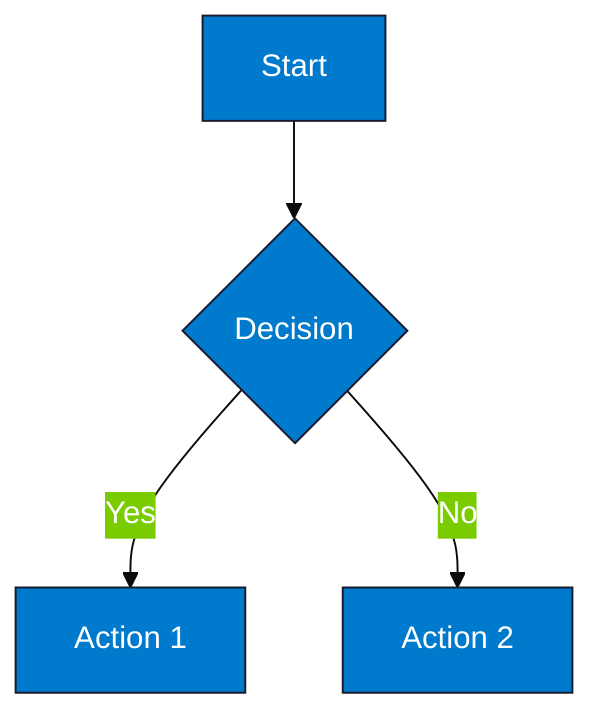
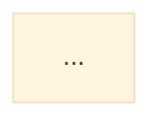

# VConfi Diagram Rendering Guide — Perfect Diagrams for Client Delivery

## The Problem

Mermaid diagrams in markdown/DOCX often render as:
- Code blocks (not images)
- Broken formatting
- Inconsistent styling
- Not professional for client presentations

## The Solution: Pre-Render to PNG

Use `mermaid-cli` (mmdc) to render diagrams to high-quality PNG images before DOCX generation.

---

## 🎨 Rendering Pipeline

```
Markdown with Mermaid
         ↓
┌─────────────────────┐
│ scripts/render_     │  ← Extract & Render
│ diagrams.py         │     each diagram to PNG
└─────────────────────┘
         ↓
Markdown with Image References
         ↓
┌─────────────────────┐
│ generate_docx_      │  ← Embed PNG images
│ with_diagrams.py    │     into DOCX
└─────────────────────┘
         ↓
Professional DOCX with Embedded Diagrams
```

---

## 🛠️ Tools Available

### 1. `scripts/render_diagrams.py`

Extracts mermaid blocks from markdown and renders to PNG.

**Usage:**
```bash
# Render all diagrams in a file
python scripts/render_diagrams.py Part1_Executive.md

# Output to specific directory
python scripts/render_diagrams.py Part1_Executive.md --output-dir diagrams/

# Use external files (don't embed base64)
python scripts/render_diagrams.py Part1_Executive.md --external
```

**What it does:**
1. Finds all ````mermaid` blocks
2. Renders each to PNG using `mmdc`
3. Replaces code blocks with image references
4. Outputs modified markdown

### 2. `scripts/generate_docx_with_diagrams.py`

Enhanced DOCX generator that embeds rendered diagrams.

**Usage:**
```bash
# Single file with diagrams
python scripts/generate_docx_with_diagrams.py Part1.md --output Part1.docx

# The script automatically:
# 1. Renders mermaid to PNG (temp files)
# 2. Embeds PNGs into DOCX
# 3. Cleans up temp files
```

### 3. Batch Processing Script

```bash
# Create batch renderer
python scripts/batch_render_diagrams.py --parts "Part*.md"
```

---

## 📋 Step-by-Step Workflow

### Option A: Render Before DOCX (Recommended)

**Step 1: Generate Parts with Subagents**
```
Task: Subagent A generates Part1 with mermaid diagrams
[Output: Part1_Executive_Architecture_ISO.md]
```

**Step 2: Render All Diagrams**
```bash
# Render diagrams in all parts
for file in Part*.md; do
    python scripts/render_diagrams.py "$file" --external
done

# This creates:
# - Part1_Executive_Architecture_ISO.md (modified with img refs)
# - diagrams/diagram_a1b2c3d4.png
# - diagrams/diagram_e5f6g7h8.png
# - ...
```

**Step 3: Merge to DOCX**
```bash
python scripts/generate_docx.py merge \
    --parts Part1*.md Part2*.md Part3*.md Part4*.md Part5*.md Part6*.md \
    --output VConfi_Plan.docx \
    --client "AcmeCorp" \
    --project "Network Upgrade"
```

The DOCX will have embedded PNG images, not code blocks.

### Option B: Automatic Rendering (Integrated)

```bash
# Use the enhanced generator
python scripts/generate_docx_with_diagrams.py \
    Design_Decisions.md \
    --output VConfi_Plan.docx \
    --client "AcmeCorp"

# Automatically renders and embeds all diagrams
```

---

## 🎨 Diagram Best Practices

### 1. Use Consistent Sizing



**Recommended dimensions:**
- Network topology: 1200×800px
- VLAN diagram: 800×600px
- Flowcharts: 1000×600px
- Rack layouts: 600×800px

### 2. Use Professional Color Scheme

```mermaid
%%{init: {'theme': 'base', 'themeVariables': {
  'primaryColor': '#007ACC',
  'primaryTextColor': '#FFFFFF',
  'primaryBorderColor': '#1A1A2E',
  'lineColor': '#666666',
  'secondaryColor': '#F0F4F8',
  'tertiaryColor': '#FFFFFF'
}}}%%
```

### 3. Required Diagrams per Part

| Part | Required Diagrams | Type |
|------|-------------------|------|
| **Part 1** | Network Topology | graph TD |
| | VLAN Segmentation | graph LR or subgraph |
| | Firewall Zones | graph TD |
| **Part 2** | Switch Stacking | graph TB |
| | Wireless Coverage | flowchart (floor plan) |
| | Server Rack Layout | Custom ASCII or external |
| **Part 3** | Backup 3-2-1 | graph LR |
| | DR Replication | graph TB |
| | Monitoring Architecture | graph TD |
| | Power Distribution | graph TD |
| **Part 4** | Gantt Timeline | gantt |
| | Cost Breakdown | pie |
| **Part 5** | Attack Surface | graph TD |
| **Part 6** | Escalation Flow | flowchart |

---

## 🔧 Advanced Rendering Options

### Custom Themes

Create `.mermaid-config.json`:

```json
{
  "theme": "base",
  "themeVariables": {
    "primaryColor": "#007ACC",
    "primaryTextColor": "#FFFFFF",
    "primaryBorderColor": "#1A1A2E",
    "lineColor": "#666666",
    "secondaryColor": "#F0F4F8",
    "tertiaryColor": "#FFFFFF"
  },
  "flowchart": {
    "htmlLabels": true,
    "curve": "basis"
  }
}
```

Use with:
```bash
mmdc -i input.mmd -o output.png -c .mermaid-config.json
```

### SVG Output (Scalable)

```bash
# For web delivery
mmdc -i diagram.mmd -o diagram.svg

# Then embed SVG in HTML output
```

### PDF Export (Vector Quality)

```bash
# Convert SVG to PDF
inkscape diagram.svg --export-pdf=diagram.pdf

# Or use rsvg-convert
rsvg-convert -f pdf -o diagram.pdf diagram.svg
```

---

## 📊 Quality Checklist

Before delivering to client:

- [ ] All diagrams render without errors
- [ ] Text is readable (minimum 12pt equivalent)
- [ ] Colors match VConfi brand (#007ACC, #1A1A2E)
- [ ] White background (not transparent)
- [ ] Consistent sizing across document
- [ ] No broken lines or overlaps
- [ ] Labels are clear and complete

---

## 🐛 Troubleshooting

### Issue: Diagrams Not Rendering

**Check:**
```bash
# Verify mmdc is installed
mmdc --version

# Test simple diagram
echo "graph TD; A-->B;" | mmdc -o test.png
```

### Issue: Diagrams Cut Off

**Solution:** Increase dimensions:
```bash
mmdc -i input.mmd -o output.png -w 1600 -h 1200
```

### Issue: Text Too Small

**Solution:** Use larger base size in mermaid config:
```json
{
  "themeVariables": {
    "fontSize": "16px"
  }
}
```

### Issue: Colors Not Applied

**Solution:** Ensure theme is set to "base":


---

## 🚀 Quick Commands

```bash
# Render single file
python scripts/render_diagrams.py Part1.md

# Render all parts
for f in Part*.md; do python scripts/render_diagrams.py "$f"; done

# Generate DOCX with diagrams
python scripts/generate_docx_with_diagrams.py Part1.md -o output.docx

# Verify all diagrams rendered
ls -la diagrams/*.png | wc -l
```

---

## 💡 Pro Tips

### 1. Keep Mermaid Source

Always keep the `.mmd` source files:
```bash
# Save source before rendering
mkdir -p diagrams/source
cp *.mmd diagrams/source/
```

This allows edits later without rewriting from scratch.

### 2. Version Control

```bash
# Commit source files
git add diagrams/source/*.mmd

# Ignore rendered PNGs (large binary files)
echo "diagrams/*.png" >> .gitignore
```

### 3. Pre-commit Hook

```bash
# .git/hooks/pre-commit
#!/bin/bash
# Auto-render diagrams before commit
python scripts/render_diagrams.py --check
```

### 4. Client Delivery Formats

| Format | Use Case | Command |
|--------|----------|---------|
| PNG | DOCX embedding | `mmdc -o diagram.png` |
| SVG | Web viewing | `mmdc -o diagram.svg` |
| PDF | Print quality | Convert SVG to PDF |
| MMD | Source/Editable | Keep original |

---

## 📁 File Structure

```
project/
├── Part1_Executive.md          # Contains mermaid code
├── Part2_Network.md            # Contains mermaid code
├── ...
├── diagrams/
│   ├── source/                 # Mermaid source files
│   │   ├── network_topology.mmd
│   │   ├── vlan_diagram.mmd
│   │   └── ...
│   ├── network_topology.png    # Rendered PNGs
│   ├── vlan_diagram.png
│   └── ...
├── scripts/
│   ├── render_diagrams.py      # Rendering tool
│   └── generate_docx_with_diagrams.py
└── VConfi_Plan.docx            # Final output with embedded images
```

---

## ✅ Summary

| Goal | Tool | Output |
|------|------|--------|
| Extract & Render | `render_diagrams.py` | PNG files |
| Embed in DOCX | `generate_docx_with_diagrams.py` | DOCX with images |
| Batch Process | Shell script | All parts rendered |
| Quality Check | Visual inspection | Client-ready diagrams |

**Result:** Professional diagrams that impress clients!

---

*Use this guide with the rendering scripts for perfect client deliverables.*
