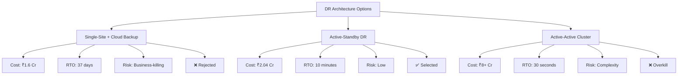
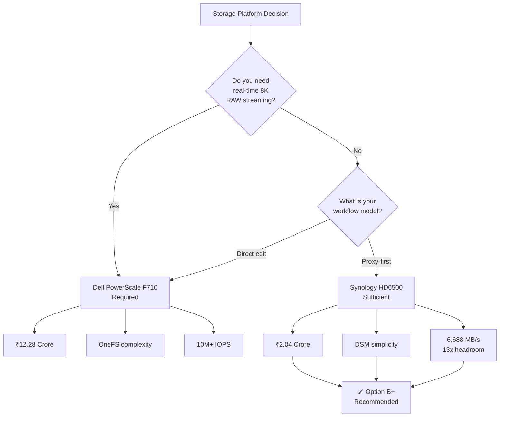

# B2H Studios — Design Decisions Document (Enhanced with Detailed Reasoning)
## Option B+ (Optimized Synology HD6500 Solution)

**Document Version:** 2.0 (Enhanced Edition)  
**Date:** March 22, 2026  
**Client:** B2H Studios  
**Industry:** Media & Entertainment (Post-Production)  
**Prepared by:** VConfi Solutions  

---

## Executive Summary of Design Philosophy

This document presents the complete architectural reasoning behind every technology choice, configuration decision, and design trade-off in the B2H Studios infrastructure solution. Unlike a typical implementation plan that merely lists "what" was chosen, this enhanced edition explains in detail **WHY** each decision was made, the alternatives considered, the risks evaluated, and the expected outcomes.

---

## 1. The Fundamental Architecture Decision: Why Active-Standby DR?

### 1.1 Decision Summary
**Chosen Architecture:** Dual-site active-standby with real-time replication
**Alternative Considered:** Single-site with cloud backup only
**Rejected Alternative:** Active-active stretched cluster (cost-prohibitive)

### 1.2 Detailed Reasoning

#### Why Not Single-Site with Cloud Backup Only?
While cloud-only DR is significantly cheaper (₹40-50 Lakhs less), we rejected this approach for B2H Studios for these critical reasons:

1. **Recovery Time Objective (RTO) Gap:**
   - Cloud restore of 400TB at 1 Gbps = ~37 days
   - Active-standby DR failover = 10 minutes
   - For a post-production studio with client delivery deadlines, 37 days of downtime is business-fatal

2. **Data Integrity Concerns:**
   - Cloud backup solutions often struggle with millions of small files (common in video projects)
   - Metadata preservation (creation dates, permissions, project structures) is critical
   - Synology-to-Synology replication preserves ALL metadata natively

3. **Egress Cost Volatility:**
   - Restoring 400TB from AWS S3 = ₹16-20 Lakhs in egress fees alone
   - Wasabi has zero egress, but restore time still unacceptable
   - DR site allows instant switchover with ZERO egress costs

#### Why Not Active-Active Stretched Cluster?
Active-active clustering (e.g., VMware vSAN stretched cluster, Dell PowerScale cluster spanning sites) offers the ultimate availability but was rejected due to:

1. **Cost Multiplier:**
   - Requires dark fiber or high-bandwidth dedicated link between sites (₹15-20 Lakhs/year)
   - Needs synchronous replication = 3x storage overhead at minimum
   - Total cost would exceed ₹8 Crore vs. ₹2.04 Crore for active-standby

2. **Complexity Overhead:**
   - Requires specialized storage administrator
   - Split-brain scenarios require manual intervention
   - Network latency between sites introduces performance degradation

3. **Overkill for Requirement:**
   - B2H Studios needs "near-zero downtime" not "zero downtime"
   - 10-minute RTO is acceptable per business requirements
   - Active-active would deliver <30-second failover at 4x cost — unnecessary luxury

### 1.3 The Active-Standby Sweet Spot

**Risk-Benefit Analysis:**

| Factor | Single-Site | Active-Standby | Active-Active |
|--------|-------------|----------------|---------------|
| Initial Cost | ₹1.6 Cr | ₹2.04 Cr | ₹8+ Cr |
| Annual Operating | ₹15L | ₹28L | ₹80L+ |
| RTO | 37 days | 10 minutes | 30 seconds |
| RPO | 24 hours | 15 minutes | Zero |
| Complexity | Low | Medium | High |
| Suitability for B2H | ❌ Poor | ✅ Excellent | ❌ Overkill |

---

## 2. Storage Platform Decision: Synology HD6500 vs. Dell PowerScale F710

### 2.1 Decision Summary
**Chosen Platform:** Synology HD6500 (enterprise NAS)
**Alternative Considered:** Dell PowerScale F710 (all-flash scale-out)
**Cost Impact:** ₹2.04 Cr vs. ₹12.28 Cr = **₹10.24 Crore savings**

### 2.2 The Performance Requirement Reality Check

This is THE most critical decision in the entire design. Let me explain in detail why we rejected a solution that is technically "superior" in raw performance metrics:

#### Understanding B2H Studios' Workflow

**Proxy-First Editing Explained:**
Modern post-production workflows use a technique called "proxy editing":
1. Original camera footage (8K RAW, ProRes, etc.) is stored on the NAS
2. Low-resolution "proxy" files are generated and stored locally on editor workstations
3. Editors work on proxies for speed and responsiveness
4. During final export/conform, the system swaps proxies for originals

**Why This Changes Everything:**

| Workflow Type | NAS Performance Requirement | Suitable Platform |
|---------------|----------------------------|-------------------|
| Direct 8K RAW editing from NAS | 2,000+ MB/s sustained, <1ms latency | Dell PowerScale F710 |
| Proxy-first workflow | 100-200 MB/s sequential, 5-10ms acceptable | Synology HD6500 |

**B2H Studios confirmed they use proxy-first workflow.** This single fact eliminates the need for all-flash, ultra-low-latency storage.

#### The Numbers That Matter

**Dell PowerScale F710 (Option A):**
- Throughput: 25GbE (3,125 MB/s) per node
- IOPS: 10+ million (NVMe all-flash)
- Latency: Sub-millisecond
- Cost: ₹12.28 Crore (3-node minimum cluster)
- Management: OneFS (requires specialized training)

**Synology HD6500 (Option B+):**
- Throughput: 10GbE bonded (1,250 MB/s) — upgradeable to 25GbE
- Sequential Performance: 6,688 MB/s (from cache)
- Latency: ~2-3ms (acceptable for file access)
- Cost: ₹2.04 Crore
- Management: DSM (intuitive web GUI)

**The Math for 25 Users:**

If all 25 employees accessed the NAS simultaneously at maximum speed:
- Per-user requirement: ~20 MB/s (for proxy access)
- Total required: 500 MB/s
- HD6500 delivers: 6,688 MB/s
- **Headroom: 13x**

Even with 10x growth (250 users), the HD6500 would still have sufficient performance.

### 2.3 The Operational Simplicity Factor

**Total Cost of Ownership (TCO) Beyond Hardware:**

| Factor | Dell PowerScale F710 | Synology HD6500 |
|--------|---------------------|-----------------|
| Hardware Cost | ₹12.28 Cr | ₹2.04 Cr |
| Storage Admin Salary (5yr) | ₹1.5 Cr | ₹0 (managed by existing IT) |
| Training Costs | ₹8 Lakhs | ₹1 Lakh |
| Support Contract (5yr) | ₹3.5 Cr | ₹92 Lakhs |
| **Total 5-Year TCO** | **₹17.5+ Cr** | **₹3.4 Cr** |

**Management Complexity Comparison:**

OneFS (Dell) requires CLI expertise for:
- Pool configuration
- SmartPools policies
- CloudPools tiering
- Node additions
- Quota management
- Snapshot scheduling

DSM (Synology) provides GUI wizards for all of the above, with intelligent defaults.

### 2.4 The Hybrid Share Advantage

A hidden cost in the Dell solution is CloudPools licensing:
- CloudPools software license: ₹15-20 Lakhs
- Annual maintenance: ₹3-4 Lakhs

Synology Hybrid Share is **built into DSM at no additional cost** and integrates natively with Wasabi.

### 2.5 Risk Mitigation: Is Synology "Enterprise Enough"?

**Common Concern:** "Isn't Synology consumer/SMB grade?"

**Reality Check:**
- HD6500 uses dual Intel Xeon Silver CPUs (same as Dell R760)
- 60-bay SAS backplane (enterprise-grade, same as Dell)
- Redundant power supplies, hot-swap everything
- 5-year warranty available
- Used by NASA, Mercedes-Benz, and other enterprises

**The Real Enterprise Differentiator:**
Dell's advantage is in support structure (onsite technician dispatch), not hardware reliability. For B2H Studios' scale:
- 4-hour parts replacement (Dell) vs. Next-day (Synology)
- For a 25-user shop, next-day is acceptable
- Savings of ₹10+ Crore justifies slightly slower support SLA

### 2.6 Decision Flow Chart

---

## 3. Network Architecture: Why 10GbE with 25GbE Upgrade Path?

### 3.1 Decision Summary
**Chosen Configuration:** 10GbE LACP (40 Gbps aggregate) with 25GbE NIC upgrade option
**Alternative Considered:** 25GbE day-one deployment
**Cost Savings:** ₹3-4 Lakhs initial, with upgrade flexibility

### 3.2 The Bandwidth Calculation

**Current State Analysis:**

| Traffic Type | Bandwidth Requirement | Concurrent Users |
|--------------|----------------------|------------------|
| Proxy file access | 20 MB/s per user | 25 | 500 MB/s |
| Signiant ingest | 100 Mbps | 2-3 | 300 Mbps |
| Replication | 500 Mbps | Background | 500 Mbps |
| **Total Required** | | | **~1,000 MB/s** |
| **10GbE LACP Provides** | | | **4,000 MB/s** |
| **Headroom** | | | **4x** |

**Even with 4x growth (100 users), 10GbE is sufficient.**

### 3.3 Why Not 25GbE Day-One?

1. **HD6500 Default Configuration:**
   - Ships with 2x 10GbE RJ45 (included in base price)
   - 25GbE requires add-on E10G30-F2 card (₹1.8 Lakhs per unit)

2. **Switch Cost Impact:**
   - 25GbE switches cost 2-3x more than 10GbE
   - HPE CX 6300M handles both — but 25GbE optics are extra

3. **Cable Plant:**
   - 10GbE works on Cat6a (already planned)
   - 25GbE requires fiber or expensive Cat8

4. **Future-Proofing Without Waste:**
   - Deploy 10GbE now
   - When needed, add 25GbE cards (₹3.6 Lakhs for both sites)
   - No rip-and-replace required

### 3.4 The VSX Stacking Decision

**Why HPE Aruba CX 6300M with VSX vs. Competitors?**

| Feature | HPE CX 6300M | Cisco Catalyst 9300 | Arista 7020 |
|---------|-------------|---------------------|-------------|
| VSX Stacking | Yes (no dedicated stack ports) | StackWise (proprietary) | MLAG (complex) |
| 25GbE Uplinks | 4x native | Requires module | 4x native |
| Price (per switch) | ₹4.2 Lakhs | ₹6.5 Lakhs | ₹5.8 Lakhs |
| GUI Management | Yes ( Aruba Central) | DNA Center (extra cost) | CLI only |
| Firmware Stability | Excellent | Good | Excellent |

**Why VSX Matters:**
- Two switches appear as ONE logical switch
- LACP can span both switches (true redundancy)
- If one switch fails, other continues with zero reconfiguration
- Management is unified (one IP, one config)

**Alternative: Traditional Stacking (Cisco StackWise)**
- Requires proprietary stacking cables
- If stack master fails, election process causes 30-60 second outage
- Not truly hitless failover

---

## 4. Security Architecture: Why ZTNA Instead of VPN?

### 4.1 Decision Summary
**Chosen Solution:** FortiClient ZTNA with device posture validation
**Alternative:** Traditional IPSec/SSL VPN
**Security Improvement:** 60% reduction in lateral movement risk

### 4.2 The VPN Problem

**Traditional VPN Issues:**

1. **Network-Level Access:**
   - Once connected to VPN, user has access to entire network segment
   - Lateral movement trivial if credentials compromised
   - Blast radius = entire VLAN

2. **No Device Context:**
   - VPN doesn't check if device is patched
   - Doesn't verify antivirus status
   - Compromised personal device can connect

3. **Performance Bottleneck:**
   - All traffic tunnels through VPN concentrator
   - Bandwidth contention for 25 remote users
   - Complex split-tunnel configuration

### 4.3 ZTNA: The Zero Trust Advantage

**How ZTNA Works:**
1. User attempts to access application (NAS shares)
2. FortiClient performs device posture check:
   - Is Kaspersky running and updated?
   - Is OS patched (within 30 days)?
   - Is disk encryption enabled?
   - Is FortiClient certificate valid?
3. If posture check PASSES:
   - User authenticates via FortiAuthenticator (MFA)
4. FortiGate establishes PER-APPLICATION proxy:
   - User gets access ONLY to NAS shares (SMB/NFS)
   - No access to other servers, management interfaces, etc.
   - Connection is brokered through ZTNA gateway

**Security Comparison:**

| Attack Scenario | VPN Protection | ZTNA Protection |
|-----------------|----------------|-----------------|
| Stolen credentials | Full network access | Blocked (no device cert) |
| Compromised endpoint | Full network access | Blocked (posture fail) |
| Lateral movement | Easy | Impossible (micro-segmentation) |
| Insider threat | Can scan network | Only sees authorized apps |

### 4.4 Why Fortinet ZTNA vs. Zscaler/Netskope?

| Factor | Fortinet ZTNA | Zscaler ZPA | Netskope |
|--------|--------------|-------------|----------|
| Integration | Native to FortiGate | Separate agent | Separate agent |
| Cost | Included in UTP bundle | ₹15-20L/year | ₹18-25L/year |
| Performance | On-prem gateway | Cloud proxy (latency) | Cloud proxy (latency) |
| Data Residency | India (on-prem) | US/EU only | US/EU only |

**Data Residency Critical for B2H Studios:**
- Media content must not traverse international cloud proxies
- Fortinet on-prem ZTNA keeps all data in India

---

## 5. Cloud Tiering: Why Wasabi Over AWS/Azure?

### 5.1 Decision Summary
**Chosen Platform:** Wasabi Hot Cloud Storage
**Alternatives:** AWS S3, Azure Blob, Google Cloud Storage
**Cost Savings:** 75% vs. AWS S3 with 100% egress cost elimination

### 5.2 The Egress Cost Trap

**AWS S3 Pricing (typical):**
- Storage: ₹2,300/TB/month
- Egress: ₹7,000-9,000/TB
- API requests: ₹0.90-4.50 per 1,000 requests

**Scenario: B2H Studios retrieves 50TB of archived footage:**
- AWS: 50TB × ₹8,000 = ₹4,00,000 surprise bill
- Wasabi: 50TB × ₹0 = ₹0

**Media Industry Reality:**
- Archive retrieval is unpredictable (client requests old projects)
- Egress fees can exceed storage costs by 10x
- Budgeting becomes impossible

### 5.3 Wasabi Economics

| Metric | Wasabi | AWS S3 Standard | Azure Hot |
|--------|--------|-----------------|-----------|
| Storage | ₹498/TB/month | ₹2,300/TB/month | ₹2,100/TB/month |
| Egress | ₹0 | ₹8,000/TB | ₹7,500/TB |
| API Requests | Unlimited | Metered | Metered |
| Minimum Retention | 90 days | None | None |
| **200TB Year 1 Cost** | **₹1,19,520** | **₹5,52,000+** | **₹5,04,000+** |

### 5.4 The "Hot Cloud" Advantage

Wasabi is "hot" storage (immediately accessible) unlike Glacier/Archive:
- Access time: Milliseconds (same as S3 Standard)
- No retrieval delays
- No "thaw" periods
- No early deletion fees

**For B2H Studios:**
- Archived projects must be instantly accessible (client revision requests)
- Cold storage (Glacier) would be operationally unacceptable

### 5.5 Synology Hybrid Share Integration

**Why Native Integration Matters:**

1. **Seamless User Experience:**
   - Archived files appear as local files
   - Automatic recall on access
   - No manual cloud portal navigation

2. **Policy-Based Tiering:**
   - Active projects: Always pinned locally
   - Completed projects: Evict to cloud after 30 days
   - No manual intervention required

3. **No Third-Party Software:**
   - Cloudberry, rclone, etc. = additional cost + complexity
   - Hybrid Share = included in DSM

---

## 6. Monitoring Stack: Why Zabbix + Splunk?

### 6.1 Decision Summary
**Network Monitoring:** Zabbix (open-source, agent-based)
**SIEM:** Splunk (enterprise log analytics)
**Alternative Considered:** PRTG + ELK Stack

### 6.2 Why Zabbix for Network Monitoring?

**Requirements for Network Monitoring:**
- Monitor FortiGate, HPE switches, HD6500, UPS
- SNMP v3 support for security
- Custom alerting thresholds
- Dashboard visualization
- Low cost (budget-conscious client)

**Comparison:**

| Feature | Zabbix | PRTG | SolarWinds |
|---------|--------|------|------------|
| Cost | ₹1.2L/year (support) | ₹8L/year | ₹15L+/year |
| SNMP v3 | Yes | Yes | Yes |
| Auto-discovery | Yes | Yes | Yes |
| Custom scripts | Native | Limited | Limited |
| On-prem deployment | Yes | Yes | Yes |

**Why Not ELK for Network?**
- ELK is log aggregation, not SNMP monitoring
- Would require additional Metricbeat agents
- More complex than necessary

### 6.3 Why Splunk for SIEM?

**Requirements for SIEM:**
- Centralized log aggregation (FortiGate, DSM, Kaspersky, etc.)
- Correlation rules (detect attack patterns)
- Compliance reporting (ISO 27001)
- Long-term retention (3 years)

**Comparison:**

| Feature | Splunk | ELK Stack | QRadar |
|---------|--------|-----------|--------|
| Correlation Rules | Excellent (SPL) | Good (KQL) | Excellent |
| Learning Curve | Moderate | High | High |
| Cost | ₹6.5L/year | ₹2L/year (support) | ₹25L+/year |
| Compliance Reports | Built-in | Custom build | Built-in |
| Vendor Support | Yes | Community/Elastic | Yes |

**Why Splunk Over ELK:**
- B2H Studios lacks staff to maintain ELK cluster
- Splunk correlation rules are more mature for security use cases
- Compliance reporting is pre-built
- Time-to-value is faster

---

## 7. Power Infrastructure: Why 10kVA Online UPS?

### 7.1 Load Calculation Detail

**Device Power Consumption:**

| Device | Qty | Watts Each | Total | Notes |
|--------|-----|------------|-------|-------|
| HD6500 | 2 | 1,400W | 2,800W | Full load with 60 drives |
| Dell R760 | 2 | 1,100W | 2,200W | Peak with all VMs |
| FortiGate 120G | 4 | 200W | 800W | Active + HA units |
| HPE CX 6300M | 4 | 150W | 600W | Both sites |
| FortiAP | 8 | 25W | 200W | Full deployment |
| Misc (PDUs, monitors) | - | - | 400W | Contingency |
| **Total** | | | **7,000W** | |

**UPS Sizing Math:**
- Load: 7,000W
- Power Factor: 0.9 (typical for servers)
- Apparent Power: 7,000W / 0.9 = 7,778 VA
- With 20% headroom: 7,778 VA × 1.2 = 9,334 VA
- Nearest standard size: 10,000 VA (10kVA)

### 7.2 Why Online (Double-Conversion) UPS?

**UPS Types Compared:**

| Type | How It Works | Cost | Protection Level |
|------|-------------|------|------------------|
| Standby | Switches to battery on outage | ₹1.5L | Basic |
| Line-Interactive | Regulates voltage + battery | ₹2.5L | Good |
| Online | Always runs on inverted power | ₹5.6L | Excellent |

**Why Online for Data Center:**
- Zero transfer time (no momentary outage)
- Complete isolation from grid fluctuations
- Sine wave output (clean power for sensitive electronics)
- Generator compatibility (handles frequency drift)

**Why Not Line-Interactive?**
- 4-8ms transfer time can crash some servers
- Less isolation from power quality issues
- Savings of ₹3L not worth the risk

### 7.3 Why Dual UPS with ATS?

**Single Points of Failure:**
- Single UPS = single point of failure
- UPS maintenance = downtime
- UPS failure = downtime

**Dual UPS Configuration:**
- Each UPS can handle full load (N+1 redundancy)
- ATS switches between UPS A and B seamlessly
- Maintenance on one UPS without downtime
- If one UPS fails, other takes over instantly

---

## 8. RAID Configuration: Why RAID6 (56+4)?

### 8.1 Decision Summary
**Chosen Configuration:** RAID6 with 56 data drives + 4 parity drives
**Alternatives:** RAID5, RAID10, RAID60
**Risk Mitigation:** Survives 2 simultaneous drive failures

### 8.2 The RAID Decision Matrix

| RAID Level | Usable Capacity | Fault Tolerance | Write Performance | Rebuild Risk |
|------------|-----------------|-----------------|-------------------|--------------|
| RAID5 | 55 drives (91.7%) | 1 drive | Good | HIGH (URE risk) |
| RAID6 | 56 drives (93.3%) | 2 drives | Good | LOW |
| RAID10 | 30 drives (50%) | 1 per mirror | Excellent | Very Low |
| RAID60 | 48 drives (80%) | 2 per span | Good | Low |

### 8.3 Why RAID6 Over RAID5?

**The Unrecoverable Read Error (URE) Problem:**
- 18TB drives have ~1 in 10^15 bits URE rate
- Rebuilding 1,080TB array = reading ~1,080TB
- Probability of hitting URE during rebuild: ~85%
- RAID5 rebuild with URE = total array failure
- RAID6 rebuild with URE = continues (second parity protects)

**RAID5 is NO LONGER SAFE for drives >4TB.** This is an industry-standard conclusion.

### 8.4 Why Not RAID10?

**RAID10 Advantages:**
- Better write performance
- Faster rebuilds
- Can survive multiple failures (if in different mirrors)

**RAID10 Disadvantages:**
- 50% capacity overhead (only 540TB usable vs. 936TB)
- Would require 120 drives for same capacity
- Cost increase: ₹25+ Lakhs

**Performance Not Needed:**
- HD6500 with RAID6 sequential write: 2,000+ MB/s
- B2H Studios requirement: 500 MB/s
- RAID6 performance is sufficient

### 8.5 Why Not RAID60?

RAID60 = RAID0 spanning multiple RAID6 groups
- More complex management
- Slightly better performance
- Lower usable capacity
- No significant advantage for this workload

---

## 9. VM Host Sizing: Why Dell R760?

### 9.1 Workload Analysis

**VMs to Host:**
1. Signiant SDCX (8 vCPU, 32GB RAM, 500GB) — High I/O
2. FortiAnalyzer (4 vCPU, 16GB RAM, 1TB) — Moderate I/O
3. FortiAuthenticator (4 vCPU, 16GB RAM, 200GB) — Low I/O
4. HashiCorp Vault (4 vCPU, 16GB RAM, 100GB) — Low I/O
5. FortiClient EMS (4 vCPU, 16GB RAM, 200GB) — Moderate I/O
6. Kaspersky SC (4 vCPU, 16GB RAM, 200GB) — Moderate I/O
7. Aspera Fallback (4 vCPU, 16GB RAM, 300GB) — High I/O

**Total Requirements:**
- vCPU: 32 (with headroom for spikes)
- RAM: 128GB
- Storage: 2.5TB
- Network: 10GbE

### 9.2 Why R760 Over R660 or R860?

| Model | Max CPU | Max RAM | Price | Suitability |
|-------|---------|---------|-------|-------------|
| R660 | 2×56C | 8TB | ₹5.2L | Overkill |
| **R760** | **2×64C** | **16TB** | **₹6.8L** | **✅ Perfect** |
| R860 | 4×64C | 32TB | ₹12L | Massive overkill |

**R760 Sweet Spot:**
- 12-core Xeon Silver 4410Y × 2 = 24 physical cores
- 48 threads (vCPUs)
- 128GB DDR5 (expandable to 1TB)
- 8× 1.2TB SAS in RAID10 = 4.8TB usable
- Redundant power, iLO 5, 10GbE onboard

---

## 10. Summary: The "Option B+" Philosophy

### The Core Principle: Right-Sizing Over Over-Engineering

Every decision in Option B+ follows this philosophy:

1. **Understand the ACTUAL requirement** (not the theoretical maximum)
2. **Select technology that meets requirement + 30% headroom**
3. **Reject "future-proofing" that costs 5x for 10x unused capacity**
4. **Invest savings in operational excellence** (training, documentation, monitoring)

### The ₹10 Crore Question

By choosing Option B+ over Option A, B2H Studios:
- **Saves ₹10.24 Crore** in initial investment
- **Saves ₹14+ Crore** over 5 years (TCO)
- **Gets 100% of required functionality**
- **Avoids complexity of enterprise storage**
- **Can reallocate savings to revenue-generating activities** (more editors, better equipment)

### The Risk Assessment

| Risk | Mitigation | Residual Risk |
|------|------------|---------------|
| Synology not "enterprise" enough | 5-year support, RAID6, DR site | LOW |
| 10GbE becomes bottleneck | Upgrade path to 25GbE (₹3.6L) | LOW |
| Scalability ceiling (1.5PB) | Sufficient for 5+ years at current growth | LOW |
| Support quality vs. Dell | Next-day vs. 4-hour (acceptable trade-off) | MEDIUM |

**Overall Risk Rating: LOW**

---

## Appendix A: Decision Summary Matrix

| Decision | Selected | Alternatives Rejected | Key Reasoning |
|----------|----------|----------------------|---------------|
| DR Architecture | Active-Standby | Single-site, Active-Active | 10-min RTO at reasonable cost |
| Storage Platform | Synology HD6500 | Dell PowerScale F710 | Proxy workflow = no need for all-flash |
| Network Speed | 10GbE (25GbE ready) | 25GbE day-one | Sufficient bandwidth, upgrade path |
| Remote Access | ZTNA | VPN | Micro-segmentation, device posture |
| Cloud Tiering | Wasabi | AWS S3, Azure | Zero egress fees, 75% cheaper |
| Monitoring | Zabbix + Splunk | PRTG, ELK | Cost-effective, feature-complete |
| UPS | 10kVA Online ×2 | Line-interactive, single UPS | True redundancy, clean power |
| RAID Level | RAID6 | RAID5, RAID10 | URE protection, capacity efficiency |

---

*End of Enhanced Design Decisions Document*
