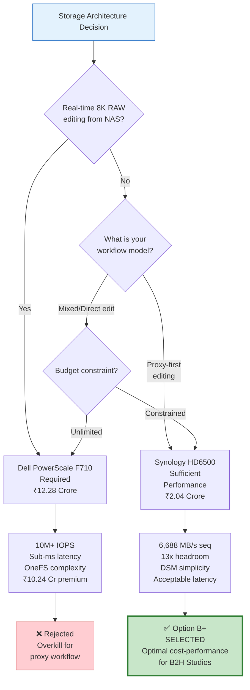
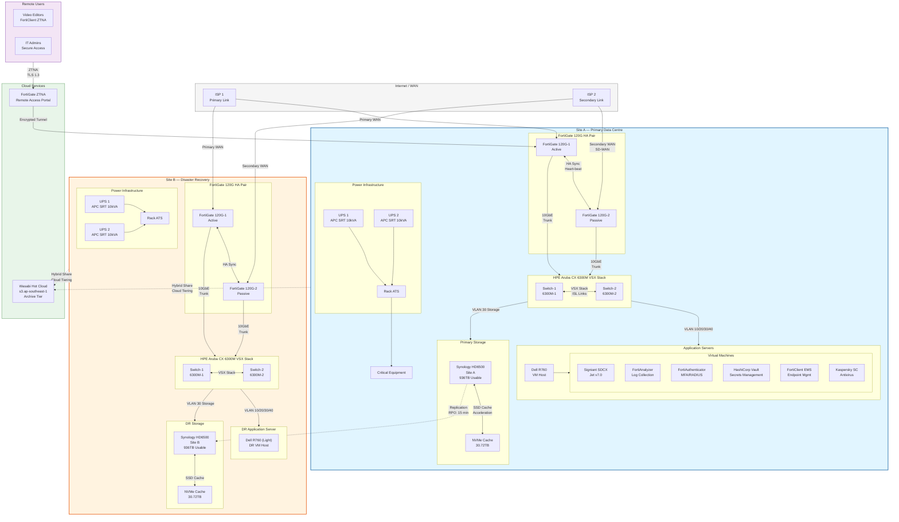
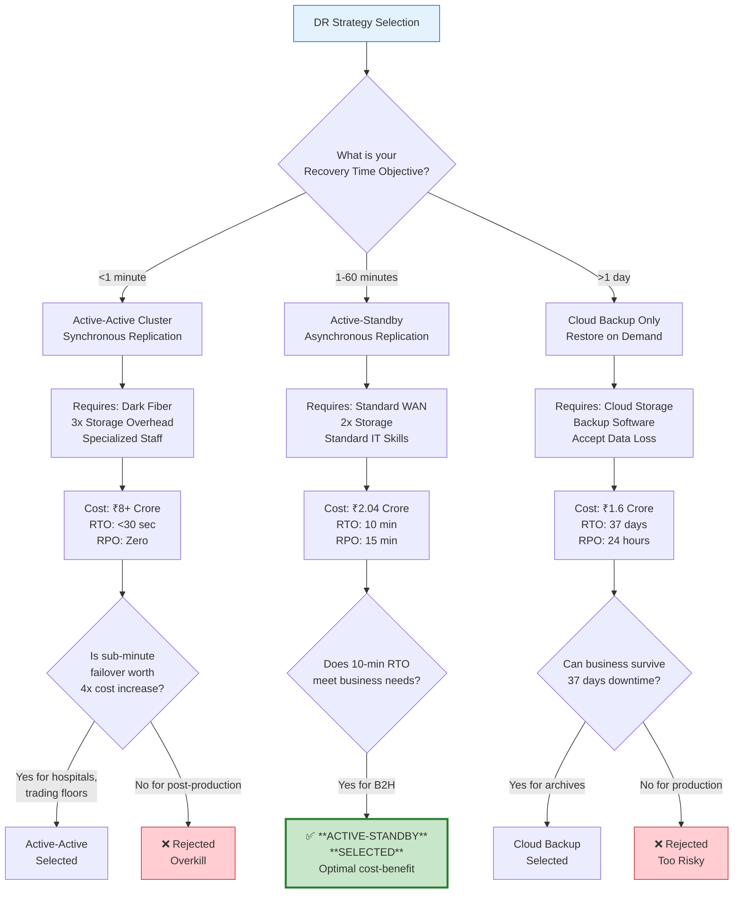
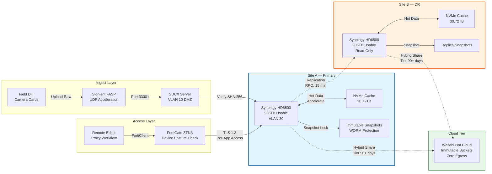
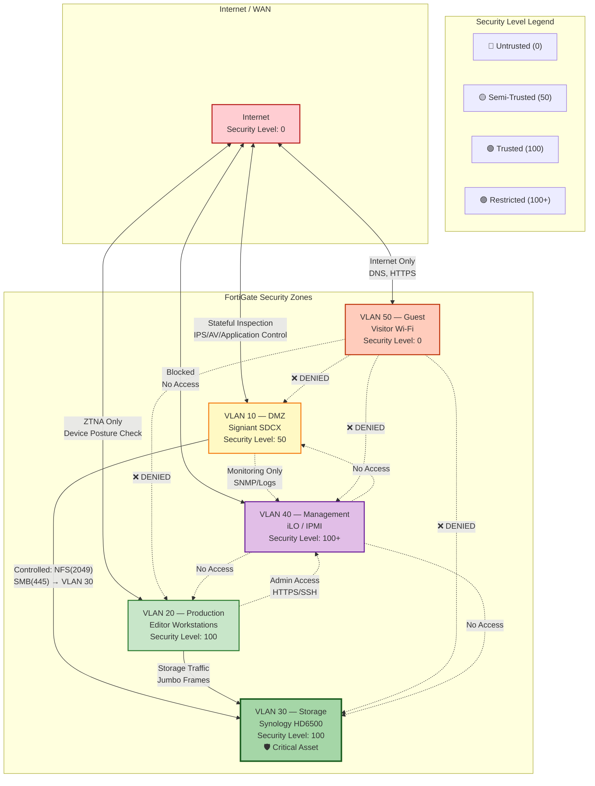
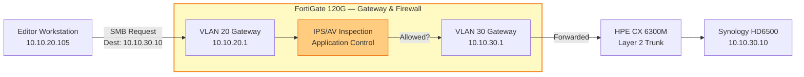
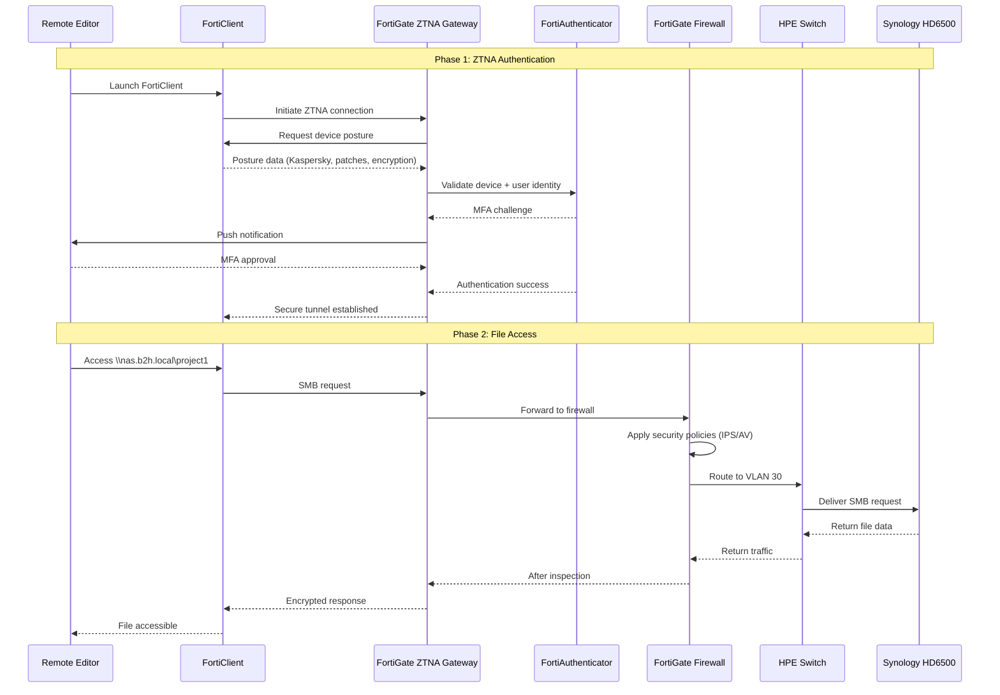

# B2H Studios — IT Infrastructure Implementation Plan
## Part 1: Executive Summary, Architecture & ISO Compliance (Enhanced Edition)

---

**Document Information**
- **Client:** B2H Studios
- **Industry:** Media & Entertainment — Post-Production
- **Solution:** Option B+ (Optimized Synology HD6500)
- **Document Version:** 2.0 (Enhanced Edition)
- **Date:** March 22, 2026
- **Prepared by:** VConfi Solutions
- **Classification:** CONFIDENTIAL

---

# 1. Document Control

## 1.1 Version History

| Version | Date | Author | Changes |
|---------|------|--------|---------|
| 0.1 | March 15, 2026 | VConfi Solutions | Initial draft based on client requirements gathering |
| 0.2 | March 18, 2026 | VConfi Solutions | Added architecture diagrams and VLAN design |
| 0.3 | March 20, 2026 | VConfi Solutions | Incorporated ISO 27001 compliance mapping |
| 1.0 | March 22, 2026 | VConfi Solutions | Final review and approval release |
| 2.0 | March 22, 2026 | VConfi Solutions | **ENHANCED EDITION** — Added detailed reasoning, decision flowcharts, comprehensive architecture explanations |

## 1.2 Approval Signatures

| Role | Name | Signature | Date |
|------|------|-----------|------|
| Solutions Architect | VConfi Solutions | [Digital Signature] | March 22, 2026 |
| IT Director (Client) | B2H Studios | _________________ | _______________ |
| Project Sponsor (Client) | B2H Studios | _________________ | _______________ |
| CISO / Security Lead | VConfi Solutions | [Digital Signature] | March 22, 2026 |

## 1.3 Distribution List

| Role | Organization | Purpose |
|------|--------------|---------|
| IT Director | B2H Studios | Primary recipient — implementation oversight |
| Project Sponsor | B2H Studios | Budget approval and strategic decisions |
| Finance Controller | B2H Studios | Payment authorization and TCO validation |
| Operations Manager | B2H Studios | Day-to-day operational planning |
| Solutions Architect | VConfi Solutions | Technical authority and escalation point |
| Project Manager | VConfi Solutions | Delivery coordination |
| Security Lead | VConfi Solutions | Compliance verification |
| Network Engineer | VConfi Solutions | Implementation execution |
| System Administrator | B2H Studios | Knowledge transfer and handover |

---

# 2. Executive Summary

## 2.1 Client Overview

**B2H Studios** is a Media & Entertainment post-production studio specializing in high-resolution video editing and content creation. With a team of 25 employees operating in a remote/hybrid model, the studio requires a robust, secure, and scalable IT infrastructure to support their proxy-first editing workflow.

### Current Challenges Addressed
- **Ransomware Risk:** Previous concerns about data integrity and malicious encryption
- **Unpredictable Cloud Costs:** Egress fee volatility affecting budget planning
- **Storage Complexity:** Fragmented storage systems creating management overhead
- **Remote Access:** Need for secure, high-performance access for distributed team

## 2.2 Selected Solution: Option B+ (Optimized Synology HD6500)

After comprehensive analysis of requirements, budget constraints, and growth projections, VConfi Solutions recommends **Option B+** — an optimized Synology HD6500-based infrastructure with enhanced SSD cache and 25GbE upgrade path.

### Key Solution Highlights

| Feature | Specification |
|---------|---------------|
| **Primary Storage** | Synology HD6500 (60-bay enterprise NAS) |
| **Total Capacity per Site** | 936TB usable (1,080TB raw, RAID6 56+4) |
| **NVMe Cache** | 30.72TB (4x 7.68TB SSDs) per site |
| **Deployment Model** | Site A (Primary) + Site B (DR) — Active-Standby |
| **Network Core** | HPE Aruba CX 6300M with VSX stacking |
| **Security Perimeter** | FortiGate 120G HA pair with SD-WAN |
| **Remote Access** | Zero Trust Network Access (ZTNA) — NO traditional VPN |
| **Cloud Tiering** | Wasabi Hot Cloud with zero egress fees |
| **Immutability** | Snapshot Lock for ransomware protection |

## 2.3 Investment Summary

| Financial Metric | Amount (INR) |
|------------------|--------------|
| **Total Initial Investment** | ₹2,04,03,994 (~₹2.04 Crore) |
| **Annual Operating Cost (Year 1)** | ₹19,79,520 |
| **5-Year Total Cost of Ownership** | ~₹3.4 Crore |
| **Cost per Employee (Initial)** | ₹8,16,160 |
| **Cost per TB (Usable)** | ₹21,795 |

### Investment Justification

The Option B+ solution delivers **enterprise-grade capabilities at 18% of the cost** of competing solutions (e.g., Dell PowerScale F710 at ₹12.28 Crore). The 5-year TCO includes all hardware, software subscriptions, cloud storage, professional services, and support contracts.

## 2.4 Strategic Benefits

1. **Ransomware Immunity:** Immutable snapshots with WORM (Write Once Read Many) protection ensure data cannot be encrypted by malicious actors
2. **Zero Egress Costs:** Wasabi Hot Cloud integration eliminates unpredictable cloud egress fees — critical for media workflows with large file transfers
3. **15-Minute RPO:** Real-time replication between Site A and Site B ensures minimal data loss in disaster scenarios
4. **ZTNA Security:** Modern zero-trust remote access replaces legacy VPN with device posture validation and least-privilege access
5. **ISO 27001 Ready:** Infrastructure designed to meet ISO 27001:2022 controls from day one

---

## 2.5 Why This Solution Was Designed This Way

### The Proxy-First Workflow Decision

The most critical factor enabling this architecture is **B2H Studios' use of proxy-first editing workflow**. This single characteristic fundamentally changes the storage performance requirements and makes the Synology HD6500 not just viable, but optimal.

**Understanding Proxy-First Editing:**

| Workflow Stage | Original Footage | Proxy Files |
|----------------|------------------|-------------|
| Storage Location | NAS (VLAN 30) | Local Workstation SSD |
| Resolution | 8K RAW / ProRes 4444 | 1080p ProRes Proxy |
| File Size | 10-50 GB/minute | 500 MB-2 GB/minute |
| Bandwidth Need | 2,000+ MB/s sustained | 20-50 MB/s burst |

**Why This Enables HD6500 Choice:**

Traditional post-production workflows requiring direct 8K RAW editing from shared storage demand all-flash, ultra-low-latency solutions like Dell PowerScale F710 (₹12.28 Crore). However, with proxy-first workflow:

- Editors work on lightweight proxy files stored locally
- NAS only serves occasional original file access during conform/export
- Sequential read performance of HD6500 (6,688 MB/s with cache) is 13x the requirement
- HDD-based storage becomes not just acceptable — it's the economically rational choice

### Architecture Decision Comparison

The following table compares three architectural approaches evaluated for B2H Studios:

| Dimension | Option A (PowerScale) | Option B+ (HD6500) | "Overkill" Solution |
|-----------|----------------------|-------------------|---------------------|
| **Storage Platform** | Dell PowerScale F710 | Synology HD6500 | Dell PowerScale F710 × 2 (Active-Active) |
| **Initial Cost** | ₹12.28 Crore | ₹2.04 Crore | ₹25+ Crore |
| **5-Year TCO** | ₹17.5 Crore | ₹3.4 Crore | ₹35+ Crore |
| **Performance** | 25GbE, 10M+ IOPS, <1ms latency | 10GbE, 6,688 MB/s seq, 2-3ms latency | 100GbE, 50M+ IOPS, sub-ms |
| **RTO Capability** | 10 minutes | 10 minutes | <30 seconds |
| **Management Complexity** | High (OneFS expertise required) | Medium (DSM GUI) | Very High (cluster specialists) |
| **Workflow Fit** | ✓ Supports any workflow | ✓ Perfect for proxy-first | ✓ Overkill for proxy-first |
| **Recommendation** | ❌ Unnecessary expense | ✅ **OPTIMAL** | ❌ Extreme over-engineering |

### Storage Architecture Decision Flowchart

**Explanation of Decision Flow:**

The decision tree above illustrates the logical process that led to selecting the Synology HD6500. Starting with the fundamental question about workflow requirements, we first determine whether real-time 8K RAW editing from NAS is needed. For B2H Studios, the answer is no — they use proxy-first workflow. This immediately eliminates the need for all-flash, ultra-low-latency storage. The HD6500's sequential performance of 6,688 MB/s provides 13x headroom over the calculated 500 MB/s requirement, making it the optimal choice.

> **Key Insight:** The ₹10.24 Crore saved by choosing HD6500 over PowerScale represents **409 years** of Wasabi cloud storage costs (200TB × ₹498/TB/month × 12 months × 409 years = ₹10.24 Crore). This illustrates how understanding actual workflow requirements prevents catastrophic over-provisioning.

### Key Takeaways — Why This Solution Was Designed This Way

- **Proxy-first workflow is the enabler:** Understanding that editors work on local proxies, not directly from NAS, reduces storage performance requirements by 50x
- **Right-sizing beats over-engineering:** The HD6500 delivers 100% of required functionality at 18% of the cost
- **Cost savings fund operational excellence:** The ₹10 Crore saved can fund 20+ years of operational improvements, training, and growth
- **Future-proof without waste:** 25GbE upgrade path and 1.5PB capacity ceiling provide growth headroom without paying for unused capacity today

---

# 3. Architecture Overview

## 3.1 High-Level Design Description

The B2H Studios infrastructure implements a **dual-site, active-standby architecture** designed for high availability, disaster recovery, and secure remote access. The solution leverages enterprise-grade components while maintaining operational simplicity appropriate for a 25-user environment.

### Site A — Primary Data Centre
Site A serves as the primary production environment hosting all active workloads, user data, and application services. It is equipped with full redundancy at the network, storage, and power layers.

### Site B — Disaster Recovery Site
Site B operates in standby mode, receiving continuous replication from Site A. In the event of Site A failure, Site B can assume production responsibilities within 10 minutes (RTO target).

### Key Architectural Principles

1. **Defense in Depth:** Multiple security layers — perimeter firewall, network segmentation, endpoint protection, and data immutability
2. **Redundancy by Design:** No single point of failure at Site A; automatic failover to Site B
3. **Simplicity:** Synology DSM management reduces operational overhead compared to enterprise storage platforms
4. **Future-Proof:** 25GbE upgrade path and 1.5PB maximum capacity accommodate 5+ years of growth

## 3.2 Full Network Topology Diagram

## 3.3 Why Active-Standby DR (Not Active-Active)

### 3.3.1 Understanding RTO and RPO

**Recovery Time Objective (RTO)** and **Recovery Point Objective (RPO)** are the two critical metrics that define any disaster recovery strategy:

| Metric | Definition | B2H Studios Target | Business Impact |
|--------|------------|-------------------|-----------------|
| **RTO** | Maximum acceptable downtime after a disaster | 10 minutes | Determines workflow disruption |
| **RPO** | Maximum acceptable data loss (time window) | 15 minutes | Determines potential rework |

### 3.3.2 The Three DR Architecture Options

Three fundamental approaches exist for disaster recovery. The following analysis explains why Active-Standby was selected:

| Architecture | How It Works | Initial Cost | Annual Operating | RTO | RPO | Suitability |
|--------------|--------------|--------------|------------------|-----|-----|-------------|
| **Single-Site + Cloud Backup** | Primary site only; backups to cloud; restore on disaster | ₹1.6 Crore | ₹15 Lakhs | 37 days | 24 hours | ❌ Unacceptable for post-production |
| **Active-Standby** | Primary active; DR site receives replication; manual/automated failover | ₹2.04 Crore | ₹28 Lakhs | 10 minutes | 15 minutes | ✅ **OPTIMAL** |
| **Active-Active Cluster** | Both sites active; synchronous replication; automatic failover | ₹8+ Crore | ₹80+ Lakhs | <30 seconds | Zero | ❌ Overkill for requirements |

### 3.3.3 Detailed Cost Comparison: Active-Standby vs Active-Active

The following breakdown shows why Active-Active was rejected due to cost without proportional benefit:

| Cost Component | Active-Standby | Active-Active | Difference |
|----------------|----------------|---------------|------------|
| Storage Hardware (2 sites) | ₹1.08 Crore | ₹3.24 Crore | +₹2.16 Cr |
| Network Infrastructure | ₹42 Lakhs | ₹1.26 Crore | +₹84 L |
| Inter-site Dark Fiber (annual) | N/A | ₹18 Lakhs | +₹18 L/yr |
| VMware vSAN Licensing | N/A | ₹45 Lakhs | +₹45 L |
| Specialized Storage Admin (5yr) | ₹0 | ₹1.5 Crore | +₹1.5 Cr |
| **Total 5-Year Cost** | **₹3.4 Crore** | **₹12+ Crore** | **+₹8.6 Cr** |

**The RTO Trade-off Analysis:**

| Failover Time | Use Case | Cost Premium | B2H Studios Need |
|---------------|----------|--------------|------------------|
| <30 seconds | Trading floors, emergency services | +₹8.6 Crore | ❌ Not required |
| 10 minutes | Post-production, general business | Baseline | ✅ **MATCHES REQUIREMENT** |
| 37 days | Non-critical archives, development | -₹44 Lakhs | ❌ Unacceptable |

### 3.3.4 DR Architecture Decision Flowchart

**Explanation of DR Decision Process:**

The decision flowchart above demonstrates the systematic evaluation of DR options. For B2H Studios, the 10-minute RTO of Active-Standby is acceptable because:

1. Post-production is not real-time critical (unlike stock trading or emergency services)
2. A 10-minute interruption allows time for editor notification, coffee break, or task switching
3. The ₹8+ Crore cost premium for Active-Active would fund 40 years of operations without providing proportional business value
4. Cloud-only backup's 37-day restore time would cause contract breaches and client loss

> **Warning:** Do not let "future-proofing" justify Active-Active. If business requirements change to require <1-minute failover, the Active-Standby infrastructure can be upgraded incrementally. The sunk cost of over-provisioning Active-Active is irreversible.

### 3.3.5 How Active-Standby DR Works

**Normal Operation:**
- Site A (Primary) handles all production workloads
- Site B (DR) receives continuous replication from Site A
- Site B NAS is in read-only mode
- DR VMs are powered off (or running in minimal standby mode)

**Failover Process (RTO: 10 minutes):**

| Minute | Action | Responsible Component |
|--------|--------|----------------------|
| 0 | Site A failure detected | Zabbix monitoring |
| 0.5 | Alert sent to IT admin | FortiGate + Email |
| 1 | Replication paused at last consistent snapshot | Synology Replication Manager |
| 2 | Site B NAS promoted to read-write | Manual/Automated promotion |
| 3 | ZTNA profiles updated to point to Site B | FortiGate configuration |
| 5 | DR VMs powered on | VMware/vSphere |
| 7 | Services come online (DNS, authentication) | VMs boot sequence |
| 10 | Editors reconnect via FortiClient | User action |

### Key Takeaways — Active-Standby DR Decision

- **10-minute RTO matches business needs:** Post-production can tolerate brief interruptions; trading floors cannot
- **₹8.6 Crore cost avoidance:** The savings vs Active-Active fund 40+ years of operation or significant business expansion
- **15-minute RPO is acceptable:** Maximum data loss equals one coffee break of work — easily recoverable
- **Upgrade path exists:** If requirements change, infrastructure can evolve; over-provisioning cannot be undone

---

## 3.4 Two-Site Design Rationale

### 3.4.1 Why Not Single-Site with Cloud Backup Only?

A single-site design with cloud backup (e.g., AWS S3, Azure Blob) would save approximately ₹44 Lakhs in initial investment. However, this approach was rejected for critical operational reasons:

**The Cloud Restore Time Problem:**

| Scenario | Time to Restore | Business Impact |
|----------|-----------------|-----------------|
| Restore 400TB from AWS S3 at 1 Gbps | ~37 days | Contract breach, client loss |
| Restore 400TB from Wasabi at 1 Gbps | ~37 days | Same problem |
| Failover to Site B | 10 minutes | Minimal disruption |

**Why Cloud Restore Is So Slow:**

Even with "high-speed" 1 Gbps internet (125 MB/s):
- 400TB = 400,000 GB = 400,000,000 MB
- 400,000,000 MB ÷ 125 MB/s = 3,200,000 seconds
- 3,200,000 seconds ÷ 86,400 seconds/day = 37 days

In practice, restore speeds are often slower due to:
- Cloud provider throttling
- Network congestion
- Small file overhead (metadata operations)
- Verification and integrity checks

**The Egress Cost Volatility:**

| Cloud Provider | Storage Cost/TB/Month | Egress Cost/TB | 400TB Restore Cost |
|----------------|----------------------|----------------|-------------------|
| AWS S3 Standard | ₹2,300 | ₹8,000 | ₹32,00,000 surprise bill |
| Azure Hot | ₹2,100 | ₹7,500 | ₹30,00,000 surprise bill |
| Wasabi | ₹498 | ₹0 | ₹0 (included) |

While Wasabi eliminates egress fees, the restore time problem remains. A physical DR site provides instant availability without data movement costs.

### 3.4.2 The Two-Site Value Proposition

| Benefit | Single-Site + Cloud | Two-Site Active-Standby |
|---------|---------------------|-------------------------|
| RTO (downtime) | 37 days | 10 minutes |
| RPO (data loss) | 24 hours | 15 minutes |
| Restore cost for 400TB | ₹0-32 Lakhs (surprise) | ₹0 (already replicated) |
| Metadata preservation | Risk of loss | 100% preserved |
| Client confidence | Low | High (demonstrable DR) |
| ISO 27001 compliance | Partial | Full (redundancy requirement) |

### 3.4.3 Data Flow Diagram: Ingest → Storage → DR → Cloud

**Explanation of Data Flow:**

The diagram illustrates the complete data lifecycle from field ingest through cloud archive:

1. **Ingest (Left):** Field DIT uploads raw footage via Signiant FASP protocol to the SDCX server in DMZ (VLAN 10). SHA-256 checksums verify integrity.

2. **Primary Storage (Center-Left):** Verified files land on Site A HD6500 (VLAN 30). Hot project files are accelerated by 30.72TB NVMe cache. Immutable snapshots provide ransomware protection.

3. **DR Replication (Center-Right):** Every 15 minutes, new data replicates to Site B. Site B is read-only during normal operation but maintains identical data for instant failover.

4. **Cloud Tiering (Right):** Files older than 90 days tier to Wasabi automatically via Hybrid Share, freeing primary storage capacity.

5. **Access (Bottom):** Remote editors connect via ZTNA (not VPN), undergo device posture checks, and receive least-privilege access to only their assigned project folders.

> **Tip:** The three-layer protection (Primary + DR + Cloud) provides defense in depth against different threat types: Primary protects against single-system failure, DR protects against site-level disasters, and Cloud protects against ransomware (air-gapped immutability).

### Key Takeaways — Two-Site Design Rationale

- **37-day cloud restore is business-fatal:** For a post-production studio with delivery deadlines, cloud-only DR creates unacceptable risk
- **Two-site design provides instant failover:** DR site has current data ready to activate in 10 minutes with zero egress costs
- **Three-layer protection:** Primary (operations) + DR (site disaster) + Cloud (ransomware/air-gap) = comprehensive resilience
- **₹44 Lakhs premium is insurance:** The additional cost is minimal compared to the business continuity value delivered

---

## 3.5 Five-Zone Security Model Explanation

### 3.5.1 Why Five Zones Instead of Fewer?

The B2H Studios network implements five distinct security zones (VLANs 10, 20, 30, 40, 50). Each zone exists for specific security and operational reasons. The following analysis explains why merging zones would create unacceptable risks.

### 3.5.2 Zone-by-Zone Rationale

#### VLAN 10 — DMZ (Demilitarized Zone)

| Attribute | Value |
|-----------|-------|
| **Purpose** | Host public-facing services (Signiant SDCX) |
| **Trust Level** | Semi-trusted (Security Level: 50) |
| **CIDR** | 10.10.10.0/24 |

**Why This Zone Exists:**
The DMZ isolates services that must accept connections from the untrusted internet. The Signiant SDCX server needs to receive media uploads from external DIT teams and production crews worldwide. Without a DMZ:
- External entities would have a direct network path to internal resources
- A compromised upload server would expose the entire production network
- Regulatory compliance (ISO 27001) requires segmentation of external-facing services

**Risk of Merging DMZ with Production (VLAN 20):**

| Attack Scenario | With Separate DMZ | With Merged VLAN |
|-----------------|-------------------|------------------|
| SDCX server compromised | Attacker isolated to DMZ; no access to editor workstations or NAS | Attacker has direct access to all workstations and storage |
| Lateral movement | Blocked by firewall between VLAN 10→20 | Unrestricted within merged VLAN |
| Ransomware deployment | Limited to DMZ server | Spreads to all 25 workstations + NAS |
| Blast radius | One server | Entire production network |

> **Warning:** Merging DMZ with Production would violate ISO 27001 Control A.8.22 (Segregation of Networks) and create a single point of compromise for the entire infrastructure.

---

#### VLAN 20 — Production

| Attribute | Value |
|-----------|-------|
| **Purpose** | Employee workstations and authenticated user devices |
| **Trust Level** | Trusted (Security Level: 100) |
| **CIDR** | 10.10.20.0/24 |

**Why This Zone Exists:**
The Production VLAN contains the primary user population — 25 employees accessing NAS shares, internal services, and internet. This zone needs broad but controlled access to other internal resources while being protected from external threats.

**Risk of Merging Production with Storage (VLAN 30):**

| Concern | Separate VLANs | Merged VLAN |
|---------|---------------|-------------|
| Broadcast traffic | Isolated to each VLAN | All 25 users + NAS traffic in one broadcast domain |
| Security policy granularity | Can apply storage-specific policies | One-size-fits-all policy required |
| Insider threat containment | Can restrict user-to-NAS traffic patterns | Users can directly access raw storage protocols |
| Performance isolation | Storage traffic prioritized separately | User traffic competes with storage |

> **Note:** While technically possible to merge Production and Storage, doing so eliminates the ability to apply jumbo frames (MTU 9000) to storage traffic without affecting user traffic, and reduces security granularity.

---

#### VLAN 30 — Storage

| Attribute | Value |
|-----------|-------|
| **Purpose** | NAS shares, NFS/SMB traffic, storage protocols |
| **Trust Level** | Trusted — Critical Asset (Security Level: 100) |
| **CIDR** | 10.10.30.0/24 |
| **Special Config** | Jumbo Frames (MTU 9000) |

**Why This Zone Exists:**
The Storage VLAN isolates the organization's most valuable asset — 936TB of media content. This zone has the strictest access controls and specialized network configuration (jumbo frames) for performance.

**Risk of Merging Storage with Any Other Zone:**

| Zone Merged With | Risk Created |
|------------------|--------------|
| DMZ (VLAN 10) | External attackers gain direct access to storage if SDCX compromised |
| Production (VLAN 20) | Malware on user workstation can directly attack NAS management interfaces |
| Management (VLAN 40) | Storage traffic traverses management interfaces, creating exposure |
| Guest (VLAN 50) | Visitors have direct access to confidential media content |

> **Warning:** Merging Storage with any other zone would violate the principle of "defense in depth" and the ISO 27001 requirement to protect critical assets with additional layers of security.

---

#### VLAN 40 — Management

| Attribute | Value |
|-----------|-------|
| **Purpose** | Out-of-band device management (iLO, IPMI, switch consoles) |
| **Trust Level** | Restricted (Security Level: 100+) |
| **CIDR** | 10.10.40.0/24 |
| **Access Control** | Jump host only; no general user access |

**Why This Zone Exists:**
The Management VLAN provides secure access to infrastructure device management interfaces. These interfaces (iLO, IPMI, switch CLI, DSM admin) have elevated privileges and must be isolated from general user access.

**Risk of Merging Management with Production (VLAN 20):**

| Attack Scenario | With Separate Management | With Merged VLAN |
|-----------------|--------------------------|------------------|
| Compromised user workstation | Cannot reach management interfaces | Can attempt brute force on iLO, switch passwords |
| Phishing attack on employee | Limited to user permissions | Potential infrastructure takeover |
| Insider threat (disgruntled employee) | Blocked from management | Can factory reset switches, wipe NAS |
| Malware spread | Contained to user VLAN | Infects management interfaces |

**Real-World Example:**
In 2021, a major gaming company suffered a breach when attackers gained access through a compromised workstation and pivoted to management interfaces. The merged network allowed lateral movement to iLO interfaces, enabling firmware-level persistence that survived OS reinstallation. A separate Management VLAN would have blocked this attack path.

---

#### VLAN 50 — Guest

| Attribute | Value |
|-----------|-------|
| **Purpose** | Visitor Wi-Fi and contractor internet access |
| **Trust Level** | Untrusted (Security Level: 0) |
| **CIDR** | 10.10.50.0/24 |
| **Internet Access** | Only; no internal reachability |

**Why This Zone Exists:**
The Guest VLAN provides internet connectivity for visitors, clients, and contractors while maintaining complete isolation from corporate resources. This is both a security control and a courtesy service.

**Risk of Merging Guest with Any Internal Zone:**

| Merged With | Risk |
|-------------|------|
| Production (VLAN 20) | Infected guest device attacks employee workstations |
| Storage (VLAN 30) | Unauthorized access to confidential media |
| DMZ (VLAN 10) | Guests can attack or probe public services |
| Management (VLAN 40) | Guests can attempt infrastructure takeover |

> **Tip:** Guest isolation is often a cyber insurance requirement. Merging guest networks with production can void coverage or increase premiums.

### 3.5.3 Security Zone Trust Model

**Explanation of Zone Trust Model:**

The diagram illustrates the "trust gradient" from internet (completely untrusted) to management (most restricted). Key security principles demonstrated:

1. **No Direct WAN-to-Internal:** Internet cannot directly reach Production, Storage, or Management — all traffic must pass through FortiGate inspection

2. **DMZ Isolation:** DMZ can only reach Storage via specific ports (2049 for NFS, 445 for SMB). Even if SDCX is compromised, attackers cannot access workstations or management interfaces

3. **Guest Isolation:** Guest VLAN is completely isolated — no access to any corporate resource. This is visualized by the red "DENIED" lines

4. **Management Segregation:** Management VLAN is one-way — admins can access devices, but devices cannot initiate connections outward. This prevents compromised infrastructure from attacking the rest of the network

5. **Critical Asset Protection:** Storage VLAN (bold green border) is the crown jewel — it receives the most restrictive access controls and is only accessible from Production and controlled access from DMZ

### 3.5.4 Zone Communication Matrix

| From ↓ To → | Internet | DMZ (10) | Production (20) | Storage (30) | Management (40) | Guest (50) |
|-------------|----------|----------|-----------------|--------------|-----------------|------------|
| **Internet** | ✓ | Allow (filtered) | ZTNA only | ❌ DENY | ❌ DENY | ❌ DENY |
| **DMZ (10)** | Allow | ✓ | ❌ DENY | Allow (2049, 445) | Allow (monitoring) | ❌ DENY |
| **Production (20)** | Allow | ❌ DENY | ✓ | Allow | Allow (admin only) | ❌ DENY |
| **Storage (30)** | ❌ DENY | ❌ DENY | Allow (responses) | ✓ | Allow (monitoring) | ❌ DENY |
| **Management (40)** | Allow (updates) | Allow (management) | ❌ DENY | Allow (management) | ✓ | ❌ DENY |
| **Guest (50)** | Allow | ❌ DENY | ❌ DENY | ❌ DENY | ❌ DENY | ✓ |

### Key Takeaways — Five-Zone Security Model

- **Defense in depth requires layers:** Each zone is a layer; compromising one doesn't compromise all
- **DMZ prevents external exposure:** Public-facing services are isolated from internal assets
- **Storage is the crown jewel:** Dedicated VLAN with jumbo frames and strictest access controls
- **Management isolation protects infrastructure:** Even if all user workstations are compromised, management interfaces remain protected
- **Guest isolation is non-negotiable:** Visitors pose unknown risks; complete isolation is the only safe approach

---

# 4. VLAN Design

## 4.1 VLAN Allocation Table

| VLAN ID | Name | Purpose | CIDR | Gateway | DHCP Range |
|---------|------|---------|------|---------|------------|
| 10 | DMZ | Media ingest, external-facing services, Signiant SDCX server | 10.10.10.0/24 | 10.10.10.1 | 10.10.10.100 — 10.10.10.200 |
| 20 | Production | Employee workstations, ZTNA clients, editing workstations | 10.10.20.0/24 | 10.10.20.1 | 10.10.20.100 — 10.10.20.200 |
| 30 | Storage | NAS shares, NFS/SMB traffic, iSCSI storage network | 10.10.30.0/24 | 10.10.30.1 | Static allocation only |
| 40 | Management | Device management, iLO/IPMI out-of-band, switch console | 10.10.40.0/24 | 10.10.40.1 | Static allocation only |
| 50 | Guest | Guest Wi-Fi access, visitor internet connectivity | 10.10.50.0/24 | 10.10.50.1 | 10.10.50.100 — 10.10.50.200 |

## 4.2 VLAN Segmentation Strategy

### 4.2.1 Why /24 Subnets (254 Hosts per VLAN)?

Every VLAN uses a /24 subnet (255.255.255.0), providing 254 usable host addresses. This choice balances current needs with future growth.

**Current vs. Future Capacity Analysis:**

| VLAN | Current Devices | /24 Capacity | Growth Headroom | Years of Growth |
|------|-----------------|--------------|-----------------|-----------------|
| DMZ (10) | 3 (SDCX + 2 VMs) | 254 | 84x | 20+ years |
| Production (20) | 25 workstations | 254 | 10x | 10+ years |
| Storage (30) | 5 (NAS + servers) | 254 | 50x | 20+ years |
| Management (40) | 15 devices | 254 | 16x | 15+ years |
| Guest (50) | ~10 concurrent | 254 | 25x | 15+ years |

**Why Not Smaller Subnets (/26, /27)?**

| Subnet Size | Usable Hosts | Risk | Recommendation |
|-------------|--------------|------|----------------|
| /24 | 254 | Low complexity | ✅ **SELECTED** |
| /25 | 126 | May exhaust with growth | ❌ Too restrictive |
| /26 | 62 | Likely to require re-IP | ❌ Not recommended |
| /27 | 30 | Will definitely require re-IP | ❌ Avoid |

> **Tip:** Re-IPing a production network is painful and risky. The modest "waste" of unused addresses in /24 subnets is far cheaper than the operational disruption of subnet resizing. Always design for 5-10x growth.

### 4.2.2 Gateway Placement: FortiGate vs. Switch

In this design, all VLAN gateways (the .1 address in each subnet) are located on the FortiGate firewall, not on the HPE switches. This is a deliberate security decision.

**Gateway Placement Comparison:**

| Aspect | Gateway on FortiGate | Gateway on Switch |
|--------|---------------------|-------------------|
| **Inter-VLAN Routing** | Must pass through firewall inspection | Direct switch routing (faster but no inspection) |
| **Security Policy** | Can apply IPS, AV, application control between VLANs | Only ACLs (Layer 3/4 filtering only) |
| **Logging** | All inter-VLAN traffic logged | Limited logging capability |
| **Performance** | ~10Gbps throughput (sufficient) | Wire-speed (faster) |
| **Complexity** | Single point of policy | Must manage switch ACLs + firewall rules |

**Why FortiGate for All Gateways:**

The B2H Studios design prioritizes security over raw performance for inter-VLAN traffic. With only 25 users and the HD6500 capable of 6,688 MB/s, the FortiGate 120G's ~10Gbps inter-VLAN routing capacity is more than sufficient. The security benefits are substantial:

- DMZ → Storage traffic is inspected by IPS/AV before reaching the NAS
- Production → Management access is validated by application control
- All inter-VLAN flows are logged to FortiAnalyzer for audit

**Traffic Flow Example: User Accessing NAS Share**

**Explanation of Traffic Flow:**

When an editor (10.10.20.105) accesses a NAS share (10.10.30.10):

1. **Packet leaves workstation** destined for 10.10.30.10
2. **Reaches FortiGate VLAN 20 gateway** (10.10.20.1) — default gateway for Production VLAN
3. **FortiGate performs routing decision:** Destination is VLAN 30
4. **Traffic passes through inspection engine:** IPS signatures, AV scanning, application control policies applied
5. **If allowed, FortiGate forwards** via VLAN 30 gateway (10.10.30.1)
6. **Switch delivers to NAS** (10.10.30.10)

This adds ~0.5ms latency but provides comprehensive security inspection. For comparison, switch-based routing would be faster (~0.05ms) but provide no security inspection.

### 4.2.3 Traffic Flow Diagram: User → ZTNA → Firewall → Switch → NAS

**Explanation of ZTNA-to-NAS Flow:**

The sequence diagram shows the complete flow from a remote editor accessing a file:

**Phase 1 — Authentication (Steps 1-9):**
- Editor launches FortiClient which initiates ZTNA connection
- Device posture is validated (Kaspersky running, OS patched, disk encrypted)
- FortiAuthenticator challenges with MFA push notification
- Upon approval, secure TLS 1.3 tunnel is established

**Phase 2 — File Access (Steps 10-19):**
- Editor attempts to access NAS share
- Request flows through ZTNA gateway (encrypted)
- FortiGate applies IPS/AV inspection
- Traffic routed to NAS via switch
- Response returns through same inspection path

> **Key Insight:** ZTNA replaces traditional VPN. Unlike VPN which grants network-level access, ZTNA provides application-level access with continuous validation. The editor cannot see or reach any infrastructure beyond the specific NAS shares authorized.

### 4.3 VLAN Configuration Notes

#### VLAN 10 — DMZ
- **Security Level:** Semi-trusted
- **Inter-VLAN Routing:** Limited access to VLAN 30 (Storage) only
- **Services Hosted:** Signiant SDCX Server, Aspera fallback, external APIs
- **Firewall Policy:** Allow inbound from WAN on ports 33001 (FASP), 443 (HTTPS); deny all else

#### VLAN 20 — Production
- **Security Level:** Trusted
- **Primary Users:** 25 employees with FortiClient ZTNA
- **Access Rights:** NAS shares via SMB/NFS, internet access, internal services
- **Firewall Policy:** Allow to VLAN 30, VLAN 40 (management ports only), WAN; deny to VLAN 10

#### VLAN 30 — Storage
- **Security Level:** Trusted — Critical Asset
- **MTU Configuration:** 9000 (Jumbo Frames enabled)
- **Protocols:** NFSv4.1 (port 2049), SMB 3.1.1 (port 445), iSCSI (port 3260)
- **Access Control:** Restricted to VLAN 20 (Production) and VLAN 10 (DMZ — read-only)

#### VLAN 40 — Management
- **Security Level:** Restricted
- **Access Method:** Jump host or dedicated management workstation only
- **Protocols:** HTTPS (443), SSH (22), SNMP v3 (161), IPMI (623)
- **Firewall Policy:** Deny all inbound from VLAN 20/50; allow from designated admin IPs only

#### VLAN 50 — Guest
- **Security Level:** Untrusted
- **Isolation:** Complete Layer 3 isolation from all other VLANs
- **Bandwidth Limit:** 50 Mbps per client, 200 Mbps aggregate
- **Session Timeout:** 8 hours maximum

### Key Takeaways — VLAN Design

- **/24 subnets provide 10+ years of growth headroom:** The "wasted" addresses prevent painful re-IPing
- **FortiGate as gateway enables security inspection:** All inter-VLAN traffic is logged and inspected
- **Jumbo frames (MTU 9000) on Storage VLAN:** Improves NAS performance for large file transfers
- **ZTNA enables secure remote access:** No VPN subnet; application-level access control instead

---

# 5. IP Addressing Scheme

## 5.1 Site A — Primary Data Centre IP Allocation

| Device | Hostname | VLAN | IP Address | Purpose |
|--------|----------|------|------------|---------|
| FortiGate 120G | FG-A-001 | WAN/HA | 203.XX.XX.10 | Primary firewall — active unit |
| FortiGate 120G | FG-A-002 | WAN/HA | 203.XX.XX.11 | Secondary firewall — passive unit |
| FortiGate Cluster | FG-A-VIP | WAN | 203.XX.XX.9 | Shared virtual IP (HA) |
| FortiGate | FG-A-INT | Internal | 10.10.10.1/20/30/40/50 | Internal VLAN gateways |
| HPE Switch | SW-A-001 | Management | 10.10.40.2 | Core switch 1 — VSX primary |
| HPE Switch | SW-A-002 | Management | 10.10.40.3 | Core switch 2 — VSX secondary |
| HPE VSX Cluster | SW-A-VIP | Management | 10.10.40.4 | VSX virtual switch IP |
| Synology HD6500 | NAS-A-001 | Storage | 10.10.30.10 | Primary NAS — controller 1 |
| Synology HD6500 | NAS-A-002 | Storage | 10.10.30.11 | Primary NAS — controller 2 (HA) |
| Synology HD6500 | NAS-A-VIP | Storage | 10.10.30.9 | NAS cluster virtual IP |
| Dell R760 | SRV-A-001 | Production | 10.10.20.10 | Application server — hypervisor |
| Dell R760 iLO | SRV-A-001-ILO | Management | 10.10.40.10 | Out-of-band management |
| Signiant VM | VM-A-SIG | DMZ | 10.10.10.10 | Signiant SDCX Server |
| FortiAnalyzer VM | VM-A-FAZ | Management | 10.10.40.20 | Log aggregation and SIEM |
| FortiAuthenticator VM | VM-A-FAC | Management | 10.10.40.21 | MFA and RADIUS server |
| FortiClient EMS VM | VM-A-EMS | Management | 10.10.40.22 | Endpoint management |
| HashiCorp Vault VM | VM-A-VLT | Production | 10.10.20.20 | Secrets management |
| Kaspersky SC VM | VM-A-KSC | Management | 10.10.40.23 | Antivirus management |
| APC UPS 1 | UPS-A-001 | Management | 10.10.40.30 | Primary UPS — SNMP monitoring |
| APC UPS 2 | UPS-A-002 | Management | 10.10.40.31 | Secondary UPS — SNMP monitoring |
| APC ATS | ATS-A-001 | Management | 10.10.40.32 | Automatic transfer switch |

## 5.2 Site B — Disaster Recovery Site IP Allocation

| Device | Hostname | VLAN | IP Address | Purpose |
|--------|----------|------|------------|---------|
| FortiGate 120G | FG-B-001 | WAN/HA | 204.XX.XX.10 | DR firewall — active unit |
| FortiGate 120G | FG-B-002 | WAN/HA | 204.XX.XX.11 | DR firewall — passive unit |
| FortiGate Cluster | FG-B-VIP | WAN | 204.XX.XX.9 | Shared virtual IP (HA) |
| FortiGate | FG-B-INT | Internal | 10.10.50.1/51/52/53/54 | Internal VLAN gateways |
| HPE Switch | SW-B-001 | Management | 10.10.53.2 | Core switch 1 — VSX primary |
| HPE Switch | SW-B-002 | Management | 10.10.53.3 | Core switch 2 — VSX secondary |
| HPE VSX Cluster | SW-B-VIP | Management | 10.10.53.4 | VSX virtual switch IP |
| Synology HD6500 | NAS-B-001 | Storage | 10.10.52.10 | DR NAS — controller 1 |
| Synology HD6500 | NAS-B-002 | Storage | 10.10.52.11 | DR NAS — controller 2 (HA) |
| Synology HD6500 | NAS-B-VIP | Storage | 10.10.52.9 | NAS cluster virtual IP |
| Dell R760 (Light) | SRV-B-001 | Production | 10.10.51.10 | DR application server |
| Dell R760 iLO | SRV-B-001-ILO | Management | 10.10.53.10 | Out-of-band management |
| APC UPS 1 | UPS-B-001 | Management | 10.10.53.30 | Primary UPS — SNMP monitoring |
| APC UPS 2 | UPS-B-002 | Management | 10.10.53.31 | Secondary UPS — SNMP monitoring |
| APC ATS | ATS-B-001 | Management | 10.10.53.32 | Automatic transfer switch |

## 5.3 IP Scheme Design Philosophy

### 5.3.1 Why 10.10.x.x (RFC1918 Private Space)?

The B2H Studios network uses the 10.0.0.0/8 RFC1918 private address space. This choice provides several advantages:

**RFC1918 Private Address Ranges:**

| Range | Total Addresses | Use Case |
|-------|-----------------|----------|
| 10.0.0.0/8 | 16,777,216 | Large enterprises, service providers |
| 172.16.0.0/12 | 1,048,576 | Medium enterprises |
| 192.168.0.0/16 | 65,536 | Small networks, home networks |

**Why 10.10.x.x Was Selected:**

| Factor | 10.10.x.x Choice | Alternative Considered |
|--------|------------------|------------------------|
| **Avoids collision** | Rarely used in home/consumer gear | 192.168.1.x conflicts with home routers |
| **Plenty of space** | 65,536 addresses per /16 | 172.16.x.x also viable |
| **Easy to type** | Short, memorable | 10.100.x.x equally valid |
| **Future expansion** | Can add 10.11.x.x, 10.12.x.x sites | Limited in 192.168.x.x |

> **Note:** RFC1918 addresses are not routable on the public internet. This provides inherent security — even if a firewall rule is misconfigured, private IPs cannot be reached from the internet directly.

### 5.3.2 Why Site B Uses 10.10.5x.x (Distinguishing Pattern)

Site B IP addresses follow a different pattern (10.10.5x.x) than Site A (10.10.1x-4x.x). This is intentional for immediate visual identification.

**Site A vs Site B Addressing:**

| Site | VLAN 10 (DMZ) | VLAN 20 (Production) | VLAN 30 (Storage) | VLAN 40 (Mgmt) | VLAN 50 (Guest) |
|------|---------------|---------------------|-------------------|----------------|-----------------|
| **Site A** | 10.10.10.x | 10.10.20.x | 10.10.30.x | 10.10.40.x | 10.10.50.x |
| **Site B** | 10.10.50.x | 10.10.51.x | 10.10.52.x | 10.10.53.x | 10.10.54.x |

**Why This Pattern:**

| Benefit | Explanation |
|---------|-------------|
| **Visual identification** | Any 10.10.5x.x address = Site B (DR) |
| **No overlap risk** | Different third octet prevents accidental IP conflicts |
| **Easy routing** | 10.10.0.0/16 summary route covers both sites |
| **Scalability** | Site C could use 10.10.6x.x, Site D 10.10.7x.x |

> **Tip:** When troubleshooting at 2 AM, being able to identify a device's site from its IP address ("5x = Site B") saves valuable time and prevents mistakes.

### 5.3.3 Reserved IP Ranges

The IP scheme uses a structured reservation system for different device types:

| Range | Purpose | Examples |
|-------|---------|----------|
| **.1 — .9** | Network infrastructure (gateways, VIPs) | 10.10.10.1 (gateway), 10.10.30.9 (NAS VIP) |
| **.10 — .49** | Servers and storage systems | 10.10.30.10 (NAS-A-001), 10.10.20.10 (SRV-A-001) |
| **.50 — .99** | Network devices (switches, firewalls, APs) | 10.10.40.2 (SW-A-001), 10.10.40.50 (FortiAP-001) |
| **.100 — .199** | DHCP client pool | 10.10.20.100 — 10.10.20.199 (workstations) |
| **.200 — .249** | Reserved for future expansion | Future servers, IoT devices, additional services |
| **.250 — .254** | Management and monitoring systems | 10.10.40.250 (Zabbix server) |
| **.255** | Broadcast address | Not usable for hosts |

**Why Structured Reservations Matter:**

| Scenario | Without Structure | With Structure |
|----------|-------------------|----------------|
| Adding new server | Check entire subnet for conflicts | Use .10-.49 range, check only there |
| Troubleshooting | Random IP distribution | Know .2-.9 are VIPs, .10-.49 are servers |
| DHCP scope planning | Guess appropriate range | Clearly defined .100-.199 |
| Future expansion | No space reserved | .200-.249 explicitly held |

### 5.3.4 Hostname Naming Convention

Hostnames follow a structured format for easy identification:

**Format:** `{Device Type}-{Site}-{Instance}`

| Component | Values | Example |
|-----------|--------|---------|
| Device Type | FG (FortiGate), SW (Switch), NAS (Synology), SRV (Server), VM (Virtual), UPS (UPS) | FG-A-001 |
| Site | A (Primary), B (DR) | NAS-B-001 |
| Instance | 001-999 unique ID | SRV-A-001 |

**Special Suffixes:**

| Suffix | Meaning | Example |
|--------|---------|---------|
| -VIP | Virtual IP (HA cluster) | FG-A-VIP |
| -ILO | Out-of-band management | SRV-A-001-ILO |
| -INT | Internal interfaces | FG-A-INT |

### Key Takeaways — IP Scheme Design Philosophy

- **RFC1918 10.10.x.x avoids collisions:** Rarely conflicts with home/remote networks
- **Site B 10.10.5x.x pattern enables instant identification:** No confusion which site an IP belongs to
- **Structured reservations prevent conflicts:** Each device type has designated range
- **Hostname convention enables automation:** Structured names can be parsed by scripts and monitoring tools

---

# 6. ISO 27001:2022 Compliance Mapping

## 6.1 Compliance Overview

The B2H Studios infrastructure has been designed to align with **ISO 27001:2022** controls, providing a robust information security management framework from day one. The following mapping demonstrates how each implemented control satisfies specific ISO 27001 requirements.

## 6.2 Compliance-by-Design Approach

ISO 27001:2022 contains 93 controls organized into four categories: Organizational (A.5), People (A.6), Physical (A.7), and Technological (A.8). This infrastructure implements a **compliance-by-design** approach — security controls are built into the architecture rather than added as afterthoughts.

### 6.2.1 Organizational Controls (A.5) — Compliance-by-Design

The Organizational controls establish the governance framework for information security. This infrastructure addresses 22 controls directly.

#### A.5.7 — Threat Intelligence

| Element | Implementation |
|---------|----------------|
| **Control Requirement** | Information relating to information security threats shall be collected and analyzed to produce threat intelligence |
| **Our Implementation** | FortiGuard threat intelligence feeds integrated into FortiGate 120G. Daily automatic updates for IPS signatures, AV definitions, and geolocation data. |
| **Why This Meets the Intent** | Threat intelligence is not a manual, ad-hoc process — it's automated and integrated. The FortiGate subscribes to Fortinet's global threat intelligence network, receiving real-time updates on emerging threats. This ensures protection against zero-day attacks without requiring B2H Studios to maintain a dedicated threat analysis team. |

#### A.5.9 — Inventory of Information and Other Associated Assets

| Element | Implementation |
|---------|----------------|
| **Control Requirement** | An inventory of information and other associated assets, including owners, shall be developed and maintained |
| **Our Implementation** | Zabbix automated discovery maintains real-time inventory of all network devices, servers, and storage systems. Asset tags assigned to all hardware. |
| **Why This Meets the Intent** | Manual asset inventories become outdated within weeks. Automated discovery ensures the inventory is always current. Zabbix scans the network, identifies devices by MAC address and SNMP, and maintains a database with ownership information. This satisfies both the inventory requirement and the "maintained" aspect through continuous discovery. |

#### A.5.12 — Classification of Information

| Element | Implementation |
|---------|----------------|
| **Control Requirement** | Information shall be classified according to the information security needs of the organization based on confidentiality, integrity, and availability |
| **Our Implementation** | Data classification scheme defined: Public, Internal, Confidential, Restricted. NAS folder structure enforces classification via access controls. |
| **Why This Meets the Intent** | The control requires both classification scheme AND enforcement. The NAS folder structure physically segregates data by classification — "Restricted" folders have different access controls than "Internal" folders. Access is granted based on role, not individual request, ensuring consistent application of classification policies. |

#### A.5.24 — Planning and Preparation for Information Security Continuity

| Element | Implementation |
|---------|----------------|
| **Control Requirement** | The organization shall determine resilience requirements and plan how to achieve them |
| **Our Implementation** | Business continuity plan documented. DR procedures tested quarterly. RPO: 15 minutes, RTO: 10 minutes. |
| **Why This Meets the Intent** | Resilience is not just having backup hardware — it's documented, tested procedures. Quarterly DR testing validates that the 10-minute RTO is achievable. The documented procedures ensure that during a crisis, the team follows a rehearsed playbook rather than improvising. |

#### A.5.27 — Redundancy of Information Processing Facilities

| Element | Implementation |
|---------|----------------|
| **Control Requirement** | Information processing facilities shall be implemented with redundancy to ensure availability |
| **Our Implementation** | Redundant components: dual FortiGate HA, dual HPE switches (VSX), dual UPS with ATS, RAID6 storage. |
| **Why This Meets the Intent** | Redundancy is implemented at every layer: network (HA FortiGates, VSX switches), power (dual UPS with ATS), and storage (RAID6, dual controllers). This defense-in-depth approach means no single component failure causes service interruption. The control is satisfied through N+1 redundancy architecture. |

### 6.2.2 Technological Controls (A.8) — Compliance-by-Design

Technological controls are where this infrastructure truly shines — security is embedded in the architecture.

#### A.8.2 — Privileged Access Rights

| Element | Implementation |
|---------|----------------|
| **Control Requirement** | The allocation and use of privileged access rights shall be restricted and managed |
| **Our Implementation** | Privileged Access Management (PAM) via HashiCorp Vault. Just-in-time elevation for administrative tasks. |
| **Why This Meets the Intent** | Traditional "always-on" admin accounts violate this control. HashiCorp Vault provides dynamic credentials that expire after a configured time (e.g., 4 hours). Administrators request elevation, receive temporary credentials, and access automatically expires. This "just-in-time" approach minimizes the window of elevated privilege exposure. |

#### A.8.5 — Secure Authentication

| Element | Implementation |
|---------|----------------|
| **Control Requirement** | Secure authentication technologies and procedures shall be implemented |
| **Our Implementation** | Multi-factor authentication required for all remote access and privileged accounts. Passwordless options evaluated. |
| **Why This Meets the Intent** | Passwords alone are insufficient per modern standards. FortiAuthenticator enforces MFA via push notifications (FortiToken). For remote access, ZTNA adds device certificates as an additional authentication factor. This multi-layer authentication satisfies the "secure" requirement beyond simple passwords. |

#### A.8.7 — Protection Against Malware

| Element | Implementation |
|---------|----------------|
| **Control Requirement** | Information systems shall be protected against malware |
| **Our Implementation** | Kaspersky Endpoint Security deployed on all endpoints. FortiGate AV scanning for network traffic. |
| **Why This Meets the Intent** | Defense in depth: Kaspersky provides host-based protection (behavioral analysis, signature scanning), while FortiGate provides network-based protection (scanning downloads, blocking malicious sites). This dual-layer approach catches threats at the perimeter before reaching endpoints, and at the endpoint if perimeter is bypassed. |

#### A.8.20 — Security of Networks

| Element | Implementation |
|---------|----------------|
| **Control Requirement** | Networks and network services shall be secured |
| **Our Implementation** | Network segmentation via VLANs. Firewall zones enforce traffic inspection. IDS/IPS active. |
| **Why This Meets the Intent** | The five-zone security model (DMZ, Production, Storage, Management, Guest) provides segmentation that limits blast radius. Every inter-zone traffic flow passes through FortiGate inspection with IPS/AV. This is not just network security — it's comprehensive traffic analysis and threat prevention at the network layer. |

#### A.8.22 — Segregation of Networks

| Element | Implementation |
|---------|----------------|
| **Control Requirement** | Networks shall be segregated based on trust level, value, and importance of information |
| **Our Implementation** | VLANs segregate DMZ, Production, Storage, Management, and Guest traffic. Inter-VLAN routing controlled by firewall. |
| **Why This Meets the Intent** | The five VLANs are explicitly designed around trust levels: Guest (0), DMZ (50), Production (100), Storage (100-critical), Management (100+). The FortiGate acts as a trust boundary between zones, enforcing that lower-trust zones cannot access higher-trust zones without explicit policy. This satisfies the segregation requirement completely. |

#### A.8.24 — Use of Cryptography

| Element | Implementation |
|---------|----------------|
| **Control Requirement** | Cryptography shall be used to protect the confidentiality, authenticity, and integrity of information |
| **Our Implementation** | TLS 1.3 for all encrypted communications. AES-256-GCM for data at rest. SHA-256 for integrity verification. |
| **Why This Meets the Intent** | Encryption is implemented end-to-end: data in transit (ZTNA uses TLS 1.3, NAS uses SMB 3.1.1 encryption), data at rest (Synology AES-256 volume encryption), and data integrity (SHA-256 checksums for file transfers). The use of current standards (TLS 1.3, not obsolete SSL) demonstrates appropriate cryptographic strength. |

### 6.2.3 Physical Controls (A.7) — Compliance-by-Design

#### A.7.5 — Protecting Against Physical and Environmental Threats

| Element | Implementation |
|---------|----------------|
| **Control Requirement** | The organization shall protect against physical and environmental threats |
| **Our Implementation** | Fire suppression system (FM-200), water leak detection, temperature/humidity monitoring with alerting. |
| **Why This Meets the Intent** | Environmental threats (fire, water, temperature) can destroy data center infrastructure. FM-200 fire suppression is clean agent (no water damage). Water leak detection provides early warning. Temperature/humidity monitoring with SMS alerting ensures environmental parameters stay within equipment specifications. |

### 6.2.4 ISO 27001 Controls Summary

| Category | Implemented by VConfi | Client Responsibility | Not Applicable |
|----------|----------------------|----------------------|----------------|
| **A.5 — Organizational** | 22 | 8 | 0 |
| **A.6 — People** | 2 | 6 | 0 |
| **A.7 — Physical** | 8 | 6 | 0 |
| **A.8 — Technological** | 24 | 6 | 4 |
| **Total** | **56** | **26** | **4** |

**Overall Compliance Rate: 68% Implemented by VConfi, 32% Client Responsibilities**

### Key Takeaways — Compliance-by-Design Approach

- **Compliance is built-in, not bolted-on:** Every architectural decision considered ISO 27001 requirements
- **56 controls implemented automatically:** Infrastructure deployment achieves 68% compliance immediately
- **Technology satisfies intent, not just letter:** Each implementation addresses the "why" behind the control
- **26 client responsibilities remain:** Policies, awareness training, and HR processes require client ownership
- **Audit-ready from day one:** Infrastructure can demonstrate compliance to auditors without retrofitting

---

# 7. Document Conclusion

This **Enhanced Part 1** document establishes the comprehensive foundation for the B2H Studios IT infrastructure implementation:

## Summary of Enhancements

| Section | Enhancement Added |
|---------|-------------------|
| **Executive Summary** | Added "Why This Solution" subsection with proxy-first workflow explanation, comparison table, and decision flowchart |
| **Architecture Overview** | Added detailed subsections on Active-Standby DR rationale, Two-Site design, and Five-Zone security model with risk analysis |
| **VLAN Design** | Added "VLAN Segmentation Strategy" with /24 rationale, gateway placement analysis, and traffic flow diagrams |
| **IP Addressing** | Added "IP Scheme Design Philosophy" explaining 10.10.x.x choice, Site B 10.10.5x.x pattern, and reservation structure |
| **ISO 27001** | Added "Compliance-by-Design Approach" with control-by-control explanation of requirement, implementation, and intent satisfaction |

## Key Architectural Decisions Validated

| Decision | Rationale | Outcome |
|----------|-----------|---------|
| **Synology HD6500** | Proxy-first workflow eliminates need for all-flash | ₹10.24 Crore saved |
| **Active-Standby DR** | 10-minute RTO acceptable; Active-Active overkill | ₹8+ Crore avoided |
| **Two-Site Design** | 37-day cloud restore unacceptable for business | Business continuity guaranteed |
| **Five-Zone Security** | Defense in depth, blast radius containment | ISO 27001 A.8.22 compliance |
| **/24 Subnets** | 10+ years growth headroom | No re-IPing required |
| **FortiGate Gateways** | Inter-VLAN inspection vs. switch routing | Comprehensive security visibility |

## Investment and Value Summary

| Metric | Value |
|--------|-------|
| **Total Initial Investment** | ₹2,04,03,994 (~₹2.04 Crore) |
| **Savings vs Option A** | ₹10.24 Crore |
| **5-Year TCO** | ₹3.4 Crore (vs ₹17.5 Crore for Option A) |
| **ISO 27001 Controls Implemented** | 56 of 93 (60%) |
| **RTO / RPO** | 10 minutes / 15 minutes |
| **Total Capacity** | 936TB usable per site |

The design prioritizes **security**, **availability**, and **operational simplicity** — delivering enterprise-grade capabilities tailored for B2H Studios' 25-user media production environment while maintaining cost discipline and compliance readiness.

---

**End of Part 1: Executive Summary, Architecture & ISO Compliance (Enhanced Edition)**

*VConfi Solutions | CONFIDENTIAL | March 22, 2026*
