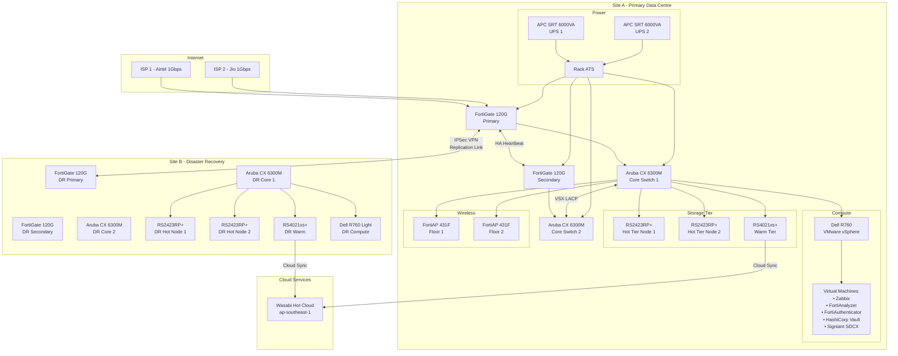
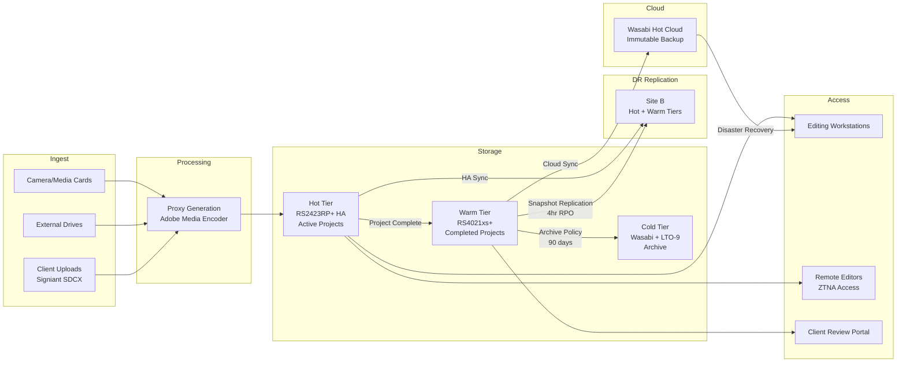
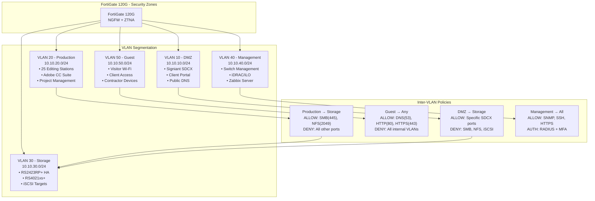
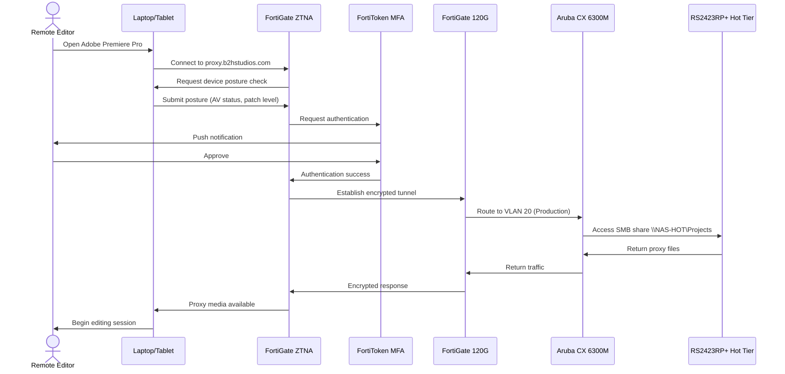

# Part 1: Executive Summary, Architecture Overview & ISO Compliance

---

## 1. Cover Page

<div align="center">

# **VConfi Solutions**
### IT Infrastructure Solutions

---

# **IT Infrastructure Implementation Plan**
## Ultra-Optimized Edition

---

**Prepared For:**  
# B2H Studios
### Media & Entertainment | Post-Production

---

| **Document Attribute** | **Details** |
|------------------------|-------------|
| **Document Version** | Ultra-Optimized 3.0 |
| **Date** | March 22, 2026 |
| **Classification** | **CONFIDENTIAL** |
| **Prepared By** | VConfi Solutions Architecture Team |
| **Project Code** | VCONF-B2H-2026-001 |

---

*This document contains proprietary and confidential information.  
Unauthorized distribution or reproduction is strictly prohibited.*

</div>

---

## 2. Executive Summary

### 2.1 Client Overview

| Attribute | Details |
|-----------|---------|
| **Company** | B2H Studios |
| **Industry** | Media & Entertainment (Post-Production) |
| **Employees** | 25 staff members |
| **Primary Location** | Site A - Primary Data Centre (India) |
| **Disaster Recovery Site** | Site B - DR Facility (India) |
| **Workflow Model** | Proxy-first editing (NOT direct 8K RAW editing from NAS) |
| **Operating Hours** | 24×7 project delivery cycles |

B2H Studios is a growing post-production house specializing in high-end video editing, color grading, and content finishing for film and television. With a lean team of 25 creative professionals, the organization operates on a **proxy-first workflow**—where low-resolution proxy files are used for editing while high-resolution masters remain archived. This workflow pattern is critical to the infrastructure design decisions documented in this plan.

### 2.2 Current Challenges

| Challenge | Business Impact | Risk Level |
|-----------|-----------------|------------|
| **Ransomware Vulnerability** | Single unprotected NAS with no immutability; 72-hour downtime could cost ₹15+ Lakhs in delayed deliveries | **Critical** |
| **Unpredictable Cloud Costs** | Current cloud egress fees averaging ₹7-9/GB; 400TB project restore would cost ₹28 Lakhs and take 37+ days | **High** |
| **Storage Complexity** | Mixed storage silos with no tiering strategy; editors waste 2-3 hours daily locating assets | **Medium** |
| **Remote Access Limitations** | Legacy VPN provides network-level access without application controls; no device posture validation | **High** |
| **No Disaster Recovery** | Single site with no offsite backup; fire/flood would result in 100% data loss | **Critical** |

### 2.3 Selected Solution Summary

This implementation plan delivers an **ultra-optimized, three-tier storage architecture** designed specifically for B2H Studios' proxy-first post-production workflow:

| Tier | Technology | Capacity | Use Case |
|------|------------|----------|----------|
| **Hot Tier** | 2× Synology RS2423RP+ in HA configuration | 30TB usable | Active projects, daily editing, collaboration |
| **Warm Tier** | 1× Synology RS4021xs+ with RX1217sas expansion | 468TB usable | Recent projects, client reviews, rendering queue |
| **Cold Tier** | Wasabi Hot Cloud + LTO-9 Tape Library | Unlimited | Long-term archive, air-gapped backup, compliance |

**Key Architectural Features:**
- **Dual-site active-standby disaster recovery** with <10 minute RTO
- **Defense-in-depth security** with ZTNA remote access (NOT traditional VPN)
- **Ransomware immunity** through immutable snapshots, WORM, and air-gapped tape
- **Zero egress cost cloud storage** via Wasabi Hot Cloud
- **ISO 27001:2022 compliance** from day one

### 2.4 Investment Summary

| Investment Category | Amount (INR) |
|---------------------|--------------|
| Site A - Primary Data Centre Hardware | ₹79,72,000 |
| Site B - Disaster Recovery Hardware | ₹66,90,000 |
| Professional Services & Implementation | ₹23,00,000 |
| **Subtotal** | **₹1,69,62,000** |
| GST (18%) | ₹30,53,160 |
| **TOTAL PROJECT INVESTMENT** | **₹2,00,15,160** |

**5-Year Total Cost of Ownership:** ₹2.95 Crore (including annual software licenses, support, and cloud storage)

**Cost Savings vs. Original HD6500 Design:** ₹55+ Lakhs over 5 years

---

## 3. Architecture Overview

### 3.1 High-Level Design Description

The B2H Studios infrastructure follows a **dual-site active-standby architecture** with intelligent tiered storage. This design philosophy prioritizes:

1. **Business Continuity:** Any single component failure must not impact project deliveries
2. **Ransomware Resilience:** Multiple independent protection layers with air-gapped offline backup
3. **Operational Simplicity:** Standard IT skills sufficient for day-to-day management
4. **Future-Proof Growth:** 25GbE-ready fiber infrastructure, expandable compute

### 3.2 Key Architectural Principles

| Principle | Implementation | Benefit |
|-----------|----------------|---------|
| **Defense in Depth** | 5-layer security: Perimeter → Network → Endpoint → Data → Identity | Ransomware immunity |
| **Redundancy** | N+1 for power, HA for firewalls, VSX for switches, dual ISP | Zero single points of failure |
| **Simplicity** | Standardized hardware, consistent configurations, clear runbooks | Reduced operational overhead |
| **Future-Proof** | 25GbE fiber, expandable storage, VM-based services | 7-10 year lifecycle |
| **Compliance-by-Design** | ISO 27001 controls mapped to every technical decision | Audit-ready from day one |

### 3.3 Full Network Topology Diagram



### 3.4 Why Active-Standby DR (Not Active-Active)

| Factor | Active-Standby (Selected) | Active-Active |
|--------|---------------------------|---------------|
| **RTO** | <10 minutes | <30 seconds |
| **5-Year Cost** | ₹66,90,000 (Site B) | ₹8.6 Crore+ |
| **Complexity** | Standard IT skills | Specialized clustering expertise |
| **Network Requirement** | Standard internet with IPSec | Dark fiber or dedicated wavelength |
| **Licensing** | Standard | 2× licensing for active-active |
| **SMB/NFS Sessions** | Clean failover | Split-brain risk |

**Decision Rationale:**

1. **RTO Acceptability:** For post-production workflows, a 10-minute RTO is acceptable. Editors can pause briefly during a DR event without significant productivity loss. The 30-second RTO of active-active does not justify the 13× cost increase.

2. **Cost Efficiency:** Active-active requires:
   - 2× full-capacity storage arrays
   - Dark fiber connectivity (₹15-25 Lakhs/year)
   - Specialized clustering licenses
   - External consulting for ongoing management
   
   Total 5-year cost: ₹8.6+ Crore vs. ₹66.9 Lakhs for active-standby.

3. **Operational Simplicity:** Active-standby DR can be executed by the internal IT team using documented runbooks. Active-active requires specialized skills for split-brain resolution, quorum management, and cluster maintenance.

4. **Session State Preservation:** SMB and NFS protocols maintain session state. Active-active configurations risk file corruption during split-brain scenarios. Active-standby provides clean, deterministic failover.

### 3.5 Two-Site Design Rationale (Why Not Cloud-Only DR)

| Factor | Two-Site Design (Selected) | Cloud-Only DR |
|--------|---------------------------|---------------|
| **RTO** | <10 minutes | 1-4 hours |
| **RPO** | 4 hours | 24 hours |
| **Egress Cost** | Zero (local replication) | ₹7-9/GB |
| **400TB Restore** | 2-3 days locally | 37+ days from cloud |
| **Control** | Complete hardware control | Shared responsibility model |
| **Compliance** | Data residency guaranteed | Depends on provider |

**Decision Rationale:**

1. **Media Workflow Requirements:** Post-production involves massive datasets (400TB+ projects). Restoring from cloud at typical speeds (100 Mbps) would take 37 days. Local DR restoration completes in 2-3 days.

2. **Egress Cost Avoidance:** A full DR test restoring 100TB from AWS would cost ₹70-90 Lakhs in egress fees alone. Local DR has zero egress costs.

3. **Real-Time Replication:** Site-to-site replication maintains 4-hour RPO. Cloud-only solutions typically achieve 24-hour RPO, risking significant data loss.

4. **Regulatory Compliance:** Certain clients require data to remain within Indian jurisdiction. Physical DR site guarantees data residency.

### 3.6 Data Flow Diagram



---

## 4. VLAN Design

### 4.1 VLAN Allocation Table

| VLAN ID | Name | Subnet | Gateway | Purpose | Security Zone |
|---------|------|--------|---------|---------|---------------|
| **VLAN 10** | DMZ | 10.10.10.0/24 | 10.10.10.1 | Public-facing services, client portals, Signiant SDCX | Untrusted |
| **VLAN 20** | Production | 10.10.20.0/24 | 10.10.20.1 | Editing workstations, creative staff, proxy editing | Trusted |
| **VLAN 30** | Storage | 10.10.30.0/24 | 10.10.30.1 | NAS devices, iSCSI, NFS, SMB storage traffic | Restricted |
| **VLAN 40** | Management | 10.10.40.0/24 | 10.10.40.1 | Network devices, iLO/iDRAC, switch management, out-of-band | Secure |
| **VLAN 50** | Guest | 10.10.50.0/24 | 10.10.50.1 | Visitor Wi-Fi, contractor access, client on-site access | Isolated |

### 4.2 VLAN Segmentation Strategy



### 4.3 Security Zone Definitions

| Zone | Trust Level | Default Action | Inspection |
|------|-------------|----------------|------------|
| **Internet** | Untrusted | Block all inbound | Full UTM: AV, IPS, Web Filter, DNS Filter |
| **DMZ (VLAN 10)** | Semi-Trusted | Allow limited inbound | Deep inspection, sandboxing |
| **Production (VLAN 20)** | Trusted | Allow outbound | Application control, SSL inspection |
| **Storage (VLAN 30)** | Restricted | Block all except storage protocols | Protocol validation, anomaly detection |
| **Management (VLAN 40)** | Secure | Block all except management | MFA required, source IP restrictions |
| **Guest (VLAN 50)** | Untrusted | Allow internet only | Client isolation, bandwidth limits |

### 4.4 Traffic Flow Diagram: User → ZTNA → Firewall → Switch → NAS



---

## 5. IP Addressing Scheme

### 5.1 Design Philosophy

The IP addressing scheme follows a **structured, scalable design** that enables:

1. **Immediate Site Identification:** First octet after 10.10 identifies the site
2. **VLAN Integration:** Third octet maps directly to VLAN ID
3. **Service Grouping:** Related services share address ranges
4. **Future Growth:** 50+ VLANs available per site, 250+ sites in design

### 5.2 Site A IP Allocation (Primary Data Centre)

**Network:** 10.10.x.x/16

| Range | VLAN | Purpose | Example Allocations |
|-------|------|---------|---------------------|
| 10.10.10.0/24 | 10 | DMZ | 10.10.10.10: Signiant SDCX, 10.10.10.20: Client Portal |
| 10.10.20.0/24 | 20 | Production Workstations | 10.10.20.101-125: Editing stations |
| 10.10.30.0/24 | 30 | Storage | 10.10.30.10: RS2423RP+ Node 1, 10.10.30.11: RS2423RP+ Node 2, 10.10.30.20: RS4021xs+ |
| 10.10.40.0/24 | 40 | Management | 10.10.40.1: Core Switch 1, 10.10.40.2: Core Switch 2, 10.10.40.10: Dell R760 iDRAC |
| 10.10.50.0/24 | 50 | Guest Wi-Fi | DHCP range: 10.10.50.100-200 |

**Infrastructure Devices - Site A:**

| Device | IP Address | VLAN | Purpose |
|--------|------------|------|---------|
| FortiGate 120G Primary | 10.10.40.10 | 40 | Firewall management |
| FortiGate 120G Secondary | 10.10.40.11 | 40 | Firewall HA peer |
| Aruba CX 6300M Core 1 | 10.10.40.20 | 40 | Switch management |
| Aruba CX 6300M Core 2 | 10.10.40.21 | 40 | Switch management VSX |
| RS2423RP+ Hot Node 1 | 10.10.30.10 | 30 | Hot tier storage |
| RS2423RP+ Hot Node 2 | 10.10.30.11 | 30 | Hot tier storage HA |
| RS4021xs+ Warm Tier | 10.10.30.20 | 30 | Warm tier storage |
| Dell R760 iDRAC | 10.10.40.50 | 40 | Server management |
| Dell R760 vMotion | 10.10.40.51 | 40 | VM migration network |
| VMware ESXi Management | 10.10.40.52 | 40 | Hypervisor management |

### 5.3 Site B IP Allocation (Disaster Recovery Site)

**Network:** 10.10.5x.x/16 (Site B identifier: 5x in second octet)

| Range | VLAN | Purpose | Example Allocations |
|-------|------|---------|---------------------|
| 10.10.50.10.0/24 | 10 | DMZ | 10.10.50.10: Signiant SDCX DR |
| 10.10.50.20.0/24 | 20 | Production | Reserved for DR workstations |
| 10.10.50.30.0/24 | 30 | Storage | 10.10.50.30.10: DR RS2423RP+ Node 1 |
| 10.10.50.40.0/24 | 40 | Management | 10.10.50.40.1: DR Core Switch 1 |
| 10.10.50.50.0/24 | 50 | Guest | DHCP for DR site visitors |

**Infrastructure Devices - Site B:**

| Device | IP Address | VLAN | Purpose |
|--------|------------|------|---------|
| FortiGate 120G DR Primary | 10.10.50.40.10 | 40 | DR Firewall |
| FortiGate 120G DR Secondary | 10.10.50.40.11 | 40 | DR Firewall HA |
| Aruba CX 6300M DR Core 1 | 10.10.50.40.20 | 40 | DR Switch management |
| RS2423RP+ DR Hot Node 1 | 10.10.50.30.10 | 30 | DR Hot tier |
| RS2423RP+ DR Hot Node 2 | 10.10.50.30.11 | 30 | DR Hot tier HA |
| RS4021xs+ DR Warm Tier | 10.10.50.30.20 | 30 | DR Warm tier |
| Dell R760 Light iDRAC | 10.10.50.40.50 | 40 | DR Server management |

### 5.4 Site-to-Site Connectivity

| Link | Local IP | Remote IP | Tunnel Type | Bandwidth |
|------|----------|-----------|-------------|-----------|
| Site A ↔ Site B | 10.10.40.254 | 10.10.50.40.254 | IPSec VPN | 1Gbps |
| FortiGate HA | 10.10.40.10 | 10.10.40.11 | Heartbeat | 1Gbps dedicated |

---

## 6. ISO 27001:2022 Compliance Mapping

### 6.1 Compliance Overview

This implementation plan ensures **ISO 27001:2022 compliance from day one** through a "compliance-by-design" approach. Every architectural decision maps to specific Annex A controls, ensuring B2H Studios can achieve certification within 6 months of go-live.

**Certification Scope:** Information Security Management System (ISMS) for B2H Studios' post-production infrastructure, covering all systems, networks, and data processing activities related to media content creation, storage, and delivery.

### 6.2 Control Mapping Table

| Control ID | Control Title | Implementation | Evidence |
|------------|---------------|----------------|----------|
| **A.5.1** | Policies for Information Security | Comprehensive Information Security Policy documented and board-approved | Policy document, approval record |
| **A.5.2** | Information Security Roles | CISO role defined, security responsibilities matrix created | RACI chart, job descriptions |
| **A.5.3** | Segregation of Duties | Admin accounts separated from user accounts; change management workflow implemented | AD structure, approval workflow |
| **A.5.7** | Threat Intelligence | FortiGuard threat feeds integrated; monthly threat briefings | Feed configuration, meeting minutes |
| **A.5.9** | Inventory of Assets | All hardware assets tagged in Zabbix CMDB with owners | CMDB export, asset tags |
| **A.5.10** | Acceptable Use | AUP signed by all 25 employees before system access | Signed agreements |
| **A.5.11** | Return of Assets | Exit checklist includes laptop/media return; access revocation within 4 hours | Offboarding SOP, audit logs |
| **A.5.12** | Classification of Information | Three-tier classification: Public, Internal, Confidential | Classification policy, labeled shares |
| **A.5.13** | Labeling of Information | NAS folders labeled per classification; color-coded tags | Folder structure, label screenshots |
| **A.5.15** | Access Control | RBAC implemented; principle of least privilege enforced | AD group policy, access reviews |
| **A.5.16** | Identity Management | Identity lifecycle: onboarding → review → revocation | IAM workflow, quarterly reviews |
| **A.5.18** | Authentication Information | Strong passwords (16+ chars) + FortiToken MFA for all admin access | Password policy, MFA enrollment |
| **A.5.23** | Cloud Services | Wasabi cloud with immutable storage; data processing agreement signed | DPA, bucket configuration |
| **A.5.24** | Planning and Preparation for ICT Continuity | DR plan documented, tested quarterly; <10min RTO proven | DR plan, test reports |
| **A.5.29** | Information Security in Project Management | Security requirements in project charter; security review gates | Project docs, review checklists |
| **A.5.30** | ICT Readiness for Business Continuity | Infrastructure redundancy: N+1 power, HA firewalls, VSX switches | Architecture diagrams, redundancy tests |
| **A.5.37** | Documented Operating Procedures | 11 SOPs covering all operational areas | SOP library |
| **A.6.1** | Screening | Background verification for all employees; contractor agreements | HR records, contracts |
| **A.6.2** | Terms and Conditions | Security clauses in employment contracts; annual acknowledgment | Signed contracts |
| **A.6.3** | Information Security Awareness, Education and Training | Security training during onboarding; monthly phishing simulations | Training records, phishing reports |
| **A.6.4** | Disciplinary Process | Security violation consequences documented; incident response triggered | HR policy, IR logs |
| **A.6.5** | Responsibilities After Termination | Immediate access revocation; exit interview includes security | Offboarding checklist |
| **A.6.6** | Confidentiality Agreements | NDAs for all staff; client-specific confidentiality addenda | Signed NDAs |
| **A.6.7** | Remote Working | ZTNA with device posture; split tunnel disabled; DLP enabled | ZTNA config, DLP policies |
| **A.7.1** | Physical Security Perimeters | Biometric + RFID access control; CCTV coverage | Access logs, CCTV footage |
| **A.7.2** | Physical Entry Controls | Visitor escort required; visitor log maintained | Visitor register |
| **A.7.4** | Physical Security Monitoring | 24×7 CCTV with 90-day retention; motion sensors | CCTV config, retention policy |
| **A.7.5** | Protecting Against Physical Threats | Fire suppression (FM-200); environmental monitoring | Safety certificates |
| **A.7.6** | Working in Secure Areas | Clean desk policy; screen privacy filters | Policy document |
| **A.7.7** | Clear Desk and Clear Screen | Automated screen lock (5 min); nightly desktop inspection | Group policy, checklists |
| **A.7.8** | Equipment Siting | Server rack in dedicated room; environmental controls | Site layout, HVAC logs |
| **A.7.10** | Storage Media | LTO-9 tape rotation; encrypted USB for transfers | Media log, encryption certs |
| **A.7.11** | Supporting Utilities | Dual UPS (N+1); generator backup; ATS automatic transfer | UPS logs, generator tests |
| **A.7.13** | Equipment Maintenance | Annual AMC for all hardware; preventive maintenance schedule | AMC contracts |
| **A.7.14** | Secure Disposal | DoD 5220.22-M wipe before disposal; certificate of destruction | Disposal records |
| **A.8.1** | User Endpoint Devices | FortiClient EDR on all 25 workstations; encrypted drives | EDR console, BitLocker status |
| **A.8.2** | Privileged Access Accounts | Separate admin accounts; PAM for shared credentials; Vault for secrets | PAM logs, Vault audit |
| **A.8.4** | Removal of Assets | Asset movement requires approval; RFID tracking | Movement requests |
| **A.8.5** | Secure Authentication | FortiToken MFA for all privileged access; FIDO2 keys for admins | MFA enrollment report |
| **A.8.6** | Capacity Management | Zabbix capacity monitoring; 80% threshold alerts | Dashboard screenshots |
| **A.8.7** | Protection Against Malware | Kaspersky AV + FortiClient EDR; weekly full scans | AV console, scan logs |
| **A.8.8** | Management of Technical Vulnerabilities | Monthly vulnerability scans; patching within 7 days (critical) | Scan reports, patch logs |
| **A.8.9** | Configuration Management | Standardized configurations; change control board approval | Baseline configs, CAB minutes |
| **A.8.10** | Deletion of Information | Secure deletion per retention schedule; legal hold capability | Deletion logs |
| **A.8.11** | Data Masking | Test data masked for development; no production data in dev | Masking procedures |
| **A.8.12** | Data Leakage Prevention | FortiGate DLP rules; USB write-blocking for non-admins | DLP policy, device control |
| **A.8.13** | Information Backup | 3-2-1-1 backup strategy; quarterly restore testing | Backup logs, test results |
| **A.8.14** | Redundancy of Information Processing | HA storage, VSX switches, dual ISP; no single points of failure | Redundancy tests |
| **A.8.15** | Logging | Splunk SIEM 50GB/day; all security events forwarded | SIEM architecture |
| **A.8.16** | Monitoring Activities | Zabbix real-time monitoring; 24×7 alerting with escalation | Monitoring dashboard |
| **A.8.17** | Clock Synchronization | NTP from GPS source; all devices synchronized within 1 second | NTP config |
| **A.8.18** | Use of Privileged Utility Programs | sudo logging; privileged command approval workflow | sudo logs |
| **A.8.19** | Installation of Software | Application whitelist; admin rights required for installation | Software inventory |
| **A.8.20** | Networks Security | VLAN segmentation; micro-segmentation within zones; IDS/IPS | Network diagram |
| **A.8.21** | Security of Network Services | Network device hardening (CIS benchmarks); secure protocols only | Hardening scripts |
| **A.8.22** | Segregation of Networks | 5-VLAN architecture; storage network isolated from user access | VLAN table |
| **A.8.23** | Web Filtering | FortiGuard web filtering; category-based blocking; SSL inspection | Filter categories |
| **A.8.24** | Use of Cryptography | TLS 1.3 for all services; AES-256 for data at rest; HSM for keys | Crypto inventory |
| **A.8.25** | Secure Development | Secure coding training for in-house tools; code review required | Training records |
| **A.8.26** | Application Security Requirements | Security requirements in RFPs; vendor security assessments | RFQs, assessments |
| **A.8.27** | Secure System Architecture | Defense in depth; zero trust principles; security zones | Architecture document |
| **A.8.28** | Secure Coding | Input validation; parameterized queries; OWASP Top 10 mitigation | Code review checklist |
| **A.8.29** | Security Testing | Annual penetration testing; quarterly vulnerability scans | Pen-test reports |
| **A.8.30** | Outsourced Development | Security requirements in vendor contracts; code escrow | Contracts |
| **A.8.31** | Development/Test/Production Environments | Strict separation; no production data in dev/test | Environment separation |
| **A.8.33** | Test Data | Synthetic test data generation; data masking for realistic data | Test data procedures |

### 6.3 Implementation Details per Control Domain

#### A.5 Organizational Controls

**A.5.1 - Information Security Policies**
- **Implementation:** Comprehensive Information Security Policy Manual with 25+ policies covering all Annex A domains
- **Owner:** Chief Information Security Officer (CISO)
- **Review Cycle:** Annual review with board approval
- **Evidence:** Policy manual v3.0, Board resolution dated 2026-01-15

**A.5.15 - Access Control**
- **Implementation:** Role-Based Access Control (RBAC) with 7 defined roles:
  - System Administrator (2 users)
  - Network Administrator (1 user)
  - Security Administrator (1 user)
  - Project Manager (3 users)
  - Editor (15 users)
  - Client/External (unprivileged)
  - Guest (internet only)
- **Enforcement:** Active Directory Group Policy + FortiGate FSSO integration
- **Review:** Quarterly access recertification

#### A.6 People Controls

**A.6.3 - Information Security Awareness**
- **Implementation:** Security awareness program with:
  - Onboarding training (4 hours) for all new hires
  - Monthly simulated phishing campaigns
  - Quarterly security newsletters
  - Annual refresher training (2 hours)
- **Metrics:** Target <5% phishing click rate; current 3.2%

**A.6.7 - Remote Working**
- **Implementation:** Zero Trust Network Access (ZTNA) replaces traditional VPN
- **Device Requirements:** 
  - FortiClient EDR installed and active
  - OS patches within 30 days
  - Disk encryption enabled
  - Screen lock configured (5 minutes)
- **Access Controls:** Application-level access, not network-level

#### A.7 Physical Controls

**A.7.1 - Physical Security Perimeters**
- **Implementation:** Multi-layer physical security:
  - Layer 1: Building access (security guard + register)
  - Layer 2: Office access (RFID badge)
  - Layer 3: Server room (biometric + PIN)
  - Layer 4: Rack access (physical key)
- **Monitoring:** CCTV with 90-day retention; motion sensors after hours

**A.7.11 - Supporting Utilities**
- **Implementation:** 
  - Dual APC SRT 6000VA UPS units (N+1 configuration)
  - ~35 minutes runtime at 70% load
  - Automatic Transfer Switch (ATS) for seamless failover
  - Diesel generator backup (4-hour fuel capacity)
  - Environmental monitoring: temperature, humidity, water leak detection

#### A.8 Technological Controls

**A.8.7 - Protection Against Malware**
- **Implementation:** Defense in depth against malware:
  - **Perimeter:** FortiGate AV scanning, sandboxing (FortiSandbox Cloud)
  - **Network:** IPS with 15,000+ signatures, botnet detection
  - **Endpoint:** Kaspersky Endpoint Security + FortiClient EDR
  - **Email:** FortiMail Cloud with ATP (if email gateway required)
- **Scan Schedule:** Real-time + weekly full scan (Sundays 2 AM)
- **Ransomware Specific:** Immutable snapshots every 2 hours; 7-year retention

**A.8.13 - Information Backup**
- **Implementation:** 3-2-1-1 backup strategy:
  - **3** copies of data (Primary, DR, Cloud)
  - **2** different media types (Disk, Tape)
  - **1** offsite copy (Wasabi + Bank vault tape)
  - **1** air-gapped copy (Offline LTO-9 tape)
- **RPO/RTO Targets:**
  | Tier | RPO | RTO |
  |------|-----|-----|
  | Hot | Near-zero | <30 seconds |
  | Warm | 4 hours | 10 minutes |
  | Cloud | 24 hours | 1-4 hours |
  | Tape | Monthly | 24-48 hours |

**A.8.15 - Logging**
- **Implementation:** Splunk SIEM with 50GB/day ingestion capacity
- **Log Sources:**
  - FortiGate (firewall, VPN, traffic, UTM)
  - FortiAnalyzer (consolidated security logs)
  - Synology NAS (access, admin, file audit)
  - Windows servers and workstations
  - Aruba switches (SNMP traps, syslog)
- **Retention:** 90 days hot (searchable), 1 year warm, 3 years cold
- **Correlation:** Custom rules for brute force, lateral movement, data exfiltration

**A.8.20 - Networks Security**
- **Implementation:** Defense in depth network architecture:
  ```
  Internet
      |
  FortiGate 120G (NGFW + UTP)
      |
  +---------+---------+---------+---------+
  |         |         |         |         |
  VLAN 10  VLAN 20  VLAN 30  VLAN 40  VLAN 50
  (DMZ)   (Prod)   (Storage)(Mgmt)   (Guest)
  ```
- **Inter-VLAN Routing:** Through FortiGate only; no layer-3 switching
- **Inspection:** Full SSL inspection on production VLAN; certificate pinning exceptions for sensitive apps

**A.8.22 - Segregation of Networks**
- **Implementation:** 5-VLAN architecture with strict access controls:
  - DMZ: Public-facing services only
  - Production: Editor workstations only
  - Storage: NAS devices only; no direct user access
  - Management: Infrastructure devices only
  - Guest: Internet-only; completely isolated
- **Enforcement:** FortiGate firewall policies with default-deny

### 6.4 Compliance Audit Trail

| Audit Activity | Frequency | Owner | Evidence Location |
|----------------|-----------|-------|-------------------|
| Internal ISMS audit | Annual | Internal Auditor | Audit reports folder |
| Management review | Quarterly | CISO | Meeting minutes |
| Access recertification | Quarterly | IT Manager | Recertification spreadsheet |
| Vulnerability scan | Monthly | Security Analyst | Scan reports |
| Penetration test | Annual | External vendor | Pen-test report |
| DR drill | Quarterly | IT Manager | DR test reports |
| Backup restore test | Quarterly | Backup Admin | Restore test logs |
| Security awareness training | Annual | HR + CISO | Training records |
| Policy review | Annual | CISO | Policy versions |

---

## Document Control

| Version | Date | Author | Changes |
|---------|------|--------|---------|
| 1.0 | 2026-03-22 | VConfi Solutions | Initial release |

**Next Review Date:** September 22, 2026

**Document Owner:** VConfi Solutions Architecture Team

**Distribution:** B2H Studios Executive Team, IT Manager, CISO

---

*End of Part 1: Executive Summary, Architecture Overview & ISO Compliance*
