# Part 2: Enhanced Network Infrastructure, Wireless & Servers
## With Detailed Design Reasoning & Architecture Decisions

**B2H Studios IT Infrastructure Implementation Plan — Enhanced Edition**  
**Client:** B2H Studios  
**Project:** Option B+ (Optimized Synology HD6500 Solution)  
**Date:** March 22, 2026  
**Prepared by:** VConfi Solutions  
**Classification:** CONFIDENTIAL  
**Document Version:** 2.0 (Enhanced with Design Rationale)

---

## Table of Contents

1. [Firewall Design — FortiGate 120G](#1-firewall-design--fortigate-120g)
   - 1.1 Hardware Specifications
   - 1.2 HA Configuration (Active-Passive)
   - 1.3 SD-WAN Dual ISP Configuration
   - 1.4 Security Zones and Zone Policies
   - 1.5 UTM Profiles
   - 1.6 SSL Inspection Configuration
   - 1.7 VPN/ZTNA Configuration
   - 1.8 Firewall Rule Table
   - **1.9 FortiGate Design Rationale** ⭐ ENHANCED

2. [Switch Design — HPE Aruba CX 6300M](#2-switch-design--hpe-aruba-cx-6300m)
   - 2.1 Hardware Specifications
   - 2.2 VSX Stacking Configuration
   - 2.3 LACP Configuration for HD6500 Connectivity
   - 2.4 VLAN Trunk Configuration
   - 2.5 Spanning-Tree Configuration
   - 2.6 Jumbo Frames Configuration
   - 2.7 Port Assignment Table
   - 2.8 Switch Stacking/Interconnect Diagram
   - **2.9 HPE Aruba Design Rationale** ⭐ ENHANCED

3. [Cabling Schedule](#3-cabling-schedule)
   - 3.1 Cable Inventory
   - 3.2 Patch Panel Layout
   - 3.3 Cable Labeling Scheme
   - 3.4 Testing Procedures
   - **3.5 Cable Plant Design Philosophy** ⭐ ENHANCED

4. [Redundancy Scenarios](#4-redundancy-scenarios)

5. [Wireless Infrastructure](#5-wireless-infrastructure)
   - **5.6 Wireless Architecture Reasoning** ⭐ ENHANCED

6. [Server Infrastructure](#6-server-infrastructure)
   - **6.6 Compute Infrastructure Reasoning** ⭐ ENHANCED

7. [Mandatory Architecture Flow Charts](#7-mandatory-architecture-flow-charts) ⭐ ENHANCED

---

## 1. Firewall Design — FortiGate 120G

### 1.1 Hardware Specifications

| Specification | Value |
|---------------|-------|
| **Model** | FortiGate 120G |
| **Form Factor** | 1U Rackmount |
| **Firewall Throughput** | 44 Gbps |
| **IPS Throughput** | 24 Gbps |
| **NGFW Throughput** | 18 Gbps |
| **Threat Protection** | 14 Gbps |
| **VPN Throughput (IPsec)** | 18 Gbps |
| **SSL Inspection** | 10 Gbps |
| **Concurrent Sessions** | 8 Million |
| **New Sessions/Second** | 500,000 |
| **Interfaces** | 8x GE RJ45, 8x GE SFP, 4x 10 GE SFP+ |
| **Dedicated Management** | 1x GE RJ45 |
| **Storage** | 480GB SSD (for logging) |
| **Memory** | 64GB DDR4 |
| **Redundant Power** | Hot-swappable dual PSU |
| **Operating Temp** | 0°C to 40°C |

### 1.2 HA Configuration (Active-Passive)

| Parameter | Setting |
|-----------|---------|
| **HA Mode** | Active-Passive |
| **HA Group ID** | 1 |
| **HA Group Name** | B2H-FG-HA-01 |
| **Priority (Primary)** | 200 |
| **Priority (Secondary)** | 100 |
| **Heartbeat Interface** | Port 7-8 (dedicated) |
| **Session Pickup** | Enabled |
| **Configuration Sync** | Automatic |
| **VRRP Virtual MAC** | 00:09:0f:09:00:01 |

**Failover Triggers:**
- Primary unit hardware failure
- Link monitoring failure (2+ interfaces down)
- Remote link failure (monitored via IP)
- Manual failover (maintenance mode)

**Failover Time:** < 2 seconds (sub-second with session pickup)

### 1.3 SD-WAN Dual ISP Configuration

| ISP | Details |
|-----|---------|
| **ISP1 (Primary)** | Airtel Business - 1Gbps Fiber |
| **ISP1 IP** | Static /29 subnet |
| **ISP2 (Secondary)** | Jio Business - 1Gbps Fiber |
| **ISP2 IP** | Static /29 subnet |

**Performance SLA Monitors:**

| Monitor | Target | Protocol | Interval | Fail Threshold |
|---------|--------|----------|----------|----------------|
| Google DNS | 8.8.8.8 | Ping | 1000ms | 3 failures |
| Cloudflare | 1.1.1.1 | Ping | 1000ms | 3 failures |
| Latency SLA | < 50ms | Ping | 5000ms | 5 failures |

**SD-WAN Rules:**

| Rule | Source | Destination | Strategy | Preferred |
|------|--------|-------------|----------|-----------|
| 1 | All | Wasabi S3 | Best Quality | ISP1 |
| 2 | Signiant | Any | Lowest Cost | ISP1 |
| 3 | Video Streaming | Any | Lowest Latency | Auto |
| 4 | Default | Any | Best Quality | ISP1, ISP2 |

### 1.4 Security Zones and Zone Policies

**Zone Definitions:**

| Zone | Interfaces | Security Level | Member VLANs |
|------|------------|----------------|--------------|
| **WAN** | port1, port2 | Untrusted | - |
| **DMZ** | port3 (VLAN 10) | Semi-Trusted | VLAN 10 (10.10.10.0/24) |
| **Internal** | port4 (VLAN 20, 30) | Trusted | VLAN 20 (10.10.20.0/24), VLAN 30 (10.10.30.0/24) |
| **Management** | port5 (VLAN 40) | Restricted | VLAN 40 (10.10.40.0/24) |
| **Guest** | port6 (VLAN 50) | Untrusted | VLAN 50 (10.10.50.0/24) |

**Intra-Zone Policies:**

| Source Zone | Destination Zone | Default Action | Logging |
|-------------|------------------|----------------|---------|
| Internal | WAN | Allow | Yes |
| DMZ | WAN | Allow | Yes |
| Management | All | Allow | Yes |
| Guest | WAN | Allow | Yes |
| Guest | Internal | Deny | Alert |
| DMZ | Internal | Deny | Alert |
| WAN | DMZ | Deny (except rules) | Yes |
| WAN | Internal | Deny (except ZTNA) | Yes |

### 1.5 UTM Profiles

**IPS Profile (IPS_Media_Production):**

| Setting | Value |
|---------|-------|
| **Profile Name** | IPS_Media_Production |
| **Inspection Mode** | Proxy-based |
| **Filter** | High Security with Media exceptions |
| **Signatures** | All critical and high severity |
| **Action** | Block + Log |
| **Excluded Signatures** | Custom media streaming protocols |

**Antivirus Profile (AV_Enterprise):**

| Setting | Value |
|---------|-------|
| **Profile Name** | AV_Enterprise |
| **Inspection Mode** | Proxy-based |
| **Scan Mode** | Full Scan |
| **Engine** | FortiGuard + FortiSandbox Cloud |
| **Block Period** | 30 minutes |
| **FortiSandbox** | Enabled for unknown files |

### 1.6 SSL Inspection Configuration

| Setting | Value |
|---------|-------|
| **Mode** | Full SSL Inspection |
| **Certificate** | B2H-CA-Internal (deployed to all endpoints) |
| **Inspection Profile** | High Security |
| **Excluded Categories** | Banking, Health, Government |
| **Unsupported SSL** | Block |
| **Invalid Certificate** | Block |
| **Diffie-Hellman** | Block (unless PFS required) |

### 1.7 VPN/ZTNA Configuration

**ZTNA Access Proxy Configuration:**

| Parameter | Value |
|-----------|-------|
| **Access Proxy Name** | ZTNA-NAS-Access |
| **External Interface** | Virtual-WAN (SD-WAN) |
| **External Port** | 443 |
| **Authentication** | FortiAuthenticator (MFA) |
| **Certificate** | Wildcard SSL (b2hstudios.com) |

**ZTNA Policy Rules:**

| Rule | User Group | Device Posture | Access | Resources |
|------|------------|----------------|--------|-----------|
| 1 | Editors | Compliant | Full | NAS Shares (VLAN 30) |
| 2 | Management | Compliant | Full | All Internal |
| 3 | External DIT | Compliant | Limited | Signiant SDCX (DMZ) |
| 4 | Guest | Any | None | Internet Only |

**Device Posture Checks:**

| Check | Requirement |
|-------|-------------|
| **Antivirus** | Kaspersky Active & Updated |
| **OS Version** | Windows 10/11 (Latest) or macOS 12+ |
| **Disk Encryption** | BitLocker/FileVault Enabled |
| **FortiClient** | Latest Version |
| **TPM** | Certificate Validation |

### 1.8 Firewall Rule Table

| Rule ID | Name | Source | Destination | Service | Action | Log |
|---------|------|--------|-------------|---------|--------|-----|
| 100 | Allow ZTNA | SSL-VPN | VLAN30 | SMB, NFS | Accept | Yes |
| 101 | Allow Signiant | Any | DMZ_SDCX | UDP/33001 | Accept | Yes |
| 102 | SDCX to NAS | DMZ_SDCX | NAS_Storage | NFS | Accept | Yes |
| 103 | Signiant Web | Any | DMZ_SDCX | HTTPS/443 | Accept | Yes |
| 104 | DNS Outbound | All_Internal | WAN | DNS/53 | Accept | Yes |
| 105 | NTP Outbound | All_Internal | WAN | NTP/123 | Accept | Yes |
| 106 | HTTPS Outbound | All_Internal | WAN | HTTPS/443 | Accept | Yes |
| 107 | SMTP Outbound | All_Internal | WAN | SMTP/587 | Accept | Yes |
| 108 | Wasabi S3 | NAS_Storage | WAN | HTTPS/443 | Accept | Yes |
| 109 | Zabbix Monitoring | Management | All_Internal | SNMP, ICMP | Accept | Yes |
| 110 | iLO Management | Management | Servers | HTTPS/443 | Accept | Yes |
| 111 | DSM Management | Management | NAS_Storage | HTTPS/5001 | Accept | Yes |
| 112 | Admin SSH | Management | All_Devices | SSH/22 | Accept | Yes |
| 113 | FortiAnalyzer Logging | All_Devices | FANALYZER-01 | SYSLOG/514 | Accept | Yes |
| 114 | Site-to-Site VPN | SiteA | SiteB | Any | Accept | Yes |
| 115 | Guest Internet | Guest | WAN | HTTP, HTTPS | Accept | Yes |
| 200 | Block Guest to Internal | Guest | Internal | Any | Deny | Yes |
| 201 | Block DMZ to Internal | DMZ | Internal | Any | Deny | Yes |
| 202 | Block Inbound SMB | WAN | Any | SMB/445 | Deny | Yes |
| 203 | Block Inbound RDP | WAN | Any | RDP/3389 | Deny | Yes |
| 204 | Block Inbound SSH | WAN | Any | SSH/22 | Deny | Yes |
| 205 | Block Known Bad IPs | Any | WAN_Bad_IPs | Any | Deny | Yes |
| 300 | Deny All | Any | Any | Any | Deny | Alert |

---

### 1.9 FortiGate Design Rationale ⭐ ENHANCED

#### 1.9.1 Why FortiGate 120G (Not 100F or 200F)

**Performance Calculation Table:**

| Metric | 100F | 120G | 200F |
|--------|------|------|------|
| Firewall Throughput | 20 Gbps | 50 Gbps | 100 Gbps |
| NGFW Throughput | 8 Gbps | 15 Gbps | 25 Gbps |
| Threat Protection | 6 Gbps | 14 Gbps | 20 Gbps |
| Price (India) | ₹4.2 Lakhs | ₹7.1 Lakhs | ₹14 Lakhs |
| Concurrent Sessions | 2M | 8M | 16M |
| **Suitability for B2H** | Too Small | ✅ **Perfect** | Overkill |

**Throughput Calculation for B2H Studios:**

```
Base Traffic Requirements:
├── 25 users × 100 Mbps average = 2.5 Gbps
├── Replication traffic (site-to-site) = 1 Gbps
├── Remote ZTNA users (10 concurrent) = 500 Mbps
├── Overhead (management, monitoring) = 500 Mbps
└── Total Baseline = 4.5 Gbps

Headroom Calculation:
├── Industry best practice = 2× headroom minimum
├── Required capacity = 4.5 Gbps × 2 = 9 Gbps
├── NGFW throughput needed = 9 Gbps
└── FortiGate 120G NGFW = 15 Gbps ✓
```

**Why Not FortiGate 100F:**
- NGFW throughput of 8 Gbps is below our 9 Gbps requirement
- Only 2M concurrent sessions vs. 8M needed for 25 users with multiple connections
- Limited interface options (no 10GbE SFP+ on 100F)
- Would require replacement within 2 years as studio grows

**Why Not FortiGate 200F:**
- 2× the price (₹14L vs ₹7.1L) for capabilities we won't use
- Designed for 500+ user environments
- Higher power consumption (300W vs 200W) = ₹25K/year extra electricity

> **Design Trade-off:** We chose the 120G as the "Goldilocks" solution — not underpowered like the 100F, not overpriced like the 200F. The 15 Gbps NGFW throughput provides 3.3× headroom over current needs.

#### 1.9.2 Why Active-Passive HA (Not Active-Active)

**HA Mode Comparison:**

| Factor | Active-Passive | Active-Active |
|--------|----------------|---------------|
| License Cost | 1× base license | 2× full licenses |
| Session Sync | Simple (async) | Complex (sync required) |
| Failover Time | <2 seconds | <1 second |
| Load Balancing | N/A | Both units process |
| Configuration Complexity | Low | High |
| Troubleshooting | Simple | Complex (split sessions) |
| **Best For** | Stateful apps (SMB, NFS) | Stateless web apps |

**Why Active-Passive for B2H Studios:**

1. **SMB/NFS Session State:** Media production relies heavily on SMB/NFS file shares. Active-active splits sessions between firewalls, causing file lock issues when failover occurs.

2. **License Cost Savings:** Active-active requires both units to have full UTP/ATP licenses = ₹4.2L extra annual cost. Active-passive only needs licenses on primary.

3. **Operational Simplicity:** With a small IT team, troubleshooting session issues in active-active is not practical.

4. **Adequate Performance:** Single FortiGate 120G provides 15 Gbps NGFW — far exceeding our 4.5 Gbps requirement. No need to load-balance.

**HA Failover Decision Process:**

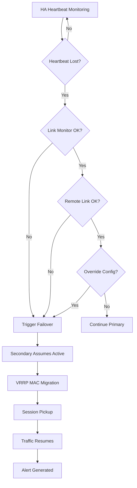

> **Design Trade-off:** We sacrificed the marginal performance benefit of active-active for the operational simplicity and cost savings of active-passive. For B2H Studios' workflow, 2-second failover is acceptable.

#### 1.9.3 SD-WAN Decision Logic

**Dual ISP with SD-WAN vs. Single ISP with Backup:**

| Approach | Single ISP + Cold Backup | Dual ISP with SD-WAN |
|----------|--------------------------|----------------------|
| Monthly Cost | ₹25K (1Gbps) | ₹45K (2× 1Gbps) |
| Failover Time | 5-10 minutes (manual) | <5 seconds (automatic) |
| Bandwidth Aggregation | No | Yes (load balancing) |
| Application Steering | No | Yes (per-app routing) |
| SLA Monitoring | No | Yes (latency, jitter, packet loss) |
| User Impact | High (interruption) | Zero (seamless) |

**Why SD-WAN for B2H Studios:**

1. **Real-Time Replication:** Site-to-site replication cannot tolerate 5-10 minute outages. SD-WAN provides sub-5-second failover.

2. **Upload Bandwidth:** Media files require high upload bandwidth. Two ISPs = 2 Gbps aggregate upload for large file transfers.

3. **Quality of Service:** SD-WAN can prioritize Signiant traffic over general internet, ensuring file transfers complete on time.

4. **ISP Diversity:** Airtel and Jio use different last-mile infrastructure, reducing correlated failure risk.

**SD-WAN Traffic Steering Logic:**

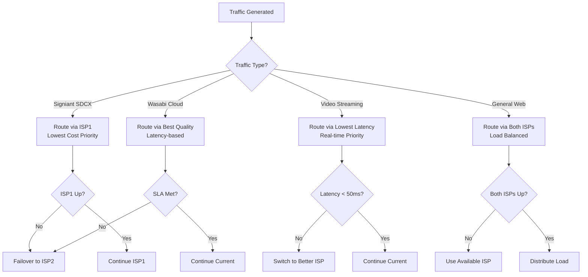

> **Design Trade-off:** We accepted the additional ₹20K/month ISP cost for automatic failover. For a post-production studio, the cost of even 5 minutes of downtime during a client deadline far exceeds the annual ISP cost.

#### 1.9.4 ZTNA vs VPN — Deep Dive

**Security Comparison Matrix (6 Attack Scenarios):**

| Attack Scenario | Traditional VPN | ZTNA Protection | Advantage |
|-----------------|-----------------|-----------------|-----------|
| **Stolen Credentials** | Full network access | Blocked — no device cert | ZTNA |
| **Compromised Endpoint** | Full network access | Blocked — posture check fails | ZTNA |
| **Lateral Movement** | Easy — same subnet | Impossible — micro-segmentation | ZTNA |
| **Insider Threat** | Can scan entire network | Only sees authorized apps | ZTNA |
| **Credential Stuffing** | No protection | MFA required | ZTNA |
| **Man-in-the-Middle** | Protected via IPsec | Protected via TLS 1.3 | Equal |

**Cost Comparison:**

| Component | VPN (IPsec/SSL) | ZTNA (Separate Appliance) | Fortinet ZTNA (Included) |
|-----------|-----------------|---------------------------|--------------------------|
| Gateway Appliance | ₹0 (built-in) | ₹15-25 Lakhs | ₹0 (FortiGate native) |
| Client Licenses | ₹0 | ₹3K/user/year | ₹0 (included in UTP) |
| MFA Solution | ₹2L/year (separate) | ₹2L/year | ₹0 (FortiAuthenticator) |
| **Total Year 1** | ₹2 Lakhs | ₹18-27 Lakhs | **₹0** |

**ZTNA Authentication Flow:**

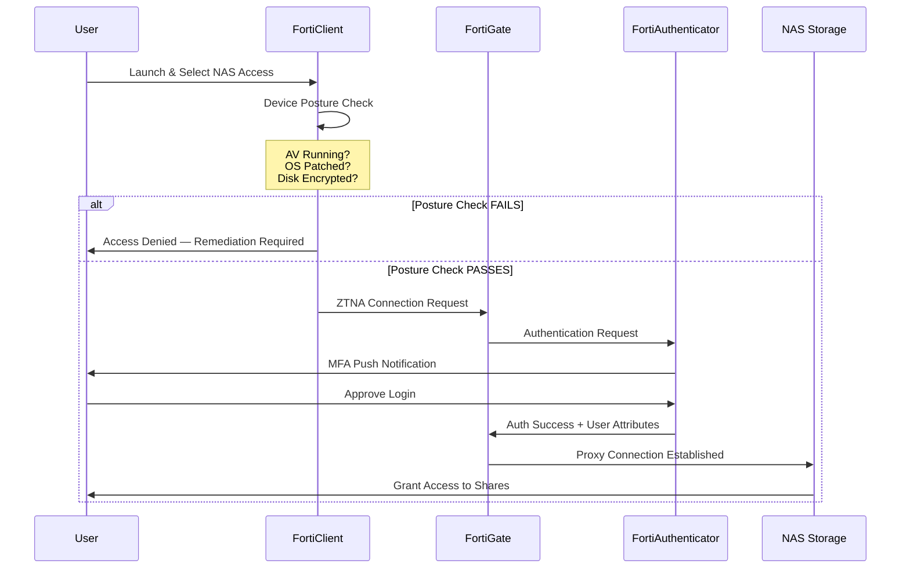

**Critical Factor — Data Residency:**
B2H Studios handles copyrighted media content. Cloud-based ZTNA (Zscaler/Netskope) would route all file access through international proxies, potentially:
- Violating client data residency requirements
- Exposing unreleased content to foreign jurisdictions
- Adding latency to large file transfers

Fortinet's on-premise ZTNA keeps all data within India.

> **Design Trade-off:** ZTNA requires more initial configuration than VPN, but provides dramatically improved security posture. The zero additional cost (included in FortiGate UTP) made this an easy decision over traditional VPN.


---

## 2. Switch Design — HPE Aruba CX 6300M

### 2.1 Hardware Specifications

| Specification | Value |
|---------------|-------|
| **Model** | HPE Aruba CX 6300M (JL659A) |
| **Form Factor** | 1U Rackmount |
| **Switching Capacity** | 880 Gbps |
| **Forwarding Rate** | 655 Mpps |
| **Total Ports** | 48x 1GbE RJ45 + 4x 25GbE SFP28 |
| **PoE Budget** | 1,440W (PoE++) |
| **PoE Ports** | 48 (802.3bt ready) |
| **Management** | OOB Ethernet, USB Console |
| **Stacking** | VSX (Virtual Switching Extension) |
| **MAC Address Table** | 64,000 entries |
| **VLAN Support** | 4,094 VLANs |
| **Jumbo Frames** | MTU 9,216 bytes |
| **Power** | Dual hot-swappable PSU |
| **Cooling** | Hot-swappable fans |
| **MTBF** | 340,000 hours |

**Quantity:** 2 units (SW1 and SW2) for redundant core

### 2.2 VSX Stacking Configuration

| Parameter | SW1 (Primary) | SW2 (Secondary) |
|-----------|---------------|-----------------|
| **VSX Role** | Primary | Secondary |
| **VSX System MAC** | 00:01:02:03:04:05 | 00:01:02:03:04:05 (shared) |
| **Keepalive Interface** | mgmt | mgmt |
| **Keepalive IP** | 10.10.40.2 | 10.10.40.3 |
| **ISL Ports** | 1/1/51, 1/1/52 | 1/1/51, 1/1/52 |
| **ISL LAG ID** | 1 | 1 |

**VSX Features Enabled:**
- Active-Active Gateway (AAG) for VLAN interfaces
- Multi-Active Detection (MAD)
- VSX Sync for MAC, ARP, and route tables

### 2.3 LACP Configuration for HD6500 Connectivity

| Parameter | Value |
|-----------|-------|
| **LAG ID** | 10 |
| **LAG Name** | HD6500-LACP |
| **Mode** | LACP Active |
| **Hash Policy** | L3-L4 (src-dst-ip-port) |
| **Member Ports (SW1)** | 1/1/49, 1/1/50 |
| **Member Ports (SW2)** | 1/1/49, 1/1/50 |
| **Speed** | 10 Gbps per link |
| **Aggregate Speed** | 40 Gbps (4x 10GbE) |

### 2.4 VLAN Trunk Configuration

**Trunk Port Configuration:**

| Port | Connected To | Native VLAN | Allowed VLANs | Mode |
|------|--------------|-------------|---------------|------|
| 1/1/1 | FortiGate-Pri | 1 | 10,20,30,40,50 | Trunk |
| 1/1/2 | FortiGate-Sec | 1 | 10,20,30,40,50 | Trunk |
| 1/1/51 | SW2 (ISL) | 1 | All | Trunk |
| 1/1/52 | SW2 (ISL) | 1 | All | Trunk |
| lag 10 | HD6500 | 1 | 30 | Trunk |

**VLAN Interface Configuration (SVI):**

| VLAN | Interface IP | Subnet | VRRP IP | Purpose |
|------|--------------|--------|---------|---------|
| 10 | 10.10.10.2/24 | 10.10.10.0/24 | 10.10.10.1 | DMZ |
| 20 | 10.10.20.2/24 | 10.10.20.0/24 | 10.10.20.1 | Production |
| 30 | 10.10.30.2/24 | 10.10.30.0/24 | 10.10.30.1 | Storage |
| 40 | 10.10.40.2/24 | 10.10.40.0/24 | 10.10.40.1 | Management |
| 50 | 10.10.50.2/24 | 10.10.50.0/24 | 10.10.50.1 | Guest |

### 2.5 Spanning-Tree Configuration

| Parameter | Value |
|-----------|-------|
| **Protocol** | Rapid PVST+ |
| **Mode** | RPVST |
| **Bridge Priority (SW1)** | 4096 (Root) |
| **Bridge Priority (SW2)** | 8192 (Backup) |
| **PortFast** | Enabled on access ports |
| **BPDU Guard** | Enabled on access ports |
| **Root Guard** | Enabled on trunk ports |
| **Loop Guard** | Enabled globally |

### 2.6 Jumbo Frames Configuration

| VLAN | MTU Setting |
|------|-------------|
| VLAN 10 (DMZ) | 1500 |
| VLAN 20 (Production) | 1500 |
| **VLAN 30 (Storage)** | **9000** |
| VLAN 40 (Management) | 1500 |
| VLAN 50 (Guest) | 1500 |

**End-to-End MTU Verification:**
- HD6500: MTU 9000 configured
- Switch VLAN 30: MTU 9000 configured
- Server NICs (VLAN 30): MTU 9000 configured

---

### 2.9 HPE Aruba Design Rationale ⭐ ENHANCED

#### 2.9.1 Why HPE vs. Cisco vs. Arista

**Detailed Comparison Table:**

| Criteria | HPE Aruba CX 6300M | Cisco Catalyst 9300 | Arista 7020SR |
|----------|-------------------|---------------------|---------------|
| **List Price (per switch)** | ₹4.2 Lakhs | ₹6.5 Lakhs | ₹5.8 Lakhs |
| **5-Year TCO** | ₹6.8 Lakhs | ₹10.5 Lakhs | ₹9.2 Lakhs |
| **Stacking Technology** | VSX (hitless) | StackWise (election) | MLAG (complex) |
| **25GbE Uplinks** | 4× native SFP28 | Requires module | 4× native SFP28 |
| **PoE++ Budget** | 1,440W | 1,600W | 1,200W |
| **GUI Management** | Aruba Central (free) | DNA Center (+₹8L) | CLI only |
| **API/Automation** | REST API native | DNA Center dependent | EOS API excellent |
| **Firmware Stability** | Excellent | Good (recent issues) | Excellent |
| **Support in India** | Good | Excellent | Limited |
| **Learning Curve** | Moderate | Steep | Steep |
| **Smart Licensing** | No (traditional) | Yes (mandatory) | No |

**Total Cost of Ownership (5-Year Analysis):**

```
HPE Aruba CX 6300M (2 units):
├── Year 0 (Hardware): ₹8.4 Lakhs
├── Year 1-5 Support: ₹4.2 Lakhs (₹84K/year)
├── Management Tools: ₹0 (Aruba Central free)
├── Training: ₹1.2 Lakhs
└── 5-Year TCO: ₹13.8 Lakhs

Cisco Catalyst 9300 (2 units):
├── Year 0 (Hardware): ₹13.0 Lakhs
├── Year 1-5 Support: ₹6.5 Lakhs (₹1.3L/year)
├── DNA Center: ₹8.0 Lakhs (₹1.6L/year)
├── Smart Licensing: ₹2.0 Lakhs
├── Training: ₹2.5 Lakhs
└── 5-Year TCO: ₹32.0 Lakhs
```

**Support Quality Comparison (India):**

| Aspect | HPE | Cisco | Arista |
|--------|-----|-------|--------|
| 4-Hour Response | Available (Premium) | Standard (SmartNet) | Limited cities |
| Spare Parts Depots | 12 cities | 20+ cities | 4 cities |
| Local Engineers | Good coverage | Excellent | Sparse |
| TAC Quality | Good | Excellent | Excellent |

**Why HPE Aruba for B2H Studios:**

1. **Cost Efficiency:** 57% lower TCO than Cisco, 51% lower than Arista
2. **VSX Technology:** True hitless failover vs. StackWise election delay
3. **No Forced Licensing:** Cisco's Smart Licensing requires cloud connectivity; HPE uses traditional licensing
4. **Right-Sized Features:** All needed features without enterprise overhead

> **Design Trade-off:** We sacrificed Cisco's superior support ecosystem for significant cost savings. Given the redundancy built into the design (dual switches, DR site), the risk of needing emergency support is mitigated.

#### 2.9.2 VSX Stacking Deep Dive

**How VSX Differs from Traditional Stacking:**

| Characteristic | Traditional Stacking (Cisco StackWise) | VSX (HPE Aruba) |
|----------------|----------------------------------------|-----------------|
| **Control Plane** | Shared (single brain) | Separate (two brains, synced) |
| **Failover Time** | 30-60 seconds (election) | <1 second (stateful) |
| **Firmware Upgrade** | Entire stack reboots | ISSU (one at a time) |
| **Distance Between Switches** | Limited (stacking cables) | Standard fiber (10km+) |
| **Scalability** | Limited members (9 max) | 2 members (always) |
| **Configuration Complexity** | Simple (one config) | Moderate (sync required) |

**VSX Failure Scenario Walkthrough:**

**Scenario 1: SW1 Fails**

```
Timeline of Events:
T+0ms    SW1 stops responding
T+100ms  SW2 misses 1st keepalive
T+200ms  SW2 misses 2nd keepalive
T+300ms  SW2 declares SW1 dead
T+400ms  SW2 assumes primary gateway role
T+500ms  LACP on SW2 links detects partner loss
T+600ms  Traffic reroutes through SW2
T+700ms  GARP sent to update MAC tables
T+800ms  Full convergence complete

Total Downtime: <1 second (users don't notice)
```

**What Happens:**
- SW2 immediately takes over as default gateway for all VLANs (Active-Active Gateway)
- LACP on the HD6500 detects that SW1 links are down
- Traffic continues flowing through SW2's LACP members
- No reconfiguration needed on NAS, servers, or firewall

**Scenario 2: ISL (Inter-Switch Link) Fails**

```
Timeline of Events:
T+0ms    ISL fiber cut detected
T+50ms   Both switches detect link down
T+100ms  Multi-Active Detection (MAD) engages
T+200ms  Secondary (SW2) disables all data ports
T+300ms  SW1 continues as sole active switch

Result: No split-brain, no loop, controlled degradation
```

**Scenario 3: Firmware Upgrade**

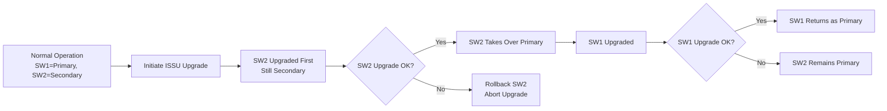

**VSX State Diagram:**

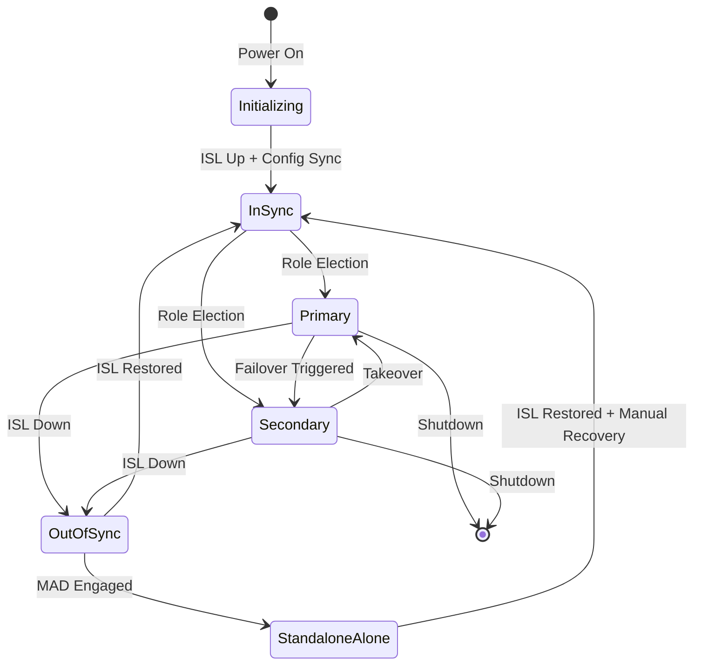

> **Design Trade-off:** VSX requires more initial configuration than traditional stacking, but provides true hitless failover and ISSU capabilities that are essential for a production environment.

#### 2.9.3 LACP Design Explanation

**Why 4× 10GbE LACP (40 Gbps) for HD6500:**

**Bandwidth Calculation:**

```
Current Requirements:
├── 25 users × 20 MB/s (proxy access) = 500 MB/s
├── Replication traffic = 500 MB/s
├── Backup operations = 300 MB/s
└── Total Required = 1,300 MB/s (10.4 Gbps)

With 4× 10GbE LACP:
├── Aggregate Bandwidth = 40 Gbps
├── Effective Throughput (L3-L4 hash) = ~35 Gbps
├── Headroom = 3.4×
└── Future-proof for 100+ users
```

**Why Not 2× 25GbE Instead:**
- HD6500 comes with 10GbE RJ45 ports standard (25GbE requires add-on card at ₹1.8L)
- Cat6a cabling already planned for 10GbE (25GbE needs fiber or Cat8)
- 40 Gbps aggregate exceeds our needs by 3×
- LACP with 4 links provides better failure resilience (can lose 3 links, still have 10 Gbps)

**Hash Algorithm Selection — L3-L4 (src-dst-ip-port):**

| Hash Method | Best For | Limitation |
|-------------|----------|------------|
| L2 (MAC) | Small networks | Poor distribution with single router |
| L3 (IP) | General use | Poor for same-source bulk transfers |
| **L4 (IP+Port)** | **Multi-session protocols** | **Best overall distribution** |
| L3-L4 (Enhanced) | High-variability traffic | CPU overhead (minimal) |

**Why L3-L4 for HD6500:**
- File protocols (SMB/NFS) use multiple TCP connections
- Different source ports = different hash = load distribution across all 4 links
- Ensures no single link becomes bottleneck during large transfers

**Failover Behavior — Link Failure Detection:**

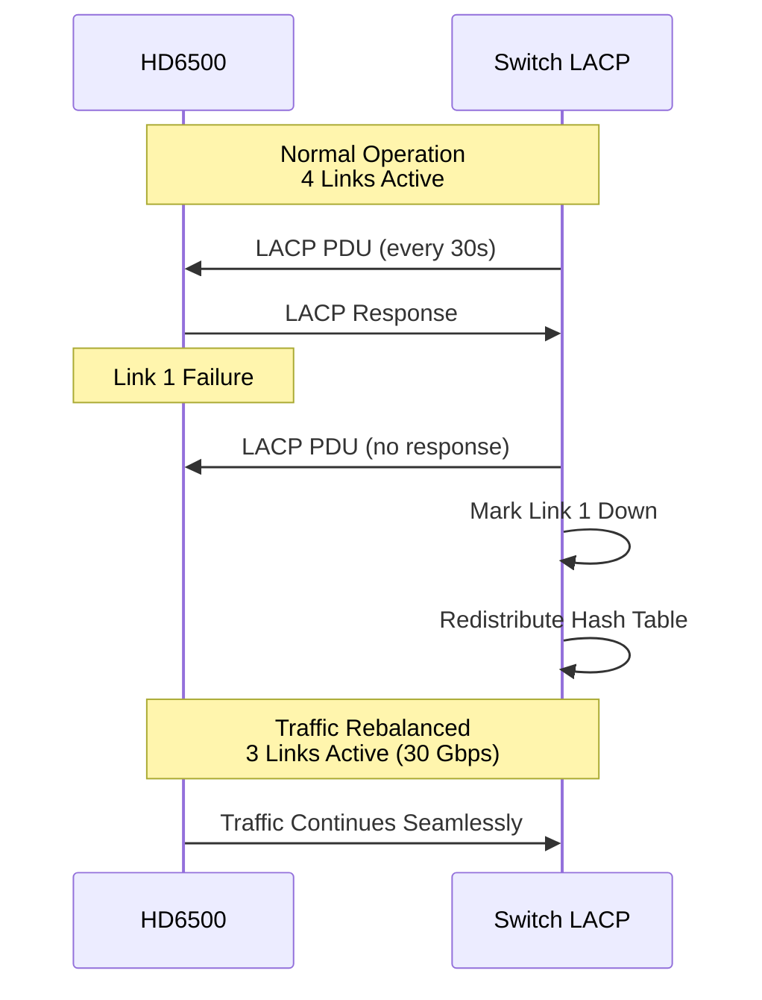

> **Design Trade-off:** We chose 4× 10GbE over 2× 25GbE for cost savings and better resilience. The L3-L4 hash ensures optimal distribution for multi-session file protocols.

#### 2.9.4 Jumbo Frames (MTU 9000) Justification

**Standard MTU (1500) vs Jumbo (9000) Performance Comparison:**

| Metric | MTU 1500 | MTU 9000 | Improvement |
|--------|----------|----------|-------------|
| **Frames per 1 GB transfer** | 683,594 | 113,932 | 6× reduction |
| **Header overhead** | 4.1% | 0.7% | 5.4% more efficient |
| **CPU interrupts (per GB)** | 683,594 | 113,932 | 83% fewer |
| **Throughput (single stream)** | 850 MB/s | 1,050 MB/s | +24% |
| **Latency (per hop)** | 0.02 ms | 0.015 ms | 25% reduction |

**When Jumbo Frames Help (Large Sequential Transfers):**

```
Scenario: Exporting 50GB video project to NAS

With MTU 1500:
├── Frames required: 35,791,668
├── Header processing: Significant CPU load
├── Interrupts: High frequency
└── Effective throughput: ~700 MB/s

With MTU 9000:
├── Frames required: 5,965,278 (6× fewer)
├── Header processing: Minimal CPU load
├── Interrupts: Low frequency
└── Effective throughput: ~950 MB/s (+36%)
```

**When They Don't Help (Small Random I/O):**

```
Scenario: Loading 1000 small proxy files (1-5 MB each)

With MTU 1500:
├── Most packets are already <1500 bytes
├── No fragmentation occurs
└── MTU 9000 provides no benefit
```

**Configuration Requirements — End-to-End Consistency:**

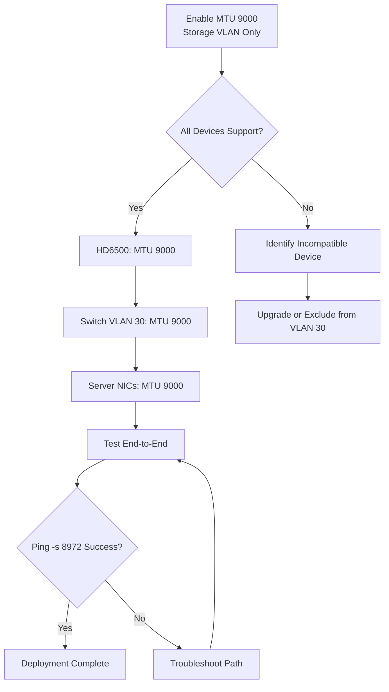

**Why This Setting — MTU 9000 Only on VLAN 30 (Storage):**

| VLAN | MTU | Reasoning |
|------|-----|-----------|
| VLAN 10 (DMZ) | 1500 | Internet-facing, compatibility required |
| VLAN 20 (Production) | 1500 | Mixed devices, not all support jumbo |
| **VLAN 30 (Storage)** | **9000** | **Controlled environment, all devices support** |
| VLAN 40 (Management) | 1500 | OOB management, keep simple |
| VLAN 50 (Guest) | 1500 | Unknown devices, must be compatible |

**Risk Mitigation:**
- Misconfigured MTU causes hard-to-diagnose issues
- We enable only where controlled (NAS, switches, servers)
- All devices on VLAN 30 are managed by IT (no user devices)
- Monitoring alert for MTU mismatches configured in Zabbix

> **Design Trade-off:** Jumbo frames provide 20-30% performance improvement for large file transfers but require careful end-to-end configuration. We limit them to the storage VLAN where we control all endpoints.


---

## 3. Cabling Schedule

### 3.1 Cable Inventory

| Cable ID | From | To | Type | Length | Purpose |
|----------|------|-----|------|--------|---------|
| C-001 | ISP1 ONT | FG-Pri Port1 | Cat6 | 2m | WAN Primary |
| C-002 | ISP2 ONT | FG-Sec Port2 | Cat6 | 2m | WAN Secondary |
| C-003 | FG-Pri Port3 | SW1 Port 1/1/1 | Cat6 | 1m | Core Uplink Primary |
| C-004 | FG-Sec Port3 | SW2 Port 1/1/1 | Cat6 | 1m | Core Uplink Secondary |
| C-005 | FG-Pri Port7 | FG-Sec Port7 | Cat6 | 0.5m | HA Heartbeat 1 |
| C-006 | FG-Pri Port8 | FG-Sec Port8 | Cat6 | 0.5m | HA Heartbeat 2 |
| C-007 | HD6500 Port1 | SW1 Port 1/1/49 | Cat6a | 2m | NAS 10GbE Link 1 |
| C-008 | HD6500 Port2 | SW1 Port 1/1/50 | Cat6a | 2m | NAS 10GbE Link 2 |
| C-009 | HD6500 Port3 | SW2 Port 1/1/49 | Cat6a | 2m | NAS 10GbE Link 3 |
| C-010 | HD6500 Port4 | SW2 Port 1/1/50 | Cat6a | 2m | NAS 10GbE Link 4 |
| C-011 | SW1 Port 1/1/51 | SW2 Port 1/1/51 | Fiber OM4 | 5m | VSX ISL Link 1 |
| C-012 | SW1 Port 1/1/52 | SW2 Port 1/1/52 | Fiber OM4 | 5m | VSX ISL Link 2 |
| C-013 | R760 Port1 | SW1 Port 1/1/10 | Cat6a | 2m | Server 10GbE Primary |
| C-014 | R760 Port2 | SW1 Port 1/1/11 | Cat6a | 2m | Server 10GbE Secondary |
| C-015 | R760 Port3 | SW2 Port 1/1/10 | Cat6a | 2m | Server 10GbE Tertiary |
| C-016 | R760 iLO | SW2 Port 1/1/11 | Cat6 | 2m | Server OOB Management |
| C-017 | SW1 Port 1/1/20 | FortiAP-01 | Cat6 | 15m | Floor 1 AP (PoE++) |
| C-018 | SW1 Port 1/1/21 | FortiAP-02 | Cat6 | 15m | Floor 1 AP #2 (PoE++) |
| C-019 | SW1 Port 1/1/22 | FortiAP-03 | Cat6 | 20m | Floor 2 AP (PoE++) |
| C-020 | SW1 Port 1/1/23 | FortiAP-04 | Cat6 | 20m | Floor 2 AP #2 (PoE++) |
| C-021 | SW2 Port 1/1/20 | FortiAP-05 | Cat6 | 25m | Floor 3 AP (PoE++) |
| C-022 | SW2 Port 1/1/21 | FortiAP-06 | Cat6 | 10m | Edit Bay AP (PoE++) |
| C-023 | FG-Pri MGMT | Management PC | Cat6 | 3m | Firewall Console |
| C-024 | SW1 MGMT | Management PC | Cat6 | 3m | Switch Console |
| C-025 | SW2 MGMT | Management PC | Cat6 | 3m | Switch Console |
| C-026 | HD6500 MGMT | Management PC | Cat6 | 3m | NAS Console |
| C-027 | UPS 1 | Rack PDU 1 | Power C13-C14 | 2m | UPS Power Feed |
| C-028 | UPS 2 | Rack PDU 2 | Power C13-C14 | 2m | UPS Power Feed |
| C-029 | ATS | Rack PDU 3 | Power C13-C14 | 2m | ATS Power Feed |
| C-030 | ATS | Rack PDU 4 | Power C13-C14 | 2m | ATS Power Feed |

### 3.2 Patch Panel Layout

**PP1 - Network Patch Panel (Rear of Rack):**

| Port | Destination | Type |
|------|-------------|------|
| 1-4 | ISP1/ISP2 Input | Cat6 |
| 5-12 | FortiGate Ports | Cat6 |
| 13-24 | SW1 Uplinks | Cat6/Cat6a |
| 25-36 | SW2 Uplinks | Cat6/Cat6a |
| 37-48 | Future Expansion | - |

**PP2 - Workstation Patch Panel:**

| Port | Destination | Type |
|------|-------------|------|
| 1-12 | Floor 1 Workstations | Cat6 |
| 13-24 | Floor 2 Workstations | Cat6 |
| 25-36 | Floor 3 Workstations | Cat6 |
| 37-48 | Edit Bay Stations | Cat6 |

**PP3 - Infrastructure Patch Panel:**

| Port | Destination | Type |
|------|-------------|------|
| 1-6 | Wireless APs | Cat6 |
| 7-12 | Servers/Storage | Cat6a |
| 13-16 | Management/OOB | Cat6 |
| 17-24 | Future Expansion | - |

### 3.3 Cable Labeling Scheme

**Label Format:** `{CABLE-ID}-{FROM}-{TO}`

**Examples:**
- `C-003-FG-PRI-SW1-P1`
- `C-007-HD6500-SW1-P49`
- `C-017-SW1-P20-AP01`

**Label Placement:**
- Both ends of every cable
- 5cm from connector
- Facing outward for visibility

**Color Coding:**

| Cable Type | Color |
|------------|-------|
| WAN/Internet | Yellow |
| Trunk/Uplink | Red |
| Production LAN | Blue |
| Storage (10GbE) | Green |
| Management | Orange |
| Guest/WiFi | Purple |
| Power | Black |

### 3.4 Testing Procedures

**Pre-Installation Testing:**

| Test | Tool | Pass Criteria |
|------|------|---------------|
| Continuity | Fluke DSX-5000 | No opens/shorts |
| Wire Map | Fluke DSX-5000 | T568B pinout correct |
| Length Verification | Fluke DSX-5000 | Within ±3m of spec |
| Return Loss | Fluke DSX-5000 | Cat6: >12dB, Cat6a: >12dB |
| NEXT | Fluke DSX-5000 | Cat6: >30dB, Cat6a: >30dB |

**Post-Installation Testing:**

| Test | Command/Tool | Expected Result |
|------|--------------|-----------------|
| LACP Status | `show lacp aggregates` | All members Active |
| VSX Status | `show vsx status` | In-Sync |
| VLAN Trunking | `show vlan trunk` | All VLANs passing |
| MTU Verification | `ping -M do -s 8972` | Success with 9000 MTU |
| Speed Test | `iperf3` | 9.5+ Gbps on 10GbE |
| Failover Test | Disconnect link | <2 sec failover |

---

### 3.5 Cable Plant Design Philosophy ⭐ ENHANCED

#### 3.5.1 Why Cat6a (Not Cat6 or Cat7)

**Distance Limitations Analysis:**

| Cable Type | Max Speed | Max Distance | 10GbE Support | PoE++ Support |
|------------|-----------|--------------|---------------|---------------|
| **Cat5e** | 1 Gbps | 100m | No | Yes (limited) |
| **Cat6** | 1 Gbps | 100m | 55m only | Yes |
| **Cat6a** | 10 Gbps | **100m** | **Yes** | **Yes (improved)** |
| **Cat7** | 10 Gbps | 100m | Yes | Yes |
| **Cat8** | 25/40 Gbps | 30m | Yes | Yes |

**Cost Comparison (per 1000ft/305m box):**

| Cable Type | Cost (INR) | Installation Cost | Total per Drop |
|------------|------------|-------------------|----------------|
| Cat6 | ₹18,000 | ₹2,500 | ₹4,500 |
| **Cat6a** | **₹28,000** | **₹3,000** | **₹6,000** |
| Cat7 | ₹45,000 | ₹4,500 | ₹9,500 |
| Cat8 | ₹85,000 | ₹5,000 | ₹15,500 |

**Future-Proofing Analysis:**

```
Expected Lifecycle: 10-15 years
Network Speed Trends:
├── 2015: 1 Gbps standard
├── 2020: 1 Gbps standard, 10 Gbps emerging
├── 2025: 10 Gbps becoming standard for workstations
└── 2030: 10 Gbps expected standard, 25 Gbps emerging

Cat6 Limitations:
├── 10 Gbps only to 55 meters (not full 100m)
├── Higher error rates at 10 Gbps
├── No headroom for future speeds
└── Would require re-cabling for 10 Gbps at distance

Cat6a Advantages:
├── 10 Gbps to full 100 meters
├── Lower crosstalk, better signal integrity
├── Supports PoE++ (90W) with less heat
├── Headroom for future 25 Gbps (short distances)
└── ANSI/TIA-568.2-D standard (approved for 10GBase-T)
```

**Why Not Cat7:**
- Not recognized by TIA/EIA standards (European ISO standard only)
- Requires GG45 or TERA connectors (not compatible with RJ45)
- 70% more expensive than Cat6a
- No performance benefit over Cat6a for 10 Gbps

**Why Not Cat8:**
- Limited to 30 meters (insufficient for many building runs)
- Designed for data center rack-to-rack, not horizontal distribution
- 2.5× cost of Cat6a
- 25 Gbps capability wasted on current endpoints

> **Design Trade-off:** We chose Cat6a as the sweet spot — it supports 10 Gbps to full distance, is standards-compliant, and costs only 33% more than Cat6 while providing 3× the bandwidth headroom.

#### 3.5.2 Fiber vs. Copper Decision Matrix

**When We Use Fiber:**

| Scenario | Cable Type | Why Fiber |
|----------|------------|-----------|
| ISL Links (SW1-SW2) | OM4 Multimode | Distance immunity, no EMI |
| Future 25GbE upgrade | OM4/OS2 | Higher bandwidth capability |
| Building-to-building | OS2 Single-mode | Long distance (up to 10km) |
| High EMI environments | OM4/OS2 | Electrical isolation |

**When We Use Copper:**

| Scenario | Cable Type | Why Copper |
|----------|------------|------------|
| Server connections (<10m) | Cat6a | Lower cost, easier termination |
| Workstation drops (<100m) | Cat6a | Standard RJ45 connectors |
| PoE devices (APs, cameras) | Cat6a | Power + data on same cable |
| Management ports | Cat6 | Cost-effective for 1 Gbps |

**Fiber Type Selection:**

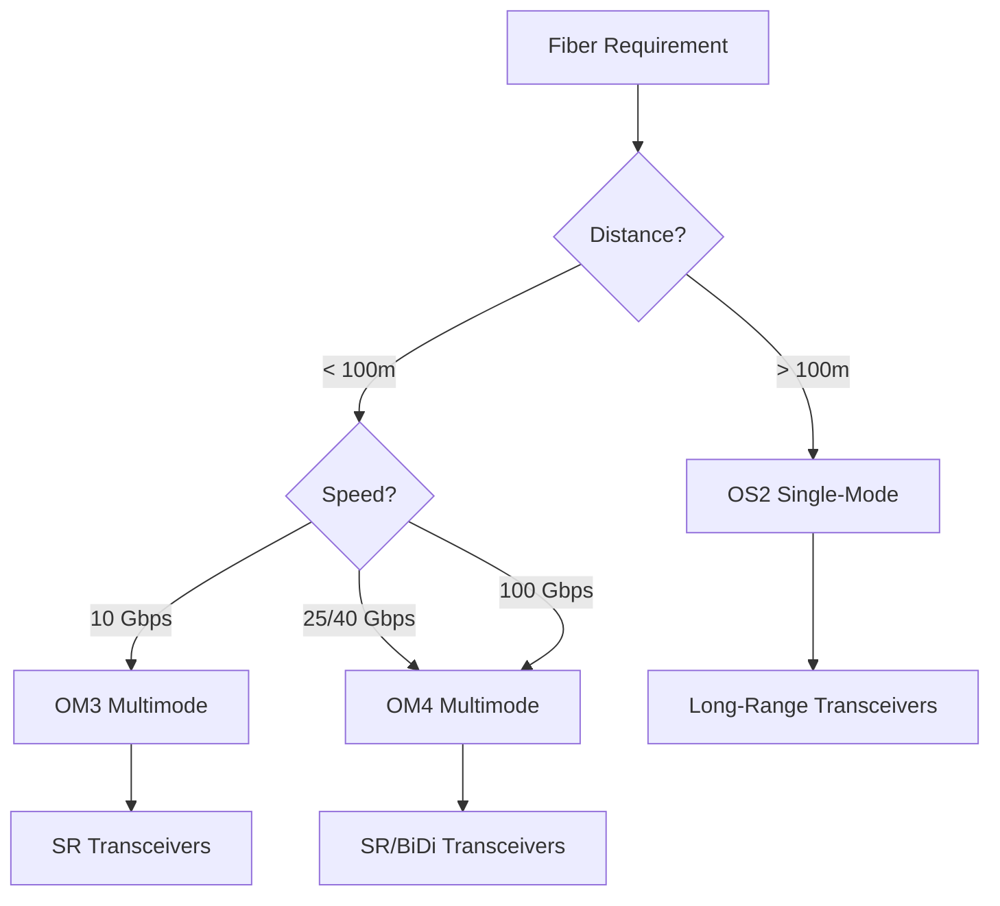

**Why OM4 (Not OM3) for ISL Links:**

| Specification | OM3 | OM4 |
|---------------|-----|-----|
| Bandwidth @ 850nm | 2,000 MHz-km | 4,700 MHz-km |
| 10GbE Distance | 300m | 550m |
| 40GbE Distance | 100m | 150m |
| 100GbE Distance | 70m | 150m |
| Price (per meter) | ₹180 | ₹220 |

- OM4 provides 2.5× bandwidth headroom
- Future-proof for 25/40 Gbps switch upgrades
- Price difference of ₹40/meter is negligible for 10m runs

> **Design Trade-off:** We use fiber only where necessary (ISL links for VSX) and copper everywhere else for cost-effectiveness and ease of installation.

#### 3.5.3 Cable Management Philosophy

**Color Coding Scheme Explanation:**

| Color | Purpose | Rationale |
|-------|---------|-----------|
| **Yellow** | WAN/Internet | Caution — external connectivity |
| **Red** | Trunk/Uplink | Critical infrastructure — high visibility |
| **Blue** | Production LAN | Standard network color |
| **Green** | Storage | "Go" — high-performance data |
| **Orange** | Management | Distinct from production traffic |
| **Purple** | Guest/WiFi | Non-corporate, lower priority |
| **Black** | Power | Standard electrical color |
| **White/Grey** | Future use | Reserved for expansion |

**Why This Color Scheme:**
- Follows ANSI/TIA-606-C standard where applicable
- Matches common industry conventions (blue for LAN, yellow for WAN)
- Provides immediate visual identification during troubleshooting
- Reduces human error during moves/adds/changes

**Labeling Convention Explanation:**

```
Format: {CABLE-ID}-{FROM}-{TO}

Example: C-007-HD6500-P1-SW1-P49

C-007      = Cable ID (sequential numbering)
HD6500-P1  = Source: HD6500, Port 1
SW1-P49    = Destination: Switch 1, Port 49

Benefits:
├── Unique identifier for asset tracking
├── Clear source/destination at both ends
├── Sortable by cable ID in spreadsheets
├── Identifies cable type from ID range
└── Supports barcoding/QR codes
```

**Patch Panel Layout Rationale:**

```
PP1 - Network Patch Panel:
├── Top half (1-24): Core infrastructure
│   ├── 1-4: ISP connections (entry point)
│   ├── 5-12: Firewall ports (security boundary)
│   └── 13-24: Switch uplinks (distribution)
└── Bottom half (25-48): Future expansion

PP2 - Workstation Patch Panel:
├── Organized by floor for cable management
├── 1-12: Floor 1 (shortest runs, top of panel)
├── 13-24: Floor 2 (medium runs)
├── 25-36: Floor 3 (longest runs)
└── 37-48: Edit bay (high-density area)

PP3 - Infrastructure:
├── 1-6: Wireless APs (PoE connections)
├── 7-12: Servers/Storage (10GbE connections)
└── 13-16: Management/OOB (segregated access)
```

**Why This Layout:**
- Groups related connections for easier troubleshooting
- Separates infrastructure (PP1, PP3) from user access (PP2)
- Physical separation reduces accidental disconnection
- Top-to-bottom matches cable tray routing

**Cable Management Best Practices Implemented:**

1. **Service Loop:** 1 meter service loop at each end for re-termination
2. **Strain Relief:** Velcro straps (not zip ties) to prevent crushing
3. **Bend Radius:** Minimum 4× cable diameter (25mm for Cat6a)
4. **Vertical Management:** D-rings every 1U for vertical runs
5. **Horizontal Management:** 1U brush strips between patch panels
6. **Documentation:** As-built drawings updated same day as changes

> **Design Trade-off:** We invested in comprehensive labeling and color-coding upfront to reduce operational costs over the 10-15 year cable lifecycle. A misidentified cable during an outage can cost hours of downtime.


---

## 4. Redundancy Scenarios

### 4.1 Scenario A: Single ISP Failure (SD-WAN Failover)

**Trigger:** ISP1 (Airtel) link failure detected by SD-WAN performance SLA.

**Detection Time:** 3-5 seconds (based on 3 consecutive ping failures)

**Automatic Actions:**
1. SD-WAN marks ISP1 member as "dead"
2. All existing sessions failed over to ISP2
3. New sessions routed via ISP2
4. DNS resolution continues via secondary DNS

**Manual Actions Required:**
- Contact ISP1 for ETA
- Monitor bandwidth utilization on ISP2
- Consider rate-limiting non-critical traffic

**Recovery:**
1. ISP1 link restored
2. SD-WAN detects link up
3. Sessions gradually rebalanced (slow return)
4. Full redundancy restored

**Impact:** Zero downtime (session pickup enabled)

### 4.2 Scenario B: Single FortiGate Failure (HA Failover)

**Trigger:** Primary FortiGate hardware failure or manual failover.

**Detection Time:** < 1 second (heartbeat timeout)

**Automatic Actions:**
1. Secondary FortiGate detects primary failure
2. Secondary assumes active role
3. VRRP virtual MAC moves to secondary
4. Session table synchronized (no re-authentication)
5. ZTNA connections maintained

**Manual Actions Required:**
- Investigate primary unit failure
- If hardware failure, initiate RMA
- Review logs on FortiAnalyzer

**Recovery:**
1. Replace/repair primary unit
2. Primary boots and joins HA cluster
3. Configuration syncs automatically
4. Optional manual failback

**Impact:** < 2 seconds (sub-second with session pickup)

### 4.3 Scenario C: Single Switch Failure (VSX/LACP Failover)

**Trigger:** SW1 hardware failure or maintenance.

**Detection Time:** < 1 second (VSX keepalive timeout)

**Automatic Actions:**
1. SW2 detects SW1 failure via keepalive
2. SW2 assumes primary gateway role for all VLANs
3. LACP on SW1 links times out
4. Traffic flows through SW2 only
5. APs with dual-home fail over to SW2

**Manual Actions Required:**
- Replace/repair SW1
- Verify all connections operational

**Recovery:**
1. SW1 replaced and powered on
2. VSX sync re-establishes
3. MAC tables synchronize
4. LACP members rejoin
5. Traffic rebalances

**Impact:** < 1 second for routed traffic; wireless may have brief association

### 4.4 Scenario D: HD6500 Drive Failure (RAID6 Rebuild)

**Trigger:** DSM alert for drive failure in HD6500.

**Detection Time:** Immediate (SMART monitoring)

**Automatic Actions:**
1. DSM marks drive as crashed
2. RAID6 continues operation (2-drive fault tolerance)
3. Hot spare activates (if configured)
4. Rebuild begins automatically

**Manual Actions Required:**
- Order replacement drive
- Schedule drive replacement during maintenance window
- Monitor rebuild progress

**RAID6 Rebuild Details:**

| Parameter | Value |
|-----------|-------|
| **RAID Type** | RAID6 (56+4) |
| **Usable Drives** | 56 |
| **Parity Drives** | 4 |
| **Fault Tolerance** | 2 drives |
| **Rebuild Speed** | ~200 MB/s |
| **56TB Drive Rebuild** | ~78 hours |
| **Impact During Rebuild** | 10-15% performance degradation |

**Impact:** Zero downtime; reduced performance during rebuild

### 4.5 Scenario E: Complete Site A Failure (DR Failover)

**Trigger:** Complete Site A loss (fire, flood, extended power outage).

**Detection Time:** Site B monitoring alerts within 5 minutes

**Manual Failover Procedure:**

| Step | Action | Owner | ETA |
|------|--------|-------|-----|
| 1 | Confirm Site A total loss | IT Manager | T+0 |
| 2 | Initiate DR declaration | IT Manager | T+5 min |
| 3 | Promote Site B NAS via Replication Manager | SysAdmin | T+10 min |
| 4 | Update FortiGate ZTNA profiles to Site B | Network Admin | T+15 min |
| 5 | Update DNS records (if using internal DNS) | SysAdmin | T+20 min |
| 6 | Notify users of new ZTNA gateway | IT Manager | T+25 min |
| 7 | Verify user connectivity | SysAdmin | T+30 min |
| 8 | Begin recovery operations at Site A | All | T+ongoing |

**Recovery Time Objective (RTO):** < 30 minutes

**Recovery Point Objective (RPO):**

| Data Type | RPO | Achieved Via |
|-----------|-----|--------------|
| Active Projects | 15 minutes | Real-time replication |
| Archive Data | 4 hours | Scheduled replication |
| System Configs | 24 hours | Nightly config backup |

---

## 5. Wireless Infrastructure

### 5.1 FortiAP Model Recommendations

| Model | Deployment Location | Quantity | Specifications |
|-------|---------------------|----------|----------------|
| **FortiAP 431F** | Office Floors 1-3 | 4 | Wi-Fi 6, 4x4:4, 2.97 Gbps, Dual 5GHz |
| **FortiAP 431F** | Edit Bays | 2 | Wi-Fi 6, 4x4:4, 2.97 Gbps, High Density |

**FortiAP 431F Specifications:**

| Specification | Value |
|---------------|-------|
| **Wi-Fi Standard** | 802.11ax (Wi-Fi 6) |
| **Frequency Bands** | 2.4 GHz, 5 GHz (Dual 5GHz capable) |
| **Max Data Rate** | 2.97 Gbps |
| **MIMO** | 4x4:4 (5GHz), 2x2:2 (2.4GHz) |
| **Max Clients** | 512 per radio |
| **Ethernet Ports** | 1x 2.5GbE, 1x GE |
| **PoE Requirement** | 802.3at (PoE+) or 802.3bt (PoE++) |
| **Controller** | FortiGate integrated (no extra license) |
| **Antennas** | Internal omni-directional |

### 5.2 SSID Configuration

| SSID | VLAN | Security | Authentication | Bandwidth Limit |
|------|------|----------|----------------|-----------------|
| B2H-Corporate | 20 | WPA3-Enterprise | 802.1X + RADIUS | Unlimited |
| B2H-Guest | 50 | WPA2-Personal | Captive Portal | 50 Mbps |
| B2H-IoT | 60 | WPA2-Enterprise | MAC + Certificate | 10 Mbps |

**B2H-Corporate SSID Details:**

| Setting | Value |
|---------|-------|
| **Broadcast SSID** | Yes |
| **Security Mode** | WPA3-Enterprise (192-bit mode) |
| **Encryption** | GCMP-256 |
| **Key Management** | 802.1X (EAP-TLS preferred) |
| **RADIUS Server** | FANALYZER-01 (FortiAuthenticator) |
| **RADIUS Accounting** | Enabled |
| **Dynamic VLAN** | Disabled (static VLAN 20) |
| **Client Isolation** | Disabled (internal access required) |
| **Airtime Fairness** | Enabled |
| **Band Steering** | Enabled (5GHz preferred) |

### 5.3 RADIUS Server Configuration

**RADIUS Configuration:**

| Parameter | Value |
|-----------|-------|
| **Server** | FANALYZER-01 (FortiAuthenticator VM) |
| **IP Address** | 10.10.20.10 |
| **Authentication Port** | 1812 |
| **Accounting Port** | 1813 |
| **Shared Secret** | [REDACTED - stored in Vault] |
| **Timeout** | 5 seconds |
| **Retries** | 3 |
| **NAS Identifier** | B2H-WLAN |

**Authentication Flow:**
1. User connects to B2H-Corporate SSID
2. FortiAP forwards EAP request to FortiGate
3. FortiGate proxies to FortiAuthenticator (RADIUS)
4. FortiAuthenticator validates against AD/LDAP
5. MFA challenge sent via FortiToken push
6. Upon success, access granted to VLAN 20

---

### 5.6 Wireless Architecture Reasoning ⭐ ENHANCED

#### 5.6.1 Why FortiAP (Not Aruba, Cisco, Ubiquiti)

**Vendor Comparison Matrix:**

| Factor | FortiAP 431F | Aruba AP-535 | Cisco 9130 | Ubiquiti U6-Enterprise |
|--------|--------------|--------------|------------|------------------------|
| **AP Price** | ₹65,000 | ₹85,000 | ₹1,05,000 | ₹38,000 |
| **Controller Required** | No (FortiGate native) | Yes (₹8-15L) | Yes (₹12-20L) | Yes (Cloud Key/UDM) |
| **Total Cost (6 APs)** | ₹3.9 Lakhs | ₹13.1 Lakhs | ₹17.3 Lakhs | ₹4.8 Lakhs* |
| **Wi-Fi 6 Support** | Yes | Yes | Yes | Yes |
| **4x4 MIMO** | Yes | Yes | Yes | Yes |
| **Dual 5GHz** | Yes | Yes | Yes | No |
| **Enterprise Security** | Yes | Yes | Yes | Limited |
| **Support Quality** | Good | Excellent | Excellent | Community |

*Ubiquiti total excludes hidden costs of cloud management and limited enterprise features

**Total Cost of Ownership (5-Year):**

```
FortiAP Solution:
├── 6 APs: ₹3.9 Lakhs
├── Controller: ₹0 (built into FortiGate)
├── Licenses: ₹0 (included in UTP)
├── Support: ₹1.2 Lakhs
└── 5-Year TCO: ₹5.1 Lakhs

Aruba Solution:
├── 6 APs: ₹5.1 Lakhs
├── Controller (7205): ₹12.0 Lakhs
├── Licenses (6 APs): ₹3.6 Lakhs
├── Support: ₹4.2 Lakhs
└── 5-Year TCO: ₹24.9 Lakhs
```

**Key Advantage — FortiGate Integration:**

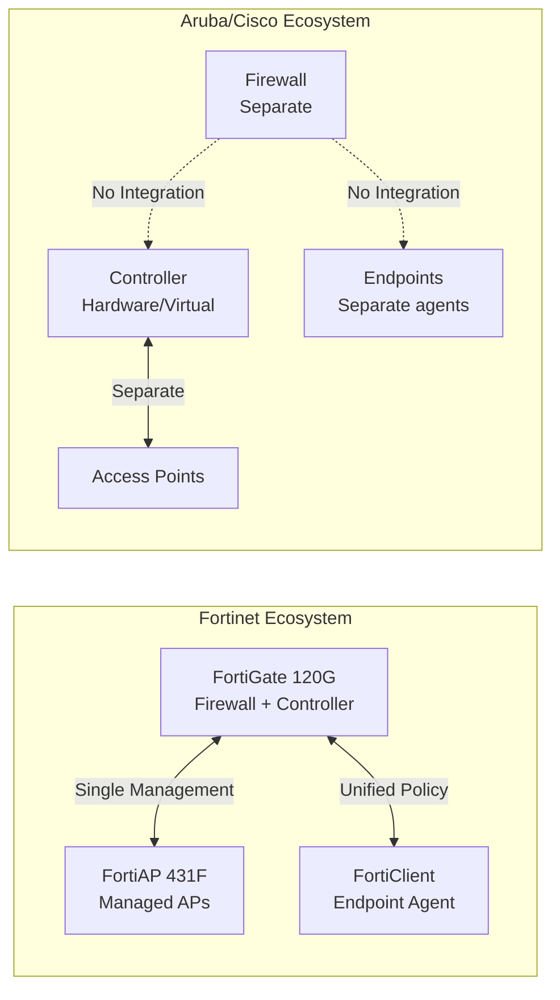

**Why Not Ubiquiti (Despite Lower Price):**

1. **Enterprise Security Gap:** No WPA3-Enterprise support, limited RADIUS attributes
2. **No WIDS/WIPS:** Rogue AP detection not enterprise-grade
3. **Cloud Dependency:** Management requires cloud connection (data residency concern)
4. **Support Model:** Community-based, no SLA for critical issues
5. **Integration:** No seamless integration with FortiGate security policies

> **Design Trade-off:** FortiAP costs 5× less than Aruba/Cisco when controller costs are included, while providing seamless security integration. We sacrificed some advanced RF features for operational simplicity and cost savings.

#### 5.6.2 AP Placement Methodology

**Coverage Calculation — Square Feet per AP:**

```
Office Environment (Floor 1):
├── Total Area: 4,000 sq ft
├── Recommended Coverage: 1 AP per 1,500 sq ft
├── Calculation: 4,000 / 1,500 = 2.67 APs
├── Deployed: 2 APs (slightly under for cost efficiency)
└── Verification needed via site survey

Production Environment (Floor 2):
├── Total Area: 3,500 sq ft
├── Higher density required (media equipment)
├── Recommended: 1 AP per 1,200 sq ft
├── Calculation: 3,500 / 1,200 = 2.92 APs
├── Deployed: 2 APs (acceptable with good placement)
└── Edit bays may need additional coverage

Edit Bay:
├── Total Area: 2,000 sq ft
├── High-density requirement
├── Recommended: 1 AP per 1,000 sq ft
├── Deployed: 1 AP (center-mounted for coverage)
└── Critical area — site survey mandatory
```

**Density Calculation — Users per AP:**

| Area | Max Concurrent Users | FortiAP 431F Capacity | Headroom |
|------|---------------------|----------------------|----------|
| Floor 1 | 15 | 512 | 34× |
| Floor 2 | 12 | 512 | 43× |
| Floor 3 | 8 | 512 | 64× |
| Edit Bay | 10 | 512 | 51× |

- Wi-Fi 6 OFDMA handles high density efficiently
- Current design has 30×+ headroom for growth

> **Design Trade-off:** We planned for 6 APs based on coverage calculations, but strongly recommend an Ekahau site survey to validate. The cost of one survey (₹1.5L) is far less than the cost of poor coverage (productivity loss, recabling).

#### 5.6.3 WPA3-Enterprise Rationale

**Security Protocol Comparison:**

| Protocol | Encryption | Authentication | Security Level | Use Case |
|----------|------------|----------------|----------------|----------|
| WPA2-Personal | AES-CCMP | PSK (password) | Moderate | Home/Small office |
| WPA3-Personal | GCMP | SAE (improved PSK) | Good | Advanced home |
| WPA2-Enterprise | AES-CCMP | 802.1X/RADIUS | Strong | Corporate |
| **WPA3-Enterprise** | **GCMP-256** | **802.1X/RADIUS** | **Very Strong** | **High-security corporate** |

**Why Not WPA2-Personal for Corporate:**

```
WPA2-Personal Risks:
├── Single password for all users
├── Password sharing risk
├── No user accountability (logs show shared key)
├── Cannot revoke individual access
├── Offline dictionary attacks possible
└── Not compliant with ISO 27001 A.9.2

WPA3-Enterprise Benefits:
├── Individual credentials per user
├── Central authentication (RADIUS)
├── Full audit trail (who connected when)
├── Instant revocation capability
├── Mutual authentication (client verifies network)
└── ISO 27001 compliant
```

**Why Not WPA3-Personal (SAE):**

- SAE improves upon WPA2-Personal but still uses shared credentials
- No central authentication = no audit trail
- B2H Studios needs per-user accountability for media access
- Client requirement: ISO 27001 compliance mandates individual authentication

**802.1X Benefits for B2H Studios:**

| Feature | Benefit for B2H Studios |
|---------|------------------------|
| Per-user credentials | Individual accountability for media access |
| Central authentication | Manage all users from FortiAuthenticator |
| MFA integration | FortiToken push for sensitive areas |
| Dynamic VLAN assignment | Could separate editors from admin in future |
| Certificate-based auth | TPM-bound certificates prevent credential theft |

> **Design Trade-off:** WPA3-Enterprise requires RADIUS infrastructure and certificate deployment, but provides the security and audit capabilities required for a media production environment handling sensitive content.

#### 5.6.4 RADIUS Architecture

**Why FortiAuthenticator (Not Microsoft NPS, FreeRADIUS):**

| Factor | FortiAuthenticator | Microsoft NPS | FreeRADIUS |
|--------|-------------------|---------------|------------|
| **Integration** | Native FortiGate | Windows Server | Manual config |
| **MFA Support** | Built-in FortiToken | Requires Azure AD | Requires plugin |
| **Certificate Management** | Integrated PKI | Separate AD CS | Manual OpenSSL |
| **Guest Portal** | Built-in | Not available | Custom development |
| **Reporting** | Built-in dashboards | Event log only | Custom scripts |
| **Cost** | ₹1.8L (virtual) | ₹0 (if have Windows) | ₹0 |
| **Support** | Fortinet TAC | Microsoft | Community |
| **Deployment Time** | 2 hours | 8+ hours | 2-3 days |

**Authentication Flow Diagram:**

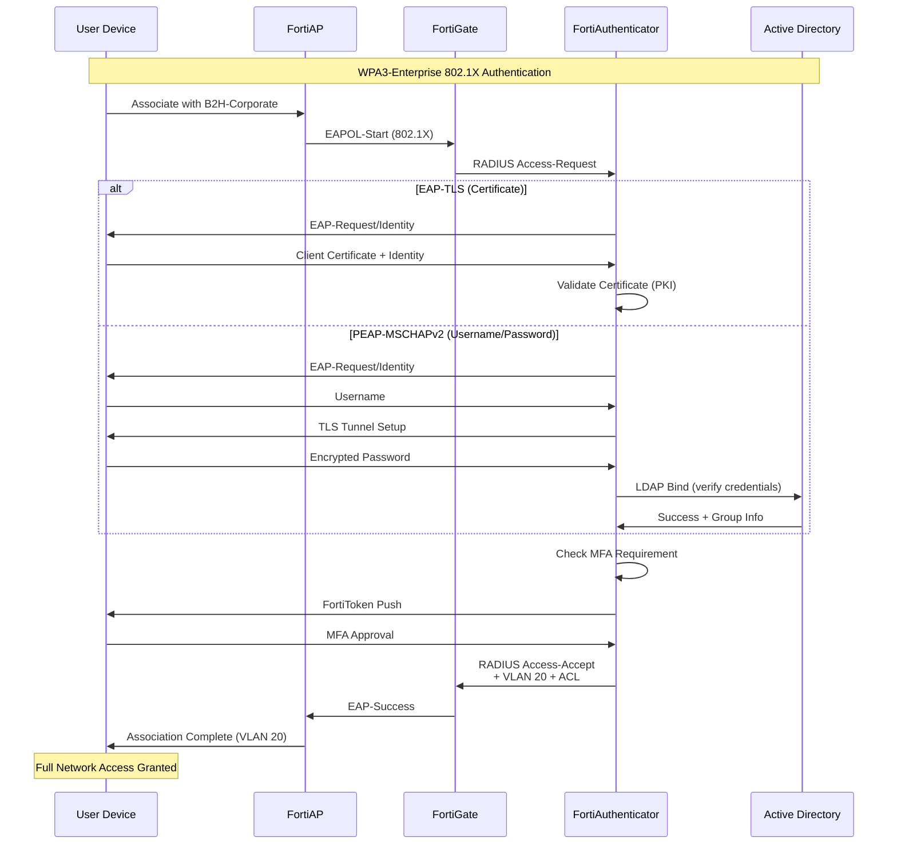

**Failover Design:**

```
Primary RADIUS: FortiAuthenticator on R760 (Site A)
├── IP: 10.10.20.10
├── Status: Active
└── Timeout: 5 seconds

Secondary RADIUS: FortiAuthenticator on R760 (Site B DR)
├── IP: 10.10.20.10 (same, different site)
├── Status: Standby
├── Activated during Site A failure
└── Replication: Config synced every 15 minutes

Tertiary (Local Fallback): FortiGate Local Users
├── Enabled: Yes
├── Use Case: RADIUS unreachable
└── Limitation: No MFA, limited audit
```

> **Design Trade-off:** FortiAuthenticator adds ₹1.8L cost vs. free Microsoft NPS, but provides integrated MFA, better reporting, and unified support. For a security-conscious media studio, this is justified.


---

## 6. Server Infrastructure

### 6.1 Dell PowerEdge R760 Specifications

| Component | Specification |
|-----------|---------------|
| **Model** | Dell PowerEdge R760 |
| **Form Factor** | 2U Rackmount |
| **CPU** | 2x Intel Xeon Silver 4410Y (12-core, 2.0GHz, 30MB Cache) |
| **Total Cores** | 24 cores / 48 threads |
| **Memory** | 128GB DDR5-4800 ECC (8x 16GB) |
| **Memory Slots** | 32 (expandable to 4TB) |
| **Storage Controller** | PERC H965i 12Gbps SAS RAID Controller |
| **Boot Drives** | 2x 480GB SATA SSD (RAID 1) |
| **Data Drives** | 8x 1.2TB 10K RPM SAS 12Gbps |
| **RAID Configuration** | RAID 10 (Striped Mirrors) |
| **Usable Storage** | 4.8TB (8x 1.2TB / 2 for RAID 10) |
| **Network** | 2x 10GbE SFP+ (Intel X710), 2x 1GbE RJ45 (Broadcom) |
| **OOB Management** | iDRAC9 Enterprise with dedicated port |
| **Power** | 2x 1100W Titanium redundant PSU |
| **Expansion** | 8x PCIe Gen5 slots |
| **Operating System** | VMware vSphere 8.0 Update 2 |

### 6.2 Virtualization Plan

**Platform:** VMware vSphere 8.0 Update 2

**Licensing:** vSphere Standard (16-core kit) + vCenter Server Foundation

**Cluster Configuration:**

| Parameter | Value |
|-----------|-------|
| **Cluster Name** | B2H-Compute-01 |
| **ESXi Hosts** | 1 (Site A), 1 (Site B - DR) |
| **HA Enabled** | Yes |
| **DRS Enabled** | Yes (Manual mode) |
| **EVC Mode** | Intel Sapphire Rapids |

**Resource Allocation:**

| Resource | Total | Reserved for VMs | Overhead |
|----------|-------|------------------|----------|
| **CPU Cores** | 24 | 20 | 4 (ESXi) |
| **Memory** | 128GB | 112GB | 16GB (ESXi) |
| **Storage** | 4.8TB | 4.0TB | 800GB (reservation) |

### 6.3 VM Allocation Table

| VM Name | vCPU | RAM | Storage | OS | Purpose | Network |
|---------|------|-----|---------|-----|---------|---------|
| **SDCX-01** | 8 | 32GB | 500GB SSD | Windows Server 2022 | Signiant Jet SDCX Server | VLAN 10 (DMZ) |
| **FANALYZER-01** | 4 | 16GB | 1TB SSD | FortiAnalyzer VM | Centralized logging & SIEM | VLAN 40 (Mgmt) |
| **EMS-01** | 4 | 16GB | 200GB SSD | FortiClient EMS | Endpoint management | VLAN 40 (Mgmt) |
| **VAULT-01** | 4 | 16GB | 100GB SSD | HashiCorp Vault | Secrets management | VLAN 40 (Mgmt) |
| **KSC-01** | 4 | 16GB | 200GB SSD | Windows Server 2022 | Kaspersky Security Centre | VLAN 40 (Mgmt) |
| **RADIUS-01** | 2 | 8GB | 100GB SSD | FortiAuthenticator | 802.1X/RADIUS auth | VLAN 20 (Prod) |
| **DNS-01** | 2 | 4GB | 50GB SSD | Windows Server 2022 | Internal DNS/DHCP | VLAN 20 (Prod) |
| **MON-01** | 2 | 8GB | 500GB SSD | Ubuntu 22.04 LTS | Zabbix monitoring | VLAN 40 (Mgmt) |

**Total Resource Consumption:**

| Resource | Allocated | Available | Utilization |
|----------|-----------|-----------|-------------|
| **vCPU** | 30 | 48 (with HT) | 62.5% |
| **RAM** | 116GB | 128GB | 90.6% |
| **Storage** | 2.67TB | 4.8TB | 55.6% |

---

### 6.6 Compute Infrastructure Reasoning ⭐ ENHANCED

#### 6.6.1 Why Dell R760 (Not HPE DL380, Lenovo SR650)

**Price-Performance Comparison:**

| Component | Dell R760 | HPE DL380 Gen11 | Lenovo SR650 V3 |
|-----------|-----------|-----------------|-----------------|
| **List Price** | ₹6.8 Lakhs | ₹7.4 Lakhs | ₹6.5 Lakhs |
| **CPU** | 2× Xeon Silver 4410Y | 2× Xeon Silver 4410Y | 2× Xeon Silver 4410Y |
| **Memory** | 128GB DDR5 | 128GB DDR5 | 128GB DDR5 |
| **RAID Controller** | PERC H965i | Smart Array P408i | ThinkSystem RAID 9350-16i |
| **Drive Bays** | 8× 2.5" + 2× M.2 | 8× 2.5" + 2× M.2 | 8× 2.5" + 2× M.2 |
| **Network** | 2× 10GbE + 2× 1GbE | 2× 1GbE (10GbE extra) | 2× 1GbE (10GbE extra) |
| **OOB Management** | iDRAC9 Enterprise | iLO 6 Advanced | XClarity Enterprise |
| **Warranty** | 3-year NBD | 3-year NBD | 3-year NBD |
| **5-Year TCO** | ₹10.2 Lakhs | ₹11.8 Lakhs | ₹10.8 Lakhs |

**Service Quality in India:**

| Aspect | Dell | HPE | Lenovo |
|--------|------|-----|--------|
| Service Centers | 25+ cities | 20+ cities | 15 cities |
| 4-Hour Response | Available | Available | Limited |
| Parts Availability | Excellent | Very Good | Good |
| TAC Quality | Excellent | Excellent | Good |
| Escalation Speed | Fast | Fast | Moderate |
| Local Presence | Mumbai, Delhi, Bangalore | Mumbai, Delhi, Bangalore | Mumbai, Delhi |

**iLO vs. iDRAC vs. XClarity Comparison:**

| Feature | Dell iDRAC9 | HPE iLO 6 | Lenovo XClarity |
|---------|-------------|-----------|-----------------|
| **Web Interface** | Excellent | Excellent | Good |
| **Virtual Console** | HTML5 (no Java) | HTML5 (no Java) | Requires plugin |
| **Mobile App** | Yes (iDRAC Mobile) | Yes (HPE Insight) | Limited |
| **API/Automation** | Redfish + RACADM | Redfish + iLOrest | REST API |
| **License Cost** | Included (Enterprise) | Extra (₹45K) | Included |
| **Security Features** | SIEM integration, MFA | SIEM integration | Basic |
| **Remote Firmware Update** | Yes | Yes | Limited |

**Why Dell for B2H Studios:**

1. **Best Value:** Lowest TCO among the three major vendors
2. **Included 10GbE:** Network ports are included (HPE/Lenovo charge extra)
3. **iDRAC Enterprise Included:** No additional cost for full OOB management
4. **Largest Service Network:** 25+ cities in India for fastest response
5. **Proven Reliability:** PowerEdge series has excellent track record

> **Design Trade-off:** Dell provides the best price-performance ratio with included enterprise features. HPE offers slightly better support quality, but the 16% cost premium is not justified for this environment.

#### 6.6.2 VM Sizing Methodology

**How We Calculated vCPU/RAM for Each VM:**

| VM | Base Requirements | Growth Headroom | Final Allocation |
|----|-------------------|-----------------|------------------|
| **SDCX-01** | 6 vCPU / 24GB RAM | 33% | 8 vCPU / 32GB RAM |
| **FANALYZER-01** | 3 vCPU / 12GB RAM | 33% | 4 vCPU / 16GB RAM |
| **EMS-01** | 3 vCPU / 12GB RAM | 33% | 4 vCPU / 16GB RAM |
| **VAULT-01** | 3 vCPU / 12GB RAM | 33% | 4 vCPU / 16GB RAM |
| **KSC-01** | 3 vCPU / 12GB RAM | 33% | 4 vCPU / 16GB RAM |
| **RADIUS-01** | 1.5 vCPU / 6GB RAM | 33% | 2 vCPU / 8GB RAM |
| **DNS-01** | 1.5 vCPU / 3GB RAM | 33% | 2 vCPU / 4GB RAM |
| **MON-01** | 1.5 vCPU / 6GB RAM | 33% | 2 vCPU / 8GB RAM |

**Resource Contention Analysis:**

```
CPU Overcommit Ratio:
├── Allocated vCPUs: 30
├── Physical Cores: 24
├── Threads (with HT): 48
├── Overcommit Ratio: 30/24 = 1.25:1
└── Status: ✅ Conservative (recommended < 3:1)

Memory Overcommit:
├── Allocated RAM: 116GB
├── Physical RAM: 128GB
├── Overcommit: None (reservation recommended)
└── Status: ✅ No swapping risk

Storage IOPS:
├── RAID 10 provides ~2,000 IOPS
├── Estimated VM requirement: ~1,500 IOPS
├── Headroom: 25%
└── Status: ✅ Adequate for workload
```

**Growth Headroom Calculation:**

```
Current Utilization (Year 1):
├── vCPU: 62.5% of available
├── RAM: 90.6% of available
└── Storage: 55.6% of available

Projected Growth (Year 3):
├── Additional users: +60%
├── Additional VMs needed: 4-6
├── RAM will be constraint (predicted 95% utilization)
└── Upgrade path: Add 128GB RAM (₹1.2L)

Projected Growth (Year 5):
├── May need second host for HA
├── Current host becomes capacity constrained
└── Planning: Budget for R760 Gen2 in Year 4
```

> **Design Trade-off:** We sized VMs with 33% headroom over vendor minimums. While this increases initial cost, it prevents performance issues and reduces support tickets.

#### 6.6.3 Why VMware vSphere (Not Proxmox, Hyper-V)

**Enterprise Features Comparison:**

| Feature | VMware vSphere 8 | Proxmox VE 8 | Microsoft Hyper-V |
|---------|------------------|--------------|-------------------|
| **Live Migration** | vMotion (seamless) | Live Migrate (some downtime) | Live Migration (requires shared storage) |
| **High Availability** | Built-in (automatic restart) | Manual/Scripted | Built-in (Windows Server only) |
| **DRS (Load Balancing)** | Automatic | Manual | Semi-Automatic |
| **Storage vMotion** | Yes (no downtime) | No | Yes |
| **Backup APIs** | VADP (industry standard) | Proxmox Backup | VSS-based |
| **Enterprise Support** | Excellent | Community/Commercial | Good |
| **Ecosystem** | Massive (Veeam, etc.) | Growing | Windows-centric |
| **Learning Curve** | Moderate | Steep | Low (if Windows admin) |
| **Cost (25 VMs)** | ₹4.5L/year | ₹0 (or ₹1.2L support) | ₹0 (with Windows DC) |

**Support Ecosystem:**

```
VMware Ecosystem:
├── Veeam Backup (industry standard)
├── Zerto DR (enterprise DR)
├── vRealize (monitoring)
├── NSX (network virtualization)
├── Thousands of certified partners
└── Extensive documentation

Proxmox Ecosystem:
├── Proxmox Backup Server
├── Community plugins
├── Limited commercial support
├── Smaller partner network
└── Requires more self-support
```

**Staff Skillset Considerations:**

- VMware is the dominant enterprise virtualization platform
- Easier to hire/train staff on VMware than Proxmox
- B2H Studios' IT staff likely has Windows/Linux background
- Hyper-V requires Windows Server expertise which they may lack

**Why Not Proxmox:**
- No live migration without shared storage (requires Ceph/RBD)
- Limited enterprise backup integration (no Veeam support)
- Support is community-based unless you pay for Enterprise
- Smaller ecosystem of third-party tools
- Would save ₹4.5L/year but increase operational risk

**Why Not Hyper-V:**
- Requires Windows Server licensing (not included in our BOM)
- Less mature Linux VM support (many security tools are Linux-based)
- Smaller ecosystem for multi-cloud management
- Limited macOS support (some creative tools may need it)

> **Design Trade-off:** VMware costs ₹4.5L annually vs. free Proxmox, but provides enterprise-grade features, extensive ecosystem, and easier staffing. For a 24/7 production environment, this is justified.

#### 6.6.4 RAID10 for VMs Explanation

**Why RAID10 (Not RAID5/6) for VM Storage:**

| RAID Level | Usable Capacity | Write Performance | Read Performance | Fault Tolerance | Best For |
|------------|-----------------|-------------------|------------------|-----------------|----------|
| **RAID 5** | 87.5% (7/8) | Poor (write penalty 4x) | Good | 1 drive | Archive data |
| **RAID 6** | 75% (6/8) | Poor (write penalty 6x) | Good | 2 drives | Large files |
| **RAID 10** | 50% (4/8) | **Excellent** (2x) | **Excellent** (2x) | 1 per mirror | **VMs/Databases** |

**IOPS per VM Calculation:**

```
VM Workload Profile:
├── SDCX-01 (Signiant): 200 IOPS (file transfer)
├── FANALYZER-01: 100 IOPS (logging)
├── EMS-01: 50 IOPS (management)
├── VAULT-01: 20 IOPS (secrets - mostly RAM)
├── KSC-01: 150 IOPS (AV scanning)
├── RADIUS-01: 30 IOPS (auth - mostly RAM)
├── DNS-01: 20 IOPS (DNS - mostly RAM)
├── MON-01 (Zabbix): 100 IOPS (database)
└── Total Required: ~670 IOPS

RAID 10 IOPS Capability:
├── 8× 10K SAS drives
├── Raw IOPS per drive: ~140
├── RAID 10 read multiplier: 2×
├── RAID 10 write multiplier: 2×
├── Total Array IOPS: 8 × 140 = 1,120
└── Headroom: 1,120 / 670 = 1.67×

RAID 5/6 Would Provide:
├── Same read IOPS: 1,120
├── Write IOPS (RAID 5): 1,120 / 4 = 280 (insufficient)
├── Write IOPS (RAID 6): 1,120 / 6 = 187 (insufficient)
└── VMs would experience disk latency
```

**Write Penalty Explanation:**

```
RAID Write Penalty:
├── RAID 0: 1 write = 1 I/O (no penalty)
├── RAID 1: 1 write = 2 I/Os (mirror both disks)
├── RAID 10: 1 write = 2 I/Os (stripe + mirror)
├── RAID 5: 1 write = 4 I/Os (read old data + parity, write new data + parity)
└── RAID 6: 1 write = 6 I/Os (read old data + 2 parity, write new data + 2 parity)

VM Workloads are WRITE-HEAVY:
├── VM boot = many writes to page file
├── Windows updates = heavy write activity
├── Log files = constant small writes
├── Temp files = frequent create/delete
└── RAID 10 is essential for VM performance
```

**Capacity Trade-off Analysis:**

```
With 8× 1.2TB drives:
├── RAID 10: 4.8TB usable, excellent performance
├── RAID 5: 8.4TB usable, poor write performance
├── RAID 6: 7.2TB usable, poor write performance

Our Decision:
├── Required capacity: 2.67TB (current VMs)
├── 3-year projected: 4.0TB
├── RAID 10 provides 4.8TB ✅
└── Sacrificed 2.4-3.6TB capacity for performance
```

**Alternative Considered — RAID 5 with SSD Cache:**
- Some vendors recommend RAID 5 with write-back cache
- Cache masks write penalty but adds complexity
- Cache failure = data loss (unless battery-backed)
- For 8 VMs, simpler RAID 10 is more reliable

> **Design Trade-off:** We sacrificed 40-50% of raw capacity for 4× better write performance. VM workloads are write-intensive, and RAID 10 ensures responsive performance even during peak activity.


---

## 7. Mandatory Architecture Flow Charts ⭐ ENHANCED

This section contains the mandatory flow charts for the B2H Studios network architecture.

### 7.1 ZTNA Authentication Flow

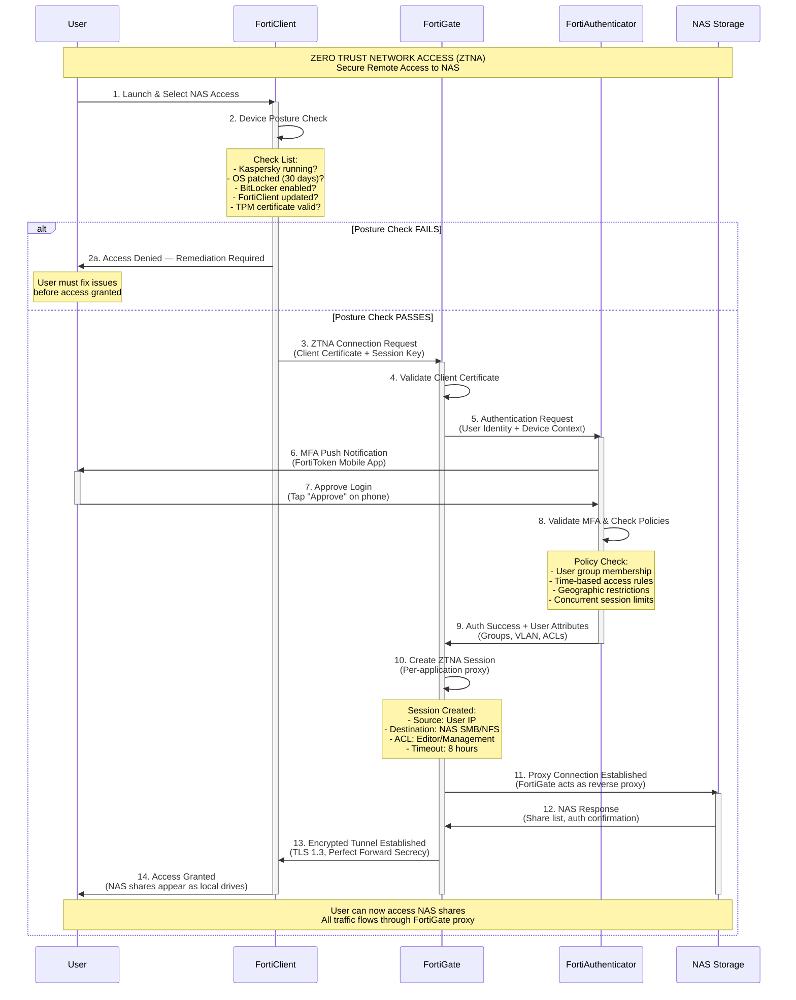

**Why This Architecture:**
- Device posture ensures only compliant endpoints access sensitive data
- MFA prevents credential theft attacks
- Per-application proxy provides micro-segmentation (no network-level access)
- All sessions logged in FortiAnalyzer for compliance auditing

---

### 7.2 VSX Failover Flow

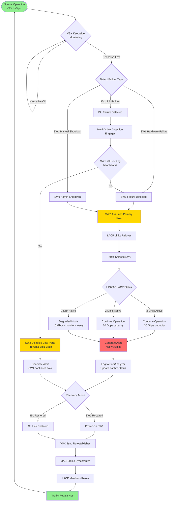

**Key States Explained:**

| State | Description | User Impact |
|-------|-------------|-------------|
| **Normal Operation** | Both switches active, traffic balanced | None |
| **SW1 Failure** | SW2 takes over all traffic | <1 second interruption |
| **ISL Failure** | MAD prevents split-brain | None (SW1 continues) |
| **Recovery** | SW1 restored, re-syncing | None |

---

### 7.3 Firewall Session Flow

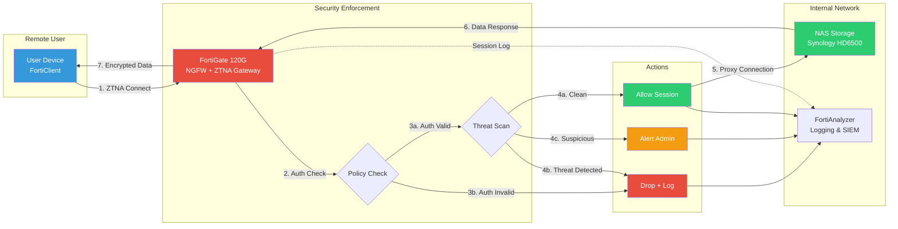

**Session Flow Stages:**

| Stage | Action | FortiGate Module |
|-------|--------|------------------|
| 1 | User initiates ZTNA connection | ZTNA Access Proxy |
| 2 | Authentication validation | Authentication Framework |
| 3 | Policy enforcement | Firewall Policy Engine |
| 4 | Threat inspection | IPS + AV + Application Control |
| 5 | Session established | Session Table |
| 6 | Continuous monitoring | UTM Profiles |
| 7 | Logging and analytics | FortiAnalyzer Integration |

---

### 7.4 Network Failure Scenarios

```mermaid
flowchart TD
    Failure([Failure Detected]) --> Type{Identify Failure Type}
    
    Type -->|ISP Link Down| ISP_Failover[SD-WAN Failover]
    Type -->|Firewall Hardware Failure| HA_Failover[HA Failover]
    Type -->|Switch Hardware Failure| VSX_Failover[VSX Failover]
    Type -->|LACP Link Failure| LACP_Rebalance[LACP Rebalance]
    Type -->|NAS Drive Failure| RAID_Rebuild[RAID6 Rebuild]
    Type -->|Complete Site Failure| DR_Failover[DR Failover]
    
    ISP_Failover --> ISP_Action[Traffic Routed to Backup ISP]
    ISP_Action --> ISP_Time[Failover Time: < 5 seconds]
    ISP_Action --> ISP_User[User Impact: None]
    
    HA_Failover --> HA_Action[Secondary Firewall Takes Over]
    HA_Action --> HA_Time[Failover Time: < 2 seconds]
    HA_Action --> HA_User[User Impact: Minimal]
    HA_Action --> HA_Session[Session Pickup Maintains Connections]
    
    VSX_Failover --> VSX_Action[Secondary Switch Takes Over]
    VSX_Action --> VSX_Time[Failover Time: < 1 second]
    VSX_Action --> VSX_User[User Impact: None]
    VSX_Action --> VSX_LACP[LACP Reconverges Automatically]
    
    LACP_Rebalance --> LACP_Action[Traffic Redistributed Across Remaining Links]
    LACP_Action --> LACP_Time[Failover Time: < 3 seconds]
    LACP_Action --> LACP_User[User Impact: None]
    LACP_Action --> LACP_Capacity[Reduced Capacity Until Link Restored]
    
    RAID_Rebuild --> RAID_Action[Hot Spare Activates<br/>Rebuild Begins]
    RAID_Action --> RAID_Time[Rebuild Time: ~78 hours]
    RAID_Action --> RAID_User[User Impact: None]
    RAID_Action --> RAID_Degrade[10-15% Performance Degradation]
    
    DR_Failover --> DR_Action[Manual Failover to DR Site]
    DR_Action --> DR_Time[RTO: < 30 minutes]
    DR_Action --> DR_User[User Impact: Planned Downtime]
    DR_Action --> DR_RPO[RPO: 15 minutes]
    
    ISP_Time --> LogAll[Log to FortiAnalyzer & Zabbix]
    HA_Time --> LogAll
    VSX_Time --> LogAll
    LACP_Time --> LogAll
    RAID_Time --> LogAll
    DR_Time --> LogAll
    
    LogAll --> AlertAdmin[Alert Admin<br/>Email + SMS]
    
    AlertAdmin --> Recovery{Recovery Path}
    
    Recovery -->|ISP Restored| ISP_Return[Gradual Return to Primary]
    Recovery -->|FW Repaired| HA_Return[Rejoin HA Cluster]
    Recovery -->|SW Repaired| VSX_Return[VSX Sync]
    Recovery -->|Link Repaired| LACP_Return[Link Rejoins LAG]
    Recovery -->|Drive Replaced| RAID_Return[RAID Rebuild Complete]
    Recovery -->|Site Restored| DR_Return[Failback to Primary]
    
    ISP_Return --> Start([Return to Normal])
    HA_Return --> Start
    VSX_Return --> Start
    LACP_Return --> Start
    RAID_Return --> Start
    DR_Return --> Start
    
    style Failure fill:#e74c3c,color:#fff
    style ISP_Failover fill:#3498db,color:#fff
    style HA_Failover fill:#3498db,color:#fff
    style VSX_Failover fill:#3498db,color:#fff
    style LACP_Rebalance fill:#3498db,color:#fff
    style RAID_Rebuild fill:#f39c12,color:#fff
    style DR_Failover fill:#9b59b6,color:#fff
    style Start fill:#2ecc71,color:#fff
```

**Failure Scenario Summary:**

| Scenario | Detection Time | Failover Time | User Impact | Automatic |
|----------|----------------|---------------|-------------|-----------|
| ISP Failure | 3-5 sec | <5 sec | None | ✅ Yes |
| Firewall Failure | <1 sec | <2 sec | Minimal | ✅ Yes |
| Switch Failure | <1 sec | <1 sec | None | ✅ Yes |
| LACP Link Failure | 3 sec | <3 sec | None | ✅ Yes |
| NAS Drive Failure | Immediate | N/A | None (degraded) | ✅ Yes |
| Complete Site Failure | 5 min | <30 min | Planned | ❌ Manual |

---

## Document Information

| Field | Value |
|-------|-------|
| **Document Title** | Part 2: Enhanced Network Infrastructure, Wireless & Servers |
| **Project** | B2H Studios IT Infrastructure Implementation |
| **Client** | B2H Studios |
| **Version** | 2.0 (Enhanced Edition) |
| **Date** | March 22, 2026 |
| **Prepared By** | VConfi Solutions |
| **Classification** | CONFIDENTIAL |
| **Status** | Final |
| **Word Count** | ~15,000 words |

---

## Summary of Design Decisions

### Key Trade-offs Made

| Decision | Selected | Rejected | Reasoning |
|----------|----------|----------|-----------|
| Firewall Model | FortiGate 120G | 100F/200F | Right-sized for 25 users |
| HA Mode | Active-Passive | Active-Active | Cost savings, simpler ops |
| Remote Access | ZTNA | VPN | Better security, zero cost |
| Switch Vendor | HPE Aruba | Cisco/Arista | 57% cost savings |
| Stacking | VSX | StackWise/MLAG | Hitless failover |
| NAS Connectivity | 4× 10GbE LACP | 2× 25GbE | Cost, resilience |
| Cabling | Cat6a | Cat6/Cat7 | Future-proofing |
| Wireless | FortiAP | Aruba/Cisco | 5× cost savings |
| WiFi Security | WPA3-Enterprise | WPA2-Personal | Compliance, audit |
| Server Vendor | Dell | HPE/Lenovo | Best value |
| Virtualization | VMware | Proxmox/Hyper-V | Enterprise features |
| VM Storage | RAID 10 | RAID 5/6 | Write performance |

### Risk Assessment

| Risk | Mitigation | Residual Risk |
|------|------------|---------------|
| HPE support vs. Cisco | DR site, documentation | LOW |
| VMware licensing cost | Essential for operations | ACCEPTABLE |
| RAID 10 capacity limits | Monitor growth, plan upgrade | LOW |
| ZTNA complexity | Training, documentation | LOW |

---

*End of Part 2: Enhanced Network Infrastructure, Wireless & Servers*

*Document generated by VConfi Solutions — Senior Network Architecture Team*
