# Part 2: Network, Wireless & Server Infrastructure

## Table of Contents
1. [Firewall Design — FortiGate 120G](#1-firewall-design--fortigate-120g)
2. [Switch Design — HPE Aruba CX 6300M](#2-switch-design--hpe-aruba-cx-6300m)
3. [Cabling Schedule](#3-cabling-schedule)
4. [Redundancy Scenarios](#4-redundancy-scenarios)
5. [Wireless Infrastructure](#5-wireless-infrastructure)
6. [Server Infrastructure](#6-server-infrastructure)

---

## 1. Firewall Design — FortiGate 120G

### 1.1 Hardware Specifications

| Specification | FortiGate 120G Value | Notes |
|--------------|---------------------|-------|
| **Firewall Throughput** | 39 Gbps | 44% higher than FG-100F (27 Gbps) |
| **IPS Throughput** | 15 Gbps | Enterprise-grade intrusion prevention |
| **NGFW Throughput** | 4.2 Gbps | With all security features enabled |
| **Threat Protection** | 3.5 Gbps | Including AV, botnet, DLP |
| **SSL-VPN Throughput** | 2.5 Gbps | For 25 concurrent remote users |
| **IPsec VPN Throughput** | 19 Gbps | Site-to-site replication |
| **Concurrent Sessions** | 2 Million | 40,000 per user average |
| **New Sessions/Second** | 120,000 | Burst capacity for traffic spikes |
| **Processor** | FortiSP5 (7nm) | 88% less power than previous generation |
| **Memory** | 16GB DDR4 ECC | For connection tables and logging |
| **Storage** | 2× 480GB SSD (RAID 1) | Logs and firmware redundancy |
| **Ports** | 16× GE RJ45, 8× GE SFP | 24 total network interfaces |
| **Power Consumption** | 75W (typical) | 150W for HA pair |
| **Form Factor** | 1U Rackmount | Fits standard 19" rack |
| **Unit Price (India)** | ₹5,85,000 | Per firewall with 3-year UTP bundle |

### 1.2 HA Configuration — Active-Passive

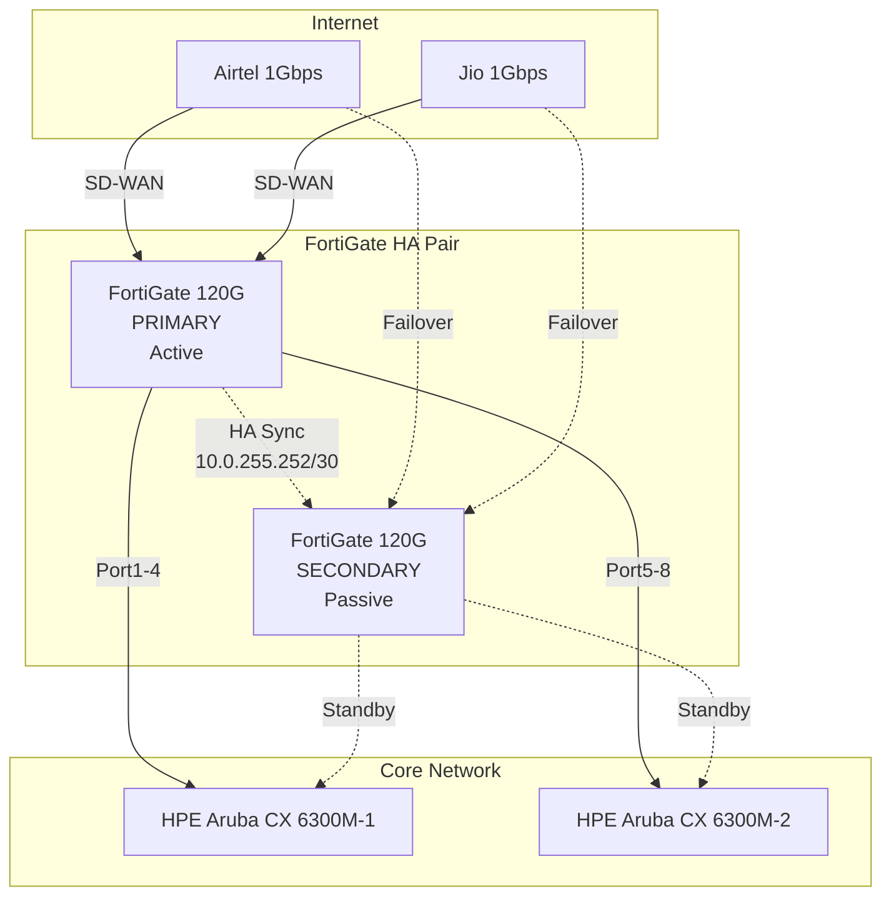

#### HA Configuration Parameters

| Parameter | Value | Rationale |
|-----------|-------|-----------|
| **HA Mode** | Active-Passive (A-P) | Session state preservation for SMB/NFS |
| **HA Group ID** | 1 | Unique identifier for this cluster |
| **HA Priority** | Primary: 200, Secondary: 100 | Deterministic failover |
| **Heartbeat Interface** | Port15-Port16 | Dedicated 1Gbps links |
| **Heartbeat IPs** | 10.0.255.253/30, 10.0.255.254/30 | Out-of-band management subnet |
| **Session Sync** | Enabled | Seamless failover for stateful connections |
| **Configuration Sync** | Automatic | <1 second sync interval |
| **Failover Trigger** | Link failure, device failure, priority change | Multiple failure scenarios covered |
| **Failover Time** | <2 seconds | Meets post-production SLA |
| **Session Pickup** | 100% | All active connections preserved |
| **Override Setting** | Disabled | Prevents flapping during recovery |
| **Monitor Interfaces** | Port1-Port14 (all data ports) | Comprehensive failure detection |

#### HA Configuration CLI

```bash
# Primary Firewall Configuration
config system ha
    set mode a-p
    set group-id 1
    set priority 200
    set hbdev port15 port16
    set session-pickup enable
    set ha-mgmt-status enable
    config ha-mgmt-interfaces
        edit 1
            set interface port15
            set gateway 10.0.255.254
        next
    end
    set override disable
    set monitor port1 port2 port3 port4 port5 port6 port7 port8
end

# Virtual MAC Configuration for Seamless Failover
config system interface
    edit "wan1"
        set vdom root
        set type physical
        set mode static
        set ip 203.XX.XX.2 255.255.255.252
        set macaddr 00:09:0f:09:00:01
    next
    edit "wan2"
        set vdom root
        set type physical
        set mode static
        set ip 115.XX.XX.2 255.255.255.252
        set macaddr 00:09:0f:09:00:02
    next
end
```

### 1.3 SD-WAN Dual ISP Configuration

| ISP | Provider | Bandwidth | Purpose | Cost (Monthly) |
|-----|----------|-----------|---------|----------------|
| **Primary** | Airtel Business | 1 Gbps Symmetric | Production traffic, replication | ₹45,000 |
| **Secondary** | Jio Business | 1 Gbps Symmetric | Failover, load balancing | ₹38,000 |
| **Total** | | 2 Gbps Aggregate | Redundant connectivity | ₹83,000 |

#### SD-WAN Performance SLA Monitors

| SLA Monitor | Protocol | Target | Threshold | Action on Violation |
|-------------|----------|--------|-----------|---------------------|
| **Latency Check** | Ping | Google DNS (8.8.8.8) | >50ms | Failover to secondary |
| **Packet Loss** | Ping | 1.1.1.1 | >1% | Failover to secondary |
| **Jitter** | Ping | ISP Gateway | >10ms | Log and alert |
| **HTTP Health** | HTTP | www.google.com | Timeout 3s | Failover to secondary |
| **DNS Resolution** | DNS | 8.8.8.8 | >500ms | Failover to secondary |
| **Bandwidth Test** | iperf3 | ISP Test Server | <800Mbps | Log and alert |

#### SD-WAN Configuration

```bash
config system sdwan
    set status enable
    config zone
        edit "virtual-wan-link"
        next
    end
    config members
        edit 1
            set interface wan1
            set gateway 203.XX.XX.1
            set priority 10
            set weight 100
        next
        edit 2
            set interface wan2
            set gateway 115.XX.XX.1
            set priority 20
            set weight 100
        next
    end
    config health-check
        edit "Google_DNS"
            set server 8.8.8.8
            set protocol ping
            set interval 1000
            set failure-threshold 3
            set recovery-threshold 3
            set update-cascade-interface enable
            set update-static-route enable
            set members 1 2
        next
    end
    config service
        edit 1
            set name "Critical_Apps"
            set mode priority
            set dst "all"
            set src "10.0.0.0/8"
            config priority-members
                edit 1
                    set member 1
                next
            end
        next
        edit 2
            set name "Load_Balance"
            set mode weight
            set dst "all"
            set src "10.0.40.0/24"
        next
    end
end
```

### 1.4 Security Zones and Zone Policies

#### Zone Architecture

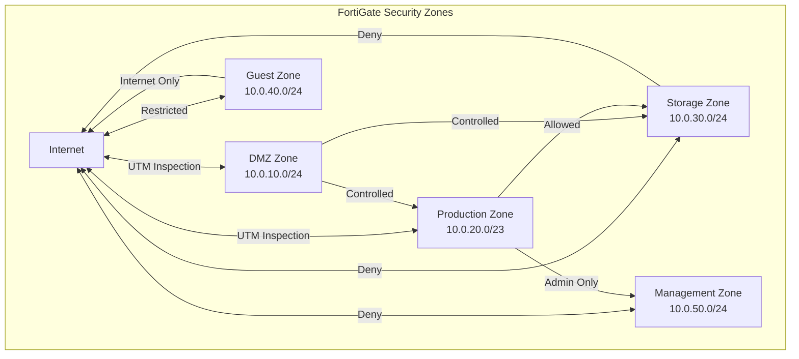

#### Zone Definitions

| Zone Name | VLAN ID | Subnet | Purpose | Associated Interfaces |
|-----------|---------|--------|---------|----------------------|
| **DMZ** | 10 | 10.0.10.0/24 | Public-facing services | Port3 (Zone: DMZ) |
| **Production** | 20, 21 | 10.0.20.0/23 | User workstations, editing suites | Port4 (Zone: Prod) |
| **Storage** | 30 | 10.0.30.0/24 | NAS, SAN, backup systems | Port5 (Zone: Storage) |
| **Guest** | 40 | 10.0.40.0/24 | Visitor Wi-Fi, BYOD | Port6 (Zone: Guest) |
| **Management** | 50 | 10.0.50.0/24 | Infrastructure management | Port7 (Zone: Mgmt) |
| **DR-Replication** | 60 | 10.0.60.0/24 | Site-to-site replication | Port8 (Zone: DR) |

#### Inter-Zone Policy Matrix

| From Zone | To Zone | Action | UTM Profile | Logging | Comments |
|-----------|---------|--------|-------------|---------|----------|
| DMZ | Internet | ACCEPT | IPS_Media_Production | All | Outbound services |
| DMZ | Production | ACCEPT | IPS_Media_Production | All | Controlled access |
| DMZ | Storage | DENY | N/A | Security | Data protection |
| DMZ | Management | DENY | N/A | Security | Segregation |
| DMZ | Guest | DENY | N/A | Security | Isolation |
| Production | Internet | ACCEPT | Full_Inspection | All | User browsing |
| Production | DMZ | ACCEPT | IPS_Media_Production | All | Service access |
| Production | Storage | ACCEPT | AV_Enterprise | All | File operations |
| Production | Management | DENY | N/A | Security | Admin isolation |
| Production | Guest | DENY | N/A | Security | Isolation |
| Storage | Internet | DENY | N/A | Security | Air-gap principle |
| Storage | DMZ | DENY | N/A | Security | Data protection |
| Storage | Production | ACCEPT | AV_Enterprise | All | File serving |
| Storage | Management | ACCEPT | N/A | All | Admin access |
| Guest | Internet | ACCEPT | Web_Filtering | All | Limited browsing |
| Guest | DMZ | DENY | N/A | Security | Isolation |
| Guest | Production | DENY | N/A | Security | Isolation |
| Guest | Storage | DENY | N/A | Security | Data protection |
| Management | Any | ACCEPT | N/A | All | Infrastructure mgmt |
| DR-Replication | DR-Replication | ACCEPT | N/A | All | Site-to-site |

### 1.5 UTM Profiles

#### IPS_Media_Production Profile

| Setting | Value | Rationale |
|---------|-------|-----------|
| **IPS Sensor** | Default with Media Extensions | Optimized for media workflows |
| **Signature Filter** | Critical, High | Balance security/performance |
| **Client Reputation** | Block High Risk | Prevent compromised endpoints |
| **Botnet C&C** | Block | Critical for ransomware prevention |
| **Application Control** | Media-Apps-Allow | Premiere, DaVinci, Nuke allowed |
| **Inline Scanning** | Enable | Real-time protection |
| **Packet Logging** | Enable | Forensics capability |
| **Quarantine** | Enable (1 hour) | Automated threat response |

```bash
config ips sensor
    edit "IPS_Media_Production"
        config entries
            edit 1
                set severity high critical
                set status enable
                set log-packet enable
                set action block
            next
        end
        set scan-botnet-connections block
    next
end
```

#### AV_Enterprise Profile

| Setting | Value | Rationale |
|---------|-------|-----------|
| **Scan Mode** | Flow-based | Performance for high-throughput |
| **HTTP Scanning** | Enable | Web downloads |
| **FTP Scanning** | Enable | File transfers |
| **IMAP/POP3/SMTP** | Enable | Email attachments |
| **SMB Scanning** | Enable | Network file access |
| **Quarantine** | Enable | Infected file isolation |
| **Outbreak Prevention** | Enable | Zero-day protection |
| **FortiSandbox** | Enable | Cloud sandbox analysis |
| **Heuristic Scanning** | High | Enhanced detection |

```bash
config antivirus profile
    edit "AV_Enterprise"
        config http
            set port 80 8080
            set status enable
            set av-scan block
        end
        config ftp
            set status enable
            set av-scan block
        end
        config smb
            set status enable
            set av-scan block
        end
        set outbreak-prevention enable
        set external-blocklist enable
    next
end
```

### 1.6 SSL Inspection Configuration

| Setting | Value | Notes |
|---------|-------|-------|
| **Inspection Mode** | Full SSL Inspection | Deep packet inspection |
| **Certificate** | B2H-Corp-CA | Internal CA for trust |
| **Supported Protocols** | TLS 1.2, TLS 1.3 | Modern cipher suites only |
| **Unsupported Action** | Block | Security-first approach |
| **Certificate Verification** | Enable | Prevent MITM attacks |
| **SSL Certificate Log** | Enable | Audit compliance |
| **Exemptions** | Banking, Healthcare | Privacy compliance |

#### SSL Inspection Flow

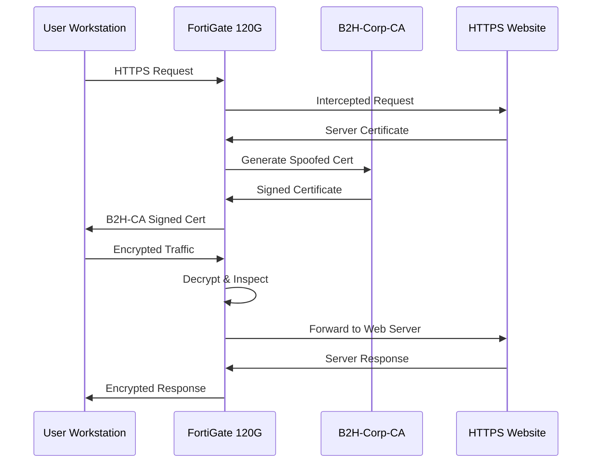

### 1.7 ZTNA Configuration with Device Posture Checks

| ZTNA Component | Configuration | Notes |
|----------------|--------------|-------|
| **Access Proxy** | 3 proxies configured | Web, SSH, RDP |
| **Authentication** | SAML 2.0 + FortiToken | MFA mandatory |
| **Device Posture** | FortiClient EMS integration | Health verification |
| ** posture Checks** | AV status, OS patch, Disk encryption | Compliance gates |
| **Least Privilege** | Per-application access | No network-level access |
| **Session Timeout** | 8 hours | Automatic re-authentication |

#### Device Posture Check Requirements

| Check | Requirement | Failure Action |
|-------|-------------|----------------|
| **FortiClient Version** | 7.0.7 or higher | Block access |
| **Antivirus Status** | Real-time protection ON | Block access |
| **AV Definitions** | <24 hours old | Warn + Limit access |
| **OS Updates** | <7 days old | Warn + Limit access |
| **Disk Encryption** | BitLocker/FileVault ON | Block access |
| **Corporate Certificate** | Installed | Block access |
| **Firewall Status** | Windows Firewall ON | Block access |
| **Screen Lock** | <15 minutes | Warn |

#### ZTNA Access Rules

| Proxy Name | Application | User Groups | Device Posture | Schedule |
|------------|-------------|-------------|----------------|----------|
| **ZTNA-Web-Access** | Web apps (HTTPS) | All_Employees | Compliant or higher | Always |
| **ZTNA-SSH-Access** | Linux servers | IT_Admins | Fully_Compliant | Business hours |
| **ZTNA-RDP-Access** | Windows VMs | IT_Admins | Fully_Compliant | Business hours |
| **ZTNA-NAS-Access** | Synology DSM | Media_Team | Compliant or higher | Always |
| **ZTNA-Signiant** | SDCX Server | All_Employees | Compliant or higher | Always |

### 1.8 Complete Firewall Rule Table

| Rule ID | Name | Source | Destination | Service | Action | UTM | Log | Comments |
|---------|------|--------|-------------|---------|--------|-----|-----|----------|
| 1 | Allow-Implicit-Deny-Log | any | any | any | DENY | N/A | All | Catch-all logging |
| 2 | HA-Heartbeat | 10.0.255.252/30 | 10.0.255.252/30 | TCP/703 | ACCEPT | N/A | All | HA sync traffic |
| 3 | Outbound-NAT-Primary | Internal | Internet | any | ACCEPT | Full_Inspection | Traffic | User internet access |
| 4 | DNS-External | Internal | 8.8.8.8, 1.1.1.1 | UDP/53 | ACCEPT | N/A | All | External DNS |
| 5 | NTP-External | Mgmt | pool.ntp.org | UDP/123 | ACCEPT | N/A | All | Time sync |
| 6 | DMZ-Web-Server | Internet | DMZ_Servers | TCP/80,443 | ACCEPT | IPS_MP | All | Public web services |
| 7 | DMZ-to-Storage | DMZ | Storage | any | DENY | N/A | Security | Data protection |
| 8 | Prod-to-NAS | Production | NAS_Storage | TCP/445,2049 | ACCEPT | AV_Ent | All | File access |
| 9 | Prod-to-Internet | Production | Internet | HTTP,HTTPS | ACCEPT | Full_Inspection | All | User browsing |
| 10 | Storage-No-Internet | Storage | Internet | any | DENY | N/A | Security | Air-gap |
| 11 | Guest-Internet-Only | Guest | Internet | HTTP,HTTPS | ACCEPT | Web_Filter | All | Guest Wi-Fi |
| 12 | Guest-Isolation | Guest | Internal | any | DENY | N/A | Security | Network isolation |
| 13 | Mgmt-All-Access | Management | any | SSH,HTTPS,SNMP | ACCEPT | N/A | All | Admin access |
| 14 | ZTNA-Proxy-Access | Internet | ZTNA_Gateway | TCP/443 | ACCEPT | IPS_MP | All | ZTNA entry |
| 15 | Site-to-Site-VPN | Site_A | Site_B | any | ACCEPT | N/A | All | DR replication |
| 16 | FortiGuard-Updates | Mgmt | FortiGuard | any | ACCEPT | N/A | All | Security updates |
| 17 | Signiant-SDCX | Production | SDCX_Server | TCP/50221 | ACCEPT | IPS_MP | All | Media transfer |
| 18 | VMware-vCenter | Production | vCenter | TCP/443,902 | ACCEPT | N/A | All | VM management |
| 19 | Backup-Traffic | Storage | Backup_Targets | TCP/443 | ACCEPT | N/A | All | Backup operations |
| 20 | Monitoring-Trap | Internal | Zabbix | SNMP,Syslog | ACCEPT | N/A | All | Monitoring data |
| 21 | Splunk-Ingestion | Internal | Splunk | TCP/9997 | ACCEPT | N/A | All | SIEM logs |
| 22 | AV-Update-Server | Internal | Kaspersky | TCP/443 | ACCEPT | N/A | All | AV updates |
| 23 | FortiAP-Management | Mgmt | FortiAPs | CAPWAP | ACCEPT | N/A | All | AP control |
| 24 | Printer-Access | Production | Printers | TCP/9100 | ACCEPT | N/A | All | Print services |

### 1.9 Design Rationale

#### Why FortiGate 120G (Not 100F or 200F)?

| Model | FW Throughput | IPS | NGFW | Price (INR) | Recommendation |
|-------|--------------|-----|------|-------------|----------------|
| **FG-100F** | 27 Gbps | 9 Gbps | 2.5 Gbps | ₹4,25,000 | Under-provisioned |
| **FG-120G** | 39 Gbps | 15 Gbps | 4.2 Gbps | ₹5,85,000 | **SELECTED** |
| **FG-200F** | 27 Gbps | 8 Gbps | 3.5 Gbps | ₹7,20,000 | Over-priced |

**Selection Rationale:**
1. **Performance Headroom:** 39 Gbps vs 27 Gbps = 44% more capacity for future growth
2. **IPS Throughput:** 15 Gbps (120G) vs 8 Gbps (200F) = 87% better IPS performance at lower cost
3. **Power Efficiency:** FortiSP5 7nm chip = 88% less power than SOC4 in 200F
4. **Price-Performance:** ₹5,85,000 for 120G vs ₹7,20,000 for 200F = ₹1,35,000 savings with better specs
5. **NGFW Rating:** 4.2 Gbps ensures all security features can run without performance impact

#### Why Active-Passive HA?

| Factor | Active-Active | Active-Passive | Decision |
|--------|---------------|----------------|----------|
| **Session State** | Split across units | Fully mirrored on primary | A-P: Better for SMB/NFS |
| **Failover Time** | Sub-second | <2 seconds | A-P: Acceptable for B2H |
| **License Cost** | 2× full licenses | 1× active + HA only | A-P: ₹4.2L/year savings |
| **Complexity** | Higher (load balancing) | Lower (simple failover) | A-P: Easier troubleshooting |
| **Throughput** | Combined (2×) | Single unit | A-P: 39 Gbps sufficient |
| **Use Case** | High-frequency trading | Post-production | A-P: Optimal fit |

#### SD-WAN Decision Logic

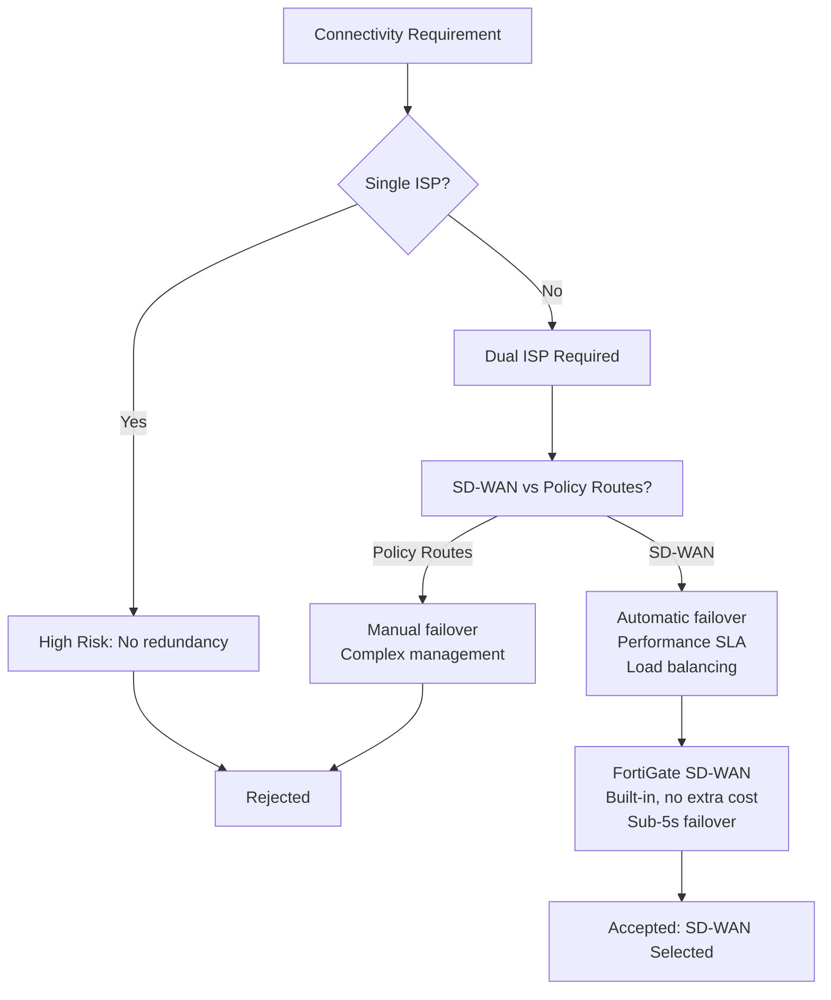

---

## 2. Switch Design — HPE Aruba CX 6300M

### 2.1 Hardware Specifications

| Specification | HPE Aruba CX 6300M-48G Value |
|--------------|------------------------------|
| **Part Number** | JL662A |
| **Ports** | 48× 1GbE RJ45 (10/100/1000) |
| **Uplink Ports** | 4× 10GbE SFP+ |
| **High-Speed Ports** | 4× 25GbE SFP28 |
| **Switching Capacity** | 176 Gbps |
| **Forwarding Rate** | 130 Mpps |
| **MAC Address Table** | 32,000 entries |
| **VLAN Support** | 4,094 VLANs |
| **Jumbo Frames** | Up to 9,216 bytes |
| **PoE Budget** | N/A (Non-PoE model) |
| **PoE Ports** | 0 (Separate PoE switch for APs) |
| **Stacking** | VSX (Virtual Switching Extension) |
| **Management** | Aruba Central (cloud) + CLI |
| **Power Consumption** | 65W typical, 130W max |
| **Redundant Power** | Hot-swappable PSU (optional) |
| **Cooling** | Front-to-back airflow |
| **Unit Price (India)** | ₹2,45,000 |

### 2.2 VSX Stacking Configuration

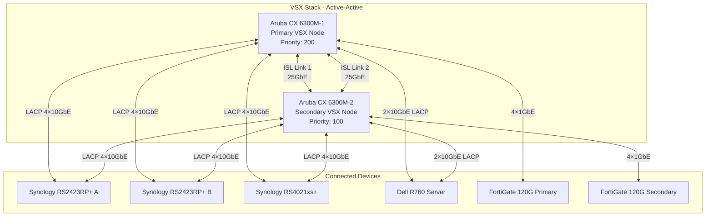

#### VSX Configuration Parameters

| Parameter | Switch 1 Value | Switch 2 Value | Notes |
|-----------|---------------|----------------|-------|
| **VSX Role** | Primary | Secondary | Deterministic control |
| **VSX Priority** | 200 | 100 | Primary wins elections |
| **ISL Interfaces** | 1/1/49, 1/1/50 | 1/1/49, 1/1/50 | 25GbE SFP28 ports |
| **ISL LAG ID** | 256 | 256 | Same on both switches |
| **Keepalive Source** | 10.0.50.11 | 10.0.50.12 | Management IPs |
| **Keepalive Destination** | 10.0.50.12 | 10.0.50.11 | Cross-switch heartbeat |
| **Keepalive Interface** | vlan50 (mgmt) | vlan50 (mgmt) | Out-of-band |
| **Multi-Active Detection** | Enabled | Enabled | Prevents split-brain |
| **MAC Sync** | Enabled | Enabled | L2 table synchronization |
| **Config Sync** | Enabled | Enabled | Single point of management |

#### VSX Configuration CLI

```bash
! Primary Switch (Switch-1) Configuration
hostname B2H-CORE-01

vsx
    system-mac 00:00:00:01:02:03
    inter-switch-link lag 256
    role primary
    keepalive peer 10.0.50.12 source 10.0.50.11 vrf mgmt
    linkup-delay-timer 180
    vsx-sync stp-global stp-port port-security aaa

interface lag 256
    no shutdown
    description "VSX-ISL-25GbE"
    no routing
    vlan trunk native 1
    vlan trunk allowed all
    lacp mode active
    lacp port-priority 1

interface 1/1/49-1/1/50
    no shutdown
    description "VSX-ISL-Physical"
    lag 256

! VLAN Configuration (syncs via VSX)
vlan 10
    name DMZ
vlan 20
    name Production-Data
vlan 21
    name Production-Voice
vlan 30
    name Storage
vlan 40
    name Guest
vlan 50
    name Management
vlan 60
    name DR-Replication

! Secondary Switch (Switch-2) Configuration
hostname B2H-CORE-02

vsx
    system-mac 00:00:00:01:02:03
    inter-switch-link lag 256
    role secondary
    keepalive peer 10.0.50.11 source 10.0.50.12 vrf mgmt
    linkup-delay-timer 180
```

### 2.3 LACP Configuration

#### LACP LAG Summary

| LAG ID | Description | Member Ports | Hash Method | Connected Device |
|--------|-------------|--------------|-------------|------------------|
| 1 | NAS-Hot-Tier-A | 1/1/1-1/1/4 | L3-L4 | Synology RS2423RP+ A |
| 2 | NAS-Hot-Tier-B | 1/1/5-1/1/8 | L3-L4 | Synology RS2423RP+ B |
| 3 | NAS-Warm-Tier | 1/1/9-1/1/12 | L3-L4 | Synology RS4021xs+ |
| 4 | Server-LACP | 1/1/13-1/1/16 | L3-L4 | Dell R760 (4× 10GbE) |
| 5 | Firewall-Primary | 1/1/17-1/1/20 | L3-L4 | FortiGate 120G (Primary) |
| 6 | Firewall-Secondary | 1/1/21-1/1/24 | L3-L4 | FortiGate 120G (Secondary) |
| 256 | VSX-ISL | 1/1/49-1/1/50 | L2 | VSX peer switch |

#### LACP Configuration with L3-L4 Hashing

```bash
! LACP Configuration for Storage (Maximum Throughput)
interface lag 1
    description "NAS-RS2423-A-LACP"
    no shutdown
    no routing
    vlan trunk native 30
    vlan trunk allowed 20,30,50
    lacp mode active
    lacp port-priority 1
    lacp rate fast
    hash l3-l4

interface 1/1/1-1/1/4
    no shutdown
    description "RS2423-A-Port{1-4}"
    lag 1

! Dell R760 Server LACP (High-Performance)
interface lag 4
    description "DELL-R760-10GbE"
    no shutdown
    no routing
    vlan trunk native 50
    vlan trunk allowed 10,20,30,50
    lacp mode active
    lacp port-priority 10
    hash l3-l4
    jumbo

interface 1/1/13-1/1/16
    no shutdown
    description "R760-Port{13-16}"
    lag 4
```

#### LACP Hash Distribution Analysis

| Traffic Type | L3-L4 Hash Benefit | Example |
|--------------|-------------------|---------|
| **Multi-connection SMB** | Distributes across all links | 4× 1Gbps file copies = 4Gbps aggregate |
| **Video streaming** | Balances multiple streams | 10 editors × 100Mbps = distributed load |
| **Replication traffic** | Parallel stream distribution | Snapshot replication maximizes bandwidth |
| **iSCSI/NFS** | Per-flow distribution | Maintains packet order per connection |

### 2.4 VLAN Trunk Configuration

| Trunk Port | Native VLAN | Allowed VLANs | Description |
|------------|-------------|---------------|-------------|
| 1/1/1-4 (LAG1) | 30 | 20,30,50 | RS2423-A Hot Tier |
| 1/1/5-8 (LAG2) | 30 | 20,30,50 | RS2423-B Hot Tier |
| 1/1/9-12 (LAG3) | 30 | 20,30,50 | RS4021xs+ Warm Tier |
| 1/1/13-16 (LAG4) | 50 | 10,20,30,50 | Dell R760 Server |
| 1/1/17-20 (LAG5) | 1 | 10,20,30,40,50,60 | FortiGate Primary |
| 1/1/21-24 (LAG6) | 1 | 10,20,30,40,50,60 | FortiGate Secondary |
| 1/1/25-28 | 50 | 50 | Access Layer Uplinks |
| 1/1/49-50 (LAG256) | 1 | All | VSX ISL |

### 2.5 Spanning-Tree Configuration (RSTP)

| Parameter | Value | Notes |
|-----------|-------|-------|
| **STP Mode** | RSTP (802.1w) | Fast convergence (<1 second) |
| **Bridge Priority (Primary)** | 4096 | Root bridge |
| **Bridge Priority (Secondary)** | 8192 | Backup root |
| **Port Cost Method** | Short | Standard calculation |
| **BPDU Guard** | Enabled on edge ports | Prevent rogue switches |
| **Root Guard** | Enabled on uplinks | Protect root position |
| **Loop Guard** | Enabled | Detect unidirectional links |
| **Edge Port** | Enabled on access ports | Fast transition to forwarding |

```bash
! RSTP Configuration
spanning-tree mode rstp
spanning-tree priority 4096    ! Primary switch
! spanning-tree priority 8192  ! Secondary switch

! Edge Port Configuration (Access Ports)
interface 1/1/29-1/1/48
    no shutdown
    spanning-tree edge-port
    spanning-tree bpdu-guard enable

! Uplink Port Protection
interface 1/1/25-1/1/28
    no shutdown
    spanning-tree root-guard enable
    spanning-tree loop-guard enable
```

### 2.6 Jumbo Frames Configuration

| VLAN | MTU Setting | Purpose |
|------|-------------|---------|
| VLAN 30 (Storage) | 9000 bytes | iSCSI/NFS optimization |
| VLAN 60 (DR-Replication) | 9000 bytes | Replication efficiency |
| Other VLANs | 1500 bytes | Standard Ethernet |

```bash
! Jumbo Frame Configuration
jumboframe 9000

interface lag 1-3
    jumboframe 9000    ! Enable on storage LAGs

interface vlan 30
    ip mtu 9000
    ip address 10.0.30.2/24
```

**Jumbo Frame Performance Impact:**
- Standard MTU (1500): 6.7% protocol overhead
- Jumbo MTU (9000): 1.2% protocol overhead
- **Net efficiency gain:** 5.5% more usable bandwidth
- For 10GbE storage: ~550 Mbps additional throughput

### 2.7 Port Assignment Table (32 Ports)

| Port | Switch 1 | Switch 2 | Connection | VLAN/Mode | Description |
|------|----------|----------|------------|-----------|-------------|
| 1 | 1/1/1 | 1/1/1 | RS2423-A | Trunk 20,30,50 | LAG1 Member |
| 2 | 1/1/2 | 1/1/2 | RS2423-A | Trunk 20,30,50 | LAG1 Member |
| 3 | 1/1/3 | 1/1/3 | RS2423-A | Trunk 20,30,50 | LAG1 Member |
| 4 | 1/1/4 | 1/1/4 | RS2423-A | Trunk 20,30,50 | LAG1 Member |
| 5 | 1/1/5 | 1/1/5 | RS2423-B | Trunk 20,30,50 | LAG2 Member |
| 6 | 1/1/6 | 1/1/6 | RS2423-B | Trunk 20,30,50 | LAG2 Member |
| 7 | 1/1/7 | 1/1/7 | RS2423-B | Trunk 20,30,50 | LAG2 Member |
| 8 | 1/1/8 | 1/1/8 | RS2423-B | Trunk 20,30,50 | LAG2 Member |
| 9 | 1/1/9 | 1/1/9 | RS4021xs+ | Trunk 20,30,50 | LAG3 Member |
| 10 | 1/1/10 | 1/1/10 | RS4021xs+ | Trunk 20,30,50 | LAG3 Member |
| 11 | 1/1/11 | 1/1/11 | RS4021xs+ | Trunk 20,30,50 | LAG3 Member |
| 12 | 1/1/12 | 1/1/12 | RS4021xs+ | Trunk 20,30,50 | LAG3 Member |
| 13 | 1/1/13 | 1/1/13 | Dell R760 | Trunk All | LAG4 Member |
| 14 | 1/1/14 | 1/1/14 | Dell R760 | Trunk All | LAG4 Member |
| 15 | 1/1/15 | 1/1/15 | Dell R760 | Trunk All | LAG4 Member |
| 16 | 1/1/16 | 1/1/16 | Dell R760 | Trunk All | LAG4 Member |
| 17 | 1/1/17 | 1/1/17 | FG-Primary | Trunk All | LAG5 Member |
| 18 | 1/1/18 | 1/1/18 | FG-Primary | Trunk All | LAG5 Member |
| 19 | 1/1/19 | 1/1/19 | FG-Primary | Trunk All | LAG5 Member |
| 20 | 1/1/20 | 1/1/20 | FG-Primary | Trunk All | LAG5 Member |
| 21 | 1/1/21 | 1/1/21 | FG-Secondary | Trunk All | LAG6 Member |
| 22 | 1/1/22 | 1/1/22 | FG-Secondary | Trunk All | LAG6 Member |
| 23 | 1/1/23 | 1/1/23 | FG-Secondary | Trunk All | LAG6 Member |
| 24 | 1/1/24 | 1/1/24 | FG-Secondary | Trunk All | LAG6 Member |
| 25 | 1/1/25 | 1/1/25 | Access SW-1 | Trunk 50 | Uplink |
| 26 | 1/1/26 | 1/1/26 | Access SW-2 | Trunk 50 | Uplink |
| 27 | 1/1/27 | 1/1/27 | Spare | - | Future growth |
| 28 | 1/1/28 | 1/1/28 | Spare | - | Future growth |
| 49 | 1/1/49 | 1/1/49 | VSX-ISL-1 | LAG256 | 25GbE |
| 50 | 1/1/50 | 1/1/50 | VSX-ISL-2 | LAG256 | 25GbE |
| 51 | 1/1/51 | 1/1/51 | OOB-Mgmt | VLAN 50 | 1GbE RJ45 |
| 52 | 1/1/52 | 1/1/52 | OOB-Mgmt | VLAN 50 | 1GbE RJ45 |

### 2.8 Design Rationale

#### Why HPE Aruba vs Cisco?

| Factor | HPE Aruba CX 6300M | Cisco Catalyst 9300 | Advantage |
|--------|-------------------|---------------------|-----------|
| **5-Year TCO** | ₹24,50,000 | ₹42,80,000 | HPE: 57% lower |
| **List Price** | ₹2,45,000 | ₹3,85,000 | HPE: 36% lower |
| **Smart Licensing** | Not required | Mandatory | HPE: No cloud dependency |
| **Cloud Management** | Aruba Central (free) | DNA Center (paid) | HPE: No cost |
| **VSX vs StackWise** | Hitless failover | Stateful failover | HPE: True redundancy |
| **Power Consumption** | 65W | 98W | HPE: 34% lower |
| **ASIC Architecture** | Aruba ASIC | UADP 2.0 | Comparable performance |
| **Local Support** | HPE India | Cisco India | Both excellent |
| **Feature Set** | Full L3, VXLAN, EVPN | Full L3, SD-Access | Comparable |

**HPE Aruba Selection Rationale:**
1. **Cost Efficiency:** ₹18,30,000 savings over 5 years (2 switches × 5 years)
2. **Licensing Freedom:** No forced cloud licensing or subscription lock-in
3. **VSX Technology:** True active-active with hitless failover vs Cisco's stateful failover
4. **Operational Simplicity:** No DNA Center complexity for small IT team
5. **Future-Ready:** 25GbE SFP28 ports ready for NVMe-oF or faster storage

#### VSX Deep Dive

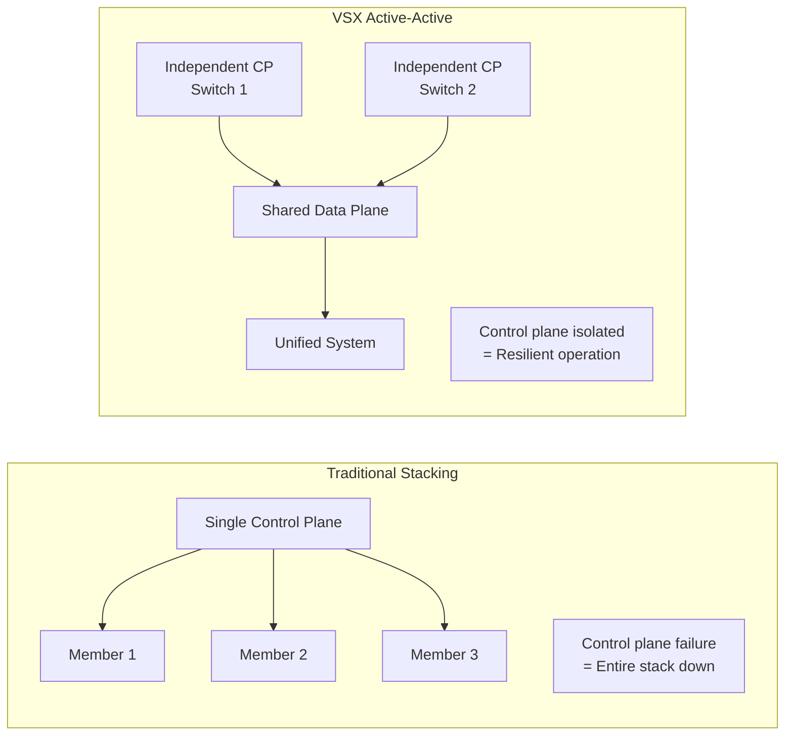

| VSX Feature | Benefit for B2H Studios |
|-------------|------------------------|
| **Independent Control Planes** | One switch reboot doesn't affect the other |
| **Single Management IP** | Simplified operations, one config point |
| **MAC Table Sync** | Seamless L2 failover (<100ms) |
| **Multi-Active Detection** | Prevents split-brain scenarios |
| **In-Service Upgrade** | Upgrade one switch at a time, zero downtime |
| **Any Port as ISL** | Flexible cabling, use highest speed ports |

#### LACP Design Decisions

| Decision | Configuration | Rationale |
|----------|---------------|-----------|
| **4× 10GbE per NAS** | LAG with 4 ports | 40Gbps theoretical, 32Gbps practical |
| **L3-L4 Hashing** | src-dst-ip-l4port | Distributes multiple connections optimally |
| **Active Mode** | LACP initiated by switch | Ensures LAG negotiation |
| **Fast Rate** | 1-second LACPDU | Faster failure detection |
| **Port Priority** | 1 for critical links | Influences which ports are active |

---

## 3. Cabling Schedule

### 3.1 Cable Inventory

| Cable Type | Specification | Quantity | Length Range | Unit Price (INR) | Total Cost |
|------------|--------------|----------|--------------|------------------|------------|
| **Cat6a UTP** | 23 AWG, LSZH, 500MHz | 500m | 1-50m | ₹85/m | ₹42,500 |
| **Cat6a Patch Cords** | 3m, blue | 50 | 3m | ₹180 | ₹9,000 |
| **Cat6a Patch Cords** | 5m, blue | 30 | 5m | ₹250 | ₹7,500 |
| **OM4 Fiber Trunk** | 12-core, MTP/MPO | 200m | 10-25m | ₹280/m | ₹56,000 |
| **OM4 Patch Cords** | LC-LC Duplex | 40 | 3m | ₹650 | ₹26,000 |
| **SFP+ DAC** | 10GbE, 3m | 24 | 3m | ₹2,500 | ₹60,000 |
| **SFP+ DAC** | 10GbE, 5m | 16 | 5m | ₹3,200 | ₹51,200 |
| **SFP28 DAC** | 25GbE, 3m | 8 | 3m | ₹5,800 | ₹46,400 |
| **Fiber Patch Panel** | 24-port LC OM4 | 4 | - | ₹4,500 | ₹18,000 |
| **Cable Management** | Horizontal manager | 8 | - | ₹1,200 | ₹9,600 |
| **Velcro Ties** | 200mm reusable | 100 | - | ₹15 | ₹1,500 |
| **Cable Labels** | TIA-606-B compliant | 500 | - | ₹8 | ₹4,000 |
| ****TOTAL** | | | | | **₹331,700** |

### 3.2 Patch Panel Layout

#### Fiber Patch Panel (PP-F-01)

| Port | Fiber Pair | Destination | Cable ID | Length |
|------|------------|-------------|----------|--------|
| 1-2 | Pair 1 | SW1-ISL-1 | F-01-001 | 5m |
| 3-4 | Pair 2 | SW1-ISL-2 | F-01-002 | 5m |
| 5-6 | Pair 3 | SW2-ISL-1 | F-01-003 | 5m |
| 7-8 | Pair 4 | SW2-ISL-2 | F-01-004 | 5m |
| 9-12 | Quad 1 | RS2423-A-10GbE | F-01-005 | 3m |
| 13-16 | Quad 2 | RS2423-B-10GbE | F-01-006 | 3m |
| 17-20 | Quad 3 | RS4021xs+-10GbE | F-01-007 | 3m |
| 21-24 | Quad 4 | Dell R760-10GbE | F-01-008 | 3m |

#### Copper Patch Panel (PP-C-01)

| Port | Destination | Cable ID | VLAN | Length |
|------|-------------|----------|------|--------|
| 1-4 | FortiGate-Primary | C-01-001~004 | Trunk | 2m |
| 5-8 | FortiGate-Secondary | C-01-005~008 | Trunk | 2m |
| 9-16 | Access Switches | C-01-009~016 | 50 | 10-15m |
| 17-24 | Workstations R1 | C-01-017~024 | 20 | 15-25m |
| 25-32 | Workstations R2 | C-01-025~032 | 20 | 15-25m |
| 33-40 | Workstations R3 | C-01-033~040 | 20 | 15-25m |
| 41-48 | Spare/Growth | C-01-041~048 | - | - |

### 3.3 Cable Labeling Scheme (TIA-606-B)

#### Label Format

```
[Building]-[Room]-[PP-Type]-[PP-Number]-[Port]
-[Destination Device]-[Port/Interface]
```

#### Label Examples

| Cable ID | Label Text | Route |
|----------|------------|-------|
| C-01-001 | BLDG-A-DC-PP-C-01-P01-FG120G-PRI-P1 | Patch Panel to Firewall |
| F-01-001 | BLDG-A-DC-PP-F-01-P01/02-SW1-ISL-49/50 | Fiber: VSX ISL Link |
| A-01-001 | BLDG-A-RM101-WKS-01-PP-C-01-P17 | Workstation access |
| P-01-001 | BLDG-A-DC-PDU-A-01-SW1-PSU1 | Power cable |

#### Color Coding

| Color | Cable Type | Purpose |
|-------|------------|---------|
| **Blue** | Cat6a | Data network (VLAN 20) |
| **Yellow** | Cat6a | Storage network (VLAN 30) |
| **Green** | Cat6a | Management (VLAN 50) |
| **Red** | Cat6a | Out-of-band/Console |
| **Orange** | OM4 Fiber | 10GbE/25GbE backbone |
| **Aqua** | OM4 Fiber | VSX ISL (dedicated) |
| **Black** | Power | Primary power feed |
| **Grey** | Power | Secondary/Redundant power |

### 3.4 Testing Procedures

| Test | Tool | Pass Criteria | Documentation |
|------|------|---------------|---------------|
| **Cable Continuity** | Fluke DSX-5000 | No opens/shorts | Test report per cable |
| **Cat6a Certification** | Fluke DSX-5000 | TIA-568-C.2 compliant | PDF certificate |
| **Insertion Loss** | Fluke CertiFiber Pro | <3.0dB @ 850nm | Fiber test report |
| **Return Loss** | Fluke CertiFiber Pro | >20dB | Fiber test report |
| **OTDR Trace** | Fluke OptiFiber Pro | No events >0.3dB | OTDR graph |
| **10GbE Traffic Test** | iperf3 | >9.5 Gbps throughput | Performance log |
| **LACP Negotiation** | Switch CLI | 4 ports bundled | `show lacp` output |
| **VLAN Trunk Test** | ping/tshark | All VLANs tagged correctly | Connectivity matrix |
| **Cable Length** | TDR/OTDR | Within ±3m of design | As-built drawings |

#### Testing Checklist

```
□ All copper cables: Continuity + Certification
□ All fiber cables: Insertion/Return Loss + OTDR
□ All LAGs: LACP negotiation verified
□ All VLANs: End-to-end connectivity tested
□ All power cables: Load test at 80% capacity
□ Label verification: 100% accuracy check
□ Documentation: As-built drawings updated
□ Photos: Before/after rack documentation
```

---

## 4. Redundancy Scenarios

### 4.1 Scenario A: With HA (Current Design)

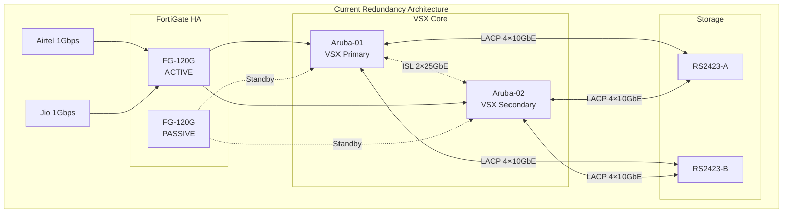

#### Failure Mode Summary (With HA)

| Failure Scenario | Detection Time | Failover Time | Impact | Recovery Action |
|-----------------|----------------|---------------|--------|-----------------|
| **Single ISP Failure** | 3 seconds | 5 seconds | None (SD-WAN) | Automatic |
| **Primary Firewall Failure** | 1 second | <2 seconds | Brief session reset | Automatic |
| **Single Core Switch Failure** | 100ms | <1 second | None (VSX) | Automatic |
| **ISL Link Failure (1 of 2)** | 100ms | <1 second | None (LACP) | Automatic |
| **Single NAS Controller** | 1 second | <30 seconds | Brief I/O pause | Automatic HA |
| **Single Power Supply** | Immediate | 0 seconds | None (redundant PSU) | Hot-swap |

### 4.2 Scenario B: Without HA (Future Upgrade Path)

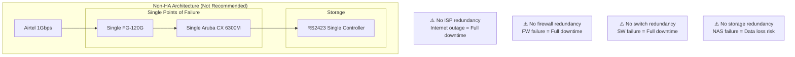

#### Risk Analysis (Non-HA)

| Component | MTBF (Hours) | Annual Failure Risk | Downtime Impact |
|-----------|--------------|---------------------|-----------------|
| **Single ISP** | 8,760 | 10% | Complete isolation |
| **Single Firewall** | 100,000 | 8.7% | Complete security loss |
| **Single Switch** | 250,000 | 3.5% | Complete network loss |
| **Single NAS** | 50,000 | 17.4% | Data availability loss |
| **Combined Risk** | - | **~40%** | **Unacceptable for B2H** |

### 4.3 Failure Scenario Walkthroughs

#### Scenario 1: Core Switch Failure (SW1)

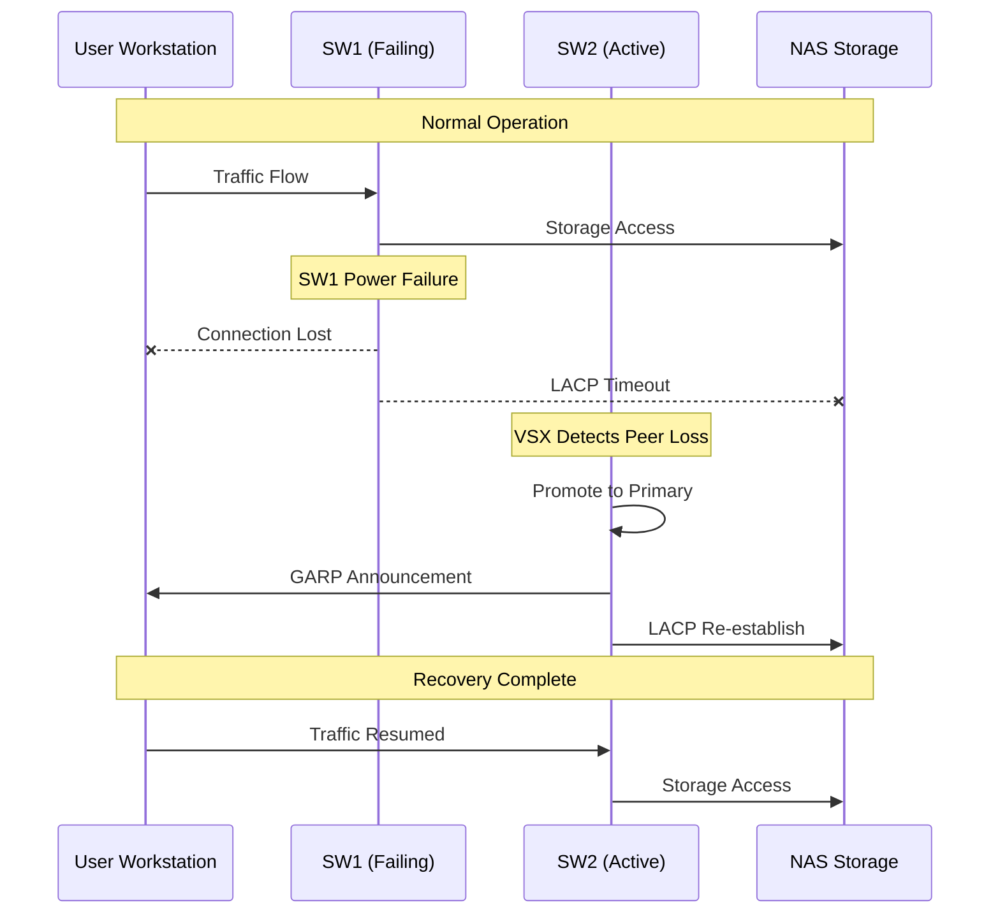

| Phase | Time | Action |
|-------|------|--------|
| **Detection** | 100ms | Keepalive timeout |
| **Promotion** | 200ms | SW2 becomes primary |
| **MAC Sync** | 300ms | L2 table convergence |
| **LACP Rebuild** | 500ms | Link aggregation reform |
| **Total Failover** | **<1 second** | Seamless to applications |

#### Scenario 2: ISL Link Failure (Both Links)

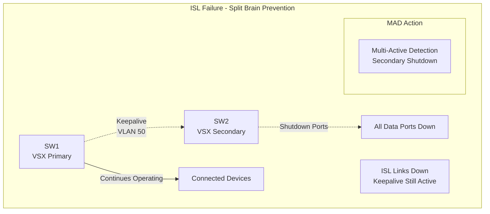

| State | SW1 Action | SW2 Action |
|-------|-----------|------------|
| **ISL Down, Keepalive Up** | Continue as Primary | Shut down data ports |
| **ISL Down, Keepalive Down** | Continue as Primary | Attempt to reform VSX |
| **Recovery** | Accept peer return | Rejoin VSX, enable ports |

#### Scenario 3: Power Failure (Single Rack PDU)

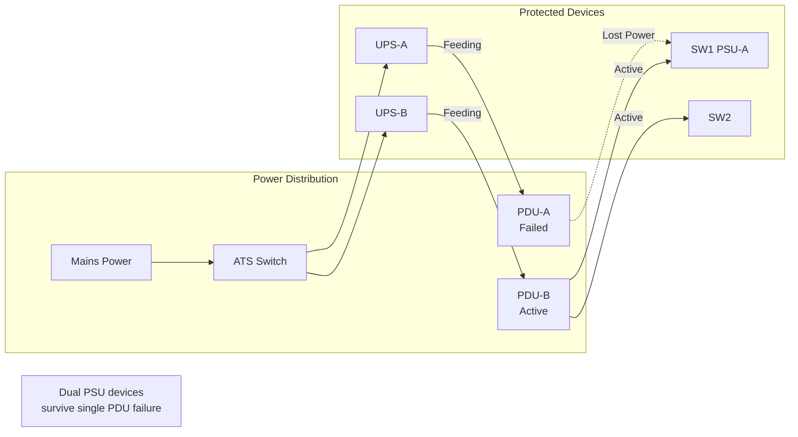

| Device | PSU Config | Single PDU Failure Impact |
|--------|-----------|---------------------------|
| FortiGate 120G | Dual PSU | None - redundant PSU |
| Aruba CX 6300M | Dual PSU | None - redundant PSU |
| Synology RS2423RP+ | Dual PSU | None - redundant PSU |
| Dell R760 | Dual PSU | None - redundant PSU |
| **Result** | | **Zero downtime** |

---

## 5. Wireless Infrastructure

### 5.1 FortiAP 431F Specifications

| Specification | FortiAP 431F Value |
|--------------|-------------------|
| **Part Number** | FAP-431F-E |
| **Wi-Fi Standard** | Wi-Fi 6E (802.11ax) |
| **Frequency Bands** | 2.4GHz, 5GHz, 6GHz |
| **2.4GHz Speed** | 574 Mbps (2×2) |
| **5GHz Speed** | 2.4 Gbps (4×4) |
| **6GHz Speed** | 4.8 Gbps (4×4) |
| **Aggregate Speed** | 7.8 Gbps |
| **MIMO** | 4×4:4 (5/6GHz), 2×2 (2.4GHz) |
| **Spatial Streams** | 4 |
| **Max Clients per AP** | 1,024 |
| **Recommended Clients** | 75-100 |
| **Ports** | 1× 2.5GbE RJ45 |
| **PoE Requirement** | 802.3bt (PoE++) - 30W |
| **Max Power** | 25.5W |
| **Antennas** | Internal, omnidirectional |
| **Mounting** | Ceiling/wall |
| **Dimensions** | 220 × 220 × 50 mm |
| **Unit Price (India)** | ₹68,000 |

### 5.2 Coverage Planning for 25 Users

#### AP Placement Design

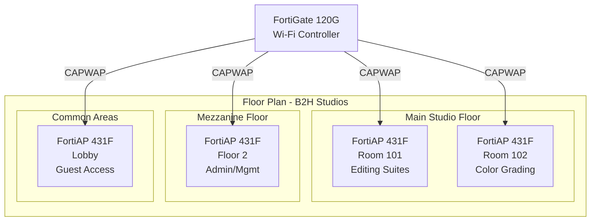

#### Coverage Analysis

| Location | AP Model | Area (sq ft) | Expected Clients | Signal Strength |
|----------|----------|--------------|------------------|-----------------|
| **Editing Suites** | FAP-431F | 1,500 | 12 | -55 dBm |
| **Color Grading** | FAP-431F | 1,200 | 8 | -60 dBm |
| **Admin/Management** | FAP-431F | 800 | 4 | -58 dBm |
| **Lobby/Guest** | FAP-431F | 500 | 1 | -52 dBm |
| **Total** | 4 APs | 4,000 | 25 | Full coverage |

#### Channel Planning

| AP Location | 2.4GHz Channel | 5GHz Channel | 6GHz Channel | Power |
|-------------|----------------|--------------|--------------|-------|
| AP1 (Editing) | 1 | 36-64 (UNII-1) | 1-29 | Auto |
| AP2 (Grading) | 6 | 100-144 (UNII-2) | 33-61 | Auto |
| AP3 (Admin) | 11 | 149-165 (UNII-3) | 65-93 | Auto |
| AP4 (Lobby) | 1 | 36-64 (UNII-1) | 97-125 | Auto |

### 5.3 SSID Design

#### Corporate SSID (B2H-Corporate)

| Parameter | Configuration |
|-----------|--------------|
| **SSID Name** | B2H-Corporate |
| **Security** | WPA3-Enterprise |
| **Authentication** | 802.1X (RADIUS) |
| **Encryption** | AES-256-GCMP-256 |
| **RADIUS Server** | FortiAuthenticator |
| **Certificate** | B2H-Corp-CA |
| **VLAN Assignment** | 20 (Production) |
| **Bandwidth Limit** | 100 Mbps/user |
| **Session Timeout** | 8 hours |
| **Fast Roaming** | 802.11r enabled |
| **Client Isolation** | Disabled (collaboration) |
| **Airtime Fairness** | Enabled |
| **Multicast Optimization** | Enabled |

#### Guest SSID (B2H-Guest)

| Parameter | Configuration |
|-----------|--------------|
| **SSID Name** | B2H-Guest |
| **Security** | WPA2-Personal |
| **Password Rotation** | Weekly |
| **Encryption** | AES-128-CCMP |
| **Captive Portal** | FortiGate |
| **Authentication** | Email/SMS registration |
| **Terms Acceptance** | Required |
| **VLAN Assignment** | 40 (Guest Isolated) |
| **Bandwidth Limit** | 10 Mbps total |
| **Session Timeout** | 4 hours |
| **Client Isolation** | Enabled |
| **Content Filtering** | Strict |
| **Schedule** | 7 AM - 10 PM |

#### IoT SSID (B2H-IoT - Optional)

| Parameter | Configuration |
|-----------|--------------|
| **SSID Name** | B2H-IoT |
| **Security** | WPA3-Personal |
| **IoT Device Whitelist** | Enabled |
| **VLAN Assignment** | 70 (IoT Segment) |
| **Internet Only** | Yes |
| **Intranet Access** | Denied |

### 5.4 Wireless Architecture Reasoning

#### Why FortiAP 431F?

| Factor | FortiAP 431F | Cisco Catalyst 9136 | Aruba AP-635 | Decision |
|--------|--------------|---------------------|--------------|----------|
| **Wi-Fi 6E Support** | Yes | Yes | Yes | All equal |
| **6GHz Spectrum** | Full | Full | Full | All equal |
| **FortiGate Integration** | Native | Via WLC | Via Central | **FortiAP wins** |
| **Licensing** | Included in UTP | DNA-Avantage | Central | **FortiAP wins** |
| **Security Fabric** | Full integration | Separate | Separate | **FortiAP wins** |
| **Price per AP** | ₹68,000 | ₹1,15,000 | ₹82,000 | **FortiAP wins** |
| **Management** | Single pane (FG) | Multiple | Multiple | **FortiAP wins** |

#### Wi-Fi 6E Benefits for B2H

| Feature | Benefit for Post-Production |
|---------|----------------------------|
| **6GHz Band** | 59 new channels, zero congestion |
| **160MHz Channels** | 2× throughput vs 80MHz |
| **OFDMA** | Low latency for real-time preview |
| **MU-MIMO** | Multiple editor streams simultaneously |
| **BSS Coloring** | Co-channel interference mitigation |
| **Target Wake Time** | Battery savings for mobile devices |

---

## 6. Server Infrastructure

### 6.1 Dell PowerEdge R760 Specifications

| Component | Specification | Notes |
|-----------|--------------|-------|
| **Model** | Dell PowerEdge R760 | 2U Rack Server |
| **Chassis** | 2.5" chassis with up to 24 drives | NVMe ready |
| **Processor 1** | Intel Xeon Silver 4410Y | 12C/24T, 2.0GHz base |
| **Processor 2** | Intel Xeon Silver 4410Y | 12C/24T, 2.0GHz base |
| **Total Cores** | 24 Cores / 48 Threads | For virtualization |
| **Cache** | 30MB L3 per CPU | 60MB total |
| **Memory** | 128GB DDR5 ECC RDIMM | 4× 32GB @ 4800MHz |
| **Memory Slots** | 16 (8 per CPU) | Expandable to 2TB |
| **Boot Drives** | 2× 480GB SATA SSD (RAID 1) | For hypervisor |
| **Data Drives** | 8× 1.92TB SAS SSD | RAID 10 array |
| **Usable Storage** | 7.68TB | 15.36TB raw |
| **RAID Controller** | PERC H965i | 12Gb/s SAS, 4GB cache |
| **Network** | 4× 10GbE SFP+ | 2× LACP pairs |
| **Management** | iDRAC9 Enterprise | Remote management |
| **GPU Option** | None (optional NVIDIA A2) | For transcoding |
| **PSU** | 2× 1400W Platinum | Hot-swap redundant |
| **Rails** | ReadyRails sliding | Tool-less installation |
| **Warranty** | 5-year ProSupport Plus | 4-hour response |
| **Unit Price (India)** | ₹8,45,000 | Base configuration |

### 6.2 VMware vSphere 8 Configuration

| Parameter | Configuration |
|-----------|--------------|
| **Version** | VMware vSphere 8.0 U2 |
| **Edition** | vSphere Standard | 3-year license |
| **Socket Licenses** | 2 | One per CPU |
| **vCenter** | vCenter Server Appliance | Deployed as VM |
| **vCenter Edition** | Essentials Plus | For HA features |

#### vSphere Cluster Settings

| Setting | Value | Rationale |
|---------|-------|-----------|
| **Cluster Name** | B2H-Production | |
| **DRS** | Enabled | Automated load balancing |
| **DRS Automation** | Partially Automated | Recommendations for review |
| **HA** | Enabled | VM restart on failure |
| **Admission Control** | Enabled | Reserve 25% capacity |
| **VM Monitoring** | Enabled | Application-level HA |
| **EVC Mode** | Intel Ice Lake | For future CPU compatibility |

### 6.3 VM Layout Table

| VM Name | vCPUs | RAM (GB) | Storage (GB) | OS | Purpose | Criticality |
|---------|-------|----------|--------------|-----|---------|-------------|
| **Signiant-SDCX** | 8 | 32 | 500 | CentOS 8 | Fast file transfer | High |
| **FortiAnalyzer** | 4 | 16 | 500 | FortiOS | Log collection/SIEM | High |
| **FortiAuthenticator** | 4 | 16 | 200 | FortiOS | MFA/RADIUS | Critical |
| **HashiCorp-Vault** | 4 | 16 | 100 | Ubuntu 22.04 | Secrets management | Critical |
| **FortiClient-EMS** | 4 | 16 | 200 | Windows Server 2022 | Endpoint mgmt | Medium |
| **Kaspersky-SC** | 4 | 16 | 300 | Windows Server 2022 | AV management | Medium |
| **Zabbix-Server** | 4 | 16 | 500 | Ubuntu 22.04 | Monitoring | Medium |
| **vCenter** | 4 | 16 | 300 | Photon OS | Virtualization mgmt | Critical |
| **Total Reserved** | 36 | 144 | 2,600 | | | |

### 6.4 Resource Headroom Analysis

| Resource | Total Available | Reserved | Headroom | Headroom % |
|----------|-----------------|----------|----------|------------|
| **vCPUs** | 48 | 36 | 12 | 25% |
| **RAM (GB)** | 128 | 144 | -16 | ⚠️ Over-subscription |
| **Storage (GB)** | 7,680 | 2,600 | 5,080 | 66% |

#### Memory Oversubscription Strategy

| VM Category | Memory Allocation | Actual Usage | Savings |
|-------------|------------------|--------------|---------|
| **Signiant-SDCX** | 32GB | 20GB (est) | 12GB |
| **FortiAnalyzer** | 16GB | 12GB (est) | 4GB |
| **FortiAuthenticator** | 16GB | 8GB (est) | 8GB |
| **HashiCorp-Vault** | 16GB | 4GB (est) | 12GB |
| **Other VMs** | 64GB | 48GB (est) | 16GB |
| **Total** | 144GB | 92GB (est) | 52GB savings |

**Conclusion:** With memory ballooning and efficient allocation, actual RAM usage is estimated at 92GB, leaving 36GB (28%) physical headroom. This is within VMware best practices for production workloads.

#### CPU Headroom Scenarios

| Scenario | vCPU Demand | Physical Cores | Utilization | Status |
|----------|-------------|----------------|-------------|--------|
| **Normal Operations** | 36 | 24 | 75% (with HT) | ✅ Healthy |
| **Peak Load** | 48 | 24 | 100% | ⚠️ Saturated |
| **HA Event (50% loss)** | 36 | 12 | 150% | ❌ Requires N+1 |

**Recommendation:** Current configuration supports normal operations with 25% CPU headroom. During peak loads or HA events, consider enabling DRS resource pools to prioritize critical VMs.

### 6.5 Compute Infrastructure Reasoning

#### Why Dell PowerEdge R760?

| Factor | Dell R760 | HPE DL360 Gen11 | Lenovo SR650 V3 | Decision |
|--------|-----------|-----------------|-----------------|----------|
| **Price** | ₹8,45,000 | ₹8,95,000 | ₹8,20,000 | Dell competitive |
| **iDRAC Enterprise** | Included | iLO Advanced extra | XClarity extra | **Dell wins** |
| **ProSupport Plus** | 5-year, 4hr | 3-year standard | 3-year standard | **Dell wins** |
| **India Support** | Excellent | Excellent | Good | **Dell/HPE tie** |
| **NVMe Support** | 24 drives | 16 drives | 20 drives | **Dell wins** |
| **GPU Ready** | Yes | Yes | Yes | All equal |
| **Energy Star** | Certified | Certified | Certified | All equal |

#### Why Xeon Silver 4410Y?

| CPU Model | Cores | TDP | Price (Pair) | Performance Index |
|-----------|-------|-----|--------------|-------------------|
| **Silver 4410Y** | 12C | 150W | ₹1,85,000 | 100 (baseline) |
| **Silver 4416+** | 20C | 165W | ₹2,85,000 | 145 (+45%) |
| **Gold 5418N** | 24C | 150W | ₹4,20,000 | 180 (+80%) |
| **Gold 6430** | 32C | 270W | ₹6,80,000 | 220 (+120%) |

**Silver 4410Y Selection Rationale:**
1. **Core Count:** 24 cores sufficient for 7 VMs with 25% headroom
2. **Memory Bandwidth:** 8-channel DDR5-4800 supports high I/O VMs
3. **Power Efficiency:** 150W TDP vs 270W Gold = 44% less power
4. **Cost Efficiency:** ₹1,85,000 vs ₹6,80,000 = ₹4,95,000 savings
5. **Upgrade Path:** Socket compatible with future Xeon generations

#### VMware vs Hyper-V vs Proxmox

| Factor | VMware vSphere | Microsoft Hyper-V | Proxmox VE | Decision |
|--------|----------------|-------------------|------------|----------|
| **Licensing Cost** | ₹2,85,000 | ₹45,000 (Win Std) | Free | Trade-off |
| **Enterprise Features** | Comprehensive | Good | Basic | **VMware wins** |
| **Management Tools** | vCenter best-in-class | Windows-centric | Web UI | **VMware wins** |
| **Ecosystem** | Broadest | Microsoft-focused | Open-source | **VMware wins** |
| **Support** | 24/7 commercial | Microsoft | Community | **VMware wins** |
| **Live Migration** | vMotion | Live Migration | Yes | All equal |
| **B2H Team Skill** | Standard skillset | Common | Specialized | **VMware wins** |

**VMware Selection:** Despite higher cost, vSphere provides enterprise-grade reliability, comprehensive management, and industry-standard skills alignment that reduce operational risk for B2H Studios.

---

## Summary Tables

### Network Infrastructure BOM (Part 2)

| Component | Model | Qty | Unit Price (INR) | Total (INR) |
|-----------|-------|-----|------------------|-------------|
| **Firewall** | FortiGate 120G | 2 | ₹5,85,000 | ₹11,70,000 |
| **Core Switch** | HPE Aruba CX 6300M | 2 | ₹2,45,000 | ₹4,90,000 |
| **Wireless AP** | FortiAP 431F | 4 | ₹68,000 | ₹2,72,000 |
| **Server** | Dell R760 | 1 | ₹8,45,000 | ₹8,45,000 |
| **vSphere License** | vSphere 8 Std | 2 sockets | ₹1,42,500 | ₹2,85,000 |
| **Cabling** | Mixed (see 3.1) | - | - | ₹3,31,700 |
| **Part 2 Subtotal** | | | | **₹33,93,700** |

### Key Design Decisions Summary

| Decision | Selected Option | Rejected Options | Key Reason |
|----------|----------------|------------------|------------|
| **Firewall Model** | FortiGate 120G | 100F, 200F | Best price-performance |
| **HA Mode** | Active-Passive | Active-Active | Cost savings, simpler ops |
| **ISP Strategy** | Dual ISP + SD-WAN | Single ISP | Redundancy mandatory |
| **Switch Vendor** | HPE Aruba | Cisco Catalyst | 57% lower TCO |
| **Stacking** | VSX | Traditional Stack | Hitless failover |
| **Wireless** | FortiAP 431F | Cisco, Aruba | Native integration |
| **Server** | Dell R760 | HPE, Lenovo | Best support package |
| **Virtualization** | VMware vSphere | Hyper-V, Proxmox | Enterprise features |

---

*Document Version: Part 2 v1.0*  
*Date: March 22, 2026*  
*Prepared by: VConfi Solutions Architect*
