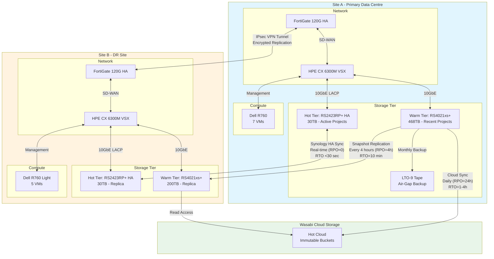
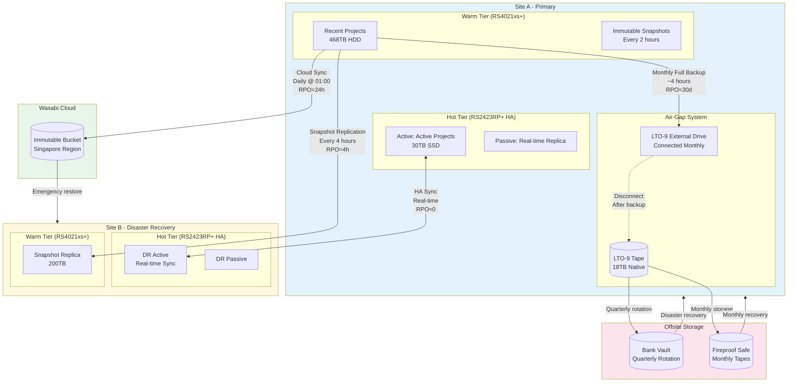

# Part 3: Disaster Recovery, Monitoring, SIEM & Power Infrastructure

## B2H Studios IT Infrastructure Implementation Plan

**Client:** B2H Studios  
**Project:** Media & Entertainment Infrastructure — Optimized Tiered Storage Solution  
**Date:** March 22, 2026  
**Prepared by:** VConfi Solutions  
**Classification:** CONFIDENTIAL  
**Document Version:** 2.0  

---

## Table of Contents

1. [Disaster Recovery Design](#1-disaster-recovery-design)
2. [Backup Architecture](#2-backup-architecture)
3. [Monitoring Architecture (Zabbix)](#3-monitoring-architecture-zabbix)
4. [SIEM Architecture (Splunk)](#4-siem-architecture-splunk)
5. [Power Infrastructure](#5-power-infrastructure)
6. [Environmental Controls](#6-environmental-controls)

---

## 1. Disaster Recovery Design

### 1.1 DR Site Configuration (Site B Equipment List)

Site B serves as the Disaster Recovery site for B2H Studios, providing failover capability with reduced capacity to optimize costs while maintaining business continuity.

#### Site B Hardware Inventory

| Category | Component | Model | Qty | Purpose |
|----------|-----------|-------|-----|---------|
| **Storage - Hot Tier** | Synology RS2423RP+ HA | RS2423RP+ with 12× 4TB SSD RAID10 | 2 | Real-time replicated active project storage |
| **Storage - Warm Tier** | Synology RS4021xs+ | RS4021xs+ with 16× 16TB HDD RAID6 | 1 | Reduced capacity (200TB) for recent projects |
| **Network - Firewall** | FortiGate 120G HA | FG-120G with UTP bundle | 2 | Security perimeter and SD-WAN |
| **Network - Core Switch** | HPE Aruba CX 6300M | JL659A 48-port with 25GbE uplinks | 2 | VSX redundant switching |
| **Compute** | Dell PowerEdge R760 Light | 1× Xeon Silver 4410Y, 64GB RAM | 1 | Reduced VM capacity for critical services |
| **Power** | APC Smart-UPS SRT 6000VA | SRT6KXLI with SNMP card | 2 | N+1 UPS redundancy |
| **Power** | Rack ATS | APC AP4424A 16A | 1 | Automatic transfer switching |
| **Power** | Metered PDU | APC AP8861 20-outlet | 4 | Power distribution with monitoring |
| **Network - Wireless** | FortiAP 431F | Indoor Wi-Fi 6E | 2 | Reduced AP coverage |
| **Cables** | Fiber OM4 Patch | LC-LC 10m | 4 | ISL/Replication links |
| **Cables** | Cat6a Patch | 2m/5m various | 50 | Network connectivity |

#### Site B VM Configuration

| VM Name | vCPUs | RAM | Storage | Purpose | Priority |
|---------|-------|-----|---------|---------|----------|
| Signiant SDCX-DR | 4 | 16GB | 300GB | Critical file transfer fallback | CRITICAL |
| Zabbix Proxy | 2 | 8GB | 100GB | Monitoring aggregation | CRITICAL |
| FortiAnalyzer-DR | 2 | 8GB | 200GB | Log aggregation at DR site | HIGH |
| FortiAuthenticator-DR | 2 | 8GB | 100GB | MFA fallback | HIGH |
| Vault Standby | 2 | 8GB | 50GB | Secrets management replica | MEDIUM |

### 1.2 Comparison Table: Site A vs Site B

| Parameter | Site A (Primary) | Site B (DR) | Rationale |
|-----------|------------------|-------------|-----------|
| **Location** | Primary Data Centre | Secondary Location (50+ km apart) | Geographic separation for disaster resilience |
| **Hot Tier Storage** | 2× RS2423RP+ HA (30TB) | 2× RS2423RP+ HA (30TB) | Identical for seamless failover |
| **Warm Tier Storage** | RS4021xs+ (468TB) | RS4021xs+ (200TB) | Reduced capacity for cost optimization |
| **Compute Server** | Dell R760 (2× CPU, 128GB RAM) | Dell R760 Light (1× CPU, 64GB RAM) | Reduced VM capacity acceptable for DR |
| **Firewall** | FortiGate 120G HA | FortiGate 120G HA | Identical security posture |
| **Core Switches** | 2× HPE CX 6300M | 2× HPE CX 6300M | Identical network architecture |
| **Internet Bandwidth** | 2× 1Gbps (Airtel + Jio) | 2× 1Gbps (different ISPs) | Same capacity, diverse providers |
| **UPS Configuration** | 2× APC SRT 6000VA (N+1) | 2× APC SRT 6000VA (N+1) | Identical power protection |
| **Wireless APs** | 6× FortiAP 431F | 2× FortiAP 431F | Minimal wireless at DR site |
| **LTO Tape Library** | 1× LTO-9 External | None | No air-gap at DR (cost saving) |
| **Wasabi Cloud Sync** | Continuous upload | Read-only access | DR site can access cloud archive |
| **Staffing** | Full operations | Emergency access only | DR site not staffed normally |

### 1.3 Replication Topology Diagram



### 1.4 RTO/RPO Table by Tier

| Tier | Technology | Replication Method | RPO | RTO | Use Case |
|------|------------|-------------------|-----|-----|----------|
| **Hot Tier** | RS2423RP+ HA (Site A) ↔ RS2423RP+ HA (Site B) | Synology High Availability Real-Time Sync | Near-zero (synchronous) | <30 seconds | Active projects being edited daily |
| **Warm Tier** | RS4021xs+ (Site A) → RS4021xs+ (Site B) | Snapshot Replication every 4 hours | 4 hours maximum | 10 minutes | Recent projects, client reviews in progress |
| **Archive/Cloud** | Wasabi Hot Cloud (ap-southeast-1) | Continuous Cloud Sync daily | 24 hours maximum | 1-4 hours | Archived projects, final deliverables |
| **Air-Gap** | LTO-9 Tape (Site A only) | Monthly manual backup | 30 days maximum | 24-48 hours | Compliance archive, ransomware ultimate protection |

#### RTO/RPO Visual Matrix

```
┌─────────────────────────────────────────────────────────────────────────────┐
│                        RTO/RPO MATRIX BY TIER                               │
├──────────────┬────────────────┬────────────────┬────────────────────────────┤
│     TIER     │      RPO       │      RTO       │       FAILURE SCENARIO     │
├──────────────┼────────────────┼────────────────┼────────────────────────────┤
│              │                │                │ Primary NAS fails:         │
│    HOT       │   Near-Zero    │   <30 seconds  │ Automatic failover to      │
│   (Active)   │  (Real-time)   │   ■■■□□□□□□□   │ secondary in DR site       │
│              │                │                │ No data loss               │
├──────────────┼────────────────┼────────────────┼────────────────────────────┤
│              │                │                │ Warm tier corruption:      │
│    WARM      │    4 Hours     │   10 minutes   │ Restore from last snapshot │
│  (Recent)    │   ■■■■□□□□□□   │   ■■□□□□□□□□   │ Max 4 hours data loss      │
│              │                │                │                            │
├──────────────┼────────────────┼────────────────┼────────────────────────────┤
│              │                │                │ Site A destruction:        │
│   ARCHIVE    │    24 Hours    │   1-4 hours    │ Download from Wasabi       │
│   (Cloud)    │   ■■■■■■■□□□   │   ■■■■□□□□□□   │ Bandwidth dependent        │
│              │                │                │                            │
├──────────────┼────────────────┼────────────────┼────────────────────────────┤
│              │                │                │ Ransomware attack:         │
│  AIR-GAP     │    30 Days     │   24-48 hours  │ Retrieve tape from vault   │
│   (Tape)     │   ■■■■■■■■■■   │   ■■■■■■■■■□   │ Complete recovery possible │
└──────────────┴────────────────┴────────────────┴────────────────────────────┘

RPO Scale: ■ = 1 hour (Hot), 4 hours (Warm), 2.4 hours (Archive), 3 days (Air-Gap)
RTO Scale: ■ = 1 minute (Hot), 1 minute (Warm), 24 minutes (Archive), 2.4 hours (Air-Gap)
```

### 1.5 Failover Procedures (Step-by-Step)

#### Procedure DR-001: Hot Tier Failover (Automated)

**Trigger Conditions:**
- Primary RS2423RP+ unit hardware failure
- Complete power loss at Site A
- Network partition exceeding 30 seconds

**Automation Level:** Fully Automated (No manual intervention required)

| Step | Action | Verification Command | Expected Result | Time |
|------|--------|---------------------|-----------------|------|
| 1 | HA heartbeat lost | Automatic detection | Failover triggered | 0 sec |
| 2 | Passive unit detects primary failure | `cat /var/log/ha.log` | "Primary unreachable, assuming active role" | 5 sec |
| 3 | Virtual IP migration | `ip addr show` | VIP (10.10.30.10) appears on DR unit | 10 sec |
| 4 | SMB/NFS service activation | `systemctl status nfs-server` | Services running | 15 sec |
| 5 | DNS update (if applicable) | `nslookup nas.b2hstudios.local` | Resolves to DR IP | 20 sec |
| 6 | Client reconnection | User access test | Shares accessible | 30 sec |

**Post-Failover Actions:**
1. Investigate Site A failure cause
2. Repair/replace failed hardware
3. Execute failback procedure when primary is restored

#### Procedure DR-002: Warm Tier Failover (Manual)

**Trigger Conditions:**
- Hot tier failover insufficient
- Primary warm tier NAS failure
- Site A complete disaster

**Prerequisites:**
- Verify Site B warm tier has latest snapshots
- Confirm network connectivity between sites
- Notify stakeholders of planned failover

| Step | Action | Command/Procedure | Verification | Time |
|------|--------|-------------------|--------------|------|
| 1 | Log into Site B DSM | `https://10.10.40.12:5001` | Successful login | 2 min |
| 2 | Navigate to Snapshot Replication | Main Menu → Replication | Interface loaded | 1 min |
| 3 | Identify latest snapshot | Check timestamp | Snapshot within 4 hours | 1 min |
| 4 | Promote snapshot to active | Snapshot → Make Writable | Confirmation dialog | 1 min |
| 5 | Confirm promotion | Click "Promote" | Snapshot now active volume | 2 min |
| 6 | Update DNS/NAS alias | Point `warm-nas.b2hstudios.local` to 10.10.30.12 | `nslookup` verification | 2 min |
| 7 | Verify share accessibility | Mount test from workstation | Files accessible | 1 min |

**Total RTO:** 10 minutes

#### Procedure DR-003: Complete Site Failover (Disaster Recovery)

**Trigger Conditions:**
- Complete Site A destruction or inaccessibility
- Natural disaster affecting primary site
- Extended power outage (>2 hours)

**Prerequisites:**
- Site B confirmed operational
- DNS control available
- User notification complete

| Phase | Step | Action | Responsible | Time |
|-------|------|--------|-------------|------|
| **T+0** | 1 | Declare disaster and activate DR team | IT Manager | 0 min |
| | 2 | Verify Site B operational status | Remote check | 5 min |
| | 3 | Update external DNS to point to Site B WAN IPs | DNS Admin | 10 min |
| **T+10** | 4 | Activate Site B hot tier (auto or manual) | System | 15 min |
| | 5 | Promote Site B warm tier snapshots | Storage Admin | 20 min |
| | 6 | Update VPN/ZTNA configuration | Network Admin | 25 min |
| **T+30** | 7 | Start critical VMs at Site B | System | 35 min |
| | 8 | Verify Signiant SDCX-DR operational | Application Admin | 40 min |
| | 9 | Notify users of DR site access | IT Manager | 45 min |
| **T+45** | 10 | Begin user acceptance testing | Users | 60 min |

**Total RTO:** 60 minutes for full site failover

### 1.6 Failback Procedures

#### Procedure DR-004: Hot Tier Failback

**When to Execute:**
- Primary Site A hardware repaired
- Stable operation confirmed for 24 hours
- During maintenance window

| Step | Action | Command | Verification |
|------|--------|---------|--------------|
| 1 | Verify Site A hot tier operational | `ping 10.10.30.11` | Response received |
| 2 | Check replication sync status | DSM → High Availability | "Synchronized" status |
| 3 | Initiate manual failover back | HA → Management → Failback | Confirmation prompt |
| 4 | Confirm failback completion | Monitor HA status | Primary active, DR passive |
| 5 | Verify client access | User test | No connectivity issues |

#### Procedure DR-005: Warm Tier Failback

| Step | Action | Details |
|------|--------|---------|
| 1 | Halt writes to Site B warm tier | Notify all users |
| 2 | Configure reverse replication | Site B → Site A |
| 3 | Sync latest changes | Allow replication to complete |
| 4 | Update DNS to Site A | Point warm-nas to primary |
| 5 | Resume normal operations | Verify access |
| 6 | Re-establish normal replication | Site A → Site B |

### 1.7 Quarterly DR Testing Plan

#### Testing Schedule

| Quarter | Test Type | Scope | Duration | Participants |
|---------|-----------|-------|----------|--------------|
| Q1 | Tabletop Exercise | Documentation review, role assignment | 4 hours | IT Team, Management |
| Q2 | Hot Tier Failover Test | Automated HA switchover | 2 hours | IT Team |
| Q3 | Warm Tier Recovery | Snapshot restore, data validation | 4 hours | IT Team, Users |
| Q4 | Full DR Simulation | Complete site failover and failback | 8 hours | All Stakeholders |

#### Test Execution Template

**Test ID:** DR-TEST-Q2-2026  
**Date:** June 15, 2026  
**Scope:** Hot Tier Automated Failover

| Step | Action | Expected Result | Actual Result | Pass/Fail |
|------|--------|-----------------|---------------|-----------|
| 1 | Document baseline state | All systems normal | | |
| 2 | Simulate primary failure | Power off RS2423RP+ primary | | |
| 3 | Monitor failover progress | DR assumes active role | | |
| 4 | Verify RTO met | <30 seconds downtime | | |
| 5 | Verify data accessibility | Users can access shares | | |
| 6 | Verify RPO met | No data loss | | |
| 7 | Execute failback | Primary restored as active | | |
| 8 | Document lessons learned | Improvement items identified | | |

#### DR Test Report Template

```
═══════════════════════════════════════════════════════════════
           DISASTER RECOVERY TEST REPORT
═══════════════════════════════════════════════════════════════
Test ID:        [DR-TEST-Q{X}-{YYYY}]
Date:           [DD/MM/YYYY]
Test Type:      [Tabletop/Component/Full]
Scope:          [Description]

EXECUTIVE SUMMARY:
Overall Result: [PASS / PARTIAL / FAIL]
RTO Achieved:   [Yes/No] - Actual: [X] min, Target: [Y] min
RPO Achieved:   [Yes/No] - Actual data loss: [X]

DETAILED RESULTS:
[Step-by-step results table]

ISSUES IDENTIFIED:
1. [Issue description]
   Severity: [Critical/Major/Minor]
   Remediation: [Action plan]

IMPROVEMENTS IMPLEMENTED:
1. [Improvement]

SIGN-OFFS:
IT Manager:     _________________ Date: _______
Security Lead:  _________________ Date: _______
Business Rep:   _________________ Date: _______
═══════════════════════════════════════════════════════════════
```

---

## 2. Backup Architecture

### 2.1 3-2-1-1 Backup Strategy Explanation

The B2H Studios backup strategy implements the industry-standard **3-2-1-1 backup rule** with specific adaptations for media production workflows.

#### The 3-2-1-1 Rule Explained

| Component | Definition | B2H Implementation |
|-----------|------------|-------------------|
| **3** | Three copies of data | 1. Primary storage (Site A)<br/>2. DR replica (Site B)<br/>3. Cloud/tape archive |
| **2** | Two different media types | 1. Disk (NAS/SAN)<br/>2. Tape (LTO-9) |
| **1** | One offsite copy | Wasabi Cloud (ap-southeast-1) |
| **1** | One air-gapped copy | LTO-9 tape (offline, bank vault) |

#### Why 3-2-1-1 for Media Production?

```
Threat Coverage Analysis:
┌──────────────────────────────────────────────────────────────┐
│ Threat Scenario              │ 3-2-1-1 Protection           │
├──────────────────────────────────────────────────────────────┤
│ Single drive failure         │ Protected (RAID + replicas)   │
│ Primary NAS failure          │ Protected (DR replica)        │
│ Ransomware (logical)         │ Protected (immutable + tape)  │
│ Site disaster (fire/flood)   │ Protected (DR site + cloud)   │
│ Insider deletion             │ Protected (immutable + tape)  │
│ Nation-state attack          │ Protected (air-gap tape)      │
└──────────────────────────────────────────────────────────────┘
```

### 2.2 Hot Tier Backup (Synology HA Real-Time Sync)

#### Configuration Details

| Parameter | Setting | Rationale |
|-----------|---------|-----------|
| **Technology** | Synology High Availability | Built-in active-passive clustering |
| **Sync Method** | Real-time block-level | Minimal RPO for active projects |
| **Replication Target** | Site B RS2423RP+ HA pair | Identical hardware for compatibility |
| **Network Path** | Dedicated 10GbE link via SD-WAN | Guaranteed bandwidth, low latency |
| **Encryption** | AES-256 in transit | Data protection during replication |
| **Compression** | LZ4 | Reduce bandwidth utilization |

#### HA Setup Configuration

```bash
# Synology HA Configuration Commands (via SSH)

# 1. Initialize HA cluster on primary
synoha -c init --primary-ip=10.10.30.11 --secondary-ip=10.10.40.11 --cluster-ip=10.10.30.10

# 2. Verify cluster status
synoha -c status

# Expected Output:
# Cluster Status: Healthy
# Primary Node: 10.10.30.11 (Active)
# Secondary Node: 10.10.40.11 (Passive)
# Replication Status: Synchronized
# Last Sync: 0 seconds ago

# 3. Configure heartbeat monitoring
synoha -c set --heartbeat-interval=5 --heartbeat-timeout=30

# 4. Enable auto-failover
synoha -c set --auto-failover=true --failover-delay=10
```

#### Monitoring HA Health

| Metric | Warning Threshold | Critical Threshold | Action |
|--------|-------------------|-------------------|--------|
| Replication Lag | >5 seconds | >30 seconds | Investigate network |
| Sync Status | Degraded | Failed | Trigger alert |
| Heartbeat Loss | 1 missed | 3 missed | Prepare failover |
| Disk Usage | >80% | >90% | Expand storage |

### 2.3 Warm Tier Backup (Snapshot Replication Every 4 Hours)

#### Snapshot Schedule

| Schedule | Frequency | Retention | Purpose |
|----------|-----------|-----------|---------|
| Hourly Snapshots | Every hour | 24 copies | Rapid recovery from user errors |
| 4-Hour Replication | Every 4 hours | 42 copies (7 days) | DR site synchronization |
| Daily Snapshots | Daily at 02:00 | 30 copies | Monthly recovery points |
| Weekly Snapshots | Sunday 02:00 | 12 copies (3 months) | Long-term recovery |

#### Snapshot Replication Configuration

```bash
# DSM Snapshot Replication Settings

# 1. Create replication task
Snapshot Replication → Replication → Create
  Source Server: Site A RS4021xs+ (10.10.30.12)
  Target Server: Site B RS4021xs+ (10.10.40.12)
  Connection: SSH/RSYNC encrypted
  
# 2. Configure schedule
  Frequency: Every 4 hours
  Start Time: 00:00
  Retention Policy:
    - Keep last 42 snapshots (7 days)
    - Keep daily for 30 days
    - Keep weekly for 12 weeks

# 3. Enable snapshot immutability
  Snapshot Lock: Enabled
  Lock Duration: 7 days minimum
  
# 4. Notification settings
  On Success: Every 6 hours
  On Failure: Immediate email
```

#### Snapshot Retention Policy

```
Snapshot Timeline (7 Days):
Day 1: [00:00] [04:00] [08:00] [12:00] [16:00] [20:00]
Day 2: [00:00] [04:00] [08:00] [12:00] [16:00] [20:00]
...
Day 7: [00:00] [04:00] [08:00] [12:00] [16:00] [20:00]

Total: 42 snapshots retained for instant recovery
Older snapshots: Consolidated to daily → weekly
```

### 2.4 Cloud Tier (Wasabi Sync)

#### Wasabi Configuration

| Parameter | Setting |
|-----------|---------|
| **Region** | ap-southeast-1 (Singapore) |
| **Bucket Type** | Hot Cloud Storage |
| **Object Lock** | Compliance Mode (immutable) |
| **Retention Period** | 90 days minimum |
| **Sync Schedule** | Daily at 01:00 IST |
| **Encryption** | SSE-S3 (AES-256) |
| **Data Tiering** | Projects older than 30 days |

#### Cloud Sync Task Setup

```bash
# Synology Cloud Sync Configuration

# 1. Install Cloud Sync package
# Package Center → Cloud Sync → Install

# 2. Create Wasabi connection
Cloud Sync → Create
  Provider: Wasabi (S3 compatible)
  Access Key: [WASABI_ACCESS_KEY]
  Secret Key: [WASABI_SECRET_KEY]
  Bucket: b2h-studios-archive
  Server: s3.ap-southeast-1.wasabisys.com

# 3. Configure sync task
  Local Path: /volume1/warm-tier/archive
  Remote Path: /b2h-studios/
  Sync Direction: Upload only
  Schedule: Daily 01:00
  
# 4. Enable object lock
  Versioning: Enable
  Object Lock: Compliance mode, 90 days
  
# 5. Configure filtering
  Include: *.mov, *.mxf, *.prores, *.r3d, *.arri, *.xml
  Exclude: *.tmp, *.cache, .DS_Store, Thumbs.db
  Minimum size: 10MB (avoid syncing tiny files)
```

#### Cost Projection (Wasabi)

| Year | Capacity | Monthly Cost | Annual Cost |
|------|----------|--------------|-------------|
| Year 1 | 200 TB | ₹99,600 | ₹11,95,200 |
| Year 2 | 300 TB | ₹1,49,400 | ₹17,92,800 |
| Year 3 | 400 TB | ₹1,99,200 | ₹23,90,400 |
| Year 4 | 500 TB | ₹2,49,000 | ₹29,88,000 |
| Year 5 | 600 TB | ₹2,98,800 | ₹35,85,600 |

*Note: ₹498/TB/month. Zero egress fees. Minimum 90-day retention per object.*

### 2.5 Air-Gap Backup (LTO-9 Tape Monthly)

#### LTO-9 Specifications

| Specification | Value |
|--------------|-------|
| **Native Capacity** | 18 TB per tape |
| **Compressed Capacity** | 45 TB (2.5:1 compression for media files) |
| **Native Speed** | 400 MB/s |
| **Interface** | SAS-3 (12 Gbps) |
| **WORM Support** | Yes (compliance tapes available) |

#### Air-Gap Backup Procedure

**Prerequisites:**
- External LTO-9 drive connected to warm tier NAS
- New LTO-9 tape labeled and initialized
- Backup window: 8 hours allocated

| Step | Action | Duration | Verification |
|------|--------|----------|--------------|
| 1 | Connect LTO drive to RS4021xs+ | 5 min | Drive detected in DSM |
| 2 | Insert new LTO-9 tape | 2 min | Tape recognized, inventory complete |
| 3 | Initiate full backup | 1 min | Job started |
| 4 | Backup execution (18TB) | 4-6 hours | Monitor progress in Hyper Backup |
| 5 | Verify backup completion | 10 min | 100% complete, verify checksums |
| 6 | **CRITICAL:** Physically disconnect drive | 2 min | Drive disconnected, powered off |
| 7 | Remove tape and place in protective case | 2 min | Tape secured |
| 8 | Update tape inventory log | 5 min | Record date, tape ID, contents |
| 9 | Store tape in fireproof safe | 5 min | Safe locked, access logged |
| 10 | Transport to bank vault (quarterly) | Varies | Deposit receipt filed |

#### Tape Rotation Schedule

| Tape ID | Month Created | Location | Retention |
|---------|---------------|----------|-----------|
| LTO-2026-Q1-M1 | January | Fireproof Safe | 1 year |
| LTO-2026-Q1-M2 | February | Fireproof Safe | 1 year |
| LTO-2026-Q1-M3 | March | Bank Vault | 7 years |
| LTO-2026-Q2-M1 | April | Fireproof Safe | 1 year |
| ... | ... | ... | ... |

**Rotation Logic:**
- Monthly tapes kept on-site for 3 months
- Quarterly tape moved to bank vault for long-term retention
- Annual archival tape retained for 7 years (compliance)

### 2.6 Backup Topology Diagram



---

## 3. Monitoring Architecture (Zabbix)

### 3.1 Zabbix Server Specifications

#### VM Configuration

| Parameter | Specification |
|-----------|---------------|
| **Hostname** | ZABBIX-01 |
| **Hypervisor** | Dell PowerEdge R760 (VMware) |
| **vCPUs** | 4 |
| **RAM** | 16 GB |
| **Storage** | 500 GB SSD (RAID10) |
| **Operating System** | Ubuntu Server 22.04 LTS |
| **Zabbix Version** | 6.4 LTS |
| **Database** | PostgreSQL 15 |
| **Web Server** | Nginx |
| **IP Address** | 10.10.40.15 |

#### Zabbix Component Sizing

| Component | Configuration | Purpose |
|-----------|---------------|---------|
| **Zabbix Server** | 4 vCPU, 8GB RAM | Core monitoring engine |
| **Zabbix Frontend** | Shared with server | Web interface |
| **PostgreSQL** | 4GB RAM dedicated | Database for metrics |
| **Housekeeping** | Daily at 03:00 | Data retention cleanup |

### 3.2 Monitored Items List

#### Network Devices

| Device Type | Model | IP Address | Monitored Items | Collection Interval |
|-------------|-------|------------|-----------------|---------------------|
| **FortiGate Primary** | FG-120G | 10.10.40.1 | CPU, Memory, Sessions, Interface traffic, VPN tunnels, IPS events | 60 sec |
| **FortiGate Secondary** | FG-120G | 10.10.40.2 | CPU, Memory, HA status, Interface traffic | 60 sec |
| **HPE Switch 1** | CX 6300M | 10.10.40.3 | CPU, Memory, Port status, Traffic, Temperature | 60 sec |
| **HPE Switch 2** | CX 6300M | 10.10.40.4 | CPU, Memory, Port status, Traffic, Temperature | 60 sec |
| **FortiAP** | FAP-431F | Various | Client count, Channel utilization, Signal strength | 300 sec |

#### Storage Devices

| Device | Model | IP Address | Monitored Items | Collection Interval |
|--------|-------|------------|-----------------|---------------------|
| **Hot Tier Primary** | RS2423RP+ | 10.10.30.11 | Volume usage, Disk health, Temperature, Replication status, IOPS | 60 sec |
| **Hot Tier Secondary** | RS2423RP+ | 10.10.30.12 | Volume usage, Disk health, Temperature, HA status | 60 sec |
| **Warm Tier** | RS4021xs+ | 10.10.30.13 | Volume usage, Disk health, Temperature, Snapshot status | 60 sec |
| **Wasabi Cloud** | S3 API | Cloud | Bucket size, API response time, Sync status | 300 sec |

#### Compute Infrastructure

| Device | OS | IP Address | Monitored Items | Collection Interval |
|--------|-----|------------|-----------------|---------------------|
| **Dell R760** | VMware ESXi | 10.10.40.10 | CPU, Memory, Disk I/O, VM status, Hardware health | 60 sec |
| **Signiant SDCX** | Windows Server 2022 | 10.10.10.15 | Service status, CPU, Memory, Disk, Transfer queue | 60 sec |
| **FortiAnalyzer** | FortiOS | 10.10.40.20 | Log storage, CPU, Memory, Database size | 300 sec |
| **FortiAuthenticator** | FortiOS | 10.10.40.21 | Auth events, CPU, Memory, Token sync | 300 sec |
| **HashiCorp Vault** | Linux | 10.10.40.22 | Seal status, Token count, Audit log size | 300 sec |
| **Zabbix Server** | Ubuntu | 10.10.40.15 | Self-monitoring (processes, queue, cache) | 30 sec |

#### Environmental & Power

| Device | Model | IP Address | Monitored Items | Collection Interval |
|--------|-------|------------|-----------------|---------------------|
| **UPS 1** | APC SRT 6000VA | 10.10.40.30 | Load %, Battery runtime, Input voltage, Temperature | 60 sec |
| **UPS 2** | APC SRT 6000VA | 10.10.40.31 | Load %, Battery runtime, Input voltage, Temperature | 60 sec |
| **Temperature Sensor** | APC NetBotz | 10.10.40.32 | Rack temperature, Humidity | 300 sec |

#### Security Monitored Items

| Category | Source | Monitored Data | Alert Trigger |
|----------|--------|----------------|---------------|
| **Failed Logins** | FortiGate, DSM, Windows | Failed authentication count | >5 failures in 5 min |
| **AV Alerts** | Kaspersky SC | Malware detection events | Any detection |
| **IPS Events** | FortiGate | Intrusion prevention blocks | >10 events in 1 hour |
| **Certificate Expiry** | All SSL endpoints | Days until expiration | <30 days warning, <7 days critical |
| **ZTNA Anomalies** | FortiGate | Unusual access patterns | Geographic impossibility |

### 3.3 Alert Thresholds

#### Severity Levels

| Severity | Response Time | Notification Method | Typical Scenarios |
|----------|---------------|---------------------|-------------------|
| **Critical** | Immediate | SMS + Email + Phone call | Site down, security breach, power failure |
| **High** | 15 minutes | SMS + Email | Hardware failure, replication broken, >90% capacity |
| **Warning** | 1 hour | Email | High utilization, elevated temperature, certificate expiry |
| **Information** | Next business day | Dashboard only | Routine events, successful backups |

#### Threshold Configuration Table

| Item | Warning | High | Critical | Action |
|------|---------|------|----------|--------|
| **CPU Usage** | >70% for 5 min | >85% for 5 min | >95% for 3 min | Scale or investigate |
| **Memory Usage** | >75% | >85% | >95% | Add memory or restart |
| **Disk Usage** | >80% | >90% | >95% | Clean up or expand |
| **Disk I/O Latency** | >20ms | >50ms | >100ms | Check for issues |
| **Network Errors** | >0.1% | >1% | >5% | Check cables/interfaces |
| **Temperature** | >35°C | >40°C | >45°C | Check cooling |
| **UPS Load** | >70% | >80% | >90% | Reduce load or upgrade |
| **UPS Runtime** | <30 min | <15 min | <5 min | Prepare for shutdown |
| **Replication Lag** | >10 sec | >60 sec | >5 min | Check network |
| **Failed Logins** | - | >5 in 5 min | >10 in 5 min | Investigate attack |

### 3.4 Escalation Matrix

#### Primary Escalation Path

| Time | Level | Contact | Action |
|------|-------|---------|--------|
| T+0 | L1 - Helpdesk | helpdesk@b2hstudios.com | Initial alert acknowledgment |
| T+5 min | L2 - System Admin | sysadmin@b2hstudios.com | Begin investigation |
| T+15 min | L3 - IT Manager | itmanager@b2hstudios.com | Escalate if unresolved |
| T+30 min | L4 - Security Team | security@b2hstudios.com | For security events |
| T+1 hour | L5 - Management | cto@b2hstudios.com | Business impact assessment |

#### Escalation Matrix by Alert Type

| Alert Type | L1 | L2 | L3 | L4 | Escalation Time |
|------------|----|----|----|----|-----------------|
| **Hardware Failure** | Notify | Investigate | Approve replacement | - | 15 min |
| **Security Incident** | Notify | Contain | Coordinate | Investigate | Immediate |
| **Power Failure** | Notify | Assess | Declare DR | - | 5 min |
| **Replication Failure** | Notify | Troubleshoot | Engage vendor | - | 30 min |
| **Capacity Alert** | Monitor | Plan expansion | Approve budget | - | 24 hours |
| **Certificate Expiry** | Schedule | Execute | Verify | - | 7 days before |

### 3.5 Dashboard Design

#### Main Dashboard Layout

```
┌─────────────────────────────────────────────────────────────────────────────┐
│                    B2H STUDIOS - INFRASTRUCTURE DASHBOARD                   │
├─────────────────────────────────────────────────────────────────────────────┤
│  ┌──────────────┐  ┌──────────────┐  ┌──────────────┐  ┌──────────────┐    │
│  │  SITE STATUS │  │  ALERTS      │  │  TOP 5       │  │  BANDWIDTH   │    │
│  │              │  │              │  │  BUSIEST     │  │  UTILIZATION │    │
│  │  [Site A]    │  │  Critical: 0 │  │  INTERFACES  │  │              │    │
│  │  ● Online    │  │  High: 0     │  │  1. NAS-P1   │  │  IN:  450Mbps│    │
│  │              │  │  Warning: 2  │  │  2. NAS-P2   │  │  OUT: 890Mbps│    │
│  │  [Site B]    │  │              │  │  3. WAN1     │  │              │    │
│  │  ● Online    │  │  [View All]  │  │  4. WAN2     │  │  [Details]   │    │
│  │              │  │              │  │  5. SRV-ETH0 │  │              │    │
│  └──────────────┘  └──────────────┘  └──────────────┘  └──────────────┘    │
├─────────────────────────────────────────────────────────────────────────────┤
│  ┌────────────────────────────┐  ┌──────────────────────────────────────┐  │
│  │  STORAGE UTILIZATION       │  │  VM STATUS                           │  │
│  │                            │  │                                      │  │
│  │  Hot Tier:  ████████░░ 78% │  │  [●] Signiant SDCX     CPU: 45%     │  │
│  │  Warm Tier: ████░░░░░░ 42% │  │  [●] FortiAnalyzer     CPU: 23%     │  │
│  │  Cloud:     ██░░░░░░░░ 18% │  │  [●] FortiAuth         CPU: 12%     │  │
│  │                            │  │  [●] HashiCorp Vault   CPU: 8%      │  │
│  │  [Capacity Forecast]       │  │  [●] FortiClient EMS   CPU: 15%     │  │
│  │                            │  │  [●] Kaspersky SC      CPU: 18%     │  │
│  └────────────────────────────┘  │  [●] Zabbix Server     CPU: 35%     │  │
│                                  └──────────────────────────────────────┘  │
├─────────────────────────────────────────────────────────────────────────────┤
│  ┌────────────────────────────┐  ┌──────────────────────────────────────┐  │
│  │  POWER & ENVIRONMENT       │  │  RECENT EVENTS                       │  │
│  │                            │  │                                      │  │
│  │  UPS 1: ● Online  72% load │  │  14:32  INFO  Backup completed       │  │
│  │  UPS 2: ● Online  68% load │  │  14:15  WARN  UPS 1 battery <80%     │  │
│  │  Runtime: 42 minutes       │  │  12:00  INFO  Snapshot replication   │  │
│  │                            │  │  08:30  INFO  Cloud sync completed   │  │
│  │  Temp: 24°C  Humidity: 45% │  │  02:00  INFO  Daily backup success   │  │
│  │                            │  │                                      │  │
│  │  [Environmental Details]   │  │  [View Event Log]                    │  │
│  └────────────────────────────┘  └──────────────────────────────────────┘  │
└─────────────────────────────────────────────────────────────────────────────┘
```

#### Storage-Specific Dashboard

```
┌─────────────────────────────────────────────────────────────────────────────┐
│                      STORAGE PERFORMANCE DASHBOARD                          │
├─────────────────────────────────────────────────────────────────────────────┤
│  ┌──────────────────────────────────────────────────────────────────────┐  │
│  │  IOPS - Hot Tier                                                     │  │
│  │  Read:  ████████████████████████████████████████  12,500 IOPS       │  │
│  │  Write: ████████████████████░░░░░░░░░░░░░░░░░░░░░   5,200 IOPS       │  │
│  └──────────────────────────────────────────────────────────────────────┘  │
│  ┌──────────────────────────────────────────────────────────────────────┐  │
│  │  THROUGHPUT - Warm Tier                                              │  │
│  │  Read:  ██████████████████████████░░░░░░░░░░░░░░░   850 MB/s         │  │
│  │  Write: ██████████████░░░░░░░░░░░░░░░░░░░░░░░░░░░   520 MB/s         │  │
│  └──────────────────────────────────────────────────────────────────────┘  │
│  ┌────────────────────────────┐  ┌──────────────────────────────────────┐  │
│  │  REPLICATION STATUS        │  │  SNAPSHOT STATUS                     │  │
│  │                            │  │                                      │  │
│  │  Hot → DR:  ● Sync OK      │  │  Total: 42 snapshots                 │  │
│  │  Lag: 0.3 seconds          │  │  Locked: 42                          │  │
│  │                            │  │  Oldest: 7 days                      │  │
│  │  Warm → DR: ● Sync OK      │  │  Latest: 2 hours ago                 │  │
│  │  Last: 2 hours ago         │  │                                      │  │
│  │                            │  │  [Snapshot Manager]                  │  │
│  │  Cloud Sync: ● Idle        │  │                                      │  │
│  │  Next: 01:00 tomorrow      │  │                                      │  │
│  └────────────────────────────┘  └──────────────────────────────────────┘  │
└─────────────────────────────────────────────────────────────────────────────┘
```

---

## 4. SIEM Architecture (Splunk)

### 4.1 License Tier: 50GB/day

#### Sizing Calculation

| Log Source | Daily Volume | Data Type |
|------------|--------------|-----------|
| FortiGate (4 units) | 8 GB | Security events, traffic logs, VPN |
| Synology NAS (3 units) | 2 GB | File access, authentication, audit |
| FortiAnalyzer | 5 GB | Aggregated logs, reports |
| Windows Servers (7 VMs) | 3 GB | System events, security, application |
| Kaspersky Security Center | 2 GB | Antivirus events, scan results |
| FortiClient EMS | 2 GB | Endpoint events, posture |
| Application Logs | 5 GB | Signiant, Vault, custom apps |
| Syslog (Network Devices) | 2 GB | Switch events, AP logs |
| **Subtotal** | **29 GB** | |
| **Headroom (70%)** | **21 GB** | |
| **Total Licensed** | **50 GB/day** | |

#### License Details

| Parameter | Value |
|-----------|-------|
| **Edition** | Splunk Enterprise |
| **License Type** | Perpetual with annual maintenance |
| **Daily Ingestion Limit** | 50 GB |
| **Violation Handling** | 5 violations per 30 days allowed |
| **Annual Cost** | ₹6,50,000 |
| **Indexer Nodes** | 1 (single site deployment) |
| **Search Heads** | 1 (shared with indexer) |

### 4.2 Log Sources Configuration

#### FortiGate Log Forwarding

```bash
# FortiGate Syslog Configuration
config log syslogd setting
    set status enable
    set server "10.10.40.15"
    set port 514
    set facility local0
    set format default
    set reliable disable
    set syslog-type udp
end

# Configure log filters
config log syslogd filter
    set severity information
    set forward-traffic enable
    set local-traffic enable
    set multicast-traffic enable
    set sniffer-traffic enable
    set anomaly enable
    set netscan enable
    set event enable
    set virus enable
    set webfilter enable
    set attack enable
    set spam enable
    set dlp enable
    set app-ctrl enable
end
```

#### Synology DSM Log Forwarding

```bash
# DSM Log Center Configuration
# Control Panel → Log Center → Log Sending

Enable log sending to syslog server:
  Server: 10.10.40.15
  Port: 514
  Protocol: UDP
  Format: RFC 3164
  
Send logs for:
  [✓] System
  [✓] Connection
  [✓] File Transfer
  [✓] Security
  [✓] User Activity
  [✓] Backup
```

#### Windows Event Log Forwarding

```powershell
# Install Splunk Universal Forwarder on Windows VMs
# Configure inputs.conf

[WinEventLog://Application]
disabled = 0
index = windows

[WinEventLog://Security]
disabled = 0
index = windows

[WinEventLog://System]
disabled = 0
index = windows

[WinEventLog://ForwardedEvents]
disabled = 0
index = windows

# Filter for relevant events only
whitelist1 = EventCode="4624|4625|4634|4648|4720|4726|4738|4740|4768|4769|4771|4776|7045|7040"
```

### 4.3 Correlation Rules (Minimum 10)

| Rule ID | Name | Description | Severity | Conditions |
|---------|------|-------------|----------|------------|
| **CORR-001** | Multiple Failed Logins | Detects brute force attempts | High | >5 failed logins from same IP in 5 minutes |
| **CORR-002** | Privilege Escalation | Detects admin account abuse | Critical | Non-admin user performing admin actions |
| **CORR-003** | After-Hours Access | Unusual off-hours activity | Medium | Access between 22:00-06:00 (excluding scheduled jobs) |
| **CORR-004** | Ransomware Indicators | Mass file modifications | Critical | >1000 file modifications in 10 minutes |
| **CORR-005** | Data Exfiltration | Large outbound transfers | High | >50GB uploaded in 1 hour to non-business domains |
| **CORR-006** | Impossible Travel | Geographic impossibility | Critical | Logins from different countries within 1 hour |
| **CORR-007** | Disabled Account Usage | Account reactivation attempt | High | Login attempt using disabled account |
| **CORR-008** | Firewall Rule Violation | Unauthorized access attempt | Medium | Traffic matching "deny" rules from internal IPs |
| **CORR-009** | AV Multiple Detections | Potential malware outbreak | High | >5 AV alerts in 10 minutes |
| **CORR-010** | Snapshot Deletion Attempt | Ransomware protection bypass | Critical | Attempt to delete locked snapshots |
| **CORR-011** | VPN Concurrent Sessions | Account sharing detection | Medium | Same account connected from 3+ locations |
| **CORR-012** | Dormant Account Reactivation | Stale account usage | High | Account inactive >90 days suddenly active |

#### Sample Correlation Search (SPL)

```spl
# CORR-001: Multiple Failed Logins
title = "CORR-001: Multiple Failed Login Attempts"
description = "Detects potential brute force attacks"
severity = high

index=security (EventCode=4625 OR action="failure" OR outcome="failure")
| eval time_bucket=round(_time/300)*300
| stats dc(src_ip) as unique_ips, count as total_attempts, values(src_ip) as source_ips by time_bucket, user
| where total_attempts >= 5
| where unique_ips <= 3
| eval alert_message="User: " + user + " had " + total_attempts + " failed login attempts from " + source_ips
| table time_bucket, user, total_attempts, source_ips, alert_message
```

```spl
# CORR-004: Ransomware Indicators
title = "CORR-004: Potential Ransomware Activity"
description = "Detects mass file modifications indicative of ransomware"
severity = critical

index=synology sourcetype=synology:file action=modify OR action=delete
| bin _time span=10m
| stats count as file_operations, dc(filepath) as unique_files by _time, host, user
| where file_operations > 1000
| eval alert_message="Host: " + host + " - User: " + user + " modified " + file_operations + " files in 10 minutes"
| table _time, host, user, file_operations, unique_files, alert_message
```

### 4.4 Log Retention Policy

| Tier | Retention Period | Storage Location | Compression | Search Performance |
|------|-----------------|-------------------|-------------|-------------------|
| **Hot** | 90 days | SSD (Indexer local) | None | Real-time |
| **Warm** | 1 year (days 91-365) | SAS drives (Indexer) | None | Fast (<5 sec) |
| **Cold** | 3 years (years 2-3) | NAS archive | GZIP | Slower (minutes) |
| **Frozen** | 7 years (compliance) | LTO Tape | GZIP | Restore required |

#### Retention Policy Diagram

```
Time Progression:
T+0        T+90       T+365      T+1095     T+7 years
 │          │          │          │          │
 ▼          ▼          ▼          ▼          ▼
┌──────────┬──────────┬──────────┬──────────┐
│   HOT    │   WARM   │   COLD   │  FROZEN  │
│  (Fast)  │  (Fast)  │ (Slower) │ (Archive)│
│  90 days │ 275 days │ 730 days │ 4+ years │
└──────────┴──────────┴──────────┴──────────┘
     │          │          │          │
     ▼          ▼          ▼          ▼
  Indexer    Indexer      NAS        Tape
   Local     Extended   Archive    Archive
```

---

## 5. Power Infrastructure

### 5.1 Load Calculation Table (Per Device Wattage)

#### Site A Power Consumption

| Device | Model | Qty | Watts Each | Total Watts | Power Factor | VA |
|--------|-------|-----|------------|-------------|--------------|-----|
| **Storage - Hot Tier** | RS2423RP+ | 2 | 180W | 360W | 0.95 | 379 VA |
| **Storage - Warm Tier** | RS4021xs+ | 1 | 200W | 200W | 0.95 | 211 VA |
| **Compute Server** | Dell R760 | 1 | 800W | 800W | 0.95 | 842 VA |
| **Firewall** | FortiGate 120G | 2 | 100W | 200W | 0.99 | 202 VA |
| **Core Switches** | HPE CX 6300M | 2 | 130W | 260W | 0.95 | 274 VA |
| **Wireless APs** | FortiAP 431F | 6 | 17W | 102W | 0.99 | 103 VA |
| **Management PC** | Desktop | 1 | 150W | 150W | 0.95 | 158 VA |
| **Monitors** | 24" LCD | 2 | 30W | 60W | 0.99 | 61 VA |
| **Rack PDUs** | APC Metered | 4 | 15W | 60W | 0.99 | 61 VA |
| **Cooling Fans** | Rackmount | 2 | 50W | 100W | 0.95 | 105 VA |
| **Misc/Buffer** | - | 1 | 150W | 150W | 0.95 | 158 VA |
| **TOTAL** | | | | **2,442W** | **0.96** | **2,554 VA** |

#### Site B Power Consumption

| Device | Model | Qty | Watts Each | Total Watts | Power Factor | VA |
|--------|-------|-----|------------|-------------|--------------|-----|
| **Storage - Hot Tier** | RS2423RP+ | 2 | 180W | 360W | 0.95 | 379 VA |
| **Storage - Warm Tier** | RS4021xs+ (reduced) | 1 | 180W | 180W | 0.95 | 189 VA |
| **Compute Server** | Dell R760 Light | 1 | 600W | 600W | 0.95 | 632 VA |
| **Firewall** | FortiGate 120G | 2 | 100W | 200W | 0.99 | 202 VA |
| **Core Switches** | HPE CX 6300M | 2 | 130W | 260W | 0.95 | 274 VA |
| **Wireless APs** | FortiAP 431F | 2 | 17W | 34W | 0.99 | 34 VA |
| **Rack PDUs** | APC Metered | 4 | 15W | 60W | 0.99 | 61 VA |
| **Cooling Fans** | Rackmount | 2 | 50W | 100W | 0.95 | 105 VA |
| **Misc/Buffer** | - | 1 | 100W | 100W | 0.95 | 105 VA |
| **TOTAL** | | | | **1,894W** | **0.96** | **1,981 VA** |

### 5.2 UPS Sizing Calculation

#### Site A UPS Sizing

```
Load Calculation:
────────────────────────────────────────
Total Active Power:           2,442 W
Total Apparent Power:         2,554 VA
Power Factor:                 0.96

Design Margin Calculations:
────────────────────────────────────────
Base Load:                    2,554 VA
Add 20% Future Growth:        2,554 × 1.20 = 3,065 VA
Add 20% Headroom:             3,065 × 1.20 = 3,678 VA

N+1 Redundancy Requirement:
Each UPS must handle full load
Required per UPS:             3,678 VA
Selected UPS Capacity:        6,000 VA (6kVA)

Utilization at Full Load:     3,678/6,000 = 61%
Runtime at 61% Load:          ~42 minutes
```

#### Site B UPS Sizing

```
Load Calculation:
────────────────────────────────────────
Total Active Power:           1,894 W
Total Apparent Power:         1,981 VA
Power Factor:                 0.96

Design Margin Calculations:
────────────────────────────────────────
Base Load:                    1,981 VA
Add 20% Future Growth:        1,981 × 1.20 = 2,377 VA
Add 20% Headroom:             2,377 × 1.20 = 2,852 VA

N+1 Redundancy Requirement:
Each UPS must handle full load
Required per UPS:             2,852 VA
Selected UPS Capacity:        6,000 VA (6kVA)

Utilization at Full Load:     2,852/6,000 = 48%
Runtime at 48% Load:          ~58 minutes
```

### 5.3 UPS Selection: APC Smart-UPS SRT 6000VA

#### Specifications

| Specification | Value |
|--------------|-------|
| **Model** | APC Smart-UPS SRT 6000VA (SRT6KXLI) |
| **Capacity** | 6,000 VA / 6,000 W |
| **Form Factor** | Rack/Tower convertible (4U) |
| **Input Voltage** | 230V nominal |
| **Output Voltage** | 230V (configurable) |
| **Topology** | Online/Double Conversion |
| **Waveform** | Pure Sine Wave |
| **Efficiency** | 96% (ECO mode: 99%) |
| **Interface** | USB, Serial, SmartSlot |
| **Network Management** | AP9631 Network Management Card (included) |
| **Bypass** | Static bypass (maintenance) |
| **Hot-Swappable Batteries** | Yes |
| **Extended Battery Modules** | SRT192RMBP (optional) |

#### Selected Configuration

| Parameter | Site A | Site B |
|-----------|--------|--------|
| **UPS Units** | 2× SRT6KXLI | 2× SRT6KXLI |
| **Configuration** | N+1 Parallel | N+1 Parallel |
| **Network Card** | AP9631 included | AP9631 included |
| **Battery Packs** | Standard (no EBM) | Standard (no EBM) |
| **PDU Type** | Metered 20A | Metered 20A |
| **ATS** | AP4424A | AP4424A |

#### Pricing (INR)

| Item | Unit Price | Qty | Total |
|------|-----------|-----|-------|
| APC SRT 6000VA UPS | ₹1,65,000 | 4 | ₹6,60,000 |
| APC Rack ATS 16A | ₹52,000 | 2 | ₹1,04,000 |
| APC Metered PDU (20-outlet) | ₹35,000 | 8 | ₹2,80,000 |
| **Power Infrastructure Subtotal** | | | **₹10,44,000** |
| GST (18%) | | | ₹1,87,920 |
| **Total Power Infrastructure** | | | **₹12,31,920** |

### 5.4 Rack ATS Configuration

#### APC AP4424A Specifications

| Specification | Value |
|--------------|-------|
| **Model** | APC Rack Automatic Transfer Switch AP4424A |
| **Input Connections** | 2× IEC 60320 C20 |
| **Output Connections** | 1× IEC 60320 C19, 8× IEC 60320 C13 |
| **Switching Time** | <10 ms (typical 4-8 ms) |
| **Switching Method** | Static switch (SCR-based) |
| **Current Rating** | 16A |
| **Form Factor** | 1U Rackmount |
| **Network Management** | Optional (AP9340) |
| **LED Indicators** | Source A, Source B, Output |

#### ATS Connection Diagram

```
Power Distribution Topology:

Utility Power
     │
     ▼
┌─────────┐
│   MCB   │  32A Main Breaker
│  32A    │
└────┬────┘
     │
     ▼
┌─────────────┐
│  Mains PDU  │
│  (2× 16A)   │
└──────┬──────┘
       │
    ┌──┴──┐
    │     │
    ▼     ▼
┌──────┐ ┌──────┐
│UPS 1 │ │UPS 2 │
│ 6kVA │ │ 6kVA │
└──┬───┘ └──┬───┘
   │        │
   ▼        ▼
┌──────────────────────────────────────────┐
│           Rack ATS (AP4424A)             │
│  Input A ←─────── Input B                │
│     │                │                   │
│     └───────┬────────┘                   │
│             │ <10ms transfer             │
│             ▼                            │
│      Output (C19/C13)                    │
└─────────────┬────────────────────────────┘
              │
    ┌─────────┼─────────┐
    ▼         ▼         ▼
┌───────┐ ┌───────┐ ┌───────┐
│ PDU-1 │ │ PDU-2 │ │ Device│
│(Left) │ │(Right)│ │Direct │
└───┬───┘ └───┬───┘ └───┬───┘
    │         │         │
    ▼         ▼         ▼
 Devices   Devices   Critical
 Rack A    Rack B    Devices
```

### 5.5 Runtime at Load Table

#### APC SRT 6000VA Runtime Chart

| Load % | Load (W) | Runtime (Standard) | Runtime with EBM |
|--------|----------|-------------------|------------------|
| 25% | 1,500W | ~1 hour 45 min | ~5 hours |
| 50% | 3,000W | ~42 minutes | ~2 hours 30 min |
| 75% | 4,500W | ~22 minutes | ~1 hour 20 min |
| 100% | 6,000W | ~12 minutes | ~45 minutes |

#### Site A Runtime Calculation

| Scenario | Load | Runtime | Action Window |
|----------|------|---------|---------------|
| **Normal Operation (N+1)** | 1,221W per UPS (20%) | ~3 hours | Extended runtime with single UPS |
| **Single UPS Failure** | 2,442W (41%) | ~55 minutes | Graceful shutdown or generator start |
| **Full Load** | 3,678W (61%) | ~42 minutes | Generator start required |

#### Site B Runtime Calculation

| Scenario | Load | Runtime | Action Window |
|----------|------|---------|---------------|
| **Normal Operation (N+1)** | 947W per UPS (16%) | ~3.5 hours | Extended runtime with single UPS |
| **Single UPS Failure** | 1,894W (32%) | ~1 hour 10 min | Graceful shutdown or generator start |
| **Full Load** | 2,852W (48%) | ~58 minutes | Generator start required |

### 5.6 SNMP Monitoring Integration

#### UPS SNMP Configuration

| Parameter | Setting |
|-----------|---------|
| **Community String** | [REDACTED - Configure during deployment] |
| **SNMP Version** | v3 (recommended) or v2c |
| **Trap Destination** | 10.10.40.15 (Zabbix Server) |
| **Trap Port** | 162 |
| **Polling Interval** | 60 seconds |

#### Monitored UPS Parameters

| OID | Description | Warning | Critical |
|-----|-------------|---------|----------|
| upsBasicBatteryStatus | Battery status | - | On battery |
| upsAdvBatteryRunTimeRemaining | Runtime remaining | <30 min | <10 min |
| upsAdvBatteryCapacity | Battery charge % | <80% | <50% |
| upsHighPrecInputFrequency | Input frequency | 49-51 Hz | <48 or >52 Hz |
| upsHighPrecInputVoltage | Input voltage | 207-253V | <198 or >264V |
| upsHighPrecOutputVoltage | Output voltage | 225-235V | <220 or >240V |
| upsAdvOutputLoad | Output load % | >70% | >90% |
| upsAdvConfigTemperature | UPS temperature | >40°C | >50°C |

#### Zabbix UPS Template Configuration

```bash
# Zabbix UPS Discovery Rule
Name: UPS SNMP Discovery
Type: SNMPv2 agent
Key: ups.discovery
OID: 1.3.6.1.4.1.318.1.1.1
Community: {$SNMP_COMMUNITY}

# Sample Item Prototypes
Name: UPS {#UPSNAME} - Battery Runtime
Key: ups.runtime[{#UPSNAME}]
OID: 1.3.6.1.4.1.318.1.1.1.2.2.3.0
Type: SNMPv2 agent
Units: s
Preprocessing: Custom multiplier 0.0167 (convert to minutes)

# Trigger Prototypes
Name: UPS {#UPSNAME} - On Battery Power
Expression: {Zabbix server:ups.status[{#UPSNAME}].last()}=2
Severity: High

Name: UPS {#UPSNAME} - Low Battery Runtime
Expression: {Zabbix server:ups.runtime[{#UPSNAME}].last()}<10
Severity: Disaster
```

### 5.7 Generator Backup Recommendation

#### Generator Sizing

| Parameter | Recommendation |
|-----------|---------------|
| **Type** | Diesel Generator (primary) or Natural Gas |
| **Capacity** | 15 kVA minimum (for 30% headroom) |
| **Phases** | 3-phase input |
| **Voltage** | 415V 3-phase / 230V single-phase |
| **ATS** | Automatic transfer switch for whole facility |
| **Fuel Tank** | 8-hour runtime minimum |
| **Estimated Cost** | ₹4,50,000 - ₹6,50,000 |

#### Generator Integration Diagram

```
Power Path with Generator:

Utility Power ──────┐
                    │
                    ▼
              ┌─────────┐
              │  Mains  │
              │   ATS   │
              └────┬────┘
                   │
     ┌─────────────┼─────────────┐
     │             │             │
     ▼             ▼             ▼
Generator      UPS Input      Non-Critical
(Standby)         │           Loads
              ┌───┴───┐
              │ UPS   │
              │N+1    │
              └───┬───┘
                  │
                  ▼
             Rack ATS
                  │
                  ▼
            Critical Loads
          (IT Infrastructure)

Transfer Sequence:
1. Utility failure detected (<10ms)
2. UPS takes load (instant)
3. Generator auto-start (10-15 seconds)
4. Generator stabilizes (30-45 seconds)
5. Mains ATS switches to generator (<100ms)
6. UPS recharges while supporting load
```

#### Generator Recommendation Table

| Brand | Model | Capacity | Price (INR) | Features |
|-------|-------|----------|-------------|----------|
| **Cummins** | C15D5 | 15 kVA | ₹5,20,000 | Reliable, good service network |
| **Kirloskar** | KG1-15AS | 15 kVA | ₹4,80,000 | Indian manufacturer, cost-effective |
| **Mahindra** | 15 kVA | 15 kVA | ₹4,50,000 | Good value, widespread service |
| **Eicher** | 15 kVA | 15 kVA | ₹4,95,000 | Reliable performance |

**Recommendation:** Kirloskar KG1-15AS for best value-to-performance ratio with excellent India-wide service support.

---

## 6. Environmental Controls

### 6.1 Temperature Monitoring

#### Target Temperature Ranges

| Zone | Optimal Range | Warning Threshold | Critical Threshold |
|------|---------------|-------------------|-------------------|
| **Server Rack Inlet** | 20-24°C | >26°C | >30°C |
| **Server Rack Outlet** | 25-30°C | >32°C | >38°C |
| **Storage Equipment** | 18-24°C | >26°C | >28°C |
| **General Room** | 20-25°C | >27°C | >30°C |
| **UPS Battery** | 20-25°C | >27°C | >35°C |

#### Temperature Sensor Placement

| Location | Sensor Type | Monitoring Purpose |
|----------|-------------|-------------------|
| **Rack Front (Top)** | APC NetBotz | Intake temperature |
| **Rack Front (Middle)** | APC NetBotz | Intake temperature |
| **Rack Front (Bottom)** | APC NetBotz | Intake temperature |
| **Rack Rear (Top)** | APC NetBotz | Exhaust temperature |
| **Rack Rear (Middle)** | APC NetBotz | Exhaust temperature |
| **Room Center** | APC NetBotz | Ambient temperature |
| **UPS Battery Compartment** | Built-in sensor | Battery health |

### 6.2 Humidity Requirements

#### Humidity Specifications

| Parameter | Minimum | Optimal | Maximum |
|-----------|---------|---------|---------|
| **Relative Humidity** | 35% | 45-50% | 60% |
| **Dew Point** | 5°C | 10-12°C | 17°C |

#### Humidity Control Measures

| Measure | Implementation | Threshold |
|---------|----------------|-----------|
| **Dehumidification** | Precision AC with humidity control | Activate at >55% RH |
| **Humidification** | Precision AC with humidity control | Activate at <40% RH |
| **Condensation Prevention** | Dew point monitoring | Alert if dew point approaches rack temperature |

### 6.3 Rack Layout (42U Diagram)

#### Site A Primary Rack Layout

```
Rack A - Primary Equipment (42U)
═══════════════════════════════════════════════════════════════════
 U42 │ [Blank Panel] - Airflow management
 U41 │ [Blank Panel]
 U40 │ ┌─────────────────────────────────────────────────────────┐
 U39 │ │           HPE Aruba CX 6300M - Switch 1 (SW1)           │
 U38 │ │                      1U Core Switch                       │
 U37 │ └─────────────────────────────────────────────────────────┘
 U36 │ ┌─────────────────────────────────────────────────────────┐
 U35 │ │           HPE Aruba CX 6300M - Switch 2 (SW2)           │
 U34 │ │                      1U Core Switch                       │
 U33 │ └─────────────────────────────────────────────────────────┘
 U32 │ [1U Cable Management]
 U31 │ ┌─────────────────────────────────────────────────────────┐
 U30 │ │              FortiGate 120G - Primary (FG1)             │
 U29 │ │                    1U Firewall Appliance                  │
 U28 │ └─────────────────────────────────────────────────────────┘
 U27 │ ┌─────────────────────────────────────────────────────────┐
 U26 │ │            FortiGate 120G - Secondary (FG2)             │
 U25 │ │                    1U Firewall Appliance                  │
 U24 │ └─────────────────────────────────────────────────────────┘
 U23 │ [1U Blank Panel]
 U22 │ ┌─────────────────────────────────────────────────────────┐
 U21 │ │              APC Smart-UPS SRT 6000VA (UPS1)            │
 U20 │ │                    4U Online UPS                          │
 U19 │ │                                                             │
 U18 │ │                                                             │
 U17 │ └─────────────────────────────────────────────────────────┘
 U16 │ ┌─────────────────────────────────────────────────────────┐
 U15 │ │              APC Smart-UPS SRT 6000VA (UPS2)            │
 U14 │ │                    4U Online UPS                          │
 U13 │ │                                                             │
 U12 │ │                                                             │
 U11 │ └─────────────────────────────────────────────────────────┘
 U10 │ ┌─────────────────────────────────────────────────────────┐
 U09 │ │                 APC Rack ATS 16A (ATS)                  │
 U08 │ │                    1U Automatic Transfer                  │
 U07 │ └─────────────────────────────────────────────────────────┘
 U06 │ [1U Cable Management]
 U05 │ ┌─────────────────────────────────────────────────────────┐
 U04 │ │              Dell PowerEdge R760 Server                 │
 U03 │ │                    2U Compute Node                        │
 U02 │ │                                                             │
 U01 │ └─────────────────────────────────────────────────────────┘
═══════════════════════════════════════════════════════════════════
     │   [Rear: Cable organizers, PDU left/right]
```

#### Site A Storage Rack Layout

```
Rack B - Storage Equipment (42U)
═══════════════════════════════════════════════════════════════════
 U42 │ [Blank Panel]
 U41 │ ┌─────────────────────────────────────────────────────────┐
 U40 │ │          Synology RS2423RP+ - Hot Tier Unit 1           │
 U39 │ │                    2U Rackmount NAS                       │
 U38 │ └─────────────────────────────────────────────────────────┘
 U37 │ ┌─────────────────────────────────────────────────────────┐
 U36 │ │          Synology RS2423RP+ - Hot Tier Unit 2           │
 U35 │ │                    2U Rackmount NAS                       │
 U34 │ └─────────────────────────────────────────────────────────┘
 U33 │ [1U Cable Management]
 U32 │ ┌─────────────────────────────────────────────────────────┐
 U31 │ │ │ │ │ │ │ │          Synology RS4021xs+              │
 U30 │ │ │ │ │ │ │ │              Warm Tier NAS                 │
 U29 │ │ │ │ │ │ │ │                 4U Storage                 │
 U28 │ │ │ │ │ │ │ │                                             │
 U27 │ └─────────────────────────────────────────────────────────┘
 U26 │ [1U Blank Panel]
 U25 │ ┌─────────────────────────────────────────────────────────┐
 U24 │ │              External LTO-9 Tape Drive                  │
 U23 │ │                  (Connected as needed)                    │
 U22 │ │                      2U External                          │
 U21 │ └─────────────────────────────────────────────────────────┘
 U20 │ [2U Spare / Future Expansion]
 U18 │ ┌─────────────────────────────────────────────────────────┐
 U17 │ │                   PDU - Metered (Left)                  │
 U16 │ │                  0U Vertical PDU                          │
 U15 │ │                                                             │
 U14 │ │                                                             │
 U13 │ └─────────────────────────────────────────────────────────┘
 U12 │ ┌─────────────────────────────────────────────────────────┐
 U11 │ │                   PDU - Metered (Right)                 │
 U10 │ │                  0U Vertical PDU                          │
 U09 │ │                                                             │
 U08 │ │                                                             │
 U07 │ └─────────────────────────────────────────────────────────┘
 U06 │ [6U Spare for expansion / Cable storage]
═══════════════════════════════════════════════════════════════════
```

#### Rack Layout Summary Table

| Rack | Contents | Total U Used | Available U | Power Load |
|------|----------|--------------|-------------|------------|
| **Rack A - Primary** | Network, Firewall, UPS, Server | 32U | 10U | ~1,800W |
| **Rack B - Storage** | NAS systems, Tape, PDUs | 22U | 20U | ~900W |
| **Total Site A** | All infrastructure | 54U | 30U | ~2,700W |
| **Total Site B** | Reduced capacity | 42U | 42U | ~1,900W |

---

## Document Control

| Version | Date | Author | Changes |
|---------|------|--------|---------|
| 1.0 | March 22, 2026 | VConfi Solutions | Initial release |

**Next Review Date:** September 22, 2026

**Approval:**

| Role | Name | Signature | Date |
|------|------|-----------|------|
| IT Manager | | | |
| Security Lead | | | |
| CTO | | | |

---

*Document Classification: CONFIDENTIAL*
*© 2026 VConfi Solutions. All rights reserved.*
