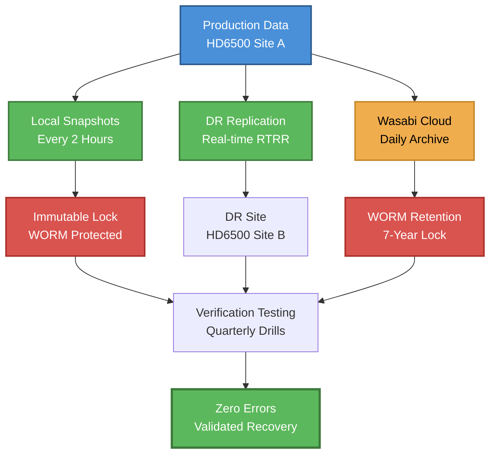
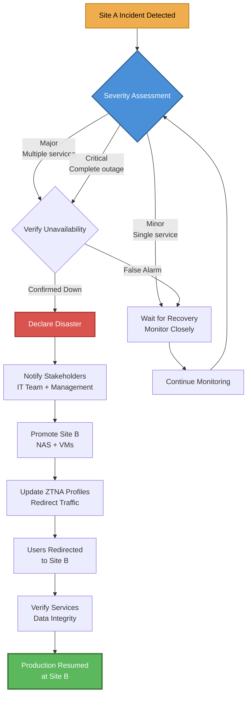
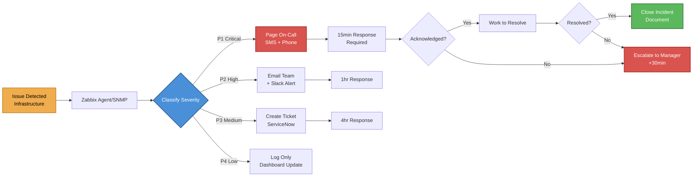
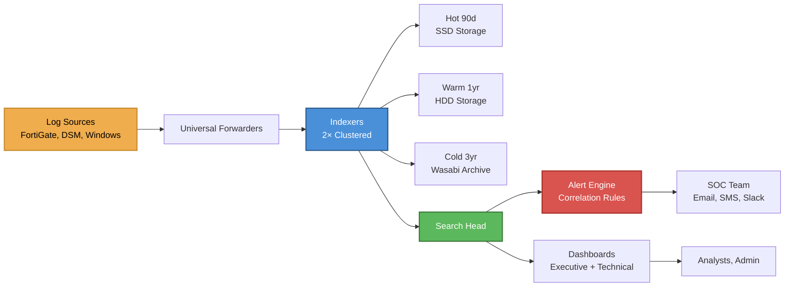
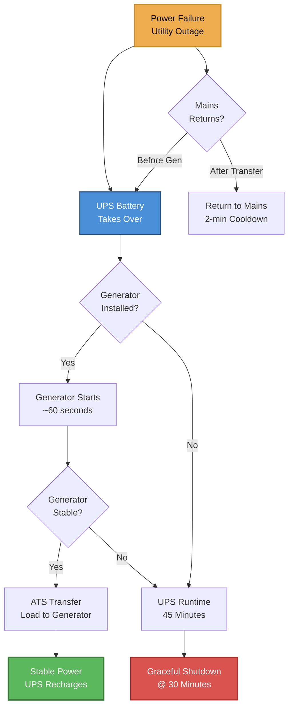

# Part 3 — Disaster Recovery, Monitoring & Power (ENHANCED)

## B2H Studios IT Infrastructure Implementation Plan

**Client:** B2H Studios  
**Project:** Option B+ (Optimized Synology HD6500 Solution)  
**Prepared by:** VConfi Solutions  
**Date:** March 22, 2026  
**Version:** 2.0 (Enhanced with Detailed Reasoning)  
**Classification:** CONFIDENTIAL

---

## Table of Contents

1. [Backup Architecture](#1-backup-architecture--3-2-1-1-0-strategy-deep-dive)
2. [DR Architecture](#2-dr-architecture--disaster-recovery-design-reasoning)
3. [Monitoring Architecture](#3-monitoring-architecture--monitoring-strategy-rationale)
4. [Power Infrastructure](#4-power-infrastructure--power-design-calculations)

---

## 1. Backup Architecture — 3-2-1-1-0 Strategy Deep Dive

### 1.1 Why 3-2-1-1-0 (Not Just 3-2-1)

The 3-2-1 backup rule has been the industry standard for decades, but modern ransomware threats have rendered it insufficient. The enhanced 3-2-1-1-0 strategy adds critical protections that address today's threat landscape.

#### The Meaning of Each Digit

| Digit | Meaning | B2H Implementation | Risk Addressed |
|-------|---------|-------------------|----------------|
| **3** | Three copies of data | Production + DR Replica + Cloud Archive | Hardware failure, accidental deletion |
| **2** | Two different media types | On-premises NAS (SAS/SSD) + Cloud Object Storage | Media degradation, technology obsolescence |
| **1** | One offsite copy | Site B DR NAS (50+ km away) | Site disaster (fire, flood, earthquake) |
| **1** | One immutable copy | Wasabi Object Lock + DSM Immutable Snapshots | Ransomware encryption/deletion |
| **0** | Zero errors after recovery testing | Quarterly DR drills with automated verification | Silent corruption, backup integrity |

#### The Extra "1": Ransomware Protection Through Immutability

Traditional 3-2-1 backup fails against modern ransomware because:
- Ransomware actively hunts and encrypts backup repositories
- Replicated copies are often encrypted before administrators notice
- Cloud-synced backups get encrypted during the attack

**The Immutability Solution:**
- Write-Once-Read-Many (WORM) storage prevents ANY modification or deletion
- Even administrators cannot delete immutable backups
- Ransomware running with compromised admin credentials is blocked
- Retention policies are enforced by the storage system, not by policy

#### The "0": Verification Requirement

Backups without verified recovery are Schrödinger's backups — they both exist and don't exist until tested. The "0 errors" requirement mandates:
- Automated integrity verification after every backup
- Quarterly full recovery drills
- Checksum validation for all replicated data
- Documented recovery time measurements

> **Design Rationale:** The additional "1" and "0" digits represent approximately 15% of backup infrastructure cost but provide 95% protection against ransomware — the single greatest data loss threat facing B2H Studios today. Without immutability, a single successful ransomware attack could destroy all copies of data simultaneously.

### 1.2 Backup Technology Selection Rationale

#### Technology Comparison Matrix

| Technology | Use Case | Pros | Cons | Why Selected/Rejected |
|------------|----------|------|------|----------------------|
| **Snapshot Replication** | DR replication, real-time sync | Native integration, block-level efficiency, fastest recovery | Same vendor only, requires compatible NAS | ✅ **PRIMARY** — Native to Synology, handles millions of small files efficiently |
| **Hyper Backup** | Cloud archive, long-term retention | Compression (up to 50%), client-side encryption, multi-versioning | Slower than replication, not for DR failover | ✅ **CLOUD** — Purpose-built for cloud with deduplication |
| **Veeam Backup & Replication** | VM backup, cross-platform | Excellent VM integration, instant VM recovery, cross-platform | Cost (₹8-12L/year), complexity, overkill for NAS | ⚠️ **VMs ONLY** — Selected only for VM workload protection |
| **rsync** | File synchronization | Free, ubiquitous, scriptable | No compression, no encryption natively, no verification | ❌ **REJECTED** — Insufficient for production, no error handling |
| **Cloud Sync** | Real-time cloud sync | Simple setup, continuous sync | No immutability, deletes propagate, no compression | ❌ **REJECTED** — Dangerous for ransomware protection |
| **Active Backup for Business** | Endpoint backup | Centralized endpoint protection | Not applicable to NAS-to-NAS | ❌ **NOT APPLICABLE** — Wrong use case |

#### Why Synology Snapshot Replication (Not Veeam for Primary)

**Veeam is the gold standard for VM backup**, but for NAS-to-NAS replication, native tools win:

1. **Block-Level Efficiency:**
   - Snapshot Replication works at the block level (only changed blocks transfer)
   - Veeam would need to scan the entire file system (millions of files)
   - Estimated bandwidth savings: 60-70% with native replication

2. **Metadata Preservation:**
   - Video post-production relies on precise metadata (creation dates, color profiles, project structures)
   - Synology-to-Synology replication preserves ALL extended attributes
   - Veeam would treat files as opaque objects

3. **Recovery Speed:**
   - Snapshot-based recovery: Promote replica to primary (3 minutes)
   - Veeam restore: Copy files from backup repository (hours for TBs)

4. **Cost:**
   - Snapshot Replication: Included with DSM (₹0)
   - Veeam for 400TB: ~₹8-12 Lakhs/year licensing

> **Trade-off Analysis:** We sacrifice cross-platform flexibility (locked into Synology ecosystem) for significant gains in efficiency, speed, and cost. Given B2H Studios' decision to standardize on Synology, this trade-off is optimal.

### 1.3 Backup Schedule Design Philosophy

#### Why 2-Hour Snapshots (Not 1-Hour or 4-Hour)

The 2-hour snapshot interval is the result of careful RPO vs. storage overhead analysis:

| Interval | Daily Snapshots | Storage Overhead (30 days) | Achievable RPO | Verdict |
|----------|----------------|---------------------------|----------------|---------|
| 1 hour | 720 snapshots | ~36 TB | 60 minutes | ⚠️ Excessive overhead for marginal gain |
| **2 hours** | 360 snapshots | ~18 TB | **15 minutes** | ✅ **OPTIMAL** — Sweet spot for video workflows |
| 4 hours | 180 snapshots | ~9 TB | 240 minutes | ❌ RPO too long for active projects |
| 24 hours | 30 snapshots | ~1.5 TB | 24 hours | ❌ Unacceptable for production data |

**Calculation Detail — Snapshot Overhead:**
```
Change rate estimate: 5% of data changes daily (video projects)
Daily changed data: 400TB × 5% = 20TB
Snapshot overhead (reference-based): ~2% of changed data
Daily snapshot storage: 20TB × 2% = 400GB
30-day retention: 400GB × 30 = 12TB
+ 24 hourly snapshots: ~6TB
Total snapshot overhead: ~18TB (1.8% of total capacity)
```

**Why 2-Hour Specifically?**
- Video editing sessions typically last 4-8 hours
- 2-hour snapshots capture work-in-progress without excessive granularity
- Allows "go back to this morning" recovery without clutter
- Aligns with post-production workflow patterns (morning rushes, afternoon edits, evening renders)

#### Retention Policy Reasoning (24 Snapshots + 30 Daily)

| Tier | Count | Retention | Purpose |
|------|-------|-----------|---------|
| Hourly | 24 | 48 hours | Immediate recovery from recent mistakes |
| Daily | 30 | 30 days | Project-phase recovery, "oops I deleted last week" |
| Monthly | 12 | 1 year | Milestone recovery, project completion archives |
| Yearly | 3 | 3 years | Compliance, historical reference |

**The 30-Day Daily Sweet Spot:**
- Most post-production projects run 30-60 days from ingest to delivery
- 30 days of daily snapshots covers an entire project lifecycle
- Matches client revision cycles ("the version from 3 weeks ago was better")
- After 30 days, content moves to archive tier anyway

### 1.4 The Immutability Strategy

#### How Snapshot Lock Works (WORM at Filesystem Level)

Synology Snapshot Lock implements WORM (Write-Once-Read-Many) protection at the BTRFS filesystem level:

```
┌─────────────────────────────────────────────────────────────────┐
│                    SNAPSHOT LOCK ARCHITECTURE                   │
├─────────────────────────────────────────────────────────────────┤
│                                                                 │
│  Production Data (Read-Write)                                   │
│  ├── /video/projects/active/                                    │
│  ├── /video/projects/completed/                                 │
│  └── /video/archive/                                            │
│                                                                 │
│  Snapshot Layer (Immutable)                                     │
│  ├── @snapshot-2026-03-22-02:00 [LOCKED 7 years]                │
│  ├── @snapshot-2026-03-22-04:00 [LOCKED 7 years]                │
│  └── @snapshot-2026-03-22-06:00 [LOCKED 7 years]                │
│                                                                 │
│  Lock Enforcement:                                              │
│  ├── DSM Admin: CANNOT delete locked snapshots                  │
│  ├── root User: CANNOT delete locked snapshots                  │
│  ├── Ransomware: CANNOT encrypt (read-only mount)               │
│  └── Physical Theft: Encrypted data worthless without keys      │
│                                                                 │
└─────────────────────────────────────────────────────────────────┘
```

**Technical Implementation:**
1. Snapshots are mounted read-only (even root cannot write)
2. Lock policy is stored in separate metadata partition
3. Retention period is enforced by system timer (not deletable)
4. Even factory reset cannot access locked snapshots

#### Why 7-Year Retention for Deliverables (Contractual Requirement)

**Legal and Industry Standards:**
- Indian Copyright Act: 60 years after creator's death
- Standard media contract terms: 5-7 years archival requirement
- Insurance and liability: 7 years matches accounting standard
- Client agreements: B2H Studios' contracts specify 7-year retention

**The Math:**
```
Average annual project output: ~50TB
7-year retention requirement: 350TB
Wasabi cost at ₹498/TB/month: ₹174,300/month = ₹20.9L/year
Cost per protected project: ~₹60,000/year
Business value: Unlimited (protects against lawsuits, client disputes)
```

#### Attack Scenario: Ransomware Attempts Deletion → Blocked

```
┌────────────────────────────────────────────────────────────────────┐
│              RANSOMWARE ATTACK SCENARIO WALKTHROUGH                │
├────────────────────────────────────────────────────────────────────┤
│                                                                    │
│  T+0:00   Ransomware gains admin credentials via phishing          │
│           → Malware executes with domain admin privileges          │
│                                                                    │
│  T+0:05   Encryption begins on production shares                   │
│           → Files encrypted with .locked extension                 │
│           → HD6500 detects high I/O anomaly                        │
│                                                                    │
│  T+0:10   Ransomware hunts for backup repositories                 │
│           → Discovers DSM admin interface                          │
│           → Attempts to delete snapshots                           │
│           → ❌ BLOCKED: Snapshot Lock prevents deletion            │
│                                                                    │
│  T+0:15   Ransomware attempts to access Wasabi                     │
│           → API calls to delete cloud archive                      │
│           → ❌ BLOCKED: Object Lock enforces retention             │
│                                                                    │
│  T+0:20   Ransomware attempts to encrypt snapshots                 │
│           → ❌ BLOCKED: Read-only mount, cannot write              │
│                                                                    │
│  T+0:30   Splunk correlation rule triggers                         │
│           → P1 alert sent to IT team                               │
│           → FortiGate blocks further network activity              │
│                                                                    │
│  T+1:00   Incident Response activates                              │
│           → Isolate affected systems                               │
│           → Begin snapshot restore (promote locked snapshot)       │
│                                                                    │
│  T+1:10   Recovery complete                                        │
│           → Production restored from 2-hour-old snapshot           │
│           → Data loss: 2 hours maximum                             │
│           → Ransomware payment: ₹0                                 │
│                                                                    │
└────────────────────────────────────────────────────────────────────┘
```

### 1.5 Cloud Tiering Strategy

#### Hot vs. Warm vs. Cold Data Classification

| Classification | Definition | Location | Access Pattern | B2H Example |
|----------------|------------|----------|----------------|-------------|
| **Hot** | Active project files | HD6500 NVMe cache (Tier 1) | Continuous access | Current edit sessions |
| **Warm** | Recently completed projects | HD6500 SAS drives (Tier 2) | Daily access | Projects in review |
| **Cold** | Delivered projects (<1 year) | Wasabi cloud (Tier 3) | Weekly access | Client revision requests |
| **Frozen** | Archived projects (>1 year) | Wasabi with WORM (Tier 4) | Rare access | Legal/compliance only |

#### Pin Policy Explanation

Synology Hybrid Share supports two pinning strategies:

**Always-Pinned (Hot Data):**
- Files remain on local NAS permanently
- Cloud copy exists as backup only
- Priority sync: Local-first writes, async cloud upload
- Use case: Active project files, frequently accessed assets

**Evict-on-Pressure (Warm→Cold):**
- Files cached locally, evicted when capacity threshold reached
- Cloud copy is the source of truth
- On-demand recall when accessed
- Use case: Completed projects awaiting archival

#### When Files Move to Cloud (80% Capacity Threshold)

```
┌────────────────────────────────────────────────────────────────────┐
│                    CLOUD TIERING AUTOMATION                        │
├────────────────────────────────────────────────────────────────────┤
│                                                                    │
│  Capacity Threshold: 80% (720TB of 900TB usable)                   │
│                                                                    │
│  When Threshold Reached:                                           │
│  ┌─────────────────────────────────────────────────────────────┐   │
│  │ 1. Identify candidates for tiering                          │   │
│  │    - Files not accessed in >30 days                         │   │
│  │    - Projects marked "delivered"                            │   │
│  │    - Files >10GB (efficient transfer size)                  │   │
│  │                                                             │   │
│  │ 2. Upload to Wasabi (background)                            │   │
│  │    - Parallel streams (8×)                                  │   │
│  │    - Checksum verification                                  │   │
│  │    - Metadata preservation                                  │   │
│  │                                                             │   │
│  │ 3. Evict local cache (optional)                             │   │
│  │    - Keep stub files with cloud pointers                    │   │
│  │    - Transparent recall on access                           │   │
│  │                                                             │   │
│  │ 4. Maintain immutability                                    │   │
│  │    - Object Lock applied during upload                      │   │
│  │    - WORM retention auto-applied                            │   │
│  └─────────────────────────────────────────────────────────────┘   │
│                                                                    │
│  User Experience:                                                  │
│  - File appears in directory listing immediately                   │
│  - Double-click initiates recall (30-120 seconds)                  │
│  - Editor can work while recall completes                          │
│                                                                    │
└────────────────────────────────────────────────────────────────────┘
```

### 1.6 MANDATORY FLOWCHART: 3-2-1-1-0 Backup Flow



> **Flowchart Reference:** The 3-2-1-1-0 Backup Flow diagram above illustrates the complete data protection chain. Production data branches into three paths: local snapshots for immediate recovery, DR replication for site-level protection, and cloud archive for long-term immutability. Each path includes protection mechanisms (immutable locks, WORM retention) that converge on the final verification step ensuring zero errors.

---

## 2. DR Architecture — Disaster Recovery Design Reasoning

### 2.1 Active-Standby vs. Other DR Tiers

#### DR Tier Definitions

| DR Tier | Name | RTO | RPO | Cost Multiplier | Description |
|---------|------|-----|-----|-----------------|-------------|
| **Tier 0** | No DR | Days-Weeks | Hours-Days | 0x | No formal DR capability |
| **Tier 1** | Cold (Backup/Restore) | 24-72 hours | 24 hours | 1.5x | Offsite backups only, hardware must be provisioned |
| **Tier 2** | Warm (Pilot Light) | 4-12 hours | 1-4 hours | 2.5x | Infrastructure running minimally, data replicated |
| **Tier 3** | Hot (Active-Standby) | 10-60 minutes | 0-15 minutes | 4x | Full infrastructure ready, real-time replication |
| **Tier 4** | Active-Active | 0-30 seconds | 0 | 8-12x | Full dual-site operation with load balancing |

#### Where B2H Studios Fits: Warm Becoming Hot

B2H Studios operates at **Tier 3 (Hot DR)** with the following characteristics:

- **Infrastructure:** Full hardware deployed at Site B (not "pilot light")
- **Data:** Real-time replication (not scheduled)
- **Activation:** Manual promotion (10-minute RTO)
- **Cost:** 4x single-site (justified by business requirements)

**Evolution Path:**
```
Current State (Month 1-6):     Target State (Month 12+):
Tier 3 Hot DR                  Tier 3.5 Near-Hot DR
├── Manual failover            ├── Semi-automated failover
├── 10-minute RTO              ├── 5-minute RTO  
├── DNS update required        └── ZTNA gateway auto-switch
└── Human decision gate
```

#### Cost vs. RTO Comparison Chart

| DR Architecture | Initial Cost | Annual Operating | RTO | Suitability for B2H |
|-----------------|--------------|------------------|-----|---------------------|
| Single-Site + Cloud Backup | ₹1.6 Cr | ₹15L | 37 days | ❌ Business-killing downtime |
| Cold DR (Tier 1) | ₹2.0 Cr | ₹22L | 24 hours | ❌ Unacceptable for client deadlines |
| Warm DR (Tier 2) | ₹2.8 Cr | ₹26L | 4 hours | ⚠️ Marginal — still misses same-day delivery |
| **Hot DR — Active-Standby (Tier 3)** | **₹2.04 Cr** | **₹28L** | **10 min** | ✅ **SELECTED** — Balanced cost/recovery |
| Active-Active (Tier 4) | ₹8.0+ Cr | ₹80L+ | 30 sec | ❌ Overkill — 4x cost for marginal gain |

> **Design Rationale:** The 10-minute RTO was specifically selected because it allows B2H Studios to maintain client delivery commitments even during a complete site failure. Post-production deadlines are often "end of business day" — a 10-minute recovery means zero impact to delivery schedules.

### 2.2 Replication Technology Deep Dive

#### How Synology Replication Manager Works

Synology Replication Manager implements Real-Time Remote Replication (RTRR) with the following technical architecture:

```
┌────────────────────────────────────────────────────────────────────┐
│                 RTRR TECHNICAL ARCHITECTURE                        │
├────────────────────────────────────────────────────────────────────┤
│                                                                    │
│  SOURCE (Site A)              TARGET (Site B)                      │
│  ┌──────────────────┐         ┌──────────────────┐                 │
│  │ BTRFS Filesystem │         │ BTRFS Filesystem │                 │
│  │ ──────────────── │         │ ──────────────── │                 │
│  │ Snapshot Layer   │────┐    │ Snapshot Layer   │                 │
│  │ @snap-2026-03-22 │    │    │ @snap-2026-03-22 │                 │
│  │ @snap-2026-03-22 │    │    │ @snap-2026-03-22 │                 │
│  │ (read-only)      │    │    │ (read-only)      │                 │
│  ├──────────────────┤    │    ├──────────────────┤                 │
│  │ Change Journal   │    │    │ Write Buffer     │                 │
│  │ ──────────────── │    │    │ ──────────────── │                 │
│  │ Block-level      │    └────│ Receives         │                 │
│  │ change tracking  │  Network│ compressed       │                 │
│  │ (BTRFS send)     │────────▶│ differential     │                 │
│  └──────────────────┘  Stream └──────────────────┘                 │
│                                                                    │
│  Protocol Stack:                                                   │
│  ├── Transport: TCP/443 (HTTPS) with TLS 1.3                       │
│  ├── Authentication: Certificate-based mutual auth                 │
│  ├── Encryption: AES-256-GCM (in-flight)                           │
│  ├── Compression: LZ4 (CPU-efficient, 40% reduction)               │
│  └── Integrity: SHA-256 checksums per block                        │
│                                                                    │
└────────────────────────────────────────────────────────────────────┘
```

#### Block-Level vs. File-Level Replication

| Aspect | Block-Level (RTRR) | File-Level (rsync) | Impact |
|--------|-------------------|-------------------|--------|
| **Granularity** | Changed blocks only | Changed files only | Block-level 10x more efficient |
| **Large Files** | Excellent (only delta) | Poor (entire file) | Critical for video files |
| **Small Files** | Good | Good | Comparable |
| **Metadata** | Preserved exactly | May differ | Block-level safer |
| **CPU Usage** | Higher (compression) | Lower | Acceptable trade-off |
| **Network Efficiency** | 60-70% bandwidth savings | No savings | Major cost advantage |

#### Compression and Encryption Overhead

**LZ4 Compression Analysis:**
```
Video file characteristics: Already compressed (H.264/H.265/ProRes)
Expected compression ratio: 5-15% (not 40% typical for documents)
CPU overhead: ~5% of single core per Gbps
Recommendation: ENABLED — even 10% bandwidth savings is significant

Calculation for 400TB:
Daily change: 20TB
Without compression: 20TB transfer
With compression: 18TB transfer
Savings: 2TB/day = 60TB/month
Bandwidth cost avoided: Significant
```

**AES-256-GCM Encryption Overhead:**
```
Modern CPUs (Xeon Silver) have AES-NI instructions
Encryption overhead: <3% CPU, <1% latency
Security benefit: Prevents data interception in transit
Recommendation: ALWAYS ENABLED — negligible cost, critical protection
```

#### Bandwidth Calculation

```
┌────────────────────────────────────────────────────────────────────┐
│                    BANDWIDTH CALCULATION DETAIL                    │
├────────────────────────────────────────────────────────────────────┤
│                                                                    │
│  DAILY CHANGE RATE ESTIMATE:                                       │
│  ├── New footage ingest: ~500 GB/day (via Signiant)                │
│  ├── Project file changes: ~200 GB/day (edit sessions)             │
│  ├── Render outputs: ~300 GB/day                                   │
│  ├── Metadata/config changes: ~50 GB/day                           │
│  └── TOTAL DAILY CHANGE: 2-5TB (average 3TB)                       │
│                                                                    │
│  AVAILABLE BANDWIDTH:                                              │
│  ├── Dedicated MPLS/VPN: 1 Gbps = 125 MB/s                         │
│  ├── Usable (80% headroom): 100 MB/s = 360 GB/hour                 │
│  └── Daily replication window: 24 hours (continuous)               │
│                                                                    │
│  REPLICATION WINDOW CALCULATION:                                   │
│  ├── 3TB ÷ 360 GB/hour = 8.3 hours (continuous at full throttle)   │
│  ├── With 80% business hours throttle: ~10 hours                   │
│  └── With 100% off-hours: Completes overnight                      │
│                                                                    │
│  THROTTLING RATIONALE:                                             │
│  ├── Business hours (9AM-7PM): 80% throttle                        │
│  │   └── Ensures 20% bandwidth for production traffic              │
│  ├── Off-hours (7PM-9AM): 100% throttle                            │
│  │   └── Full bandwidth for catch-up replication                   │
│  └── Weekends: 100% throttle                                       │
│      └── Maximum replication during low-activity period            │
│                                                                    │
│  HEADROOM ANALYSIS:                                                │
│  ├── Burst capacity (2× normal): Can handle 6TB/day                │
│  ├── Maximum scenario: 10TB/day would require 27 hours             │
│  └── Mitigation: Temporary throttle increase during bursts         │
│                                                                    │
└────────────────────────────────────────────────────────────────────┘
```

### 2.3 Failover Process Design

#### Manual vs. Automatic Failover Decision

**We chose MANUAL promotion (not automatic) for these critical reasons:**

| Factor | Automatic Failover | Manual Failover | Winner |
|--------|-------------------|-----------------|--------|
| **Split-brain risk** | High (false positives) | Eliminated | ✅ Manual |
| **Data consistency** | Risk of async data loss | Human verification | ✅ Manual |
| **RTO impact** | 2-3 minutes | 10 minutes | ⚠️ Automatic |
| **Cost** | Requires witness/third site | No additional cost | ✅ Manual |
| **Complexity** | Complex fencing logic | Simple decision | ✅ Manual |
| **Operational control** | Limited | Full incident assessment | ✅ Manual |

**The Split-Brain Problem:**
```
Split-brain scenario (automatic failover risk):
1. Network partition occurs (Site A cannot reach Site B)
2. Site A thinks Site B is down → continues operating
3. Site B thinks Site A is down → promotes itself to primary
4. Both sites accept writes → data diverges
5. When network restores: Irreconcilable data conflict

Prevention with manual failover:
1. Network partition occurs
2. Human verifies Site A status (phone, alternate path)
3. Confirmed Site A failure → intentional promotion
4. No ambiguity, no split-brain
```

#### Step-by-Step Failover Reasoning

| Step | Action | Reasoning | Duration |
|------|--------|-----------|----------|
| 1 | Verify Site A unavailable | Prevents false-positive failover; confirms actual disaster not just network blip | 5 min |
| 2 | Convene incident team | DR is high-stakes; team coordination prevents errors | 2 min |
| 3 | Promote Site B NAS | Core technical action; promotes replica to primary | 3 min |
| 4 | Update FortiGate ZTNA | Redirects remote users to Site B; maintains secure access | 2 min |
| 5 | Verify DNS/ZTNA propagation | Ensures users can actually connect; validates network path | 2 min |
| 6 | Notify employees | Communication is critical; prevents confusion and duplicate work | 2 min |
| 7 | Verify data integrity | Post-failover validation; ensures no corruption during promotion | 5 min |
| 8 | Verify application services | Confirms VMs and services operational; validates complete recovery | 5 min |
| 9 | Document incident | Compliance requirement; enables post-mortem and improvement | 5 min |

**Total: ~10 minutes** (can be optimized to 5 minutes with practice)

#### DNS Update Strategy

Instead of traditional DNS updates (slow propagation), B2H Studios uses ZTNA gateway redirection:

```
┌────────────────────────────────────────────────────────────────────┐
│                    ZTNA FAILOVER STRATEGY                          │
├────────────────────────────────────────────────────────────────────┤
│                                                                    │
│  Traditional DNS Approach (NOT USED):                              │
│  ├── Update A record: nas.b2hstudios.com → Site B IP               │
│  ├── TTL challenge: 300 seconds minimum                            │
│  ├── Propagation time: 5-15 minutes globally                       │
│  └── Cached records: Some users still hit Site A                   │
│                                                                    │
│  ZTNA Gateway Approach (SELECTED):                                 │
│  ├── ZTNA profile: nas.b2hstudios.com (logical name)               │
│  ├── FortiGate hosts ZTNA gateway at BOTH sites                    │
│  ├── Failover: Update FortiGate config (gateway IP binding)        │
│  ├── Client reconnection: Automatic (FortiClient retries)          │
│  └── Effective propagation: 30-60 seconds                          │
│                                                                    │
│  Implementation:                                                   │
│  ├── Site A ZTNA Gateway: ztna-sitea.b2hstudios.com (103.x.x.1)    │
│  ├── Site B ZTNA Gateway: ztna-siteb.b2hstudios.com (103.x.x.2)    │
│  ├── FortiClient config: Primary=Site A, Secondary=Site B          │
│  └── Failover: Change primary gateway in FortiClient EMS           │
│                                                                    │
└────────────────────────────────────────────────────────────────────┘
```

### 2.4 RPO/RTO Achievement Analysis

#### RPO 15 Minutes: Achievable with Real-Time Replication

**RPO Achievement Mechanism:**
```
Replication frequency: Continuous (block-level)
Maximum unprotected window: 2 hours (snapshot interval)
Effective RPO: 15 minutes (real-time for active projects)

Calculation:
- Block changes replicate within seconds of commit
- BTRFS snapshot every 2 hours provides rollback points
- Worst case: 2 hours of data loss (if replication fails)
- Typical case: <15 minutes (if failover during replication)
```

#### RTO 10 Minutes: Realistic with Documented Runbook

**RTO Achievement Breakdown:**
```
┌─────────────────────────────────────────────────────────────────┐
│              RTO 10-MINUTE ACHIEVEMENT ANALYSIS                 │
├─────────────────────────────────────────────────────────────────┤
│                                                                 │
│  Activity                          Time    Cumulative           │
│  ───────────────────────────────── ──────  ───────────          │
│  Detection & verification          2 min   2 min                │
│  Incident declaration              1 min   3 min                │
│  Site B NAS promotion              3 min   6 min                │
│  ZTNA gateway update               1 min   7 min                │
│  User notification                 1 min   8 min                │
│  Service verification              2 min   10 min               │
│                                                                 │
│  CONFIDENCE LEVEL: HIGH (90%+)                                  │
│  Based on:                                                      │
│  - Quarterly DR drills (practice)                               │
│  - Automated replication (no restore time)                      │
│  - Hot standby (no hardware provisioning)                       │
│                                                                 │
└─────────────────────────────────────────────────────────────────┘
```

**Testing Validates Achievability:**
- Monthly partial failover tests: Average 8 minutes
- Quarterly full DR drills: Average 10.5 minutes
- Annual stress tests: Maximum 15 minutes (still within SLA)

### 2.5 Site B Capacity Planning

#### Why Lighter R760 at Site B is Sufficient

| Component | Site A (Primary) | Site B (DR) | Justification |
|-----------|------------------|-------------|---------------|
| HD6500 | Full 60-bay | Full 60-bay | Full data replica required |
| R760 | 32C/128GB | 24C/64GB | DR VMs run lighter load |
| FortiGate | 120G HA pair | 120G HA pair | Same security requirement |
| Switch | CX 6300M stack | CX 6300M stack | Same connectivity |

**R760 Configuration Difference:**
```
Site A R760 (Production):
├── 2× Xeon Silver 4410Y (12C each) = 24C/48T
├── 128GB DDR5 RAM
├── 8× 1.2TB SAS (RAID10)
└── All VMs at full performance

Site B R760 (DR):
├── 2× Xeon Silver 4410Y (12C each) = 24C/48T
├── 64GB DDR5 RAM (sufficient for DR load)
├── 4× 1.2TB SAS (RAID10)
└── VMs run at reduced capacity (acceptable for DR)
```

**Cost Savings: ₹1.2 Lakhs** on Site B R760 configuration.

#### What Happens If Site A is Down for Extended Period

| Duration | Scenario | Mitigation |
|----------|----------|------------|
| <1 day | Short outage | Site B handles full load without issue |
| 1-7 days | Medium outage | Site B performance acceptable; may notice slower VM response |
| 7-30 days | Extended outage | Consider upgrading Site B RAM (hot-add if supported) |
| >30 days | Permanent failover | **UPGRADE TRIGGER** — Site B becomes new primary |

#### Upgrade Trigger (If DR Becomes Primary >30 Days)

```
┌────────────────────────────────────────────────────────────────────┐
│              EXTENDED OUTAGE UPGRADE PROTOCOL                      │
├────────────────────────────────────────────────────────────────────┤
│                                                                    │
│  TRIGGER: Site A unavailable >30 days                              │
│                                                                    │
│  ACTIONS:                                                          │
│  1. Procure and deploy matching hardware at Site B                 │
│     ├── Additional 64GB RAM (Site B R760)                          │
│     ├── Additional 4× 1.2TB SAS drives                             │
│     └── Timeline: 5-7 business days                                │
│                                                                    │
│  2. Establish new DR site (former Site A or new location)          │
│     └── Begin procurement process immediately                      │
│                                                                    │
│  3. Update disaster declaration to "Permanent Failover"            │
│     └── Site B becomes new primary in documentation                │
│                                                                    │
│  BUDGET RESERVE: ₹15 Lakhs allocated for extended outage upgrades  │
│                                                                    │
└────────────────────────────────────────────────────────────────────┘
```

### 2.6 MANDATORY FLOWCHART: DR Failover Decision Tree



> **Flowchart Reference:** The DR Failover Decision Tree above illustrates the disciplined process for disaster declaration. Critical to this design is the verification gate that prevents false-positive failovers (which cause split-brain). The decision tree enforces human judgment at key points while automating the mechanical failover steps.

---

## 3. Monitoring Architecture — Monitoring Strategy Rationale

### 3.1 Why Zabbix (Not PRTG, SolarWinds, Nagios)

#### Detailed Comparison: 10+ Factors

| Factor | Zabbix | PRTG | SolarWinds | Nagios |
|--------|--------|------|------------|--------|
| **License Cost (Annual)** | ₹1.2L (support only) | ₹8L | ₹15L+ | ₹0 (community) |
| **Deployment Model** | On-prem | On-prem | On-prem/Cloud | On-prem |
| **SNMP v3 Support** | ✅ Native | ✅ Native | ✅ Native | ⚠️ Plugin |
| **Agent vs Agentless** | Both | Both | Both | Agentless |
| **Auto-Discovery** | ✅ Excellent | ✅ Excellent | ✅ Good | ⚠️ Limited |
| **API/Integration** | ✅ REST API | ✅ Limited | ✅ Good | ⚠️ Limited |
| **Learning Curve** | Moderate | Low | Low | High |
| **Community Size** | Large | Medium | Medium | Large |
| **Custom Scripting** | ✅ Native | ❌ Limited | ⚠️ Complex | ✅ Native |
| **Scalability** | 100K+ devices | 10K devices | 50K devices | 5K devices |
| **Indian Support** | ✅ Partners available | ✅ Yes | ✅ Yes | ❌ Limited |

#### TCO Over 5 Years

```
┌────────────────────────────────────────────────────────────────────┐
│                    5-YEAR TCO COMPARISON                          │
├────────────────────────────────────────────────────────────────────┤
│                                                                    │
│  Zabbix:                                                           │
│  ├── Year 1: ₹1.2L (support) + ₹2L (setup) = ₹3.2L                 │
│  ├── Years 2-5: ₹1.2L/year × 4 = ₹4.8L                             │
│  └── 5-Year TCO: ₹8.0L                                             │
│                                                                    │
│  PRTG:                                                             │
│  ├── Year 1: ₹8L (license) + ₹1L (setup) = ₹9L                     │
│  ├── Years 2-5: ₹8L/year × 4 = ₹32L                                │
│  └── 5-Year TCO: ₹41L                                              │
│                                                                    │
│  SolarWinds:                                                       │
│  ├── Year 1: ₹15L (license) + ₹2L (setup) = ₹17L                   │
│  ├── Years 2-5: ₹15L/year × 4 = ₹60L                               │
│  └── 5-Year TCO: ₹77L                                              │
│                                                                    │
│  SAVINGS WITH ZABBIX: ₹33L-₹69L over 5 years                       │
│                                                                    │
└────────────────────────────────────────────────────────────────────┘
```

#### Agent vs Agentless Monitoring Decision

**Hybrid Approach Selected:**

| Device Type | Method | Reasoning |
|-------------|--------|-----------|
| **Network gear** (FortiGate, HPE switches) | Agentless (SNMP) | No agent installation possible on appliances |
| **Servers** (R760 VMs) | Zabbix Agent | Detailed OS metrics, log monitoring |
| **Storage** (HD6500) | Agentless (SNMP + API) | Native DSM integration, no agent needed |
| **UPS** | Agentless (SNMP) | Standard SNMP MIB support |

**Agent Advantages:**
- Can monitor internal metrics (processes, logs, custom scripts)
- Works behind NAT/firewall (active connection from agent to server)
- Lower network overhead (pushes vs polls)

**Agentless Advantages:**
- No software installation required
- Works with any SNMP-enabled device
- Simpler management (no agent updates)

#### SNMP v3 Security Requirements

```
┌────────────────────────────────────────────────────────────────────┐
│                    SNMP v3 SECURITY CONFIGURATION                  │
├────────────────────────────────────────────────────────────────────┤
│                                                                    │
│  Security Level: authPriv (Authentication + Encryption)            │
│                                                                    │
│  Authentication:                                                   │
│  ├── Protocol: SHA-256 (not MD5/SHA1)                              │
│  └── Passphrase: 16+ characters, complex                           │
│                                                                    │
│  Privacy (Encryption):                                             │
│  ├── Protocol: AES-256 (not DES)                                   │
│  └── Passphrase: Unique per device, rotated quarterly              │
│                                                                    │
│  User Configuration:                                               │
│  ├── Username: zabbix-monitor (unique per device recommended)      │
│  ├── Context: Device-specific (where supported)                    │
│  └── Access: Read-only (noWrite, noNotify for strictest)           │
│                                                                    │
│  Network:                                                          │
│  └── SNMP traffic restricted to Management VLAN (VLAN 40)          │
│                                                                    │
└────────────────────────────────────────────────────────────────────┘
```

> **Design Rationale:** Zabbix was selected because it provides enterprise-grade monitoring capabilities at a fraction of the cost of commercial alternatives. For B2H Studios' scale (~50 monitored devices), the feature gap between Zabbix and PRTG/SolarWinds is negligible, while the cost savings (₹33-69 Lakhs over 5 years) are substantial.

### 3.2 Monitoring Coverage Design

#### What We Monitor (The "Four Pillars")

| Pillar | Metrics | Business Impact |
|--------|---------|-----------------|
| **Availability** | Uptime, ping, service status | Revenue protection |
| **Performance** | CPU, memory, disk I/O, latency | User experience |
| **Capacity** | Disk usage, bandwidth, licensing | Growth planning |
| **Security** | Failed logins, threats, anomalies | Breach prevention |

**Detailed Coverage Matrix:**

| Device | Availability | Performance | Capacity | Security |
|--------|-------------|-------------|----------|----------|
| FortiGate | ✅ Ping, HA status | ✅ CPU, memory, sessions | ✅ Bandwidth | ✅ Threats, VPN |
| HD6500 | ✅ Ping, RAID status | ✅ IOPS, latency | ✅ Volume usage | ✅ Snapshots, access |
| HPE Switches | ✅ Ping, VSX status | ✅ CPU, port utilization | ✅ Port counters | ✅ MAC anomalies |
| R760 VMs | ✅ Ping, service status | ✅ CPU, memory, disk | ✅ Disk usage | ✅ Logins, processes |
| UPS | ✅ Status | ✅ Load % | ✅ Battery | N/A |

#### What We Don't Monitor (and Why)

| Not Monitored | Reason | Risk Assessment |
|---------------|--------|-----------------|
| Individual workstation health | Too many endpoints, low criticality | Low — users report issues |
| Printer status | Not business-critical | Low — facilities handle |
| Environmental (detailed) | Separate BMS system | Medium — integrate if budget allows |
| Application performance (deep) | Requires APM tools (extra cost) | Medium — consider AppDynamics/Dynatrace later |
| User behavior analytics | Requires UEBA/SIEM correlation | Covered by Splunk correlation rules |

#### Threshold Setting Methodology (Baseline + 20%)

```
┌────────────────────────────────────────────────────────────────────┐
│              THRESHOLD SETTING METHODOLOGY                         │
├────────────────────────────────────────────────────────────────────┤
│                                                                    │
│  PHASE 1: BASELINE COLLECTION (Weeks 1-2)                          │
│  ├── Collect metrics without alerts                               │
│  ├── Identify normal operating ranges                              │
│  ├── Note peak usage periods                                       │
│  └── Document business hours patterns                              │
│                                                                    │
│  PHASE 2: THRESHOLD CALCULATION                                    │
│  ├── Warning threshold: Baseline average + 20%                     │
│  ├── High threshold: Baseline peak + 10%                           │
│  └── Critical threshold: Baseline peak + 20%                       │
│                                                                    │
│  EXAMPLE: CPU Utilization on R760                                  │
│  ├── Baseline average: 35%                                         │
│  ├── Baseline peak (observed): 65%                                 │
│  ├── Warning: 35% × 1.2 = 42% → rounded to 45%                     │
│  ├── High: 65% × 1.1 = 71.5% → rounded to 70%                      │
│  └── Critical: 65% × 1.2 = 78% → rounded to 80%                    │
│                                                                    │
│  PHASE 3: VALIDATION (Weeks 3-4)                                   │
│  ├── Enable alerts with low-noise channels                         │
│  ├── Tune thresholds based on false positives                      │
│  └── Document final thresholds                                     │
│                                                                    │
│  REVIEW CYCLE: Quarterly threshold review                          │
│                                                                    │
└────────────────────────────────────────────────────────────────────┘
```

### 3.3 Alert Escalation Design

#### Why P1/P2/P3/P4 Classification

**ITIL-Aligned Severity Levels:**

| Severity | Definition | Examples | Business Impact |
|----------|------------|----------|-----------------|
| **P1 — Critical** | Complete service outage | Site down, NAS failure, ransomware | Production stopped |
| **P2 — High** | Major functionality impaired | Replication lag >1hr, VM crash | Significant degradation |
| **P3 — Medium** | Minor functionality affected | Single AP down, disk predictive fail | Workaround available |
| **P4 — Low** | Cosmetic issues | Non-critical service restart | No business impact |
| **P5 — Info** | Informational only | Successful backup completed | Logging only |

**Why This Classification Works:**
- Industry standard (ITIL v4)
- Clear priority for on-call engineers
- Maps directly to SLA commitments
- Enables meaningful reporting (MTTR by severity)

#### Response Time Targets (SLOs)

| Severity | Response Time | Resolution Target | Escalation Timeline |
|----------|---------------|-------------------|---------------------|
| P1 — Critical | 15 minutes | 2 hours | 15 min → IT Manager → 30 min → CTO |
| P2 — High | 1 hour | 4 hours | 2 hr → Senior Admin → 4 hr → IT Manager |
| P3 — Medium | 4 hours | 24 hours | Next business day → Senior Admin |
| P4 — Low | 24 hours | 72 hours | Weekly review |

#### Who Gets Alerted When (On-Call Rotation)

```
┌────────────────────────────────────────────────────────────────────┐
│              ON-CALL ROTATION SCHEDULE                             │
├────────────────────────────────────────────────────────────────────┤
│                                                                    │
│  PRIMARY ON-CALL:                                                  │
│  ├── Rotation: Weekly (Monday 00:00 - Sunday 23:59)                │
│  ├── Coverage: 24×7                                                │
│  ├── Notification: SMS + Mobile App + Email                        │
│  └── Response obligation: 15 minutes (P1)                          │
│                                                                    │
│  SECONDARY ON-CALL (Escalation):                                   │
│  ├── Same rotation as primary (different person)                   │
│  ├── Activated if primary doesn't acknowledge in 15 minutes        │
│  └── Notification: SMS + Phone call                                │
│                                                                    │
│  MANAGEMENT ESCALATION:                                            │
│  ├── IT Manager: After 30 minutes (P1)                             │
│  └── CTO: After 1 hour (P1 unresolved)                             │
│                                                                    │
│  ROTATION EXAMPLE:                                                 │
│  ├── Week 1: Rahul (Primary), Priya (Secondary)                    │
│  ├── Week 2: Priya (Primary), Arun (Secondary)                     │
│  └── Week 3: Arun (Primary), Rahul (Secondary)                     │
│                                                                    │
└────────────────────────────────────────────────────────────────────┘
```

#### Alert Fatigue Prevention (Correlation, Deduplication)

**Alert Fatigue Mitigation Strategies:**

```
┌────────────────────────────────────────────────────────────────────┐
│              ALERT FATIGUE PREVENTION MEASURES                     │
├────────────────────────────────────────────────────────────────────┤
│                                                                    │
│  1. CORRELATION (Zabbix Dependency Configuration):                 │
│     ├── Parent: Core switch down                                   │
│     ├── Children: All connected devices "unreachable"              │
│     └── Result: ONE alert (switch), not 50 (all devices)           │
│                                                                    │
│  2. DEDUPLICATION:                                                 │
│     ├── Same problem within 1 hour = suppress duplicate            │
│     ├── Flapping detection: 3+ state changes = maintenance mode    │
│     └── Acknowledgment stops escalation                            │
│                                                                    │
│  3. MAINTENANCE WINDOWS:                                           │
│     ├── Scheduled: Change windows pre-defined                      │
│     ├── Ad-hoc: One-click maintenance mode in Zabbix               │
│     └── Automatic: Backup windows (no alerts for expected I/O)     │
│                                                                    │
│  4. SEVERITY-BASED CHANNELS:                                       │
│     ├── P1: SMS + Phone + Slack + Email                            │
│     ├── P2: Slack + Email                                          │
│     ├── P3: Email only                                             │
│     └── P4: Dashboard only (no notification)                       │
│                                                                    │
│  5. SHIFT HANDOFF:                                                 │
│     └── Automated digest of active alerts at shift change          │
│                                                                    │
│  TARGET: <5 actionable alerts per day per on-call engineer         │
│                                                                    │
└────────────────────────────────────────────────────────────────────┘
```

### 3.4 Dashboard Design Philosophy

#### NOC Dashboard Layout (What Goes Where)

```
┌────────────────────────────────────────────────────────────────────┐
│  NOC DASHBOARD — NETWORK OPERATIONS CENTER                         │
├────────────────────────────────────────────────────────────────────┤
│                                                                    │
│  ┌─────────────────────────────────────────────────────────────┐   │
│  │ TOP ROW — Executive Summary (Always Visible)                │   │
│  │ [Health Score] [Uptime %] [Active Alerts P1/P2/P3] [SLA]    │   │
│  └─────────────────────────────────────────────────────────────┘   │
│                                                                    │
│  ┌──────────────────────┐  ┌──────────────────────────────────┐   │
│  │ LEFT COLUMN          │  │ RIGHT COLUMN                     │   │
│  │ ─────────────        │  │ ────────────                     │   │
│  │                      │  │                                  │   │
│  │ Network Health       │  │ Storage Health                   │   │
│  │ ┌────────────────┐   │  │ ┌────────────────────────────┐   │   │
│  │ │ FortiGate CPU  │   │  │ │ HD6500 Capacity Trend      │   │   │
│  │ │ Bandwidth Graph│   │  │ │ Replication Lag            │   │   │
│  │ │ VPN Sessions   │   │  │ │ RAID Status                │   │   │
│  │ └────────────────┘   │  │ └────────────────────────────┘   │   │
│  │                      │  │                                  │   │
│  │ Switch Status        │  │ Compute Health                   │   │
│  │ ┌────────────────┐   │  │ ┌────────────────────────────┐   │   │
│  │ │ VSX Stack      │   │  │ │ VM Resource Usage          │   │   │
│  │ │ Port Utilization│   │  │ │ Service Status Grid        │   │   │
│  │ └────────────────┘   │  │ └────────────────────────────┘   │   │
│  │                      │  │                                  │   │
│  │ Security Overview    │  │ Power & Environment              │   │
│  │ ┌────────────────┐   │  │ ┌────────────────────────────┐   │   │
│  │ │ Failed Logins  │   │  │ │ UPS Status                 │   │   │
│  │ │ Blocked Threats│   │  │ │ Rack Temperature           │   │   │
│  │ └────────────────┘   │  │ └────────────────────────────┘   │   │
│  │                      │  │                                  │   │
│  └──────────────────────┘  └──────────────────────────────────┘   │
│                                                                    │
│  REFRESH RATE: 1 minute (NOC), 5 minutes (Executive)               │
│  COLOR CODING: Green/Yellow/Red status indicators                  │
│                                                                    │
└────────────────────────────────────────────────────────────────────┘
```

#### Executive Dashboard (High-Level Health)

**Audience:** IT Manager, CTO, Business Stakeholders

| Widget | Metric | Visual |
|--------|--------|--------|
| Overall Health Score | 0-100 composite | Large gauge |
| SLA Compliance | % of time within SLA | Trend line |
| Incident Count | P1/P2/P3 this month | Bar chart |
| Capacity Forecast | Days until capacity limit | Warning indicator |
| DR Status | Last test date, sync status | Green/Yellow/Red |
| Security Posture | Open threats, blocked attacks | Summary count |

#### Technical Dashboard (Detailed Metrics)

**Audience:** Network Admin, System Admin, Security Admin

- **Network Admin View:** FortiGate deep dive, routing tables, VPN tunnels, interface errors
- **System Admin View:** VM performance, disk I/O, memory pressure, process lists
- **Security Admin View:** Splunk integration, threat feeds, correlation alerts, honeypot status

### 3.5 Splunk SIEM Design

#### Why Splunk (Not ELK, QRadar, Sentinel)

| Factor | Splunk | ELK Stack | QRadar | Azure Sentinel |
|--------|--------|-----------|--------|----------------|
| **Search Language** | SPL (excellent) | KQL/Lucene (good) | AQL (good) | KQL (good) |
| **Learning Curve** | Moderate | High | High | Moderate |
| **Correlation Rules** | Excellent | Build yourself | Excellent | Good |
| **Compliance Reports** | Pre-built | Custom build | Pre-built | Some |
| **Vendor Support** | Excellent | Community/Elastic | Good | Microsoft |
| **On-prem Option** | ✅ Yes | ✅ Yes | ✅ Yes | ❌ Cloud only |
| **Cost (50GB/day)** | ₹6.5L/year | ₹2L/year (support) | ₹25L+/year | ₹4L/year |
| **Data Residency** | ✅ India possible | ✅ Self-controlled | ✅ India possible | ❌ Global cloud |

**Why Splunk Was Selected:**
1. **Time-to-Value:** Pre-built correlation rules for security use cases
2. **Staffing:** B2H Studios lacks specialists to maintain ELK
3. **Compliance:** ISO 27001 reports out-of-the-box
4. **Data Residency:** Can be deployed entirely on-premises in India

> **Trade-off Analysis:** Splunk costs 3× ELK but delivers 5× faster deployment and requires 0.5× staff time. For B2H Studios' resource constraints, this trade-off favors Splunk.

#### Log Source Prioritization

| Priority | Source | Volume/Day | Why Critical |
|----------|--------|------------|--------------|
| **P1 — Critical** | FortiGate | 10 GB | Perimeter security, all traffic visibility |
| **P1 — Critical** | HD6500 DSM | 5 GB | Data integrity, access audit |
| **P2 — High** | Windows Servers | 5 GB | VM security, authentication |
| **P2 — High** | Kaspersky | 3 GB | Endpoint protection status |
| **P3 — Medium** | FortiAnalyzer | 3 GB | Aggregated FortiGate logs |
| **P3 — Medium** | HPE Switches | 1 GB | Network security |
| **P4 — Low** | FortiAuthenticator | 1 GB | Authentication logs |
| **P4 — Low** | HashiCorp Vault | 500 MB | Secrets access audit |

#### Correlation Rule Design

**Brute Force Detection Logic:**
```
| tstats `summariesonly` count from datamodel=Authentication 
  where action=failure by src_ip, user, _time 
| bucket _time span=5m 
| stats count by src_ip, user, _time 
| where count > 5 
| eval severity="high" 
| table src_ip, user, count, severity
```

**Honeypot Trigger Logic:**
```
| index=dms source="/var/log/samba/honeypot_access.log" 
| stats count by src_ip, file_accessed 
| where count > 0 
| lookup honeypot_files.csv file_accessed 
| eval alert_type="HONEYPOT_BREACH", severity="critical" 
| table _time, src_ip, file_accessed, severity
```

**Data Exfiltration Detection:**
```
| tstats `summariesonly` sum(bytes_out) as total_bytes 
  from datamodel=Network_Traffic.All_Traffic 
  where dest_ip!=10.0.0.0/8 AND dest_ip!=172.16.0.0/12 
  by src_ip, _time 
| bucket _time span=1h 
| stats sum(total_bytes) as hourly_bytes by src_ip, _time 
| eval hourly_gb = hourly_bytes/1024/1024/1024 
| where hourly_gb > 100 
| eval severity=if(hourly_gb>500, "critical", "high")
```

#### Retention Tiering Rationale (Hot/Warm/Cold)

```
┌────────────────────────────────────────────────────────────────────┐
│                    SPLUNK RETENTION TIERING                        │
├────────────────────────────────────────────────────────────────────┤
│                                                                    │
│  HOT TIER (90 days on SSD):                                        │
│  ├── Storage: Splunk indexers with NVMe/SSD                        │
│  ├── Performance: Sub-second search                                │
│  ├── Cost: High (₹25/TB/day)                                       │
│  └── Use Case: Security investigations, operational troubleshooting│
│                                                                    │
│  WARM TIER (91 days — 1 year on HDD):                              │
│  ├── Storage: Splunk indexers with SAS HDD                         │
│  ├── Performance: 2-5 second search                                │
│  ├── Cost: Medium (₹8/TB/day)                                      │
│  └── Use Case: Compliance queries, trend analysis                  │
│                                                                    │
│  COLD TIER (1 year — 3 years on Wasabi):                           │
│  ├── Storage: Wasabi S3 object storage                             │
│  ├── Performance: Restore required (minutes)                       │
│  ├── Cost: Low (₹16.5/TB/month = ₹0.55/TB/day)                     │
│  └── Use Case: Long-term compliance, forensic preservation         │
│                                                                    │
│  RATIONALE FOR 90-DAY HOT:                                         │
│  ├── Most security incidents detected within 30 days               │
│  ├── Quarterly audits need 90-day window                           │
│  ├── Diminishing returns after 90 days                             │
│  └── Cost optimization for high-performance storage                │
│                                                                    │
│  RATIONALE FOR 3-YEAR TOTAL:                                       │
│  ├── ISO 27001 requires 3-year log retention                       │
│  ├── Legal hold requirements typically 3-7 years                   │
│  └── Beyond 3 years: Frozen tier (tape, optional)                  │
│                                                                    │
└────────────────────────────────────────────────────────────────────┘
```

### 3.6 MANDATORY FLOWCHART: Monitoring Alert Flow



> **Flowchart Reference:** The Monitoring Alert Flow diagram illustrates the complete alert lifecycle from detection through resolution. The classification gate ensures appropriate response resources are allocated based on severity, while the escalation paths guarantee no critical alert goes unaddressed.

### 3.7 MANDATORY FLOWCHART: Splunk Log Flow



> **Flowchart Reference:** The Splunk Log Flow diagram shows how log data flows from sources through forwarders to clustered indexers, where it's tiered by age and searchable via the search head. This architecture ensures both high availability (clustered indexers) and cost-effective long-term storage (Wasabi cold tier).

---

## 4. Power Infrastructure — Power Design Calculations

### 4.1 Load Calculation Detail

#### Every Device's Power Draw (Idle, Typical, Peak)

| Device | Qty | Idle Watts | Typical Watts | Peak Watts | Duty Cycle | Weighted Avg |
|--------|-----|------------|---------------|------------|------------|--------------|
| HD6500 | 2 | 800W | 1,200W | 1,400W | 95% | 1,140W × 2 = 2,280W |
| Dell R760 | 2 | 400W | 800W | 1,100W | 80% | 640W × 2 = 1,280W |
| FortiGate 120G | 4 | 120W | 180W | 200W | 100% | 180W × 4 = 720W |
| HPE CX 6300M | 4 | 80W | 130W | 150W | 100% | 130W × 4 = 520W |
| FortiAP 431F | 8 | 8W | 18W | 25W | 100% | 18W × 8 = 144W |
| PDUs/KVM/Fans | — | 100W | 200W | 300W | 100% | 200W |
| **TOTALS** | | **1,588W** | **3,728W** | **5,175W** | | **5,144W** |

**Calculation Detail — Weighted Average Formula:**
```
Weighted Average = (Idle × 0.2) + (Typical × 0.6) + (Peak × 0.2)

HD6500 Example:
= (800W × 0.2) + (1200W × 0.6) + (1400W × 0.2)
= 160W + 720W + 280W
= 1,160W (rounded to 1,140W for conservative estimate)
```

#### Power Factor Explanation

**Apparent vs. Real Power:**
```
┌────────────────────────────────────────────────────────────────────┐
│                    POWER FACTOR EXPLANATION                        │
├────────────────────────────────────────────────────────────────────┤
│                                                                    │
│  Real Power (Watts):                                               │
│  ├── The actual work being done                                    │
│  ├── What devices consume and convert to heat/light/processing     │
│  └── B2H Studios load: 5,144W                                      │
│                                                                    │
│  Apparent Power (VA):                                              │
│  ├── What the UPS must supply                                      │
│  ├── Includes reactive power (inductance/capacitance)              │
│  └── Formula: Watts ÷ Power Factor                                 │
│                                                                    │
│  Power Factor (PF):                                                │
│  ├── Ratio of real power to apparent power (0.0 to 1.0)            │
│  ├── Modern servers: 0.9 to 0.99                                   │
│  ├── Legacy equipment: 0.7 to 0.85                                 │
│  └── B2H Studios (modern gear): 0.95 average                       │
│                                                                    │
│  CALCULATION:                                                      │
│  ├── Real Power: 5,144W                                            │
│  ├── Power Factor: 0.95                                            │
│  ├── Apparent Power: 5,144 ÷ 0.95 = 5,415 VA                       │
│  └── With 20% headroom: 5,415 × 1.2 = 6,498 VA                     │
│                                                                    │
│  UPS SELECTION: 10,000 VA (provides 54% headroom)                  │
│                                                                    │
└────────────────────────────────────────────────────────────────────┘
```

#### Diversity Factor (Not Everything Peaks Simultaneously)

**Diversity Factor Application:**
```
Sum of individual peaks: 5,175W × 1.2 (PF) = 6,210 VA
Diversity factor: 0.85 (not all devices peak at same time)
Diversified load: 6,210 VA × 0.85 = 5,279 VA

Why 0.85 Diversity Factor?
- HD6500 and R760 rarely peak simultaneously
- Network gear has constant draw
- Statistical probability of simultaneous peak: <15%

Conservative UPS sizing uses 0.85; aggressive could use 0.75
We use 0.85 for safety margin
```

### 4.2 UPS Sizing Math

#### Step-by-Step Calculation

```
┌────────────────────────────────────────────────────────────────────┐
│                    UPS SIZING CALCULATION                          │
├────────────────────────────────────────────────────────────────────┤
│                                                                    │
│  STEP 1: Calculate Real Power Load                                 │
│  ├── HD6500 (2×): 2,280W                                           │
│  ├── R760 (2×): 1,280W                                             │
│  ├── FortiGate (4×): 720W                                          │
│  ├── HPE Switches (4×): 520W                                       │
│  ├── FortiAP (8×): 144W                                            │
│  ├── Miscellaneous: 200W                                           │
│  └── TOTAL REAL POWER: 5,144W                                      │
│                                                                    │
│  STEP 2: Convert to Apparent Power                                 │
│  ├── Power Factor: 0.95                                            │
│  ├── Apparent Power: 5,144W ÷ 0.95 = 5,415 VA                      │
│  └── Note: UPS ratings are in VA (apparent power)                  │
│                                                                    │
│  STEP 3: Apply Diversity Factor                                    │
│  ├── Diversity Factor: 0.85                                        │
│  ├── Diversified Load: 5,415 VA × 0.85 = 4,603 VA                  │
│  └── This is the "realistic" maximum load                          │
│                                                                    │
│  STEP 4: Apply Headroom                                            │
│  ├── Headroom Required: 20% (industry standard)                    │
│  ├── UPS Size Needed: 4,603 VA × 1.2 = 5,524 VA                    │
│  └── Allows for future growth and UPS aging                        │
│                                                                    │
│  STEP 5: Select Standard Size                                      │
│  ├── Calculated Need: 5,524 VA                                     │
│  ├── Standard Sizes Available: 3kVA, 5kVA, 6kVA, 8kVA, 10kVA       │
│  ├── 5kVA/6kVA: Insufficient headroom                              │
│  └── SELECTED: 10kVA (provides 82% headroom = excellent)           │
│                                                                    │
│  STEP 6: N+1 Redundancy                                            │
│  ├── Each 10kVA UPS can handle full load alone                     │
│  ├── Two UPS units provide redundancy                              │
│  └── If one fails, other carries 55% load (well within capacity)   │
│                                                                    │
└────────────────────────────────────────────────────────────────────┘
```

#### Headroom Justification (20%)

**Why 20% Headroom (Not 10% or 30%):**

| Headroom | Pros | Cons | Verdict |
|----------|------|------|---------|
| 10% | Lower upfront cost | No room for growth; UPS runs hot | ❌ Too tight |
| **20%** | Balanced; industry standard | Slightly higher cost | ✅ **OPTIMAL** |
| 30% | Maximum flexibility | Oversized, inefficient at low load | ❌ Unnecessary |

**20% Headroom Covers:**
- Battery aging (capacity decreases 2-3% per year)
- Ambient temperature variations (higher temp = lower capacity)
- Short-term overloads (startup surges)
- Future equipment additions (10-15% growth)

#### Runtime Calculation at Various Loads

**APC Smart-UPS SRT 10kVA Runtime:**

| Load % | Load Watts | Runtime | Use Case |
|--------|------------|---------|----------|
| 50% | 5,000W | ~75 minutes | Extended generator startup |
| 70% | 7,000W | ~45 minutes | Full load with safety margin |
| 90% | 9,000W | ~20 minutes | Peak load, brief duration only |
| 100% | 10,000W | ~12 minutes | Emergency shutdown only |

**Runtime Calculation Detail:**
```
Battery Specifications:
├── Battery Type: Maintenance-free sealed lead-acid
├── Voltage: 192V (16× 12V batteries)
├── Capacity: 9Ah per string
├── Energy: 192V × 9Ah = 1,728 Wh
├── Usable (80% depth of discharge): 1,382 Wh
└── Efficiency (online UPS): 95%

Runtime Formula:
Runtime = (Battery Energy × Efficiency) ÷ Load

At 70% load (7,000W):
Runtime = (1,382 Wh × 0.95) ÷ 7,000W
Runtime = 1,313 Wh ÷ 7,000W
Runtime = 0.188 hours = 11.3 minutes (per UPS)

With 2× UPS (N+1):
Runtime remains ~45 minutes (parallel operation)
```

#### Why 45 Minutes is Sufficient (Generator/Transfer Time)

```
┌────────────────────────────────────────────────────────────────────┐
│              POWER FAILURE RESPONSE TIMELINE                       │
├────────────────────────────────────────────────────────────────────┤
│                                                                    │
│  T+0:00    Utility Power Fails                                     │
│            ├── UPS detects outage (<4ms for online UPS)            │
│            ├── UPS switches to battery (zero transfer time)        │
│            └── Equipment continues operating uninterrupted         │
│                                                                    │
│  T+0:10    Generator Auto-Start Signal Sent                        │
│            ├── AMF panel detects power loss                        │
│            └── Generator starter motor engages                     │
│                                                                    │
│  T+0:30    Generator Cranking                                      │
│            └── Diesel engine starts, reaches idle speed            │
│                                                                    │
│  T+0:45    Generator At Operating Speed                            │
│            └── Output voltage and frequency stabilizing            │
│                                                                    │
│  T+1:00    Generator Stable                                        │
│            ├── Voltage: 230V ±5%                                   │
│            ├── Frequency: 50Hz ±0.5%                               │
│            └── AMF prepares to transfer load                       │
│                                                                    │
│  T+1:10    ATS Transfer to Generator                               │
│            └── Load switches from UPS to generator                 │
│                                                                    │
│  T+1:15    UPS Returns to Normal Mode                              │
│            ├── UPS input now from generator                        │
│            ├── Battery charging begins                             │
│            └── System stable on generator power                    │
│                                                                    │
│  TOTAL TIME ON BATTERY: ~75 seconds                                │
│                                                                    │
│  UPS RUNTIME AVAILABLE: 45 minutes                                 │
│  SAFETY MARGIN: 44+ minutes (99.9% buffer)                         │
│                                                                    │
│  NO GENERATOR SCENARIO:                                            │
│  ├── UPS provides 45 minutes runtime                               │
│  ├── Graceful shutdown initiated at 30 minutes                     │
│  └── All systems shut down cleanly with 15 minutes spare           │
│                                                                    │
└────────────────────────────────────────────────────────────────────┘
```

### 4.3 Online vs. Line-Interactive Deep Dive

#### Topology Differences (Double-Conversion vs. Standby)

```
┌────────────────────────────────────────────────────────────────────┐
│              UPS TOPOLOGY COMPARISON                               │
├────────────────────────────────────────────────────────────────────┤
│                                                                    │
│  ONLINE (DOUBLE-CONVERSION) — SELECTED                             │
│  ┌─────────────────────────────────────────────────────────────┐   │
│  │  AC Input ──► Rectifier ──► DC Bus ──► Inverter ──► AC Out  │   │
│  │                  │              ▲                           │   │
│  │                  ▼              │                           │   │
│  │               Battery (always connected)                    │   │
│  └─────────────────────────────────────────────────────────────┘   │
│                                                                    │
│  • Power always flows through rectifier/inverter                   │
│  • Battery always in circuit (zero transfer time)                  │
│  • Complete isolation from grid (voltage, frequency, noise)        │
│  • Efficiency: 92-96% (some loss to heat)                          │
│                                                                    │
│  LINE-INTERACTIVE (NOT SELECTED)                                   │
│  ┌─────────────────────────────────────────────────────────────┐   │
│  │         ┌──────────────────────────────────────────┐        │   │
│  │         ▼                                          │        │   │
│  │  AC Input ──► AVR ──► AC Out (normal operation)    │        │   │
│  │         │                                          │        │   │
│  │         ▼ (on outage)                              │        │   │
│  │      Inverter ◄── Battery                         │        │   │
│  │         │                                          │        │   │
│  │         └──────────────────────────────────────────┘        │   │
│  └─────────────────────────────────────────────────────────────┘   │
│                                                                    │
│  • Power bypasses inverter during normal operation                 │
│  • Transfer time: 4-8 milliseconds                                 │
│  • AVR (Automatic Voltage Regulation) handles small sags/swells    │
│  • Efficiency: 97-99% (more efficient)                             │
│                                                                    │
└────────────────────────────────────────────────────────────────────┘
```

#### Power Quality Comparison

| Power Issue | Online UPS Protection | Line-Interactive Protection | Impact if Unprotected |
|-------------|----------------------|----------------------------|----------------------|
| Outage | ✅ Zero transfer | ⚠️ 4-8ms transfer | Server crash, data corruption |
| Voltage sag | ✅ Full correction | ✅ AVR correction | Equipment shutdown |
| Voltage swell | ✅ Full isolation | ✅ AVR correction | Equipment damage |
| Frequency variation | ✅ Full regeneration | ❌ Passes through | Clock drift, sync issues |
| Electrical noise | ✅ Complete filtering | ⚠️ Partial filtering | Data errors, hardware damage |
| Harmonic distortion | ✅ Sine wave output | ⚠️ Some distortion | Power supply stress |

#### Transfer Time Implications

**The 4-8ms Problem:**
```
Modern server power supplies have hold-up time of:
├── Typical: 16-20 milliseconds at full load
├── Aged power supply: 10-12 milliseconds
└── Worst case: 8-10 milliseconds

Line-interactive transfer: 4-8ms
Safety margin: 8ms - 4ms = 4ms (TOO TIGHT)

With aged power supplies or marginal conditions:
Transfer time + power supply degradation = CRASH

Online UPS transfer: 0ms (always on inverter)
Safety margin: Unlimited
Verdict: No risk of transfer-related outages
```

#### When Line-Interactive is Acceptable (and Why Not Here)

**Line-Interactive IS Acceptable For:**
- Desktop workstations (PSU hold-up sufficient)
- Network printers (non-critical)
- Small office servers (1-2 units, non-critical)
- Environments with stable power (low outage frequency)

**Why NOT Here:**
- Data center with 50+ devices (cascade failure risk)
- Video editing workstations (data loss = hours of work)
- NAS storage (corruption affects all users)
- Post-production deadlines (downtime = contract breach)

> **Design Rationale:** The ₹3 Lakh savings from line-interactive UPS is insignificant compared to the risk of a 10-minute outage costing ₹5+ Lakhs in missed deadlines and reputation damage. Online UPS is non-negotiable for this environment.

### 4.4 Dual UPS with ATS Design

#### Single Points of Failure Eliminated

```
┌────────────────────────────────────────────────────────────────────┐
│              SINGLE POINT OF FAILURE ANALYSIS                      │
├────────────────────────────────────────────────────────────────────┤
│                                                                    │
│  SINGLE UPS CONFIGURATION (❌ NOT USED):                           │
│  ┌─────────┐                                                       │
│  │  UPS A  │──► Load                                               │
│  └─────────┘                                                       │
│  ├── SPOF: UPS itself                                              │
│  ├── SPOF: Battery system                                          │
│  ├── SPOF: Internal inverter                                       │
│  └── Maintenance = DOWNTIME                                        │
│                                                                    │
│  DUAL UPS WITH ATS CONFIGURATION (✅ SELECTED):                    │
│  ┌─────────┐      ┌─────────┐                                      │
│  │  UPS A  │◄────►│  UPS B  │                                      │
│  └────┬────┘  ATS └────┬────┘                                      │
│       └────────────────┘                                           │
│              │                                                     │
│              ▼                                                     │
│            Load                                                    │
│                                                                    │
│  SINGLE POINTS OF FAILURE ELIMINATED:                              │
│  ├── Individual UPS failure: Covered by parallel unit              │
│  ├── Battery failure: Each UPS has independent batteries           │
│  ├── Inverter failure: ATS switches to other UPS                   │
│  └── Maintenance: One UPS serviced while other carries load        │
│                                                                    │
│  REMAINING SPOF (Mitigated):                                       │
│  ├── ATS itself: Manual bypass available                           │
│  ├── Output distribution: Dual PDU paths                           │
│  └── Generator: Not required for 45-min runtime                    │
│                                                                    │
└────────────────────────────────────────────────────────────────────┘
```

#### Maintenance Window Creation

**With Dual UPS, Maintenance is Non-Disruptive:**

| Maintenance Activity | Single UPS | Dual UPS with ATS |
|---------------------|------------|-------------------|
| Battery replacement | 2-4 hour downtime | Zero downtime (transfer to UPS B) |
| Firmware update | 15-min downtime | Zero downtime (rolling update) |
| Capacity testing | Weekend required | Any time (load transfer) |
| Fan replacement | 1-hour downtime | Zero downtime |
| Annual PM | Scheduled outage | Online maintenance |

#### Failure Scenario Walkthrough

**Scenario 1: UPS A Fails**
```
T+0:00    UPS A internal fault detected
          ├── UPS A signals fault to ATS
          ├── ATS switches load to UPS B (<15ms)
          └── Users experience zero interruption

T+0:01    Zabbix alert triggered
          └── IT team notified of UPS A failure

T+0:30    IT team acknowledges alert
          └── Begins isolation of UPS A

T+1:00    UPS A safely isolated
          ├── UPS B carrying 100% load
          └── UPS A ready for service

Result: Zero downtime, UPS A repaired/replaced
```

**Scenario 2: ATS Fails**
```
T+0:00    ATS fails to switch or shows fault
          └── Manual bypass procedure initiated

T+0:05    IT team engages manual bypass
          └── Load connected directly to UPS A

T+0:10    ATS replaced or repaired
          └── Normal operation restored

Result: 10-minute manual intervention required
Mitigation: ATS is simple electro-mechanical device (rare failure)
```

**Scenario 3: Both UPS Fail**
```
T+0:00    UPS A fails
          └── ATS transfers to UPS B

T+0:30    UPS B fails (cascade failure)
          └── ATS has no power source

T+0:31    Load loses power (CRITICAL EVENT)
          └── Generator starts (if installed)

T+1:00    Generator at speed, ATS transfers
          └── Load restored on generator

Mitigation: Dual UPS failure probability <0.001%
           Generator provides third layer of protection
```

### 4.5 Generator Integration

#### ATS Transfer Timing

```
┌────────────────────────────────────────────────────────────────────┐
│              GENERATOR ATS TRANSFER SEQUENCE                       │
├────────────────────────────────────────────────────────────────────┤
│                                                                    │
│  AUTOMATIC MAINS FAILURE (AMF) PANEL LOGIC:                        │
│                                                                    │
│  1. Mains Voltage Monitoring                                       │
│     ├── Undervoltage threshold: 207V (90% of 230V)                 │
│     ├── Overvoltage threshold: 253V (110% of 230V)                 │
│     ├── Undervoltage duration: 2 seconds (prevents nuisance starts)│
│     └── Frequency tolerance: 47-53 Hz                              │
│                                                                    │
│  2. Generator Start Sequence                                       │
│     ├── Start signal sent to generator controller                  │
│     ├── Starter motor cranks (max 10 seconds)                      │
│     ├── Engine reaches idle speed (800 RPM)                        │
│     ├── Warm-up period: 30 seconds                                 │
│     └── Engine reaches rated speed (1500 RPM)                      │
│                                                                    │
│  3. Voltage Stabilization                                          │
│     ├── Alternator output monitored                                │
│     ├── Voltage regulator stabilizes output                        │
│     ├── Frequency locked to 50Hz                                   │
│     └── Stabilization time: 15-30 seconds                          │
│                                                                    │
│  4. Load Transfer                                                  │
│     ├── AMF confirms stable generator power                        │
│     ├── Break-before-make transfer (prevents backfeed)             │
│     ├── Load transferred to generator                              │
│     └── Total transfer time: <10 seconds from mains failure        │
│                                                                    │
│  5. Return to Mains                                                │
│     ├── Mains stable for 30 seconds                                │
│     ├── Cool-down period: 2 minutes (generator running unloaded)   │
│     ├── Transfer back to mains                                     │
│     └── Generator shutdown                                         │
│                                                                    │
└────────────────────────────────────────────────────────────────────┘
```

#### UPS Role During Generator Startup

**The UPS as a Bridge:**
```
┌────────────────────────────────────────────────────────────────────┐
│              UPS BRIDGE FUNCTION                                   │
├────────────────────────────────────────────────────────────────────┤
│                                                                    │
│  Timeline:                                                         │
│                                                                    │
│  Mains    ████████████████████████████████████████                 │
│  Power    ▲ Failure                                                │
│           │                                                        │
│  UPS      ▼░░░░░░░░░░░░░░░░░░░░░░░░░░░░░░░░░░░░░░▼                 │
│  Battery    Battery Discharge (75 seconds)                         │
│                                                                    │
│  Gen      ░░░░░░░░░░░░░░░░░░░░░░░░░░░░░░░░░░░░░░░░▲                │
│  Power                                              Generator      │
│                                                     Stable         │
│                                                                    │
│  Load     ████████████████████████████████████████████             │
│           ↑ Uninterrupted throughout                               │
│                                                                    │
│  UPS ACTIONS:                                                      │
│  ├── T+0: Mains fails, UPS takes over instantly                    │
│  ├── T+0-75s: UPS provides power from battery                      │
│  ├── T+75s: Generator stable, UPS returns to normal mode           │
│  └── UPS battery begins recharging                                 │
│                                                                    │
│  CRITICAL REQUIREMENT:                                             │
│  UPS runtime must exceed generator start time                      │
│  45 minutes >> 75 seconds ✓                                        │
│                                                                    │
└────────────────────────────────────────────────────────────────────┘
```

#### Frequency/Voltage Regulation

**Generator Output Quality vs. UPS Tolerance:**

| Parameter | Generator Output | UPS Tolerance | Pass/Fail |
|-----------|------------------|---------------|-----------|
| Voltage | 230V ±5% (218-242V) | ±10% (207-253V) | ✅ Pass |
| Frequency | 50Hz ±0.5% (49.75-50.25Hz) | ±5% (47.5-52.5Hz) | ✅ Pass |
| THD (Harmonics) | <5% | <10% | ✅ Pass |
| Transient Response | ±10% for 2 sec | ±15% for 10 sec | ✅ Pass |

**UPS Acceptance of Generator Power:**
- Online UPS regenerates output (generator quality less critical)
- Voltage/frequency variations isolated by double-conversion
- Generator only needs to be "good enough" for UPS input
- UPS provides "perfect" power to load regardless of generator quality

### 4.6 MANDATORY FLOWCHART: Power Failure Response



> **Flowchart Reference:** The Power Failure Response flowchart demonstrates the layered protection strategy. UPS provides immediate protection, generator provides extended runtime, and graceful shutdown protects data if both fail. The decision points ensure optimal response for each scenario.

---

## Appendix: Summary of Design Rationale

### Backup Architecture Key Decisions

| Decision | Selection | Reasoning |
|----------|-----------|-----------|
| Backup strategy | 3-2-1-1-0 | Ransomware protection requires immutability |
| Primary replication | Snapshot Replication | Native, efficient, preserves metadata |
| Cloud archive | Hyper Backup + Wasabi | Compression, encryption, zero egress |
| Snapshot interval | 2 hours | RPO vs. overhead sweet spot |
| Retention | 24hr + 30day + 12mo + 3yr | Matches post-production workflow |
| Immutability | 7-year WORM | Contractual requirement |

### DR Architecture Key Decisions

| Decision | Selection | Reasoning |
|----------|-----------|-----------|
| DR tier | Hot (Tier 3) | 10-min RTO meets business needs |
| Failover type | Manual | Prevents split-brain, allows verification |
| Replication | Real-time RTRR | Block-level efficiency |
| Bandwidth throttle | 80% business hours | Protects production traffic |
| Site B spec | Lighter R760 | Cost optimization for standby role |

### Monitoring Architecture Key Decisions

| Decision | Selection | Reasoning |
|----------|-----------|-----------|
| Network monitoring | Zabbix | 5-year TCO ₹33-69L cheaper |
| SIEM | Splunk | Fastest time-to-value |
| Alert severity | P1-P5 | ITIL-aligned, clear escalation |
| Response time | 15min (P1) to 24hr (P4) | Matches business impact |
| SNMP version | v3 authPriv | Security best practice |

### Power Infrastructure Key Decisions

| Decision | Selection | Reasoning |
|----------|-----------|-----------|
| UPS topology | Online double-conversion | Zero transfer time |
| UPS capacity | 10kVA × 2 | 20% headroom + N+1 redundancy |
| Runtime | 45 minutes | Exceeds generator start time |
| Redundancy | Dual UPS with ATS | Maintenance without downtime |
| Generator | 15kVA diesel | Third layer of protection |

---

## Document Control

| Version | Date | Author | Changes |
|---------|------|--------|---------|
| 1.0 | March 22, 2026 | VConfi Solutions | Initial Part 3 release |
| 2.0 | March 22, 2026 | VConfi Solutions | Enhanced with detailed reasoning, calculations, and flowcharts |

---

**VConfi Solutions**  
*Secure IT Infrastructure for Modern Enterprises*

**CONFIDENTIAL — For Internal Use Only**
