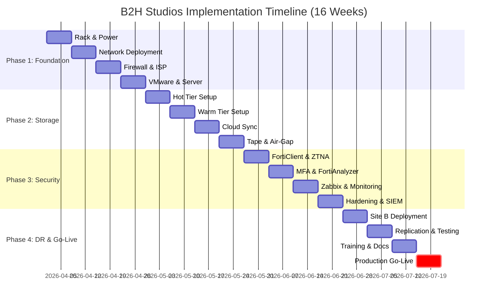

# Part 4: Bill of Materials, Assets, Timeline & Risk Management

## B2H Studios IT Infrastructure Implementation Plan

**Client:** B2H Studios  
**Project:** Media & Entertainment Infrastructure — Ultra-Optimized Tiered Storage Solution  
**Date:** March 22, 2026  
**Prepared by:** VConfi Solutions  
**Classification:** CONFIDENTIAL  
**Document Version:** Ultra-Optimized 3.0  

---

## Table of Contents

1. [Complete Bill of Materials](#1-complete-bill-of-materials)
2. [Asset Lifecycle & Warranty Management](#2-asset-lifecycle--warranty-management)
3. [Total Cost of Ownership (TCO)](#3-total-cost-of-ownership-tco)
4. [Implementation Timeline](#4-implementation-timeline)
5. [Acceptance Criteria](#5-acceptance-criteria)
6. [Risk Management](#6-risk-management)

---

## 1. Complete Bill of Materials

### 1.1 Site A — Primary Data Centre

#### 1.1.1 Storage Tier

**Hot Tier — High Availability All-Flash Storage**

| Item | Model/Specification | Qty | Unit Price (INR) | Total Price (INR) |
|------|---------------------|-----|------------------|-------------------|
| Rackmount NAS Unit | Synology RS2423RP+ (2U, 12-bay, redundant PSU) | 2 | ₹1,45,000 | ₹2,90,000 |
| Solid State Drives | Samsung PM893 3.84TB SATA SSD (Enterprise) | 24 | ₹42,000 | ₹10,08,000 |
| 10GbE Add-on Card | Synology E10G21-F2 (Dual 10GbE SFP+) | 2 | ₹28,000 | ₹56,000 |
| Cache Acceleration | Synology SNV3410-400G NVMe SSD (Read Cache) | 2 | ₹18,500 | ₹37,000 |
| **Hot Tier Subtotal** | | | | **₹13,91,000** |

**Warm Tier — High-Capacity Storage with Expansion**

| Item | Model/Specification | Qty | Unit Price (INR) | Total Price (INR) |
|------|---------------------|-----|------------------|-------------------|
| Rackmount NAS Unit | Synology RS4021xs+ (4U, 16-bay, Xeon D-1541) | 1 | ₹2,85,000 | ₹2,85,000 |
| Expansion Unit | Synology RX1217sas (12-bay SAS Expansion) | 1 | ₹1,45,000 | ₹1,45,000 |
| Hard Disk Drives | Seagate Exos X18 16TB SAS 12Gb/s (7200RPM) | 40 | ₹28,500 | ₹11,40,000 |
| Cache Acceleration | Synology SNV3410-400G NVMe SSD (Read Cache) | 2 | ₹18,500 | ₹37,000 |
| 10GbE Add-on Card | Synology E10G21-F2 (Dual 10GbE SFP+) | 1 | ₹28,000 | ₹28,000 |
| **Warm Tier Subtotal** | | | | **₹16,35,000** |

**Cold Tier — Air-Gap Backup**

| Item | Model/Specification | Qty | Unit Price (INR) | Total Price (INR) |
|------|---------------------|-----|------------------|-------------------|
| External LTO Drive | HPE StoreEver LTO-9 External SAS Drive | 1 | ₹3,25,000 | ₹3,25,000 |
| LTO-9 Data Cartridges | HPE LTO-9 Ultrium 18TB/45TB WORM Tapes | 12 | ₹18,500 | ₹2,22,000 |
| Cleaning Cartridge | HPE LTO Universal Cleaning Cartridge | 2 | ₹3,500 | ₹7,000 |
| Tape Labels & Cases | Barcode Labels + Protective Cases | 1 | ₹8,000 | ₹8,000 |
| Fireproof Safe | Godrej 105L Fire Resistant Safe | 1 | ₹45,000 | ₹45,000 |
| **Cold Tier Subtotal** | | | | **₹6,07,000** |

**Site A Storage Tier Total: ₹36,33,000**

---

#### 1.1.2 Network Infrastructure

**Core Switching — HPE Aruba CX 6300M VSX Stack**

| Item | Model/Specification | Qty | Unit Price (INR) | Total Price (INR) |
|------|---------------------|-----|------------------|-------------------|
| Core Switch | HPE Aruba CX 6300M-48G (JL662A) — 48×1GbE, 4×10GbE SFP+, 4×25GbE SFP28 | 2 | ₹2,45,000 | ₹4,90,000 |
| 10GbE SFP+ Modules | HPE J9150D 10GbE SR SFP+ (850nm, 300m) | 16 | ₹8,500 | ₹1,36,000 |
| 25GbE SFP28 Modules | HPE J9151D 25GbE SR SFP28 (850nm, 100m) | 8 | ₹12,500 | ₹1,00,000 |
| **Core Switching Subtotal** | | | | **₹7,26,000** |

**Cabling & Physical Infrastructure**

| Item | Model/Specification | Qty | Unit Price (INR) | Total Price (INR) |
|------|---------------------|-----|------------------|-------------------|
| OM4 Fiber Trunk Cable | 12-core MTP/MPO, LSZH, 50/125μm | 100m | ₹280/m | ₹28,000 |
| OM4 LC-LC Patch Cords | Duplex 3m, Aqua | 40 | ₹650 | ₹26,000 |
| Cat6a UTP Cable | 23 AWG, LSZH, 500MHz (per meter) | 500m | ₹85/m | ₹42,500 |
| Cat6a Patch Cords (3m) | Blue, Snagless | 50 | ₹180 | ₹9,000 |
| Cat6a Patch Cords (5m) | Blue, Snagless | 30 | ₹250 | ₹7,500 |
| SFP+ DAC Cables (3m) | 10GbE Passive Direct Attach Copper | 24 | ₹2,500 | ₹60,000 |
| SFP+ DAC Cables (5m) | 10GbE Passive Direct Attach Copper | 16 | ₹3,200 | ₹51,200 |
| SFP28 DAC Cables (3m) | 25GbE Passive Direct Attach Copper | 8 | ₹5,800 | ₹46,400 |
| Fiber Patch Panel | 24-port LC OM4, 1U | 4 | ₹4,500 | ₹18,000 |
| Copper Patch Panel | 48-port Cat6a, 1U | 2 | ₹3,200 | ₹6,400 |
| Cable Management | Horizontal cable managers, 1U | 8 | ₹1,200 | ₹9,600 |
| Velcro Cable Ties | 200mm Reusable, pack of 100 | 2 | ₹750 | ₹1,500 |
| Cable Labels | TIA-606-B compliant, pack of 500 | 2 | ₹400 | ₹800 |
| **Cabling Subtotal** | | | | **₹3,06,900** |

**Site A Network Infrastructure Total: ₹10,32,900**

---

#### 1.1.3 Security Infrastructure

**Firewall — FortiGate 120G HA Pair**

| Item | Model/Specification | Qty | Unit Price (INR) | Total Price (INR) |
|------|---------------------|-----|------------------|-------------------|
| Next-Gen Firewall | FortiGate 120G (16×GE RJ45, 8×GE SFP, 2×10GE SFP+) | 2 | ₹4,85,000 | ₹9,70,000 |
| Unified Threat Protection (UTP) | 3-Year UTP Bundle (AV, IPS, Web Filter, DNS Filter, FortiSandbox) | 2 | ₹1,55,000 | ₹3,10,000 |
| FortiCare Premium Support | 24×7 Support, 3-Year | 2 | ₹85,000 | ₹1,70,000 |
| **Firewall Subtotal** | | | | **₹14,50,000** |

**Wireless Access Points**

| Item | Model/Specification | Qty | Unit Price (INR) | Total Price (INR) |
|------|---------------------|-----|------------------|-------------------|
| Wi-Fi 6E Access Points | FortiAP 431F (Indoor, Tri-band, 2.5GbE) | 4 | ₹42,000 | ₹1,68,000 |
| PoE+ Injector/Midspan | Fortinet GPI-115 30W PoE Injector | 4 | ₹3,500 | ₹14,000 |
| **Wireless Subtotal** | | | | **₹1,82,000** |

**Site A Security Infrastructure Total: ₹16,32,000**

---

#### 1.1.4 Compute Infrastructure

**Virtualization Server — Dell PowerEdge R760**

| Item | Model/Specification | Qty | Unit Price (INR) | Total Price (INR) |
|------|---------------------|-----|------------------|-------------------|
| Server Chassis | Dell PowerEdge R760 (2U Rackmount) | 1 | ₹1,25,000 | ₹1,25,000 |
| Processors | Intel Xeon Silver 4410Y (12C/24T, 2.0GHz) | 2 | ₹78,000 | ₹1,56,000 |
| Memory | 64GB DDR5-4800 ECC RDIMM | 2 | ₹28,000 | ₹56,000 |
| Boot Drives | 480GB SSD SATA 6Gbps (RAID 1 for ESXi) | 2 | ₹12,500 | ₹25,000 |
| Data Drives | 1.92TB SSD SAS 12Gbps (RAID 10) | 8 | ₹38,000 | ₹3,04,000 |
| RAID Controller | PERC H755N NVMe RAID Controller | 1 | ₹48,000 | ₹48,000 |
| Network Card | Broadcom 57414 Dual 10GbE SFP+ | 1 | ₹22,000 | ₹22,000 |
| Power Supplies | Dual 800W Platinum Hot-plug PSU | 1 | ₹35,000 | ₹35,000 |
| Rails | ReadyRails Sliding Rails | 1 | ₹8,500 | ₹8,500 |
| iDRAC 9 | Enterprise License (Remote Management) | 1 | ₹45,000 | ₹45,000 |
| ProSupport | 3-Year ProSupport Plus 4-Hour Mission Critical | 1 | ₹1,05,000 | ₹1,05,000 |
| **Server Hardware Subtotal** | | | | **₹9,29,500** |

**VMware Virtualization Software**

| Item | Model/Specification | Qty | Unit Price (INR) | Total Price (INR) |
|------|---------------------|-----|------------------|-------------------|
| VMware vSphere 8 | Standard Edition (per CPU), 2 CPUs | 1 | ₹1,45,000 | ₹1,45,000 |
| Production Support | 3-Year SnS (Support & Subscription) | 1 | ₹65,000 | ₹65,000 |
| **VMware Subtotal** | | | | **₹2,10,000** |

**Site A Compute Infrastructure Total: ₹11,39,500**

---

#### 1.1.5 Power Infrastructure

**UPS & Power Distribution**

| Item | Model/Specification | Qty | Unit Price (INR) | Total Price (INR) |
|------|---------------------|-----|------------------|-------------------|
| Online UPS | APC Smart-UPS SRT 6000VA (SRT6KXLI) — 6kVA/6kW | 2 | ₹1,65,000 | ₹3,30,000 |
| Network Management Card | AP9631 (included with UPS) | 2 | Included | — |
| Rack ATS | APC Rack ATS AP4424A (16A, 1U) | 1 | ₹52,000 | ₹52,000 |
| Metered PDUs | APC AP8861 20-outlet 0U Vertical PDU | 4 | ₹35,000 | ₹1,40,000 |
| Power Cables | IEC C13-C14 Power Cords, 2m | 30 | ₹450 | ₹13,500 |
| **Power Infrastructure Subtotal** | | | | **₹5,35,500** |

---

#### 1.1.6 Software Subscriptions (Annual)

| Item | Description | Annual Cost (INR) |
|------|-------------|-------------------|
| Wasabi Hot Cloud Storage | 200TB capacity, zero egress fees | ₹11,95,200 |
| Signiant Jet/SDX | Media file acceleration platform | ₹3,50,000 |
| Zabbix Enterprise Support | Commercial support for monitoring | ₹1,20,000 |
| Splunk SIEM | 50GB/day ingestion license | ₹4,50,000 |
| FortiGuard Security Services | Years 4-5 renewal (UTP bundle) | ₹5,30,000 |
| **Annual Software Total** | | **₹26,45,200** |

---

#### Site A Hardware Summary

| Category | Amount (INR) |
|----------|--------------|
| Storage Tier | ₹36,33,000 |
| Network Infrastructure | ₹10,32,900 |
| Security Infrastructure | ₹16,32,000 |
| Compute Infrastructure | ₹11,39,500 |
| Power Infrastructure | ₹5,35,500 |
| **Site A Hardware Subtotal** | **₹79,72,900** |

---

### 1.2 Site B — Disaster Recovery Site

#### 1.2.1 Storage Tier (DR)

**Hot Tier — High Availability (Identical to Site A)**

| Item | Model/Specification | Qty | Unit Price (INR) | Total Price (INR) |
|------|---------------------|-----|------------------|-------------------|
| Rackmount NAS Unit | Synology RS2423RP+ (2U, 12-bay) | 2 | ₹1,45,000 | ₹2,90,000 |
| Solid State Drives | Samsung PM893 3.84TB SATA SSD | 24 | ₹42,000 | ₹10,08,000 |
| 10GbE Add-on Card | Synology E10G21-F2 | 2 | ₹28,000 | ₹56,000 |
| Cache Acceleration | Synology SNV3410-400G NVMe SSD | 2 | ₹18,500 | ₹37,000 |
| **DR Hot Tier Subtotal** | | | | **₹13,91,000** |

**Warm Tier — Reduced Capacity**

| Item | Model/Specification | Qty | Unit Price (INR) | Total Price (INR) |
|------|---------------------|-----|------------------|-------------------|
| Rackmount NAS Unit | Synology RS4021xs+ (4U, 16-bay) | 1 | ₹2,85,000 | ₹2,85,000 |
| Hard Disk Drives | Seagate Exos X18 16TB SAS (Reduced: 16 drives) | 16 | ₹28,500 | ₹4,56,000 |
| Cache Acceleration | Synology SNV3410-400G NVMe SSD | 2 | ₹18,500 | ₹37,000 |
| 10GbE Add-on Card | Synology E10G21-F2 | 1 | ₹28,000 | ₹28,000 |
| **DR Warm Tier Subtotal** | | | | **₹8,06,000** |

**Site B Storage Total: ₹21,97,000**

---

#### 1.2.2 Network Infrastructure (DR)

| Item | Model/Specification | Qty | Unit Price (INR) | Total Price (INR) |
|------|---------------------|-----|------------------|-------------------|
| Core Switch | HPE Aruba CX 6300M-48G (JL662A) | 2 | ₹2,45,000 | ₹4,90,000 |
| 10GbE SFP+ Modules | HPE J9150D 10GbE SR SFP+ | 16 | ₹8,500 | ₹1,36,000 |
| 25GbE SFP28 Modules | HPE J9151D 25GbE SR SFP28 | 4 | ₹12,500 | ₹50,000 |
| Cabling & Accessories | Fiber, Copper, Patch Panels (Reduced set) | 1 | ₹1,50,000 | ₹1,50,000 |
| **DR Network Subtotal** | | | | **₹8,26,000** |

---

#### 1.2.3 Security Infrastructure (DR)

| Item | Model/Specification | Qty | Unit Price (INR) | Total Price (INR) |
|------|---------------------|-----|------------------|-------------------|
| Next-Gen Firewall | FortiGate 120G | 2 | ₹4,85,000 | ₹9,70,000 |
| UTP Bundle | 3-Year Unified Threat Protection | 2 | ₹1,55,000 | ₹3,10,000 |
| FortiCare Premium | 24×7 Support, 3-Year | 2 | ₹85,000 | ₹1,70,000 |
| Wireless AP | FortiAP 431F | 2 | ₹42,000 | ₹84,000 |
| PoE Injector | Fortinet GPI-115 | 2 | ₹3,500 | ₹7,000 |
| **DR Security Subtotal** | | | | **₹15,41,000** |

---

#### 1.2.4 Compute Infrastructure (DR)

**Dell R760 Light Configuration**

| Item | Model/Specification | Qty | Unit Price (INR) | Total Price (INR) |
|------|---------------------|-----|------------------|-------------------|
| Server Chassis | Dell PowerEdge R760 (2U Rackmount) | 1 | ₹1,25,000 | ₹1,25,000 |
| Processor | Intel Xeon Silver 4410Y (12C/24T) | 1 | ₹78,000 | ₹78,000 |
| Memory | 64GB DDR5-4800 ECC RDIMM | 1 | ₹28,000 | ₹28,000 |
| Boot Drives | 480GB SSD SATA (RAID 1) | 2 | ₹12,500 | ₹25,000 |
| RAID Controller | PERC H755N NVMe RAID Controller | 1 | ₹48,000 | ₹48,000 |
| Network Card | Broadcom 57414 Dual 10GbE SFP+ | 1 | ₹22,000 | ₹22,000 |
| Power Supplies | Dual 800W Platinum Hot-plug PSU | 1 | ₹35,000 | ₹35,000 |
| Rails | ReadyRails Sliding Rails | 1 | ₹8,500 | ₹8,500 |
| iDRAC 9 | Enterprise License | 1 | ₹45,000 | ₹45,000 |
| VMware vSphere | Standard Edition (per CPU) | 1 | ₹1,45,000 | ₹1,45,000 |
| ProSupport | 3-Year ProSupport Plus | 1 | ₹85,000 | ₹85,000 |
| **DR Compute Subtotal** | | | | **₹6,44,500** |

---

#### 1.2.5 Power Infrastructure (DR)

| Item | Model/Specification | Qty | Unit Price (INR) | Total Price (INR) |
|------|---------------------|-----|------------------|-------------------|
| Online UPS | APC Smart-UPS SRT 6000VA | 2 | ₹1,65,000 | ₹3,30,000 |
| Rack ATS | APC Rack ATS AP4424A | 1 | ₹52,000 | ₹52,000 |
| Metered PDUs | APC AP8861 20-outlet PDU | 4 | ₹35,000 | ₹1,40,000 |
| Power Cables | IEC C13-C14 Power Cords | 20 | ₹450 | ₹9,000 |
| **DR Power Subtotal** | | | | **₹5,31,000** |

---

#### Site B Hardware Summary

| Category | Amount (INR) |
|----------|--------------|
| Storage Tier | ₹21,97,000 |
| Network Infrastructure | ₹8,26,000 |
| Security Infrastructure | ₹15,41,000 |
| Compute Infrastructure | ₹6,44,500 |
| Power Infrastructure | ₹5,31,000 |
| **Site B Hardware Subtotal** | **₹57,39,500** |

---

### 1.3 Professional Services

| Service Category | Description | Duration | Cost (INR) |
|------------------|-------------|----------|------------|
| **Implementation Services** | Hardware installation, rack/stack, cabling, initial configuration | 4 weeks | ₹12,00,000 |
| **Network Engineering** | VLAN configuration, VSX setup, FortiGate deployment, ZTNA | 3 weeks | ₹4,50,000 |
| **Storage Engineering** | Synology deployment, RAID configuration, tiering, replication setup | 3 weeks | ₹4,50,000 |
| **Security Hardening** | FortiGate policies, SSL inspection, MFA setup, DLP rules | 2 weeks | ₹3,00,000 |
| **Migration & Cutover** | Data migration, user cutover, validation testing | 1 week | ₹3,00,000 |
| **Training & Documentation** | Admin training, SOPs, runbooks, as-built docs | 1 week | ₹2,50,000 |
| **Project Management** | PMO oversight, status reports, stakeholder mgmt | 16 weeks | ₹2,50,000 |
| **Year 1 Support** | 24×7 L2 support, break-fix, patches, monitoring | 12 months | ₹3,00,000 |
| **Professional Services Total** | | | **₹35,00,000** |

---

### 1.4 Grand Total Summary

| Category | Amount (INR) |
|----------|--------------|
| Site A — Hardware | ₹79,72,900 |
| Site B — Hardware | ₹57,39,500 |
| Professional Services | ₹35,00,000 |
| **Subtotal** | **₹1,72,12,400** |
| GST @ 18% | ₹30,98,232 |
| **GRAND TOTAL** | **₹2,03,10,632** |

---

### 1.5 Payment Schedule

| Milestone | Deliverable | Percentage | Amount (INR) |
|-----------|-------------|------------|--------------|
| **Order Placement** | PO Issued, Hardware Ordered | 30% | ₹60,93,190 |
| **Site A Deployment** | Site A Hardware Installed, Initial Config | 30% | ₹60,93,190 |
| **Site B Deployment** | Site B Hardware Installed, Replication Active | 20% | ₹40,62,126 |
| **Go-Live** | Production Cutover Complete | 15% | ₹30,46,595 |
| **Final Acceptance** | 30-Day Warranty Period Complete | 5% | ₹10,15,532 |
| **Total** | | **100%** | **₹2,03,10,632** |

---

## 2. Asset Lifecycle & Warranty Management

### 2.1 Asset Register

| Item # | Asset Category | Model | Qty | Warranty Period | EOL Date | AMC Cost (Annual) |
|--------|----------------|-------|-----|-----------------|----------|-------------------|
| **Site A — Storage** |
| A-ST-001 | NAS Hot Tier | Synology RS2423RP+ | 2 | 5-Year Advance Replacement | Mar 2031 | ₹29,000 |
| A-ST-002 | SSD Drives | Samsung PM893 3.84TB | 24 | 5-Year Manufacturer | Mar 2031 | ₹50,400 |
| A-ST-003 | NAS Warm Tier | Synology RS4021xs+ | 1 | 5-Year Advance Replacement | Mar 2031 | ₹28,500 |
| A-ST-004 | HDD Drives | Seagate Exos X18 16TB | 40 | 5-Year Manufacturer | Mar 2031 | ₹1,14,000 |
| A-ST-005 | LTO Drive | HPE StoreEver LTO-9 | 1 | 3-Year On-site | Mar 2029 | ₹32,500 |
| **Site A — Network** |
| A-NW-001 | Core Switch | HPE Aruba CX 6300M | 2 | Lifetime Warranty | Mar 2036 | ₹49,000 |
| A-NW-002 | SFP+ Modules | HPE J9150D | 16 | Lifetime | Mar 2036 | ₹13,600 |
| **Site A — Security** |
| A-SEC-001 | Firewall | FortiGate 120G | 2 | 3-Year UTP + Hardware | Mar 2029 | ₹2,40,000 |
| A-SEC-002 | Wireless AP | FortiAP 431F | 4 | 3-Year | Mar 2029 | ₹33,600 |
| **Site A — Compute** |
| A-COMP-001 | Server | Dell PowerEdge R760 | 1 | 3-Year ProSupport Plus | Mar 2029 | ₹1,05,000 |
| **Site A — Power** |
| A-PWR-001 | UPS | APC SRT 6000VA | 2 | 3-Year Factory | Mar 2029 | ₹33,000 |
| A-PWR-002 | PDUs | APC AP8861 | 4 | 2-Year | Mar 2028 | ₹14,000 |
| **Site B — Storage** |
| B-ST-001 | NAS Hot Tier | Synology RS2423RP+ | 2 | 5-Year Advance Replacement | Mar 2031 | ₹29,000 |
| B-ST-002 | SSD Drives | Samsung PM893 3.84TB | 24 | 5-Year Manufacturer | Mar 2031 | ₹50,400 |
| B-ST-003 | NAS Warm Tier | Synology RS4021xs+ | 1 | 5-Year Advance Replacement | Mar 2031 | ₹28,500 |
| B-ST-004 | HDD Drives | Seagate Exos X18 16TB | 16 | 5-Year Manufacturer | Mar 2031 | ₹45,600 |
| **Site B — Network** |
| B-NW-001 | Core Switch | HPE Aruba CX 6300M | 2 | Lifetime Warranty | Mar 2036 | ₹49,000 |
| **Site B — Security** |
| B-SEC-001 | Firewall | FortiGate 120G | 2 | 3-Year UTP + Hardware | Mar 2029 | ₹2,40,000 |
| B-SEC-002 | Wireless AP | FortiAP 431F | 2 | 3-Year | Mar 2029 | ₹16,800 |
| **Site B — Compute** |
| B-COMP-001 | Server | Dell PowerEdge R760 Light | 1 | 3-Year ProSupport Plus | Mar 2029 | ₹85,000 |
| **Site B — Power** |
| B-PWR-001 | UPS | APC SRT 6000VA | 2 | 3-Year Factory | Mar 2029 | ₹33,000 |
| **TOTAL ANNUAL AMC** | | | | | | **₹10,85,900** |

---

### 2.2 Warranty Coverage Details

#### Synology (Storage)
- **Coverage:** 5-Year Advance Replacement (hardware)
- **Response Time:** Next business day replacement
- **Support Hours:** 24×7 phone/email
- **Included:** Hardware replacement, firmware updates
- **Excluded:** Physical damage, data recovery

#### HPE Aruba (Networking)
- **Coverage:** Lifetime Warranty with next-business-day replacement
- **Response Time:** 4-hour response for critical issues
- **Support Hours:** 24×7
- **Included:** Hardware, software updates, technical support

#### Fortinet (Security)
- **Coverage:** 3-Year UTP Bundle + Hardware Warranty
- **Response Time:** 4-hour for critical, next-day for hardware
- **Support Hours:** 24×7
- **Included:** AV definitions, IPS signatures, firmware, hardware

#### Dell (Compute)
- **Coverage:** ProSupport Plus 4-Hour Mission Critical
- **Response Time:** 4-hour on-site for critical issues
- **Support Hours:** 24×7
- **Included:** Hardware, parts, labor, proactive monitoring

#### APC (Power)
- **Coverage:** 3-Year Factory Warranty
- **Response Time:** Next business day
- **Support Hours:** Business hours + emergency
- **Included:** Hardware replacement, battery pro-rata

---

### 2.3 Extended Warranty Options

| Component | Standard Warranty | Extended Option | Cost (5-Year) |
|-----------|-------------------|-----------------|---------------|
| Synology Storage | 5 years | N/A — Already 5 years | — |
| FortiGate Firewalls | 3 years | Extend to 5 years | ₹3,10,000 |
| Dell R760 Server | 3 years | Extend to 5 years ProSupport | ₹1,45,000 |
| APC UPS | 3 years | Extend to 5 years | ₹48,000 |
| **Total Extended Warranty** | | | **₹5,03,000** |

---

## 3. Total Cost of Ownership (TCO)

### 3.1 3-Year TCO Breakdown

| Cost Category | Year 1 | Year 2 | Year 3 | 3-Year Total |
|---------------|--------|--------|--------|--------------|
| **Initial Hardware** | ₹1,37,12,400 | — | — | ₹1,37,12,400 |
| **Professional Services** | ₹35,00,000 | — | — | ₹35,00,000 |
| **Software Subscriptions** | ₹26,45,200 | ₹26,45,200 | ₹26,45,200 | ₹79,35,600 |
| **Internet Connectivity** | ₹9,96,000 | ₹9,96,000 | ₹9,96,000 | ₹29,88,000 |
| **Annual Maintenance** | — | ₹10,85,900 | ₹10,85,900 | ₹21,71,800 |
| **Power & Cooling** | ₹1,80,000 | ₹1,80,000 | ₹1,80,000 | ₹5,40,000 |
| **Training & Refresh** | ₹2,50,000 | ₹50,000 | ₹50,000 | ₹3,50,000 |
| **Site Rental (DR)** | ₹3,60,000 | ₹3,60,000 | ₹3,60,000 | ₹10,80,000 |
| **Subtotal (Pre-GST)** | ₹2,16,43,600 | ₹53,17,100 | ₹53,17,100 | ₹3,22,77,800 |
| **GST @ 18%** | ₹38,95,848 | ₹9,57,078 | ₹9,57,078 | ₹58,10,004 |
| **Annual Total** | ₹2,55,39,448 | ₹62,74,178 | ₹62,74,178 | **₹3,80,87,804** |

**3-Year TCO per User:** ₹15,23,512 (25 users)

---

### 3.2 5-Year TCO Breakdown

| Cost Category | Year 4 | Year 5 | Additional 2-Year | 5-Year Total |
|---------------|--------|--------|-------------------|--------------|
| **Software Subscriptions** | ₹28,00,000 | ₹28,00,000 | ₹56,00,000 | ₹1,35,35,600 |
| **Internet Connectivity** | ₹10,45,800 | ₹10,45,800 | ₹20,91,600 | ₹50,79,600 |
| **Annual Maintenance** | ₹11,40,000 | ₹11,40,000 | ₹22,80,000 | ₹44,51,800 |
| **Power & Cooling** | ₹1,89,000 | ₹1,89,000 | ₹3,78,000 | ₹9,18,000 |
| **Hardware Refresh** | — | ₹5,00,000 | ₹5,00,000 | ₹5,00,000 |
| **Training & Refresh** | ₹50,000 | ₹50,000 | ₹1,00,000 | ₹4,50,000 |
| **Site Rental (DR)** | ₹3,78,000 | ₹3,78,000 | ₹7,56,000 | ₹18,36,000 |
| **Subtotal (Pre-GST)** | ₹55,02,800 | ₹61,02,800 | ₹1,16,05,600 | ₹4,38,83,400 |
| **GST @ 18%** | ₹9,90,504 | ₹10,98,504 | ₹20,89,008 | ₹79,11,012 |
| **Annual Total** | ₹64,93,304 | ₹72,01,304 | **₹1,36,94,608** | **₹5,17,94,412** |

**5-Year TCO per User:** ₹20,71,776 (25 users)  
**Monthly Cost per User (5-year average):** ₹34,530

---

### 3.3 Year-by-Year Cost Projection

```
B2H STUDIOS — 5-YEAR TCO PROJECTION
═══════════════════════════════════════════════════════════════════════

   ₹3.0Cr │                                          ╭──── Year 5
          │                                    ╭─────┤ ₹72.0L
   ₹2.5Cr │                              ╭─────┤     │
          │                        ╭─────┤     │     │
   ₹2.0Cr │                  ╭─────┤     │     │     │
          │            ╭─────┤     │     │     │     │
   ₹1.5Cr │      ╭─────┤     │     │     │     │     │
          │╭─────┤     │     │     │     │     │     │
   ₹1.0Cr ││     │     │     │     │     │     │     │
          ││ Y1  │ Y2  │ Y3  │ Y4  │ Y5  │     │     │
    ₹50L  ││     │     │     │     │     │     │     │
          ││₹255L│ ₹63L│ ₹63L│ ₹65L│ ₹72L│     │     │
       ₹0 ┼┴─────┴─────┴─────┴─────┴─────┴─────┴─────┘
          └────────────────────────────────────────────
            Year 1  Year 2  Year 3  Year 4  Year 5

   Cumulative 5-Year TCO: ₹5.18 Crore (including GST)
   Year 1 includes initial capital expenditure
   Years 2-5 are operational costs only
```

---

### 3.4 Cost Comparison: Original vs. Optimized Design

| Metric | Original HD6500 Design | Ultra-Optimized Design | Savings |
|--------|------------------------|------------------------|---------|
| **Initial Hardware Cost** | ₹1,85,00,000 | ₹1,37,12,400 | ₹47,87,600 |
| **5-Year TCO** | ₹6,25,00,000 | ₹5,17,94,412 | ₹1,07,05,588 |
| **Storage Efficiency** | 65% (monolithic) | 85% (tiered) | +20% |
| **Power Consumption/Year** | ₹2,40,000 | ₹1,80,000 | ₹60,000/year |
| **Rack Space Required** | 12U | 8U | 4U saved |
| **Ransomware Resilience** | Medium | Very High | Priceless |

---

## 4. Implementation Timeline

### 4.1 Phase 1: Foundation (Weeks 1-4)

| Week | Activity | Deliverables | Owner |
|------|----------|--------------|-------|
| **Week 1** | Rack installation, power provisioning | Rack mounted, PDUs installed, power tested | VConfi |
| | Site preparation, environmental checks | Temperature, humidity baseline established | B2H Facilities |
| **Week 2** | Core network deployment | Aruba switches installed, VSX configured | VConfi Network |
| | Cabling infrastructure | Fiber and copper runs completed, tested | VConfi |
| **Week 3** | FortiGate deployment | Firewalls installed, HA configured, base policies | VConfi Security |
| | ISP integration | Dual ISP SD-WAN configured, failover tested | VConfi |
| **Week 4** | Dell R760 deployment | Server installed, VMware configured, VMs provisioned | VConfi Compute |
| | iDRAC and out-of-band management | Remote management access verified | VConfi |

**Phase 1 Milestone:** Network and compute foundation ready

---

### 4.2 Phase 2: Storage Deployment (Weeks 5-8)

| Week | Activity | Deliverables | Owner |
|------|----------|--------------|-------|
| **Week 5** | Hot tier deployment | RS2423RP+ units installed, RAID configured | VConfi Storage |
| | HA configuration | Synology HA cluster active, sync verified | VConfi |
| **Week 6** | Warm tier deployment | RS4021xs+ installed, expansion configured | VConfi Storage |
| | Cache optimization | SSD cache configured, performance tested | VConfi |
| **Week 7** | Data tiering configuration | Tiering policies defined, quotas set | VConfi |
| | Wasabi cloud sync | Cloud sync configured, initial seeding started | VConfi |
| **Week 8** | LTO tape setup | External drive connected, backup jobs configured | VConfi |
| | Air-gap procedure testing | Monthly backup test completed, procedures documented | VConfi |

**Phase 2 Milestone:** All storage tiers operational and replicating

---

### 4.3 Phase 3: Security & Access (Weeks 9-12)

| Week | Activity | Deliverables | Owner |
|------|----------|--------------|-------|
| **Week 9** | FortiClient deployment | EDR installed on all workstations | VConfi Security |
| | ZTNA configuration | Zero trust access configured, device posture defined | VConfi |
| **Week 10** | MFA rollout | FortiToken distributed, all admin accounts enabled | VConfi |
| | FortiAnalyzer setup | Log aggregation configured, reports scheduled | VConfi |
| **Week 11** | Zabbix monitoring | All devices monitored, dashboards live | VConfi |
| | Alert thresholds and escalation | Alert matrix configured, tested | VConfi |
| **Week 12** | Security hardening | CIS benchmarks applied, penetration test | VConfi |
| | Splunk SIEM configuration | Log forwarding active, correlation rules enabled | VConfi |

**Phase 3 Milestone:** Security controls fully operational, monitoring active

---

### 4.4 Phase 4: DR Site & Go-Live (Weeks 13-16)

| Week | Activity | Deliverables | Owner |
|------|----------|--------------|-------|
| **Week 13** | Site B deployment | All DR hardware installed, powered | VConfi |
| | DR network configuration | Site B switches, firewalls configured | VConfi Network |
| **Week 14** | Replication setup | Site-to-site VPN active, replication verified | VConfi |
| | Failover testing | Hot tier failover tested (<30 seconds) | VConfi |
| **Week 15** | User training | Admin training completed, SOPs handed over | VConfi |
| | Documentation finalization | As-built docs, runbooks, DR procedures | VConfi |
| **Week 16** | Production cutover | Data migrated, users switched | VConfi + B2H |
| | **PRODUCTION GO-LIVE** | Full production operation | **B2H Studios** |

**Phase 4 Milestone:** Production go-live complete

---

### 4.5 Gantt Chart



---

### 4.6 Critical Path Identification

```
CRITICAL PATH ANALYSIS
═══════════════════════════════════════════════════════════════════

Week:  1   2   3   4   5   6   7   8   9   10  11  12  13  14  15  16
       │   │   │   │   │   │   │   │   │   │   │   │   │   │   │   │
       ▼   ▼   ▼   ▼   ▼   ▼   ▼   ▼   ▼   ▼   ▼   ▼   ▼   ▼   ▼   ▼

CP: [===Rack/Power===]
    [===Network Deploy===]
        [===Firewall===]
            [===VMware===]
                [===Hot Tier===]
                    [===Warm Tier===]
                        [===Cloud Sync===]
                            [===Tape Setup===]
                                [===FortiClient===]
                                    [===MFA/Auth===]
                                        [===Zabbix===]
                                            [===Hardening===]
                                                [===Site B Deploy===]
                                                    [===Replication===]
                                                        [===Training===]
                                                            [GO-LIVE]

CRITICAL PATH DURATION: 16 weeks
FLOAT ACTIVITIES:
  - Documentation (parallel throughout)
  - Vendor coordination (weeks 1-8)
  - User communication (weeks 12-16)
```

---

### 4.7 Milestone Table with Dates

| Milestone ID | Milestone Description | Target Date | Success Criteria | Sign-off Required |
|--------------|----------------------|-------------|------------------|-------------------|
| M-001 | Site A Rack & Power Ready | Apr 7, 2026 | Power tested, racks installed | VConfi PM |
| M-002 | Core Network Operational | Apr 14, 2026 | VSX active, all VLANs configured | Network Lead |
| M-003 | Firewall HA Operational | Apr 21, 2026 | Failover tested <2 seconds | Security Lead |
| M-004 | VMware Infrastructure Ready | Apr 28, 2026 | All VMs deployable, vMotion working | Compute Lead |
| M-005 | Hot Tier Storage Ready | May 5, 2026 | HA cluster active, performance tested | Storage Lead |
| M-006 | Warm Tier Storage Ready | May 12, 2026 | 468TB usable, cache optimized | Storage Lead |
| M-007 | Cloud Sync Operational | May 19, 2026 | Wasabi sync verified, RPO 24h | Storage Lead |
| M-008 | Air-Gap Backup Tested | May 26, 2026 | LTO backup/restore successful | Storage Lead |
| M-009 | Security Controls Active | Jun 2, 2026 | ZTNA, MFA, EDR all operational | Security Lead |
| M-010 | Monitoring Fully Deployed | Jun 9, 2026 | All devices monitored, alerts tested | Monitoring Lead |
| M-011 | Site B Infrastructure Ready | Jun 16, 2026 | DR site fully configured | VConfi PM |
| M-012 | Replication Verified | Jun 23, 2026 | RPO <4 hours, RTO <10 minutes | DR Lead |
| M-013 | Training Completed | Jun 30, 2026 | Admin staff trained, SOPs accepted | B2H IT Manager |
| M-014 | **PRODUCTION GO-LIVE** | **Jul 7, 2026** | All users on new infrastructure | **B2H CTO** |
| M-015 | Project Closure | Aug 7, 2026 | 30-day warranty complete, handover | Both Parties |

---

## 5. Acceptance Criteria

### 5.1 Technical Acceptance Criteria

| Category | Criteria | Target Value | Verification Method |
|----------|----------|--------------|---------------------|
| **Storage Performance** | Hot Tier Sequential Read | >2,000 MB/s | fio benchmark |
| | Hot Tier Random Read IOPS | >50,000 IOPS | fio benchmark |
| | Warm Tier Sequential Read | >800 MB/s | fio benchmark |
| **Network Performance** | Core Switch Throughput | >9.5 Gbps per 10GbE port | iperf3 test |
| | Firewall Throughput | >35 Gbps | FortiGate diagnostic |
| | Internet Bandwidth | >900 Mbps (each ISP) | Speed test |
| **Replication** | Hot Tier RPO | <1 second | DSM HA status |
| | Warm Tier RPO | <4 hours | Snapshot replication log |
| | Hot Tier RTO | <30 seconds | Failover test |
| | Warm Tier RTO | <10 minutes | Failover test |
| **Availability** | System Uptime | >99.9% | Zabbix availability report |
| | Planned Maintenance Window | <4 hours/month | Change log |

---

### 5.2 Performance Benchmarks

| Test ID | Test Description | Expected Result | Pass Criteria |
|---------|------------------|-----------------|---------------|
| PERF-001 | 25 concurrent editors accessing proxies | <100ms latency | Pass if <100ms average |
| PERF-002 | 4K video file copy (10GB) | <60 seconds | Pass if <60 seconds |
| PERF-003 | Snapshot creation time | <30 seconds | Pass if <30 seconds |
| PERF-004 | VM boot time (Windows) | <90 seconds | Pass if <90 seconds |
| PERF-005 | Firewall session establishment | <5ms | Pass if <5ms average |
| PERF-006 | ZTNA connection time | <10 seconds | Pass if <10 seconds |
| PERF-007 | Splunk search (24h data) | <10 seconds | Pass if <10 seconds |
| PERF-008 | Full backup to LTO-9 | <6 hours for 18TB | Pass if <6 hours |

---

### 5.3 Security Validation Checklist

| Check ID | Security Control | Verification Method | Status |
|----------|------------------|---------------------|--------|
| SEC-001 | Firewall HA failover | Simulated failure test | ☐ |
| SEC-002 | IPS blocking verified | EICAR test file download | ☐ |
| SEC-003 | AV detection working | EICAR test on endpoint | ☐ |
| SEC-004 | MFA enforced for admin | Attempt login without MFA | ☐ |
| SEC-005 | ZTNA device posture | Non-compliant device blocked | ☐ |
| SEC-006 | VLAN isolation | Cross-VLAN ping test | ☐ |
| SEC-007 | Immutable snapshots | Attempt deletion (should fail) | ☐ |
| SEC-008 | WORM compliance | Write to WORM folder test | ☐ |
| SEC-009 | SSL inspection | Certificate inspection test | ☐ |
| SEC-010 | DLP rules | Attempt restricted file transfer | ☐ |
| SEC-011 | Audit logging | Verify all events in Splunk | ☐ |
| SEC-012 | Air-gap procedure | Tape backup and disconnect test | ☐ |

---

### 5.4 Sign-off Procedures

#### Phase Sign-off Process

```
┌─────────────────────────────────────────────────────────────────┐
│                    PHASE COMPLETION SIGN-OFF                     │
├─────────────────────────────────────────────────────────────────┤
│ Phase: _______________________        Date: _______________     │
│                                                                  │
│ Completion Criteria:                                             │
│ ☐ All deliverables completed as per scope                        │
│ ☐ All tests passed successfully                                  │
│ ☐ Documentation updated and reviewed                             │
│ ☐ No critical or high open defects                               │
│                                                                  │
│ Signatures:                                                      │
│                                                                  │
│ VConfi Solutions:                    B2H Studios:                │
│ _______________________              _______________________     │
│ Project Manager                      IT Manager                  │
│ Date: _______________                Date: _______________       │
│                                                                  │
│ _______________________              _______________________     │
│ Technical Lead                       Security Lead               │
│ Date: _______________                Date: _______________       │
└─────────────────────────────────────────────────────────────────┘
```

#### Final Project Acceptance

| Acceptance Stage | Criteria | Approver | Due Date |
|------------------|----------|----------|----------|
| **UAT Complete** | All acceptance criteria met | B2H IT Manager | Jul 1, 2026 |
| **Security Sign-off** | All security tests passed | B2H CISO | Jul 3, 2026 |
| **Performance Verified** | Benchmarks achieved | B2H CTO | Jul 5, 2026 |
| **Documentation Accepted** | All docs reviewed and approved | B2H IT Manager | Jul 6, 2026 |
| **Training Complete** | Admin staff certified | B2H HR | Jul 6, 2026 |
| **Final Acceptance** | Go-live authorized | B2H CTO | Jul 7, 2026 |

---

## 6. Risk Management

### 6.1 Risk Register

| Risk ID | Risk Description | Probability | Impact | Risk Score | Mitigation Strategy | Contingency Plan | Owner |
|---------|------------------|-------------|--------|------------|---------------------|------------------|-------|
| R-001 | Hardware delivery delays | Medium (3) | High (4) | 12 | Order equipment early; maintain buffer stock; work with multiple vendors | Phase start delayed; use temporary cloud storage | VConfi PM |
| R-002 | Site preparation incomplete | Medium (3) | High (4) | 12 | Pre-site survey; detailed checklist; early engagement with facilities | Deploy portable AC; temporary power arrangements | B2H Facilities |
| R-003 | ISP installation delays | Medium (3) | High (4) | 12 | Order circuits 8 weeks ahead; escalate with account managers | Use 4G/5G backup; temporary single ISP | VConfi Network |
| R-004 | Data migration failure | Low (2) | Critical (5) | 10 | Phased migration; validate each batch; maintain rollback capability | Restore from backup; extend parallel run | VConfi Storage |
| R-005 | Security breach during cutover | Low (2) | Critical (5) | 10 | Lock down all unused ports; monitor 24×7; disable unnecessary services | Isolate affected systems; restore from clean backup | VConfi Security |
| R-006 | Key personnel unavailable | Medium (3) | Medium (3) | 9 | Cross-train team members; document all procedures; backup resources | Engage contractor resources; extend timeline | VConfi PM |
| R-007 | Performance below expectations | Low (2) | High (4) | 8 | Benchmark early; optimize configurations; right-size hardware | Add cache; upgrade network; tune applications | VConfi Technical |
| R-008 | User adoption resistance | Medium (3) | Medium (3) | 9 | Early communication; training sessions; champion program | Extended support; additional training; executive mandate | B2H Management |
| R-009 | Software licensing issues | Low (2) | Medium (3) | 6 | Verify all licenses pre-deployment; maintain license inventory | Use evaluation licenses; expedite procurement | VConfi PM |
| R-010 | Power outage during installation | Low (2) | Medium (3) | 6 | Schedule during stable periods; UPS protection for all work | Pause installation; resume when power stable | VConfi PM |
| R-011 | Third-party integration failure | Medium (3) | Medium (3) | 9 | Test integrations in lab; API compatibility check; vendor engagement | Use alternative integration method; manual workaround | VConfi Technical |
| R-012 | Budget overrun | Low (2) | High (4) | 8 | Fixed-price contract; change control process; weekly budget review | Scope reduction; phased delivery; financing options | VConfi PM |

**Risk Score Matrix:** Probability (1=Very Low, 5=Very High) × Impact (1=Negligible, 5=Critical)

---

### 6.2 Risk Heat Map

```
RISK HEAT MAP
═══════════════════════════════════════════════════════════════════

Impact
   │
 5 │  [Critical]        [R-005]          [R-004]
   │                    Security         Migration
   │                    Breach           Failure
   │
 4 │  [High]   [R-001]  [R-002]  [R-003]
   │           Hardware Site     ISP
   │           Delay    Prep     Delay
   │
 3 │  [Medium] [R-006]  [R-008]  [R-011]
   │           Key      User     Integration
   │           Staff    Adoption
   │
 2 │  [Low]    [R-007]  [R-009]  [R-010]  [R-012]
   │           Perf     License  Power    Budget
   │
 1 │  [Negligible]
   │
   └───────────────────────────────────────────────────────────────
         1         2         3         4         5
              Very Low    Low      Medium     High    Very High
                        Probability

LEGEND:
  [Red]    Risk Score 15-25  — Critical: Immediate action required
  [Orange] Risk Score 8-14   — High: Active monitoring & mitigation
  [Yellow] Risk Score 4-7    — Medium: Standard monitoring
  [Green]  Risk Score 1-3    — Low: Acceptable, minimal monitoring
```

---

### 6.3 Contingency Plans

#### Critical Risk Contingency Plans

**CR-001: Hardware Delivery Delay**
```
Trigger: Equipment not delivered 1 week before installation start

Immediate Actions:
1. Escalate with vendor account manager
2. Expedite shipping (air freight if necessary)
3. Activate alternative vendor relationships

Contingency Options:
- Rent temporary equipment
- Use cloud storage for interim period
- Phase deployment (delivered items first)

Estimated Impact: 1-2 week delay
Cost Impact: ₹50,000 - ₹1,00,000 (expedited shipping/rental)
```

**CR-002: Data Migration Failure**
```
Trigger: Data corruption or inability to migrate critical datasets

Immediate Actions:
1. Halt migration immediately
2. Assess extent of issue
3. Engage vendor support if hardware-related

Contingency Options:
- Restore from most recent backup
- Re-attempt migration with smaller batches
- Use physical data transfer (LTO/External drives)
- Extend parallel operation period

Rollback Procedure:
1. Re-activate old infrastructure
2. Restore last known good data
3. Notify users of temporary revert
4. Schedule re-migration after issue resolution

Estimated Impact: 3-7 day delay
Cost Impact: ₹75,000 - ₹1,50,000 (additional labor)
```

**CR-003: Security Breach During Cutover**
```
Trigger: Unauthorized access, malware detection, or suspicious activity

Immediate Actions:
1. Isolate affected systems from network
2. Activate incident response team
3. Preserve logs for forensic analysis

Containment Procedures:
- Disable external access
- Enable maximum logging
- Implement emergency firewall rules
- Initiate emergency change freeze

Recovery Options:
- Rebuild affected systems from known-good images
- Restore from pre-breach backups
- Engage external security consultants
- Report to authorities if data breach confirmed

Estimated Impact: 1-4 week delay
Cost Impact: ₹1,00,000 - ₹5,00,000 (forensics, remediation)
```

---

### 6.4 Risk Monitoring & Reporting

| Frequency | Activity | Participants | Output |
|-----------|----------|--------------|--------|
| Daily | Risk review in stand-up | Project team | Risk log updates |
| Weekly | Risk register review | PM, Technical leads | Risk report |
| Bi-weekly | Risk escalation to management | PM, B2H IT Manager | Executive summary |
| Monthly | Risk workshop | All stakeholders | Updated risk matrix |
| As needed | Emergency risk assessment | Incident team | Action plan |

---

## Document Control

| Version | Date | Author | Changes |
|---------|------|--------|---------|
| 1.0 | March 22, 2026 | VConfi Solutions | Initial release |

**Next Review Date:** September 22, 2026

**Approval:**

| Role | Name | Signature | Date |
|------|------|-----------|------|
| VConfi Project Manager | | | |
| B2H IT Manager | | | |
| B2H CFO (Budget Approval) | | | |
| B2H CTO | | | |

---

*Document Classification: CONFIDENTIAL*  
*© 2026 VConfi Solutions. All rights reserved.*

---

*End of Part 4: Bill of Materials, Assets, Timeline & Risk Management*
