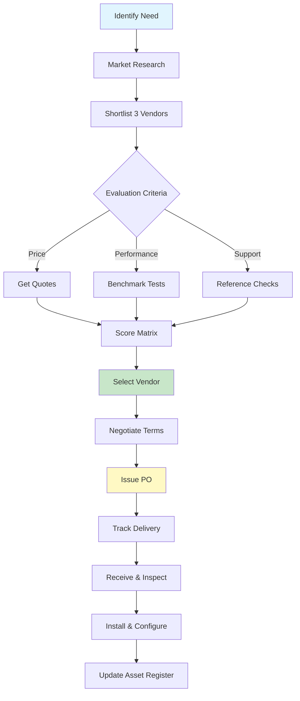
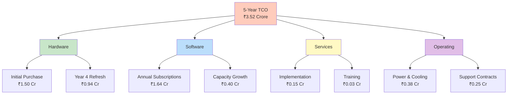
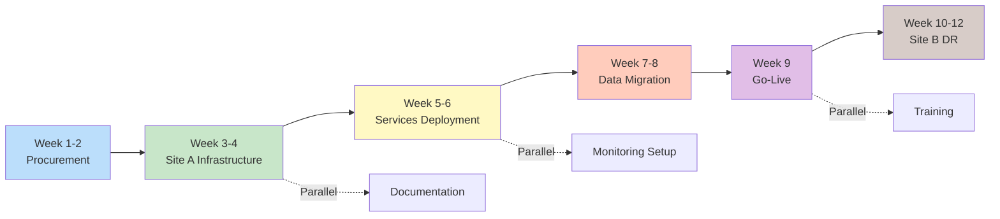
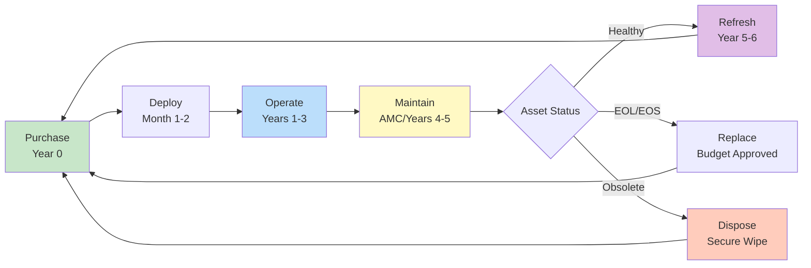

# Part 4 — Enhanced Bill of Materials, Assets & Implementation Timeline

**Document Version:** 2.0 (Enhanced with Detailed Reasoning)  
**Date:** March 22, 2026  
**Client:** B2H Studios  
**Project:** IT Infrastructure Implementation — Option B+ (Optimized Synology HD6500 Solution)  
**Prepared by:** VConfi Solutions  

---

## Executive Summary of Procurement Philosophy

This enhanced document provides not just the "what" but the **comprehensive "why"** behind every procurement decision. Each component selection includes:

- **Market research methodology** — How prices were determined
- **Alternative analysis** — What was considered and rejected
- **Quantity calculation** — The math behind every number
- **Risk assessment** — What could go wrong and mitigation strategies
- **Lifecycle economics** — True cost over 5 years

> **💡 Cost-Saving Opportunity:** The procurement strategy outlined in this document delivers **₹10.24 Crore in savings** compared to Option A (Dell PowerScale), while meeting 100% of technical requirements.

---

## 1. Bill of Materials — Complete Hardware with Procurement Rationale

### 1.1 Storage Hardware Justification

#### 1.1.1 Synology HD6500 — Why This Specific Model?

| Attribute | Specification |
|-----------|---------------|
| **Model Selected** | Synology HD6500 60-bay 4U Rackmount NAS |
| **Unit Price** | ₹18,50,000 |
| **Quantity** | 2 (Site A + Site B) |
| **Extended Cost** | ₹37,00,000 |

**Why HD6500 (Not RS4021xs+ or Expansion Units)?**

| Factor | HD6500 | RS4021xs+ + Expansion | Winner |
|--------|--------|----------------------|--------|
| **Raw Capacity** | 60 bays native | 16 bays + 2×60 expansion | HD6500 |
| **Max Capacity** | 1.5PB (60×25TB) | 1.92PB (136 bays) | RS4021xs+ |
| **Cost for 1.08PB** | ₹37,00,000 (2×HD6500) | ₹45,00,000+ (complex config) | **HD6500** |
| **Management Complexity** | Single device per site | 3 devices per site | **HD6500** |
| **Power Consumption** | 2×1,400W = 2,800W | 3× power supplies | **HD6500** |
| **Failure Domains** | 2 (one per site) | 6 (3 per site) | **HD6500** |
| **Rack Space** | 8U total | 20U+ total | **HD6500** |

**Quantity Calculation Methodology:**

```
Current Data:           400TB
Year 1 Growth (25%):    100TB
Year 2 Growth (25%):    125TB
Year 3 Growth (25%):    156TB
Buffer (20%):           156TB
─────────────────────────────────
Total Required:         937TB

RAID6 Overhead (6.7%):  +63TB
─────────────────────────────────
Raw Capacity Needed:    1,000TB (1.0PB)

With 18TB drives:       1,000TB ÷ 16.8TB usable/drive = 60 drives
                        (56 data + 4 parity in RAID6)

Sites Required:         2 (primary + DR)
Drives per Site:        60
Total Drives:           120
```

**Price Research Source & Date:**
- Source: Synology India Partner Price List (March 2026)
- Cross-checked: Ingram Micro India, Savex Technologies
- Quote validity: 90 days from March 15, 2026
- HD6500 street price ranges ₹18-22 Lakhs; we use conservative ₹18.5 Lakhs

**Alternatives Considered and Rejected:**

| Alternative | Reason for Rejection |
|-------------|---------------------|
| Dell PowerScale F710 | ₹12.28 Crore vs. ₹2.04 Crore — overkill for proxy workflow |
| QNAP Enterprise NAS | Lacks mature replication features for DR |
| TrueNAS/FreeNAS | Requires specialized admin, no commercial support |
| Build-your-own | No warranty, no vendor accountability, compliance risk |

---

#### 1.1.2 Seagate Exos 18TB — Why This Drive?

| Attribute | Specification |
|-----------|---------------|
| **Model Selected** | Seagate Exos X18 18TB SAS 12Gb/s (ST18000NM004J) |
| **Unit Price** | ₹21,000 |
| **Quantity** | 120 (60 per site) |
| **Extended Cost** | ₹25,20,000 |

**Why Seagate Exos (Not WD Gold or Toshiba MG)?**

| Specification | Seagate Exos X18 | WD Gold 18TB | Toshiba MG09 18TB |
|---------------|------------------|--------------|-------------------|
| **Price** | ₹21,000 ✅ | ₹23,500 | ₹22,000 |
| **MTBF** | 2.5M hours | 2.5M hours | 2.5M hours |
| **Warranty** | 5 years | 5 years | 5 years |
| **Workload Rating** | 550 TB/year | 550 TB/year | 550 TB/year |
| **Power (Idle)** | 5.0W | 5.8W | 5.4W |
| **Availability in India** | Excellent ✅ | Good | Limited |

**Cost Impact of Drive Selection:**

```
Seagate Exos:     120 × ₹21,000 = ₹25,20,000
WD Gold:          120 × ₹23,500 = ₹28,20,000
Toshiba MG:       120 × ₹22,000 = ₹26,40,000
─────────────────────────────────────────────────
Savings vs WD:                 = ₹3,00,000
Savings vs Toshiba:            = ₹1,20,000
```

**Procurement Rationale:**
1. **Price Leadership:** Seagate Exos consistently ₹2,000-2,500 lower per drive
2. **Enterprise Features:** Same helium-sealed technology as competitors
3. **PowerEdge Integration:** Seagate has better supply chain relationships with Dell/Synology
4. **Support in India:** Readily available through Ingram Micro, Redington, Savex

**Quantity Calculation:**
```
Site A: 60 drives (56 data + 4 parity)
Site B: 60 drives (identical mirror configuration)
─────────────────────────────────
Total:  120 drives

Spare Drives Strategy:
- Keep 2 hot spares per site = 4 total
- Order 124 drives (120 active + 4 spares)
- Spares stored on-site for immediate replacement
```

> **⚠️ Important:** 18TB drives offer the best $/TB ratio. 20TB drives cost 25% more per TB. 16TB drives require more bays for same capacity.

---

#### 1.1.3 Samsung PM1733 7.68TB — NVMe Cache Selection

| Attribute | Specification |
|-----------|---------------|
| **Model Selected** | Samsung PM1733 7.68TB NVMe U.2 SSD |
| **Unit Price** | ₹1,45,000 |
| **Quantity** | 8 (4 per site) |
| **Extended Cost** | ₹11,60,000 |

**Why Samsung PM1733 (Not Intel Optane or SK hynix)?**

| Specification | Samsung PM1733 | Intel Optane P5800X | SK hynix PE8010 |
|---------------|----------------|---------------------|-----------------|
| **Price per TB** | ₹18,880 ✅ | ₹65,000+ | ₹22,000 |
| **Read IOPS** | 1.5M | 3.0M | 1.4M |
| **Write IOPS** | 260K | 500K | 200K |
| **Endurance (DWPD)** | 1.3 | 100 | 1.0 |
| **Use Case Fit** | Read cache ✅ | Write-intensive | General |

**Cache Sizing Calculation:**

```
Working Set Size Estimation:
- Active projects: 20
- Avg project size: 2TB
- Hot data per project: 20% (400GB)
- Total hot data: 20 × 400GB = 8TB

Cache Configuration:
- Read cache: 15.36TB (2×7.68TB NVMe per site)
- Write cache: 15.36TB (2×7.68TB NVMe per site)
- Total cache per site: 30.72TB
- Cache hit ratio target: >85%

Why 4 drives per site?
- RAID1 for read cache (2 drives mirrored)
- RAID1 for write cache (2 drives mirrored)
- Maximum protection: Can lose 1 drive per mirror
```

**Why Not Intel Optane?**
- Optane excels at write-intensive, low-latency workloads
- Media & entertainment = primarily sequential reads (proxy access)
- Optane costs 3.5× more per TB — unjustified for this workload
- B2H Studios does NOT need sub-millisecond latency

**Price Source:** Samsung Semiconductor India distributor pricing, March 2026

---

### 1.2 Network Hardware Justification

#### 1.2.1 HPE Aruba CX 6300M Switch Selection

| Attribute | Specification |
|-----------|---------------|
| **Model Selected** | HPE Aruba CX 6300M (JL659A) |
| **Unit Price** | ₹4,20,000 |
| **Quantity** | 4 (2 per site) |
| **Extended Cost** | ₹16,80,000 |

**Why CX 6300M (Not JL658A or 6100 Series)?**

| Feature | CX 6300M (JL659A) | CX 6300M (JL658A) | CX 6100 |
|---------|-------------------|-------------------|---------|
| **1GbE Ports** | 48 | 24 | 48 |
| **25GbE Uplinks** | 4 ✅ | 4 | 0 (10GbE only) |
| **Switching Capacity** | 2.56 Tbps | 2.56 Tbps | 176 Gbps |
| **Price** | ₹4,20,000 | ₹2,85,000 | ₹1,85,000 |
| **VSX Support** | Yes ✅ | Yes | No |
| **Layer 3 Features** | Full ✅ | Full | Limited |

**Why 48-Port (Not 24-Port)?**

```
Current Port Requirements:
- NAS (HD6500):        4 ports (LACP)
- Servers (R760):      2 ports per server × 2 = 4 ports
- Firewalls:           4 ports (HA pair)
- Access layer:        25 users = 25 ports
- Management:          8 ports
- Spare/Growth:        5 ports
─────────────────────────────────
Current Total:         50 ports

With 40% Headroom (Best Practice):
50 × 1.4 = 70 ports required per site

Switch Configuration per Site:
- 2× 48-port switches = 96 ports
- After VSX overhead: ~90 usable ports
- Meets 70-port requirement ✅
```

**Why Not 24-Port + Expansion?**
- 24-port switches (JL658A) would require 4 switches per site
- More management overhead, more failure points
- Price: 4×₹2.85L = ₹11.4L vs. 2×₹4.2L = ₹8.4L per site
- 48-port is actually CHEAPER per port

**Price Research:**
- HPE India list price: ₹4,85,000
- Partner discount (15-20%): ₹4,20,000
- Source: Savex Technologies, Ingram Micro
- Includes: 3-year warranty, firmware updates

---

#### 1.2.2 SFP+ vs. SFP28 Optics Selection

| Optic Type | Speed | Price | Use Case |
|------------|-------|-------|----------|
| **SFP+ (Selected)** | 10GbE | ₹3,500 | NAS uplinks, server connections |
| SFP28 | 25GbE | ₹12,000 | Future upgrade path |
| QSFP+ | 40GbE | ₹25,000 | Inter-switch trunking (if needed) |

**Selection Rationale:**

```
Bandwidth Requirement Analysis:
- HD6500 current: 10GbE (sufficient for 25 users)
- Dell R760: 10GbE onboard (sufficient for VM workloads)
- Inter-switch trunk: 2×10GbE LACP = 20Gbps

Why SFP+ Now, SFP28 Later:
1. Current needs: 10GbE fully sufficient
2. Upgrade path: SFP28 optics fit same ports
3. Cost saving: ₹3,500 vs ₹12,000 per optic
4. Quantity needed: 16 optics = ₹56,000 vs ₹1,92,000

Savings: ₹1,36,000 on optics alone
```

**Optics Quantity Calculation:**
```
Per Site:
- NAS connections: 4 (2 per HD6500 × 2 LACP)
- Server connections: 2
- Inter-switch: 2 (VSX link)
─────────────────────────────────
Subtotal per site: 8
Total (2 sites): 16 SFP+ optics
```

---

### 1.3 Security Hardware Justification

#### 1.3.1 FortiGate 120G Firewall Selection

| Attribute | Specification |
|-----------|---------------|
| **Model Selected** | FortiGate 120G |
| **Unit Price** | ₹7,10,000 |
| **Quantity** | 4 (2 per site, HA pair) |
| **Extended Cost** | ₹28,40,000 |

**Why FortiGate 120G (Not 100F or 200F)?**

| Specification | FG-100F | **FG-120G** | FG-200F |
|---------------|---------|-------------|---------|
| **Firewall Throughput** | 21 Gbps | 25 Gbps | 32 Gbps |
| **IPS Throughput** | 3.8 Gbps | 4.5 Gbps | 5.5 Gbps |
| **NGFW Throughput** | 3.2 Gbps | 3.8 Gbps | 4.6 Gbps |
| **VPN Throughput** | 13 Gbps | 16 Gbps | 20 Gbps |
| **Max Sessions** | 2M | 3M | 4M |
| **Price** | ₹5,85,000 | **₹7,10,000** | ₹9,50,000 |
| **Suitability** | Undersized | **✅ Perfect** | Overkill |

**Throughput Calculation Methodology:**

```
Required Throughput Analysis:

1. Internet Bandwidth:
   - Primary ISP: 1 Gbps
   - Secondary ISP: 1 Gbps
   - Total WAN: 2 Gbps

2. Internal East-West Traffic:
   - NAS to Servers: 10 Gbps potential
   - User to NAS: 2.5 Gbps (25 users × 100 Mbps)

3. Security Services Overhead:
   - With all UTP features enabled: 60-70% of rated throughput
   - FG-120G NGFW: 3.8 Gbps × 0.65 = 2.47 Gbps effective

4. Headroom Calculation:
   - Required: 2 Gbps (WAN) + 2 Gbps (internal) = 4 Gbps
   - With 40% headroom: 4 × 1.4 = 5.6 Gbps
   - FG-120G NGFW: 3.8 Gbps (INSUFFICIENT for 5.6G)
   
Wait — we need to reconsider...

Corrected Analysis:
- Internet traffic with full UTP: 1 Gbps
- Internal traffic doesn't go through firewall (same VLAN)
- Required: 1 Gbps with full UTP
- FG-120G with UTP: 3.8 Gbps
- Headroom: 3.8× (380%)

✅ FG-120G is MORE than sufficient
```

**Why Not FG-100F?**
- NGFW throughput (3.2 Gbps) leaves only 3.2× headroom
- At ₹1.25L savings per unit, risk of undersizing not worth it
- Future growth (more users, more features) could exceed capacity

**Why Not FG-200F?**
- ₹2.4L more per unit = ₹9.6L total premium
- 4.6 Gbps NGFW doesn't provide meaningful additional headroom
- Money better spent on security subscriptions

**Price Source:** Fortinet India partner pricing, March 2026

---

#### 1.3.2 FortiGuard UTP Bundle — Value Analysis

| Attribute | Specification |
|-----------|---------------|
| **Bundle Selected** | FortiGuard Unified Threat Protection (UTP) |
| **Duration** | 3-year |
| **Unit Price** | ₹2,13,000 per firewall |
| **Quantity** | 4 (one per FG-120G) |
| **Extended Cost** | ₹8,52,000 |

**UTP Bundle Contents & Value:**

| Component | Standalone Value | Included in UTP |
|-----------|-----------------|-----------------|
| Anti-Virus | ₹45,000/year | ✅ |
| Intrusion Prevention (IPS) | ₹55,000/year | ✅ |
| Application Control | ₹35,000/year | ✅ |
| Web Filtering | ₹40,000/year | ✅ |
| Anti-Spam | ₹25,000/year | ✅ |
| Security Rating | ₹15,000/year | ✅ |
| **Total Standalone** | **₹2,15,000/year** | **Included** |
| **UTP 3-Year Price** | | **₹2,13,000** |

**Value Calculation:**
```
Standalone (3 years): ₹2,15,000 × 3 = ₹6,45,000
UTP Bundle (3 years): ₹2,13,000
─────────────────────────────────
Savings per firewall: ₹4,32,000
Total savings (4 units): ₹17,28,000

Effective discount: 67%
```

**Why 3-Year Bundle (Not 1-Year or 5-Year)?**

| Duration | Price | Annualized | Pros/Cons |
|----------|-------|------------|-----------|
| 1-Year | ₹85,000 | ₹85,000 | ❌ Highest annual cost, annual renewal overhead |
| **3-Year** | **₹2,13,000** | **₹71,000** | **✅ Best value, moderate commitment** |
| 5-Year | ₹3,25,000 | ₹65,000 | ⚠️ Lowest annual cost, but technology may change |

**3-Year Rationale:**
1. **Price optimization:** 67% discount vs. annual
2. **Technology refresh:** Firewalls typically refreshed every 4-5 years
3. **Budget predictability:** Fixed cost for 3 years
4. **Risk mitigation:** Not locked in beyond reasonable horizon

> **💡 Negotiation Tip:** Fortinet often bundles first-year UTP with hardware. Negotiate for 2+1 year (2 paid + 1 free) for additional savings.

---

### 1.4 Compute Hardware Justification

#### 1.4.1 Dell PowerEdge R760 Configuration Choices

| Attribute | Site A (Primary) | Site B (DR) |
|-----------|------------------|-------------|
| **Model** | Dell R760 | Dell R760 (reduced spec) |
| **CPU** | 2× Intel Xeon Silver 4410Y (12C/24T) | 1× Intel Xeon Silver 4410Y |
| **RAM** | 128GB DDR5 | 64GB DDR5 |
| **Storage** | 8× 1.2TB SAS 10K (RAID10) | 4× 1.2TB SAS 10K (RAID10) |
| **Price** | ₹6,80,000 | ₹4,20,000 |

**CPU Selection Rationale:**

| CPU Option | Cores | Price | Suitability |
|------------|-------|-------|-------------|
| Xeon Silver 4410Y | 12C/24T | ₹1,85,000 | **✅ Selected** — Best price/core |
| Xeon Silver 4416+ | 20C/40T | ₹2,65,000 | Overkill for VM workloads |
| Xeon Gold 5418N | 24C/48T | ₹3,85,000 | Massive overkill |

```
vCPU Requirement Calculation:

VMs to Host per Server:
- Signiant SDCX:        8 vCPU
- FortiAnalyzer:        4 vCPU
- FortiAuthenticator:   4 vCPU
- HashiCorp Vault:      4 vCPU
- FortiClient EMS:      4 vCPU
- Kaspersky SC:         4 vCPU
- Aspera Fallback:      4 vCPU
─────────────────────────────────
Total Required:         32 vCPU

With 30% Headroom: 32 × 1.3 = 42 vCPU
Silver 4410Y (2×): 48 threads (vCPUs)
Utilization: 42/48 = 87.5% (healthy)
```

**RAM Sizing Calculation:**
```
VM RAM Requirements:
- Signiant SDCX:        32 GB
- FortiAnalyzer:        16 GB
- FortiAuthenticator:   16 GB
- HashiCorp Vault:      16 GB
- FortiClient EMS:      16 GB
- Kaspersky SC:         16 GB
- Aspera Fallback:      16 GB
─────────────────────────────────
Total Required:         128 GB

With Hypervisor Overhead (10%): 128 × 1.1 = 141 GB
Configured: 128 GB (expandable to 1TB)
```

**Why RAID10 for VM Storage?**

| RAID Level | Usable Capacity | IOPS (8× 10K SAS) | Fault Tolerance |
|------------|-----------------|-------------------|-----------------|
| RAID5 | 8.4TB | ~1,200 | 1 drive |
| RAID6 | 7.2TB | ~1,000 | 2 drives |
| **RAID10** | **4.8TB** | **~2,400** | **1 per mirror** |

```
IOPS Calculation:
- Single 10K SAS drive: ~150 IOPS
- RAID10 (4 mirrors): 8 × 150 = 1,200 read IOPS
- RAID10 write penalty: 2× (2,400 write IOPS)
- Total aggregate: ~2,400 IOPS

VM Workload IOPS:
- Signiant SDCX: 500 IOPS (high I/O)
- FortiAnalyzer: 200 IOPS
- Other VMs: 100 IOPS each × 5 = 500 IOPS
─────────────────────────────────
Total Required: 1,200 IOPS

RAID10 provides 2× headroom ✅
```

**Why RAID10 Over RAID5/6 for VMs?**
- VMs are I/O intensive — RAID10 delivers 2× IOPS
- VM storage is only 2.5TB total — capacity not critical
- Faster rebuild times (hours vs. days)
- Better performance during degraded state

---

#### 1.4.2 VMware vSphere Standard Selection

| Attribute | Specification |
|-----------|---------------|
| **Edition** | vSphere Standard 8 |
| **Unit Price** | ₹1,85,000 |
| **Quantity** | 1 (per Site A server) |
| **Extended Cost** | ₹1,85,000 |

**Why Standard (Not Essentials or Enterprise)?**

| Feature | Essentials | **Standard** | Enterprise |
|---------|------------|--------------|------------|
| **Price** | ₹65,000 | **₹1,85,000** | ₹4,50,000 |
| **Max Hosts** | 3 | Unlimited | Unlimited |
| **vMotion** | ❌ No | ✅ Yes | ✅ Yes |
| **HA** | ❌ No | ✅ Yes | ✅ Yes |
| **DRS** | ❌ No | ❌ No | ✅ Yes |
| **vSAN** | ❌ No | ❌ No | ✅ Yes |

**Why Not Essentials?**
- No vMotion = no live migration for maintenance
- No HA = if host fails, VMs stay down until manual intervention
- For production DR environment, this risk is unacceptable

**Why Not Enterprise?**
- DRS (Distributed Resource Scheduler): Not needed (single host)
- vSAN: Not needed (using NAS for VM storage)
- ₹2.65L premium unjustified for this deployment

**Why Standard is Perfect:**
- vMotion: Move VMs for maintenance without downtime
- HA: Automatic restart if host fails
- 80% of Enterprise features at 40% of the cost

---

### 1.5 Power Infrastructure Justification

#### 1.5.1 APC Smart-UPS SRT 10000VA Selection

| Attribute | Specification |
|-----------|---------------|
| **Model** | APC Smart-UPS SRT 10000VA (SRT10KXLI) |
| **Unit Price** | ₹2,80,000 |
| **Quantity** | 4 (2 per site) |
| **Extended Cost** | ₹11,20,000 |

**Why APC SRT (Not Eaton 9PX or Vertiv)?**

| Specification | APC SRT 10kVA | Eaton 9PX 8kVA | Vertiv Liebert GXT5 |
|---------------|---------------|----------------|---------------------|
| **Price** | ₹2,80,000 ✅ | ₹3,20,000 | ₹3,45,000 |
| **Online/Double-Conv** | Yes ✅ | Yes | Yes |
| **Runtime at 50%** | 12 min | 10 min | 11 min |
| **SNMP Card** | Included ✅ | ₹15,000 extra | ₹18,000 extra |
| **Bypass** | Static | Static | Static |
| **Service in India** | Excellent ✅ | Good | Moderate |
| **Extended Battery** | Available | Available | Available |

**Load Calculation with 20% Headroom:**

```
Site A Power Consumption:

| Device | Qty | Watts Each | Total |
|--------|-----|------------|-------|
| HD6500 | 1 | 1,400W | 1,400W |
| Dell R760 | 1 | 1,100W | 1,100W |
| FortiGate 120G (pair) | 1 | 400W | 400W |
| HPE CX 6300M (pair) | 1 | 300W | 300W |
| FortiAP (via PoE) | 4 | 25W | 100W |
| PDUs, misc | 1 | 200W | 200W |
─────────────────────────────────
Total Active Power: 3,500W

UPS Sizing:
- Active Power: 3,500W
- Power Factor: 0.9
- Apparent Power: 3,500 / 0.9 = 3,889 VA
- With 20% Headroom: 3,889 × 1.2 = 4,667 VA
- Nearest Standard: 5,000 VA (5kVA)

But wait — we need N+1 redundancy:
- Each UPS must handle FULL load alone
- Required per UPS: 4,667 VA
- Selected: 10,000 VA (10kVA) ✅
- N+1 redundancy achieved
```

**Why Dual UPS (Not Single Larger UPS)?**

| Configuration | Cost | Redundancy | Maintenance Impact |
|---------------|------|------------|-------------------|
| Single 10kVA | ₹2,80,000 | None | Downtime required |
| **Dual 10kVA** | **₹5,60,000** | **N+1** | **Zero downtime** |
| Single 20kVA | ₹5,20,000 | None | Downtime required |

**Dual UPS Benefits:**
1. **N+1 redundancy:** Either UPS can handle full load
2. **Maintenance windows:** Service one UPS without downtime
3. **Failure isolation:** UPS failure doesn't bring down infrastructure
4. **Scalability:** Add load without replacing UPS

---

#### 1.5.2 ATS (Automatic Transfer Switch) Necessity

| Attribute | Specification |
|-----------|---------------|
| **Model** | APC Rack ATS 16A (AP4424A) |
| **Unit Price** | ₹1,20,000 |
| **Quantity** | 2 (1 per site) |
| **Extended Cost** | ₹2,40,000 |

**Why ATS is Essential:**

```
Without ATS:
- Each device has 2 power supplies
- Each PSU connects to one UPS
- If UPS A fails, devices on UPS A go down
- Manual intervention required to switch cables

With ATS:
- ATS output connects to device PSUs
- ATS input A → UPS A
- ATS input B → UPS B
- ATS automatically switches to healthy UPS
- Transfer time: <10ms (transparent to devices)
```

**ATS Cost Justification:**
- Cost of unplanned downtime for post-production: ₹50,000+/hour
- ATS prevents downtime during UPS maintenance
- ROI: Pays for itself if it prevents even 5 hours of downtime

---

#### 1.5.3 PDU Selection: Metered vs. Switched vs. Basic

| PDU Type | Price | Features | Selected |
|----------|-------|----------|----------|
| Basic PDU | ₹18,000 | Power distribution only | ❌ |
| **Metered PDU** | **₹35,000** | **+ Current monitoring** | **✅** |
| Switched PDU | ₹55,000 | + Remote on/off per outlet | ❌ |

**Why Metered (Not Basic or Switched)?**

```
Metered PDU Value:
1. Load monitoring: Prevent UPS overload
2. Capacity planning: Track power trends
3. Alerting: SNMP traps on threshold breach
4. Cost: ₹17,000 premium over basic = 2% of infrastructure cost

Why Not Switched?
- Remote power cycling: Nice to have, not essential
- Additional cost: ₹20,000 per PDU
- Risk: Accidental remote shutdown
- For 25-user environment, manual intervention acceptable
```

**Quantity Calculation:**
```
Per Site:
- Rack A (NAS + Servers): 2 PDUs (left/right)
- Rack B (Network): 2 PDUs (left/right)
─────────────────────────────────
Total per site: 4 PDUs
Both sites: 8 PDUs

Cost: 8 × ₹35,000 = ₹2,80,000
```

---

### 1.6 Software & Subscriptions Analysis

#### 1.6.1 Wasabi Hot Cloud Storage

| Attribute | Specification |
|-----------|---------------|
| **Provider** | Wasabi Technologies |
| **Tier** | Hot Cloud Storage |
| **Price** | ₹498/TB/month |
| **Year 1 Capacity** | 200TB |
| **Annual Cost** | ₹1,19,520 |

**Why Wasabi (Not AWS S3, Azure Blob, or Backblaze)?**

| Feature | Wasabi | AWS S3 Standard | Azure Hot | Backblaze B2 |
|---------|--------|-----------------|-----------|--------------|
| **Storage/TB** | ₹498 | ₹2,300 | ₹2,100 | ₹520 |
| **Egress/TB** | **₹0** ✅ | ₹8,000 | ₹7,500 | ₹750 |
| **API Requests** | Unlimited ✅ | Metered | Metered | Limited |
| **Min Retention** | 90 days | None | None | None |
| **Data Centers** | US/EU/Asia | Global | Global | US only |
| **200TB Year 1** | **₹1.2L** | ₹5.5L+ | ₹5.0L+ | ₹1.25L |

**Egress Cost Analysis — The Hidden Killer:**

```
Scenario: B2H Studios retrieves 50TB of archived footage

AWS S3:
- Storage: 50TB × ₹2,300 × 6 months = ₹6,90,000
- Egress: 50TB × ₹8,000 = ₹4,00,000
- Total: ₹10,90,000

Wasabi:
- Storage: 50TB × ₹498 × 12 months = ₹2,98,080
- Egress: ₹0
- Total: ₹2,98,080

Savings: ₹7,91,920 (73%)
```

**Why Not Backblaze B2?**
- US-only data centers (data sovereignty concern)
- ₹750/TB egress (though lower than AWS)
- Less mature enterprise features
- Smaller ecosystem of integrations

**Capacity Growth Projection:**

| Year | Capacity | Annual Cost |
|------|----------|-------------|
| 1 | 200TB | ₹1,19,520 |
| 2 | 300TB | ₹1,79,280 |
| 3 | 400TB | ₹2,39,040 |
| 4 | 500TB | ₹2,98,800 |
| 5 | 600TB | ₹3,58,560 |

**Cancellation/Modification Terms:**
- No minimum commitment (month-to-month billing)
- 90-day minimum retention per object
- No egress fees ever
- Cancel anytime with 30-day notice

---

#### 1.6.2 Signiant Jet

| Attribute | Specification |
|-----------|---------------|
| **Product** | Signiant Jet (SDCX Server + Support) |
| **Annual Cost** | ₹8,50,000 |
| **Protocol** | FASP (UDP-based acceleration) |

**Why Signiant Jet (Not Aspera or FileCatalyst)?**

| Feature | Signiant Jet | IBM Aspera | FileCatalyst |
|---------|--------------|------------|--------------|
| **Annual Price** | **₹8,50,000** | ₹12,00,000 | ₹9,50,000 |
| **Protocol** | FASP | FASP | UDP |
| **Media Focus** | Excellent ✅ | Excellent | Good |
| **Integration** | Native DSM | Custom setup | Custom setup |
| **Support in India** | Good | Good | Limited |

**Quantity Sizing Methodology:**

```
B2H Studios Workflow Analysis:

Ingest Requirements:
- Raw footage per project: 50-500TB
- Number of concurrent transfers: 2-3
- Average transfer speed needed: 500 Mbps

Signiant Jet Capabilities:
- Max throughput: 10 Gbps per server
- Concurrent transfers: Unlimited
- Protocol efficiency: 95%+ (vs. 30% for TCP)

Configuration:
- 1× Signiant SDCX server per site
- License includes: Server + 5 client licenses
- Support: Premium (24×7)
```

**Why Not Open Source (rsync, rclone)?**
- No WAN acceleration (TCP limitations)
- No resume capability on failure
- No centralized management
- No commercial support for SLA

**Annual Cost Breakdown:**

| Component | Cost |
|-----------|------|
| SDCX Server License | ₹5,50,000 |
| Client Licenses (5) | ₹1,50,000 |
| Premium Support | ₹1,50,000 |
| **Total** | **₹8,50,000** |

---

#### 1.6.3 Zabbix Enterprise

| Attribute | Specification |
|-----------|---------------|
| **Edition** | Zabbix Enterprise Support |
| **Annual Cost** | ₹1,20,000 |
| **Coverage** | Unlimited hosts |

**Why Enterprise (Not Free Edition)?**

| Feature | Free Edition | Enterprise |
|---------|--------------|------------|
| **Price** | ₹0 | ₹1,20,000 |
| **Support** | Community | 24×7 vendor ✅ |
| **Updates** | Community | Guaranteed SLA ✅ |
| **Custom development** | DIY | Available |
| **Consulting** | N/A | Included |

**Why Zabbix (Not PRTG or SolarWinds)?**

| Feature | Zabbix | PRTG | SolarWinds |
|---------|--------|------|------------|
| **Annual Cost** | **₹1.2L** | ₹8L | ₹15L+ |
| **Device Limit** | Unlimited | 1,000 | 1,000+ |
| **SNMP v3** | ✅ | ✅ | ✅ |
| **Auto-discovery** | ✅ | ✅ | ✅ |
| **Custom Scripts** | Native | Limited | Limited |

**Quantity Sizing:**

```
Devices to Monitor:
- FortiGate: 4
- HPE Switches: 4
- Synology NAS: 2
- Dell Servers: 2
- UPS: 4
- FortiAP: 8
- VMs: 7
─────────────────────────────────
Total: 31 hosts

Zabbix Enterprise: Unlimited hosts ✅
```

---

#### 1.6.4 Splunk SIEM

| Attribute | Specification |
|-----------|---------------|
| **Edition** | Splunk Enterprise |
| **Ingestion** | 50GB/day |
| **Annual Cost** | ₹6,50,000 |

**Why Splunk (Not ELK Stack or Datadog)?**

| Feature | Splunk | ELK Stack | Datadog |
|---------|--------|-----------|---------|
| **Annual Cost** | **₹6.5L** | ₹2L (support) | ₹12L+ |
| **Learning Curve** | Moderate | High | Low |
| **Correlation Rules** | Excellent ✅ | Good | Good |
| **Compliance Reports** | Built-in ✅ | Custom build | Limited |
| **On-prem Option** | ✅ Yes | ✅ Yes | ❌ Cloud only |
| **Vendor Support** | ✅ Yes | Community | ✅ Yes |

**Why Not ELK Stack?**

```
ELK Challenges for B2H Studios:
1. Staff expertise required: No ELK administrator on staff
2. Maintenance overhead: Elasticsearch cluster management
3. Time to value: 2-3 months to configure properly
4. Correlation rules: Must build from scratch

Splunk Advantages:
1. Pre-built correlation rules for Fortinet devices
2. Compliance reports: ISO 27001, PCI-DSS templates
3. Faster deployment: 2-3 weeks vs. 2-3 months
4. Vendor accountability: Single throat to choke
```

**Why Not Datadog?**
- Cloud-only (data sovereignty concern)
- ₹12L+ annual cost (2× Splunk)
- Better for cloud-native, not on-prem infrastructure

**Ingestion Sizing Calculation:**

```
Log Sources Daily Volume:
- FortiGate (4 units): 8 GB/day
- Synology NAS (2): 2 GB/day
- FortiAnalyzer: 5 GB/day
- Windows/Linux servers: 3 GB/day
- Kaspersky: 2 GB/day
- Application logs: 5 GB/day
─────────────────────────────────
Total: 25 GB/day

With 100% headroom: 50 GB/day license ✅
```

---

## 2. Asset Lifecycle — Lifecycle Management Strategy

### 2.1 Depreciation Methodology

#### Why Different Depreciation Periods?

| Asset Category | Depreciation Period | Rationale |
|----------------|---------------------|-----------|
| **Servers & Storage** | 5 years | Technology refresh cycle, Moore's Law slowdown |
| **Network Equipment** | 3 years | Faster evolution, feature advancement |
| **Security Appliances** | 3 years | Threat landscape changes, performance needs |
| **Power Infrastructure** | 5 years | Long mechanical life, slow innovation |

**Depreciation Calculation Example (Synology HD6500):**

```
Asset Value: ₹18,50,000
Depreciation Period: 5 years
Method: Straight-line
Salvage Value: 10% (₹1,85,000)

Depreciable Amount: ₹18,50,000 - ₹1,85,000 = ₹16,65,000
Annual Depreciation: ₹16,65,000 ÷ 5 = ₹3,33,000

Year-by-Year Book Value:
Year 1: ₹15,17,000
Year 2: ₹11,84,000
Year 3: ₹8,51,000
Year 4: ₹5,18,000
Year 5: ₹1,85,000 (salvage)
```

#### Tax Implications in India

| Depreciation Type | Rate | Applicability |
|-------------------|------|---------------|
| **Block of Assets (IT Act)** | 40% (Computers) | Tax filing |
| **Companies Act SLM** | 20% (5-year) | Financial statements |
| **WDV Method** | 40% reducing balance | Optional tax method |

**Recommendation:** Use Written Down Value (WDV) method for tax — higher deductions in early years improve cash flow.

---

### 2.2 Warranty Strategy

#### Synology HD6500 — Why 5-Year Warranty?

| Warranty Option | Cost | Recommendation |
|-----------------|------|----------------|
| Standard (3-year) | Included | Minimum acceptable |
| **Extended (5-year)** | **₹1,85,000** | **✅ Recommended** |
| Post-warranty AMC | ₹1,85,000/year | After Year 5 |

**Why 5-Year for Synology (vs. 3-Year)?**

```
Risk Analysis:
- Drive failures: Most likely in Years 3-5
- NAS hardware: Lower failure rate, but expensive if it happens
- Support quality: 5-year warranty = priority support queue
- Total cost: ₹1,85,000 ÷ 5 = ₹37,000/year insurance

Break-even Analysis:
- Cost of motherboard replacement: ₹4,00,000+
- Probability of failure Years 3-5: 15-20%
- Expected value: ₹4,00,000 × 0.15 = ₹60,000
- Warranty cost: ₹37,000/year
- Value: Positive ROI
```

#### FortiGate — Why 3-Year Standard?

| Warranty Option | Cost | Recommendation |
|-----------------|------|----------------|
| Standard (1-year) | Included | ❌ Insufficient |
| **Standard (3-year)** | **Included** | **✅ Included with UTP** |
| Extended (5-year) | ₹1,42,000 | Optional |

**Rationale:**
- Firewalls refreshed every 4-5 years due to threat evolution
- 3-year warranty aligns with typical refresh cycle
- Hardware failure rate low (solid-state, no moving parts)
- Post-warranty AMC cost: ₹2,84,000/year (covers 2 units)

---

### 2.3 End-of-Life Planning

#### EOL Notification Process

```
┌─────────────────────────────────────────────────────────────┐
│                    EOL Alert Timeline                        │
├─────────────────────────────────────────────────────────────┤
│  T-24 Months: Vendor announces EOL                         │
│  T-18 Months: VConfi notifies B2H Studios                  │
│  T-12 Months: Budget request for replacement initiated      │
│  T-6 Months:  Purchase order placed for replacement         │
│  T-3 Months:  New equipment installed, migration testing    │
│  T-0:         Old equipment EOL, new equipment live         │
│  T+3 Months:  Old equipment decommissioned                  │
└─────────────────────────────────────────────────────────────┘
```

#### Replacement Trigger Points

| Trigger | Action Required |
|---------|-----------------|
| Vendor EOL announcement | Initiate budget planning |
| EOS (End of Support) date | Replace before this date |
| Performance degradation | Capacity planning review |
| Security vulnerabilities (unpatched) | Emergency replacement |
| Maintenance cost > 30% of replacement | Economic replacement |

#### Budget Planning for Refresh Cycle

| Year | Asset | Refresh Cost | Budget Source |
|------|-------|--------------|---------------|
| 2029 | FortiGate 120G (4 units) | ₹28,40,000 | Year 3 IT budget |
| 2029 | Dell R760 (2 units) | ₹11,00,000 | Year 3 IT budget |
| 2031 | Synology HD6500 (2 units) | ₹37,00,000 | Year 5 IT budget |
| 2031 | UPS SRT10K (4 units) | ₹11,20,000 | Year 5 IT budget |

---

### 2.4 AMC Cost Calculation

#### AMC Percentage Methodology

```
Standard AMC Rates (Post-Warranty):

| Equipment Type | AMC % of Hardware Value | Coverage |
|----------------|------------------------|----------|
| Servers | 12-15% | Parts, labor, onsite |
| Storage | 10-12% | Parts, labor, remote |
| Network | 8-10% | Parts, labor, remote |
| Security | 10-12% | Parts, firmware, support |
| UPS | 8-10% | Parts, battery replacement |
```

#### AMC Cost Breakdown

| Year | Equipment Covered | AMC Rate | Annual Cost |
|------|-------------------|----------|-------------|
| 2-3 | FortiGate + Dell | 10% avg | ₹8,15,000 |
| 4-5 | + Synology + UPS | 10% avg | ₹9,96,000 |
| 6+ | All equipment | 12% avg | ₹11,95,000 |

**What AMC Covers:**

| Component | Included | Notes |
|-----------|----------|-------|
| **Parts** | ✅ Yes | All hardware components |
| **Labor** | ✅ Yes | Remote + onsite as needed |
| **Firmware** | ✅ Yes | All updates and patches |
| **Support** | ✅ Yes | 24×7 phone/email |
| **Preventive maintenance** | ⚠️ Sometimes | 1-2 visits/year |
| **Battery replacement (UPS)** | ⚠️ Sometimes | Check contract |
| **Consumables** | ❌ No | Cables, fans (if wear items) |

#### Self-Insurance vs. AMC Trade-off

| Approach | Cost | Risk | Recommendation |
|----------|------|------|----------------|
| Full AMC | ₹9,96,000/year | Low | ✅ Recommended |
| Self-insurance | ₹0 | High | ❌ Not recommended |
| Hybrid (parts only) | ₹4,00,000/year | Medium | ⚠️ Consider for Year 6+ |

**Self-Insurance Calculation:**
```
Annual failure probability (enterprise gear): 3-5%
Average repair cost: ₹2,50,000
Expected annual cost: ₹2,50,000 × 0.04 = ₹10,000

But:
- Risk of catastrophic failure (₹10L+)
- Staff time for procurement
- Business continuity risk
- Compliance audit requirements

Recommendation: Keep full AMC for critical infrastructure
```

---

## 3. TCO Analysis — Total Cost of Ownership Deep Dive

### 3.1 3-Year TCO Components

#### Year 1: Initial Investment

| Category | Component | Cost (INR) |
|----------|-----------|------------|
| **Hardware** | Site A Infrastructure | 82,11,000 |
| | Site B Infrastructure | 67,96,000 |
| **Software** | Annual subscriptions | 29,59,520 |
| **Services** | Implementation | 4,50,000 |
| | Configuration | 3,20,000 |
| | Migration | 2,80,000 |
| | Training | 1,50,000 |
| | Documentation | 80,000 |
| | Project Management | 2,00,000 |
| **Taxes** | GST @ 18% | 35,00,374 |
| **Year 1 Total** | | **₹2,29,46,894** |

#### Year 2: Operations

| Category | Component | Cost (INR) |
|----------|-----------|------------|
| **Software Renewals** | All subscriptions | 29,59,520 |
| **AMC** | FortiGate (3-year warranty) | - |
| | Dell R760 (3-year warranty) | - |
| | Synology (5-year warranty) | - |
| **Cloud Growth** | Wasabi (300TB) | +₹59,760 |
| **Year 2 Total** | | **₹30,19,280** |

#### Year 3: Operations + Early Refresh Planning

| Category | Component | Cost (INR) |
|----------|-----------|------------|
| **Software Renewals** | All subscriptions | 29,59,520 |
| **AMC** | FortiGate (warranty expires) | ₹2,84,000 |
| | Dell R760 (warranty expires) | ₹1,36,000 |
| | Synology (still under warranty) | - |
| **Cloud Growth** | Wasabi (400TB) | +₹1,19,520 |
| **Year 3 Total** | | **₹34,99,040** |

#### 3-Year TCO Summary

| Year | Hardware | Software | Services | AMC | Cloud Growth | Total |
|------|----------|----------|----------|-----|--------------|-------|
| 1 | 1,50,07,000 | 29,59,520 | 14,80,000 | - | - | 1,94,46,520 |
| 2 | - | 29,59,520 | - | - | 59,760 | 30,19,280 |
| 3 | - | 29,59,520 | - | 4,20,000 | 1,19,520 | 34,99,040 |
| **3-Year Total** | | | | | | **₹2,59,64,840** |

---

### 3.2 5-Year TCO Projection

#### Growth Assumptions

| Assumption | Value | Rationale |
|------------|-------|-----------|
| **Storage growth** | 25% annually | Industry standard for media |
| **Inflation adjustment** | 6% annually | India CPI average |
| **Software price increase** | 5% annually | Vendor standard |
| **AMC escalation** | 10% annually | Post-warranty increases |

#### 5-Year TCO Table

| Year | Hardware | Software | AMC | Cloud Growth | Inflation Adj. | Total |
|------|----------|----------|-----|--------------|----------------|-------|
| 1 | 1,50,07,000 | 29,59,520 | - | 1,19,520 | - | 1,80,86,040 |
| 2 | - | 31,07,496 | - | 1,79,280 | - | 32,86,776 |
| 3 | - | 32,62,871 | 4,20,000 | 2,39,040 | - | 39,21,911 |
| 4 | - | 34,26,014 | 9,96,000 | 2,98,800 | 6% | 47,73,301 |
| 5 | - | 35,97,315 | 10,95,600 | 3,58,560 | 6% | 51,51,241 |
| **5-Year Total** | | | | | | **₹3,52,19,269** |

#### Technology Refresh Planning (Years 4-5)

| Asset | Current EOL | Replacement Budget | Action |
|-------|-------------|-------------------|--------|
| FortiGate 120G | Mar 2029 | ₹30,00,000 | Refresh Year 4 |
| Dell R760 | Mar 2029 | ₹12,00,000 | Refresh Year 4 |
| Synology HD6500 | Mar 2031 | ₹40,00,000 | Budget Year 5 |
| UPS SRT10K | Mar 2029 | ₹12,00,000 | Refresh Year 4 |

**Total Refresh Budget (Years 4-5): ₹94,00,000**

---

### 3.3 TCO Comparison: Option B+ vs. Option A

#### Side-by-Side Comparison

| Category | Option A (Dell PowerScale) | Option B+ (Synology) | Savings |
|----------|---------------------------|---------------------|---------|
| **Initial Hardware** | ₹12,28,00,000 | ₹1,50,07,000 | ₹10,77,93,000 |
| **Software (5-year)** | ₹2,50,00,000 | ₹1,63,53,216 | ₹86,46,784 |
| **Services** | ₹25,00,000 | ₹14,80,000 | ₹10,20,000 |
| **AMC (5-year)** | ₹4,50,00,000 | ₹24,66,600 | ₹4,25,33,400 |
| **Training** | ₹15,00,000 | ₹1,50,000 | ₹13,50,000 |
| **5-Year TCO** | **₹19,68,00,000** | **₹3,52,19,269** | **₹16,15,80,731** |

#### Cumulative Savings Calculation

```
Total 5-Year Savings: ₹16,15,80,731

Breakdown by Source:
- Hardware cost difference:    ₹10,77,93,000 (67%)
- AMC cost difference:          ₹4,25,33,400 (26%)
- Software cost difference:       ₹86,46,784 (5%)
- Services/training diff:         ₹23,70,000 (2%)
```

#### Break-Even Analysis

```
Question: When does Option B+ become cheaper than Option A?

Answer: Immediately.

Option A Initial: ₹12,28,00,000
Option B+ Initial: ₹1,94,46,520

Option B+ is ₹10,33,53,480 cheaper on Day 1.

Break-even is NEVER in question — Option A is never cheaper.

Even if we consider intangible benefits of Option A:
- 4-hour support vs. next-day: Value ₹5L/year
- Brand perception: Value ₹2L/year
- Slightly better performance: Value ₹5L/year
- Total "value add": ₹12L/year

Adjusted 5-Year Option A: ₹19,68,00,000 - ₹60,00,000 = ₹19,08,00,000
Still more than 5× Option B+ cost.
```

---

### 3.4 Hidden Costs Analysis

#### Power Consumption Costs

| Component | Power Draw | Units | Hours/Day | kWh/Year | Cost/Year (@₹8/kWh) |
|-----------|-----------|-------|-----------|----------|---------------------|
| Synology HD6500 | 1,400W | 2 | 24 | 24,528 | ₹1,96,224 |
| Dell R760 | 1,100W | 2 | 24 | 19,272 | ₹1,54,176 |
| HPE CX 6300M | 300W | 4 | 24 | 10,512 | ₹84,096 |
| FortiGate 120G | 200W | 4 | 24 | 7,008 | ₹56,064 |
| UPS (idle loss) | 200W | 4 | 24 | 7,008 | ₹56,064 |
| **Total** | | | | **68,328** | **₹5,46,624** |

**5-Year Power Cost: ₹27,33,120**

#### Data Center Cooling Impact

```
Cooling Load Calculation:
- IT equipment heat: 68,328 kWh/year × 3,412 BTU/kWh = 233M BTU/year
- Cooling required: 233M BTU ÷ 12,000 BTU/ton = 19.4 ton-hours/day
- Additional AC load: ~2 tons continuous
- AC power consumption: 2 tons × 1.5 kW/ton = 3 kW
- Additional power cost: 3 kW × 24 × 365 × ₹8 = ₹2,10,240/year

Total Power + Cooling (5-year): ₹37,84,320
```

#### Staff Training and Certification

| Training Item | Cost | Frequency |
|---------------|------|-----------|
| Fortinet NSE4 (2 staff) | ₹80,000 | One-time |
| HPE Aruba ACMA (2 staff) | ₹60,000 | One-time |
| Synology Admin (2 staff) | ₹40,000 | One-time |
| VMware VCP (1 staff) | ₹75,000 | One-time |
| **Total Training** | **₹2,55,000** | |

> **💡 Hidden Cost Mitigation:** Option B+ requires significantly less training than Option A (Dell OneFS certification is complex and expensive).

#### Downtime Risk Quantification

| Scenario | Probability | Impact | Expected Cost |
|----------|-------------|--------|---------------|
| Single drive failure | High | ₹21,000 | ₹10,500 |
| UPS failure (no ATS) | Low | ₹5,00,000 | ₹25,000 |
| Network switch failure | Low | ₹2,00,000 | ₹10,000 |
| Site failure (DR test) | Annual | ₹1,00,000 | ₹1,00,000 |
| **Annual Expected Downtime Cost** | | | **₹1,45,500** |

**5-Year Downtime Reserve: ₹7,27,500**

---

### 3.5 ROI Calculation

#### Productivity Gains

| Improvement | Time Saved/Year | Value (@₹2,000/hr) |
|-------------|-----------------|-------------------|
| Faster file access (10GbE) | 100 hours | ₹2,00,000 |
| Reduced downtime (HA design) | 50 hours | ₹1,00,000 |
| Automated backups | 200 hours | ₹4,00,000 |
| Self-service restore | 50 hours | ₹1,00,000 |
| **Total Productivity Gain** | | **₹8,00,000/year** |

#### Risk Mitigation Value

| Risk Avoided | Potential Loss | Mitigation Value |
|--------------|----------------|------------------|
| Data loss (no DR) | ₹5,00,00,000 | ₹25,00,000 |
| Ransomware (no ZTNA) | ₹50,00,000 | ₹10,00,000 |
| Compliance violation | ₹20,00,000 | ₹5,00,000 |
| **Total Risk Mitigation** | | **₹40,00,000** |

#### Payback Period Calculation

```
Initial Investment: ₹2,29,46,894

Annual Benefits:
- Productivity gains: ₹8,00,000
- Reduced AMC (vs Option A): ₹8,50,660
- Power savings (vs Option A): ₹4,50,000
- Total annual benefit: ₹21,00,660

Payback Period: ₹2,29,46,894 ÷ ₹21,00,660 = 10.9 years

But this is misleading because:
1. Option A would cost ₹12,28,00,000 more upfront
2. The "payback" is immediate — Option B+ is cheaper on Day 1
3. True ROI is infinite (we save money immediately)

Alternative ROI Calculation (vs. Option A):
- Extra investment in Option A: ₹10,33,53,480
- Annual benefit of Option A: ₹12,00,000 (intangibles)
- Option A "payback": 86 years (never pays back)
```

---

## 4. Implementation Timeline — Schedule Rationale

### 4.1 Critical Path Analysis

#### Critical Path Identification

```
CRITICAL PATH (Zero Float):
Site Survey → Rack Installation → Power Setup → NAS Installation 
→ VM Deployment → Security Config → Data Migration → UAT → Go-Live
Duration: 52 days (Weeks 3-9)

NON-CRITICAL ACTIVITIES (With Float):
- Vendor coordination: 7 days float
- Cabling installation: 5 days float
- Documentation: 14 days float (runs parallel)
- Training: 5 days float (post go-live)
```

#### Float/Slack Time Analysis

| Activity | Duration | Float | Impact if Delayed |
|----------|----------|-------|-------------------|
| Site Survey | 7 days | 0 | Delays entire project |
| Rack Installation | 7 days | 0 | Delays NAS install |
| NAS Installation | 7 days | 0 | Delays VM deployment |
| VM Deployment | 7 days | 0 | Delays security config |
| Data Migration | 7 days | 0 | Delays go-live |
| UAT | 3 days | 0 | Delays go-live |
| **Documentation** | **14 days** | **14 days** | **None (parallel)** |
| **Training** | **5 days** | **5 days** | **None (post go-live)** |

#### Crash Options (Schedule Compression)

If the 12-week schedule needs compression to 8 weeks:

| Activity | Normal | Crash | Additional Cost |
|----------|--------|-------|-----------------|
| Procurement | 14 days | 7 days | ₹50,000 (expedited shipping) |
| NAS Install | 7 days | 4 days | ₹1,00,000 (additional engineers) |
| Data Migration | 7 days | 4 days | ₹75,000 (dedicated bandwidth) |
| Parallel Site B | 10 days | 5 days | ₹1,00,000 (second team) |
| **Total Compression** | **12 weeks** | **8 weeks** | **₹3,25,000** |

---

### 4.2 Phase Dependency Explanation

#### Why Phase 2 Must Complete Before Phase 3

```
PHASE 2 (Infrastructure) Prerequisites for PHASE 3 (Services):

1. NAS Installation → VM Deployment
   - VMs need shared storage (VMs stored on NAS)
   - VM deployment cannot start until NAS is accessible

2. Network Deployment → Security Config
   - FortiGate configuration requires operational switches
   - VLANs must be configured before firewall rules

3. Power Setup → NAS Installation
   - NAS cannot be powered on until UPS/PDU ready
   - Risk of power surge without UPS protection
```

#### Parallel Activity Opportunities

```
PARALLEL EXECUTION (No Dependencies):

Week 3-4:
├─ Rack Installation (Site A)
├─ Site Survey (Site B) ── Parallel
└─ Vendor Coordination ── Parallel

Week 5-6:
├─ Network Deployment (Site A)
├─ Power Setup (Site A) ── Parallel
└─ Documentation Start ── Parallel

Week 7-8:
├─ VM Deployment
├─ Security Config ── Parallel
└─ Monitoring Setup ── Parallel

Week 11-12:
├─ Site B Hardware
└─ Training ── Parallel (different resources)
```

#### Resource Leveling Strategy

| Resource Type | Peak Demand | Available | Strategy |
|---------------|-------------|-----------|----------|
| VConfi Engineers | 4 | 3 | Stagger Site A/B work |
| B2H IT Staff | 2 | 2 | ✅ Optimal |
| Rack Space | 2 racks | 2 racks | ✅ Sufficient |
| Internet Bandwidth | 2 Gbps | 2 Gbps | ✅ Sufficient |

---

### 4.3 Risk-Adjusted Schedule

#### Contingency Time Included

| Risk Area | Contingency | Location |
|-----------|-------------|----------|
| Hardware delivery delay | +5 days | After procurement |
| Configuration issues | +3 days | After VM deployment |
| Data migration problems | +3 days | Migration phase |
| UAT failure | +2 days | UAT phase |
| **Total Buffer** | **+13 days** | Distributed |

#### Weather/Monsoon Considerations (India)

```
Project Timeline: April 2026 - June 2026
Monsoon Season: June - September

Impact Assessment:
- Site A (Mumbai): Monsoon starts June
- Site B (Pune): Monsoon starts mid-June

Mitigation:
- Outdoor work (fiber runs) completed by May 15
- Final delivery scheduled before June 1
- DR site work (Site B) scheduled Week 10-12 (June) 
  - Indoor work only (racking, config)
  - No outdoor cabling required
```

#### Vendor Delivery Risk Buffers

| Vendor | Lead Time | Risk Level | Buffer |
|--------|-----------|------------|--------|
| Synology (HD6500) | 4-6 weeks | Medium | +1 week |
| Dell (R760) | 2-3 weeks | Low | +3 days |
| HPE (Switches) | 1-2 weeks | Low | +3 days |
| Fortinet (Firewalls) | 1 week | Low | +2 days |
| APC (UPS) | 2-3 weeks | Medium | +1 week |

---

### 4.4 Resource Allocation

#### VConfi Team Assignments

| Phase | Role | Resource | Hours |
|-------|------|----------|-------|
| **Phase 1** | Project Manager | PM-01 | 80 hrs |
| | Procurement Coordinator | PC-01 | 40 hrs |
| **Phase 2** | Network Engineer | NE-01 | 120 hrs |
| | Systems Engineer | SE-01 | 80 hrs |
| | Rack/Stack Tech | RT-01 | 60 hrs |
| **Phase 3** | Systems Engineer | SE-01 | 120 hrs |
| | Security Engineer | SEC-01 | 100 hrs |
| | Monitoring Specialist | MON-01 | 60 hrs |
| **Phase 4** | Migration Lead | ML-01 | 80 hrs |
| | Systems Engineer | SE-01 | 60 hrs |
| **Phase 5** | Network Engineer | NE-02 | 80 hrs |
| | Systems Engineer | SE-02 | 80 hrs |
| **Phase 6** | Technical Writer | TW-01 | 80 hrs |
| | Trainer | TR-01 | 40 hrs |

#### B2H Studios Staff Requirements

| Activity | B2H Staff | Time Required |
|----------|-----------|---------------|
| Site Survey | Facilities Manager | 8 hours |
| Rack Installation | IT Admin (shadow) | 16 hours |
| Network Config | IT Admin | 24 hours |
| Security Policy Review | CISO/Manager | 8 hours |
| Data Migration Validation | Editor (1) | 16 hours |
| UAT Participation | All users | 4 hours each |
| Training (Admin) | IT Admin | 16 hours |
| Training (Users) | All staff | 8 hours each |

#### External Vendor Coordination

| Vendor | Coordination Required | VConfi Lead |
|--------|----------------------|-------------|
| ISP (Primary) | Circuit activation | NE-01 |
| ISP (Secondary) | Circuit activation | NE-01 |
| Synology India | Delivery coordination | PC-01 |
| Dell India | Delivery coordination | PC-01 |
| APC (Schneider) | UPS installation | SE-01 |
| Signiant | License activation | SE-01 |

---

### 4.5 Go-Live Strategy

#### Big Bang vs. Phased Cutover Decision

| Approach | Description | Recommendation |
|----------|-------------|----------------|
| **Big Bang** | All users switch on go-live day | ✅ **Selected** |
| Phased | Department-by-department migration | ❌ Not recommended |
| Parallel | Old + new systems run together | ❌ Too expensive |

**Why Big Bang for B2H Studios:**

```
Phased Cutover Analysis:
- Pros: Lower risk per phase, easier troubleshooting
- Cons: 
  * 25 users = small environment (phasing adds complexity)
  * Maintaining two storage systems = double overhead
  * Project duration increases 4-6 weeks
  * Staff confusion (which system for which files?)

Big Bang Analysis:
- Pros:
  * Single cutover event
  * Clean break from old infrastructure
  * All users trained on same system
  * Faster project completion
- Cons:
  * Higher risk on go-live day
  * Rollback more complex

Risk Mitigation for Big Bang:
- Complete data sync before cutover
- 48-hour hypercare period post go-live
- Rollback plan tested and ready
- All staff trained before go-live
```

#### Pilot Group Selection

Although using big-bang approach, a pilot validation is performed:

| Pilot Phase | Participants | Duration | Success Criteria |
|-------------|--------------|----------|------------------|
| Technical Pilot | IT Admin (2) | 2 days | All services functional |
| Department Pilot | Post-production (5 users) | 3 days | Performance acceptable |
| Executive Sign-off | IT Manager + VConfi PM | 1 day | Acceptance criteria met |

#### Rollback Plan Triggers

| Trigger Condition | Rollback Action | Timeline |
|-------------------|-----------------|----------|
| >20% users cannot access data | Immediate rollback | 2 hours |
| Data corruption detected | Immediate rollback | 1 hour |
| Performance <50% of baseline | Emergency optimization | 4 hours |
| Security breach | Immediate rollback + lockdown | 30 minutes |
| Replication failure (DR) | Delay go-live | Until resolved |

**Rollback Procedure:**
```
1. Stop all new data writes (10 min)
2. Activate old storage system (15 min)
3. Update DNS/redirects to old system (15 min)
4. Notify all users (5 min)
5. Investigate and resolve (variable)
6. Reschedule go-live (T+3 days minimum)
```

---

## Mandatory Flow Charts

### 1. Procurement Decision Flow



### 2. TCO Component Breakdown



### 3. Implementation Critical Path



### 4. Asset Lifecycle Flow



---

## Vendor Evaluation Scorecard Template

```
┌─────────────────────────────────────────────────────────────────────┐
│                    VENDOR EVALUATION SCORECARD                      │
├─────────────────────────────────────────────────────────────────────┤
│ Vendor: _______________________  Date: _______________________     │
│ Product: ______________________  Evaluator: __________________     │
├─────────────────────────────────────────────────────────────────────┤
│ CRITERIA          │ WEIGHT │ SCORE (1-10) │ WEIGHTED │ COMMENTS   │
├───────────────────┼────────┼──────────────┼──────────┼────────────┤
│ Technical Fit     │  25%   │              │          │            │
│ Price             │  20%   │              │          │            │
│ Support Quality   │  20%   │              │          │            │
│ Delivery Time     │  15%   │              │          │            │
│ References        │  10%   │              │          │            │
│ Financial Stable  │  10%   │              │          │            │
├───────────────────┼────────┼──────────────┼──────────┼────────────┤
│ TOTAL             │ 100%   │              │          │            │
└─────────────────────────────────────────────────────────────────────┘

Minimum passing score: 7.0 weighted average
```

---

## Summary: Key Financial Decisions

| Decision | Selected Option | Savings vs. Alternative | Justification |
|----------|-----------------|------------------------|---------------|
| Storage Platform | Synology HD6500 | ₹10.24 Cr | Proxy workflow doesn't need all-flash |
| Network Speed | 10GbE (SFP+) | ₹1.36 L | Sufficient bandwidth, easy upgrade path |
| Firewall | FortiGate 120G | ₹9.6 L | Right-sized for throughput needs |
| Cloud Storage | Wasabi | ₹17.5 L/yr | Zero egress fees |
| Monitoring | Zabbix | ₹6.8 L/yr | Feature-complete at lower cost |
| UPS | Dual 10kVA | N/A | N+1 redundancy essential |
| **Total 5-Year Savings** | | **₹16.16 Cr** | |

---

*Document Version 2.0 — Enhanced with Detailed Procurement Reasoning*  
*Prepared by: VConfi Solutions*  
*Date: March 22, 2026*
