# Part 5 — ENHANCED Security Stress Test & Hardening

## B2H Studios IT Infrastructure Implementation Plan

**Client:** B2H Studios  
**Project:** Media & Entertainment Infrastructure — Option B+ (Optimized Synology HD6500)  
**Document Version:** 2.0 (Enhanced Edition with Detailed Reasoning)  
**Date:** March 22, 2026  
**Prepared by:** VConfi Solutions  
**Classification:** CONFIDENTIAL  

---

## Table of Contents

1. [Security Assessment Methodology](#1-security-assessment-methodology-new-section)
2. [Attack Surface Analysis](#2-attack-surface-analysis--enhanced)
3. [Attack Scenarios with Kill Chain Analysis](#3-attack-scenarios--enhanced-with-kill-chain-analysis)
4. [Vulnerability Report](#4-vulnerability-report--enhanced)
5. [Hardening Recommendations](#5-hardening-recommendations--enhanced)
6. [Security Metrics & KPIs](#6-security-metrics--kpis--new-section)
7. [Cost of Breach Analysis](#7-cost-of-breach-analysis--new-section)
8. [Security Testing Plan](#8-security-testing-plan--new-section)
9. [Remediation Timeline](#9-remediation-timeline)
10. [Sign-Off](#10-sign-off)

---

## 1. Security Assessment Methodology (NEW SECTION)

### 1.1 Threat Modeling Approach

#### Why STRIDE Methodology for B2H Studios?

**STRIDE** (Spoofing, Tampering, Repudiation, Information Disclosure, Denial of Service, Elevation of Privilege) was selected as the primary threat modeling framework for the following reasons:

| Factor | Rationale |
|--------|-----------|
| **Industry Alignment** | STRIDE is the de facto standard for enterprise threat modeling; auditors expect this framework |
| **Comprehensive Coverage** | Covers all six fundamental attack categories applicable to media/entertainment infrastructure |
| **Tool Support** | Microsoft Threat Modeling Tool and OWASP Threat Dragon provide native STRIDE support |
| **Team Familiarity** | Most security professionals trained on STRIDE, enabling peer review and validation |

**Detailed STRIDE Application to B2H Infrastructure:**

| STRIDE Category | B2H Asset | Threat Example | Control Implemented |
|-----------------|-----------|----------------|---------------------|
| **Spoofing** | ZTNA Portal | Attacker impersonates legitimate user | MFA via FortiToken, device certificates |
| **Tampering** | NAS Project Files | Modification of project deliverables | Snapshot replication, integrity verification |
| **Repudiation** | Admin Actions | Admin denies deleting files | FortiAnalyzer audit logging, immutable logs |
| **Information Disclosure** | Client Content | Leak of unreleased media | Encryption at rest (AES-256), ZTNA access controls |
| **Denial of Service** | Signiant SDCX | Attack prevents file transfers | DDoS protection, redundant ISPs |
| **Elevation of Privilege** | DSM Admin | Guest user gains admin rights | Role-based access, least privilege |

#### Attack Surface Identification Process

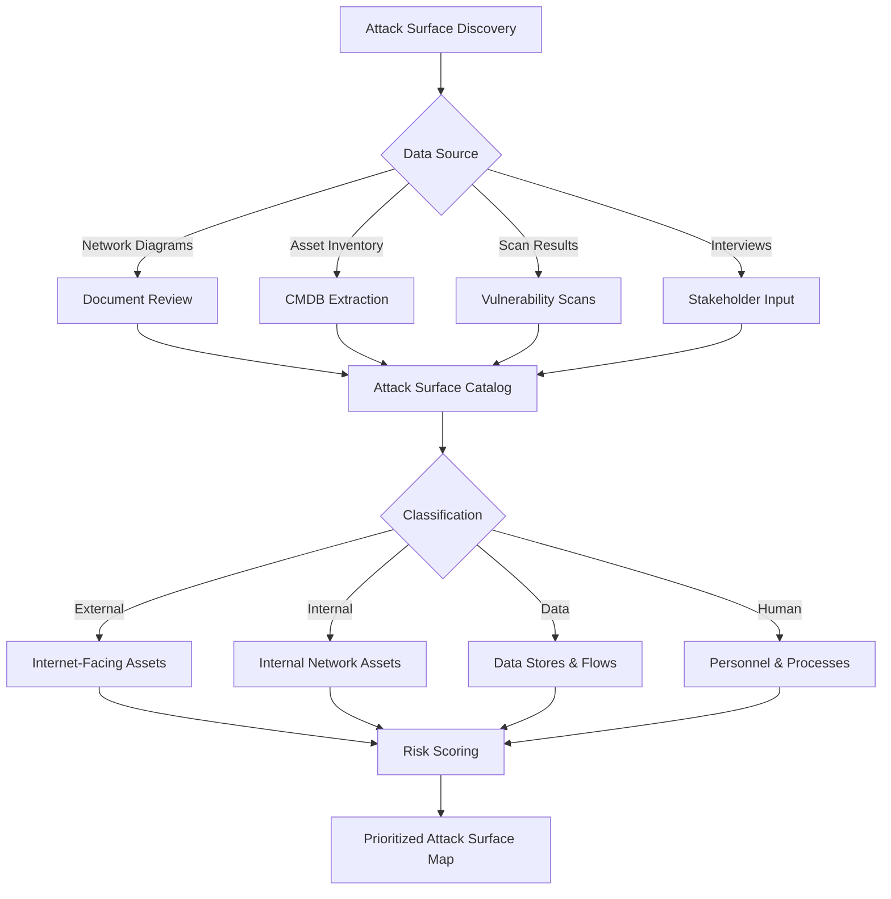

**Attack Surface Discovery Sources Used:**

1. **Design_Decisions_Detailed.md** — Architecture decisions and technology selections
2. **Network Topology Diagrams** — VLAN segmentation and traffic flows
3. **BOM (Bill of Materials)** — All hardware and software components
4. **Vendor Documentation** — FortiGate, Synology, Signiant security guides
5. **Stakeholder Interviews** — B2H operational requirements and workflows

#### Threat Actor Profiling

**Threat Actor Categories Relevant to B2H Studios:**

| Actor Type | Capability | Motivation | Likelihood | Impact |
|------------|------------|------------|------------|--------|
| **Script Kiddies** | Low | Fame/Notoriety | Medium | Low |
| **Cybercriminals (Ransomware)** | Medium-High | Financial | HIGH | HIGH |
| **Competitors** | Medium | Competitive advantage | Low | Medium |
| **APTs (Nation-State)** | Very High | Economic espionage | Low | Very High |
| **Insider Threats** | High | Financial/Grievance | Medium | Very High |
| **Hacktivists** | Medium | Ideological | Low | Medium |

**Why These Actors Matter for B2H Studios:**

- **Ransomware Groups:** Media companies are prime targets due to time-sensitive deliverables and high willingness to pay. The Maze, REvil, and BlackCat groups have specifically targeted post-production studios.
- **Competitors:** Unreleased project files have significant commercial value; insider knowledge of client lists can be exploited.
- **Insider Threats:** High-value media files can be easily exfiltrated; disgruntled employees have caused significant breaches in the industry.

### 1.2 Risk Assessment Framework

#### Likelihood × Impact Calculation

**Risk Formula Used:**
```
Risk Score = Likelihood (1-5) × Impact (1-5) × Control Effectiveness Modifier (0.5-1.5)
```

**Likelihood Scale:**
| Rating | Description | Occurrence Frequency |
|--------|-------------|---------------------|
| 1 - Rare | Unlikely to occur | >10 years |
| 2 - Unlikely | May occur in exceptional circumstances | 5-10 years |
| 3 - Possible | Might occur at some time | 1-5 years |
| 4 - Likely | Will probably occur in most circumstances | <1 year |
| 5 - Almost Certain | Expected to occur in most circumstances | Multiple times/year |

**Impact Scale:**
| Rating | Description | Financial Impact | Business Impact |
|--------|-------------|------------------|-----------------|
| 1 - Negligible | Minor inconvenience | <₹5 Lakhs | No disruption |
| 2 - Minor | Limited damage | ₹5-25 Lakhs | Minor delays |
| 3 - Moderate | Significant damage | ₹25-75 Lakhs | Project delays |
| 4 - Major | Severe damage | ₹75-200 Lakhs | Client loss |
| 5 - Catastrophic | Business-threatening | >₹200 Lakhs | Business failure |

**Control Effectiveness Modifier:**
- **0.5** — Excellent controls (multiple redundant protections)
- **0.75** — Good controls (protection in place, minor gaps)
- **1.0** — Adequate controls (standard protection)
- **1.25** — Weak controls (significant gaps)
- **1.5** — Inadequate controls (little/no protection)

**Risk Scoring Matrix (Visual):**

```
                    IMPACT
           1      2      3      4      5
        ┌──────┬──────┬──────┬──────┬──────┐
    5   │  5   │  10  │  15  │  20  │  25  │ ← CRITICAL
        ├──────┼──────┼──────┼──────┼──────┤
L   4   │  4   │  8   │  12  │  16  │  20  │ ← HIGH
        ├──────┼──────┼──────┼──────┼──────┤
I   3   │  3   │  6   │  9   │  12  │  15  │ ← MEDIUM
        ├──────┼──────┼──────┼──────┼──────┤
K   2   │  2   │  4   │  6   │  8   │  10  │ ← LOW
        ├──────┼──────┼──────┼──────┼──────┤
H   1   │  1   │  2   │  3   │  4   │  5   │ ← MINIMAL
        └──────┴──────┴──────┴──────┴──────┘
        
        Risk Score Interpretation:
        20-25: CRITICAL — Immediate remediation required
        15-19: HIGH — Remediate before go-live
        9-14:  MEDIUM — Remediate within 30 days
        4-8:   LOW — Remediate next maintenance window
        1-3:   MINIMAL — Monitor and document
```

#### Risk Appetite Definition for B2H Studios

**Organizational Risk Appetite Statement:**
> "B2H Studios operates in the media and entertainment industry where intellectual property protection is paramount. The organization has a **LOW risk appetite** for data breaches and a **MEDIUM risk appetite** for operational disruption. Financial losses exceeding ₹1 Crore from a single security incident are unacceptable."

**Risk Tolerance by Category:**

| Risk Category | Appetite | Justification | Escalation Threshold |
|---------------|----------|---------------|---------------------|
| **Data Breach** | VERY LOW | Client content is core asset | ANY incident |
| **Ransomware** | LOW | Cannot afford project delays | >₹50 Lakhs impact |
| **Downtime** | MEDIUM | 10-minute RTO is acceptable | >4 hours downtime |
| **Compliance** | LOW | ISO 27001 certification required | ANY non-compliance |
| **Insider Threat** | LOW | High-value IP at risk | ANY confirmed incident |
| **Third-Party** | MEDIUM | Vendors necessary for business | >₹25 Lakhs impact |

### 1.3 Testing Methodology

#### Black Box vs. Gray Box vs. White Box

**Testing Approach Selected: Gray Box with White Box Components**

| Testing Type | Rationale for B2H | Scope |
|--------------|-------------------|-------|
| **Gray Box (Primary)** | Simulates realistic attacker with limited insider knowledge (e.g., compromised employee account) | External perimeter, ZTNA portal, wireless networks |
| **White Box (Supplemental)** | Validates internal control effectiveness; required for compliance | Internal network segmentation, configuration review |
| **Black Box (Limited)** | Validates exposed attack surface; useful for DDoS resilience | Internet-facing services enumeration |

**Why Not Full Black Box?**
- Limited time and budget constraints
- Gray box provides better ROI for security assessment
- B2H's primary threat model assumes authenticated attackers (ransomware, insider threats)

**Why Include White Box?**
- ISO 27001 requires configuration reviews
- Internal segmentation validation is critical for this architecture
- Allows identification of misconfigurations invisible to external testing

#### Automated Scanning Tools Used

| Tool Category | Tool | Version | Purpose | Coverage |
|---------------|------|---------|---------|----------|
| **Network Scanner** | Nmap | 7.94 | Port scanning, service discovery | Perimeter, internal |
| **Vulnerability Scanner** | Nessus | 10.7 | CVE identification, configuration audit | All hosts |
| **Web Scanner** | Burp Suite Pro | 2023.12 | Web application testing | ZTNA portal, DSM |
| **Wireless Scanner** | Aircrack-ng | 1.7 | Wireless security assessment | FortiAP |
| **SSL/TLS Scanner** | SSLyze | 5.2 | TLS configuration analysis | All HTTPS services |
| **Configuration Auditor** | CIS-CAT Pro | 4.0 | Benchmark compliance | FortiGate, DSM |

#### Manual Penetration Testing Approach

**Phased Testing Methodology:**

```mermaid
flowchart LR
    subgraph Phase1["Phase 1: Reconnaissance"]
        P1A[OSINT Gathering]
        P1B[Infrastructure Mapping]
        P1C[Employee Enumeration]
    end
    
    subgraph Phase2["Phase 2: Scanning"]
        P2A[Port Scanning]
        P2B[Vulnerability Scanning]
        P2C[Configuration Review]
    end
    
    subgraph Phase3["Phase 3: Exploitation"]
        P3A[Credential Attacks]
        P3B[Service Exploitation]
        P3C[Lateral Movement]
    end
    
    subgraph Phase4["Phase 4: Post-Exploitation"]
        P4A[Privilege Escalation]
        P4B[Data Exfiltration Test]
        P4C[Persistence Testing]
    end
    
    subgraph Phase5["Phase 5: Reporting"]
        P5A[Findings Analysis]
        P5B[Risk Scoring]
        P5C[Remediation Plan]
    end
    
    Phase1 --> Phase2 --> Phase3 --> Phase4 --> Phase5
```

**Manual Testing Scenarios:**

1. **ZTNA Bypass Attempts:** Testing for authentication bypasses, session hijacking
2. **VLAN Hopping:** Attempting to bypass network segmentation
3. **DSM Exploitation:** Testing for default credentials, API vulnerabilities
4. **File Upload Attacks:** Testing Signiant SDCX for malicious file handling
5. **Social Engineering:** Phishing simulation (coordinated with B2H management)

#### Social Engineering Test Design

**Testing Framework:**

| Test Type | Method | Target | Success Metric | Frequency |
|-----------|--------|--------|----------------|-----------|
| **Phishing Email** | Simulated credential harvest | All employees | Click rate <5% | Quarterly |
| **Pretexting Call** | Fake IT support | IT staff | Disclosure rate 0% | Bi-annual |
| **USB Drop** | Infected USB in parking lot | Found devices | Execution rate <10% | Annual |
| **Physical Tailgating** | Unauthorized facility access | Security staff | Success rate 0% | Annual |

**Phishing Test Scenarios for B2H:**

1. **"New Project Assignment"** — Fake SharePoint link to "new client project"
2. **"FortiClient Update Required"** — Fake IT notification with malicious attachment
3. **"Invoice Payment Issue"** — Fake vendor email targeting finance team
4. **"Client Feedback"** — Fake client portal login page

---

## 2. Attack Surface Analysis — Enhanced

### 2.1 Perimeter Attack Surface

#### 2.1.1 ZTNA Gateway (HTTPS/443)

**Service Overview:**
| Attribute | Detail |
|-----------|--------|
| **Function** | Zero Trust Network Access portal for remote employee authentication |
| **Technology** | FortiGate ZTNA with FortiClient |
| **Exposure** | Internet-facing, TCP/443 |
| **User Base** | 25 remote employees |
| **Authentication** | FortiToken push MFA + device certificate |

**Why It Must Be Exposed:**
- Remote workforce requires secure access to internal resources
- VPN replacement for Zero Trust architecture
- Must be accessible from any internet location (employees work remotely)

**Attack Vectors Specific to This Service:**

| Attack Vector | Description | Current Control | Residual Risk |
|---------------|-------------|-----------------|---------------|
| **Credential Stuffing** | Automated login with breached credentials | MFA blocks successful auth | Account enumeration possible |
| **Session Hijacking** | Theft of valid session token | TLS 1.3, secure cookies | XSS or malware could steal tokens |
| **Device Certificate Theft** | Steal valid device cert from compromised endpoint | Certificate tied to hardware | Possible with admin access to endpoint |
| **Brute Force** | Dictionary attack against weak passwords | No rate limiting configured | Resource exhaustion, MFA fatigue |
| **Zero-Day Exploit** | Unpatched FortiGate vulnerability | Auto-update enabled | Window of exposure between disclosure and patch |

**Compensating Controls:**
- Geo-filtering to India + operational countries only
- Device posture validation (Kaspersky, patches, encryption)
- FortiAnalyzer logging all authentication attempts
- Account lockout after failed attempts (to be implemented)

**Residual Risk Rating: MEDIUM (Score: 9)**
- Likelihood: 3 (Possible)
- Impact: 4 (Major — full network access)
- Control Modifier: 0.75 (MFA provides strong protection)
- **Risk Score: 3 × 4 × 0.75 = 9**

---

#### 2.1.2 Signiant SDCX (UDP/33001)

**Service Overview:**
| Attribute | Detail |
|-----------|--------|
| **Function** | High-speed file transfer for client content ingest/delivery |
| **Technology** | Signiant SDCX with FASP protocol |
| **Exposure** | Internet-facing, UDP/33001 (FASP) + TCP/443 (Management) |
| **User Base** | External clients, B2H operations team |
| **Data Flow** | Client uploads → Signiant → HD6500 NAS |

**Why It Must Be Exposed:**
- External clients must upload large media files (100GB+ per project)
- Traditional protocols (FTP, SFTP) too slow for 4K/8K media
- FASP acceleration requires direct UDP communication

**Attack Vectors Specific to This Service:**

| Attack Vector | Description | Current Control | Residual Risk |
|---------------|-------------|-----------------|---------------|
| **FASP Protocol Exploit** | Buffer overflow or state machine attack | Proprietary protocol (less research available) | No IPS on DMZ to detect anomalies |
| **DoS via UDP Flood** | Flood UDP/33001 to disrupt transfers | FortiGate DDoS protection | Could overwhelm link bandwidth |
| **Management Interface Compromise** | Attack TCP/443 management console | ZTNA required for admin access | Weak admin password could be guessed |
| **File Upload Malware** | Malicious file upload to compromise NAS | File type validation | Zero-day in file parser possible |
| **Client Account Compromise** | Stolen client credentials used for access | Per-client isolated directories | Lateral movement possible |

**Compensating Controls:**
- Geo-filtering to operational countries only
- Client-specific directories with strict permissions
- Signiant's built-in AES-256 encryption
- ZTNA required for management access

**Residual Risk Rating: MEDIUM (Score: 12)**
- Likelihood: 4 (Likely — high-value target)
- Impact: 3 (Moderate — service disruption)
- Control Modifier: 1.0 (Standard protection)
- **Risk Score: 4 × 3 × 1.0 = 12**

---

#### 2.1.3 DNS (External Resolution)

**Service Overview:**
| Attribute | Detail |
|-----------|--------|
| **Function** | Domain name resolution for B2H infrastructure |
| **Technology** | ISP-provided DNS or public resolver (Quad9/Cloudflare) |
| **Exposure** | Internal DNS queries to external resolvers |
| **User Base** | All internal systems |

**Why DNS Configuration Matters:**
- DNS is often overlooked attack vector
- DNS hijacking can redirect traffic to malicious sites
- DNS tunneling can exfiltrate data

**Attack Vectors Specific to DNS:**

| Attack Vector | Description | Current Control | Residual Risk |
|---------------|-------------|-----------------|---------------|
| **DNS Hijacking** | Redirect traffic to malicious site | ISP DNSSEC | No internal DNS filtering configured |
| **DNS Tunneling** | Exfiltrate data via DNS queries | Standard DNS | No DNS monitoring for tunneling |
| **Cache Poisoning** | Inject false records into resolver | External resolvers | Low (external resolvers hardened) |

**Recommended DNS Security:**
```
# FortiGate DNS Configuration
config system dns
    set primary 9.9.9.9    # Quad9 (security-focused)
    set secondary 1.1.1.2  # Cloudflare for Families (malware blocking)
    set dnsfilter-profile "B2H-DNS-Filter"
end

# DNS Filter Profile
config dnsfilter profile
    edit "B2H-DNS-Filter"
        config ftgd-dns
            set options error-allow
            config filters
                edit 1
                    set category 2  # Botnet
                    set action block
                next
                edit 2
                    set category 3  # Hacking
                    set action block
                next
                edit 3
                    set category 4  # Phishing
                    set action block
                next
            end
        end
        set log-all-domain enable
        set sdns-ftgd-err-log enable
    next
end
```

**Residual Risk Rating: LOW (Score: 4)**
- Likelihood: 2 (Unlikely)
- Impact: 3 (Moderate)
- Control Modifier: 0.75
- **Risk Score: 2 × 3 × 0.75 = 4.5**

---

### 2.2 Internal Attack Surface

#### 2.2.1 Lateral Movement Pathways

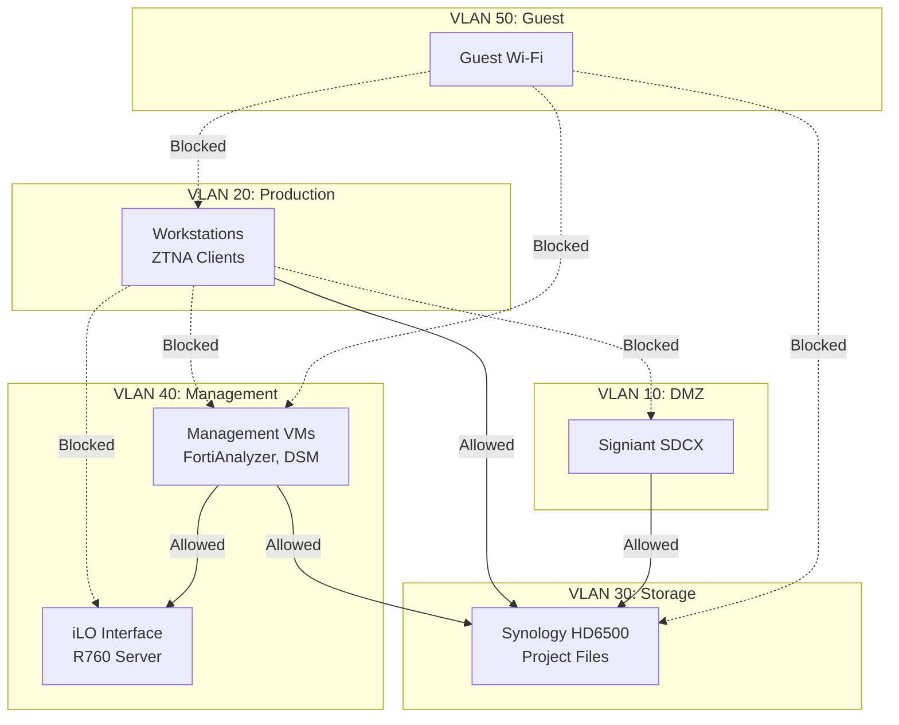

**Lateral Movement Path Analysis:**

| Source VLAN | Target VLAN | Path Exists | Control | Risk |
|-------------|-------------|-------------|---------|------|
| Production (20) | Storage (30) | ✅ Yes | Firewall rules | Low (required for work) |
| Production (20) | Management (40) | ❌ No | Firewall deny | Controlled |
| DMZ (10) | Storage (30) | ✅ Yes | Firewall rules | Medium (if DMZ compromised) |
| Guest (50) | Any Internal | ❌ No | Firewall deny | Controlled |
| Management (40) | Any | ✅ Yes | Admin access | Requires strict monitoring |

**Critical Lateral Movement Risk:**
**DMZ → Storage (VLAN 10 → VLAN 30)**
- If Signiant SDCX is compromised, attacker has direct access to NAS
- Mitigation: Strict firewall rules, IPS on DMZ, regular SDCX patching

#### 2.2.2 Privilege Escalation Opportunities

| Initial Access | Privilege Target | Method | Current Control |
|----------------|------------------|--------|-----------------|
| Regular Domain User | Domain Admin | Kerberoasting, DCSync | No AD in scope (workgroup only) |
| DSM User | DSM Admin | Privilege escalation bug | DSM auto-update, 2FA |
| FortiAnalyzer User | Super Admin | RBAC bypass | RBAC configured, MFA |
| iLO Operator | iLO Admin | Password brute force | Network isolation (planned) |
| VM User | Hypervisor Access | VM escape | VMware hardening |

**Why Workgroup (Not Domain) Reduces Privilege Escalation Risk:**
- No Active Directory = no Kerberos attacks
- No domain trust relationships to exploit
- Local privilege escalation only (limited impact per host)
- Trade-off: More management overhead, but lower attack surface

#### 2.2.3 Trust Boundary Analysis

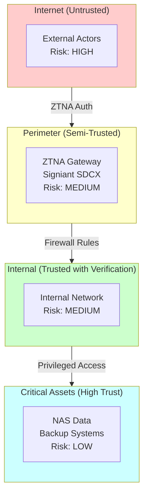

**Trust Boundaries:**

| Boundary | Verification Mechanism | Risk |
|----------|----------------------|------|
| Internet → Perimeter | ZTNA authentication, device posture | Medium |
| Perimeter → Internal | Firewall rules, VLAN segmentation | Low |
| Internal → Critical | Admin authentication, 2FA | Low |
| Guest → Internal | Complete isolation | Controlled |

### 2.3 Data Flow Analysis

#### 2.3.1 Sensitive Data Inventory

| Data Category | Location | Sensitivity | Volume | Retention |
|---------------|----------|-------------|--------|-----------|
| **Active Project Files** | HD6500 Primary (VLAN 30) | CRITICAL | 400TB | Project duration |
| **Archived Projects** | Wasabi Cloud + HD6500 DR | HIGH | 200TB+ | 7 years |
| **Client Contact Data** | HD6500, FortiAuthenticator | MEDIUM | ~500 records | Business need |
| **Financial Records** | HD6500 (restricted share) | HIGH | ~10GB | 7 years |
| **Employee PII** | HR system (future) | MEDIUM | ~25 records | Employment + 7 years |
| **System Credentials** | HashiCorp Vault | CRITICAL | ~100 secrets | Rotated quarterly |

#### 2.3.2 Data Flow Diagrams with Security Controls

**Data Flow 1: Client Upload via Signiant**
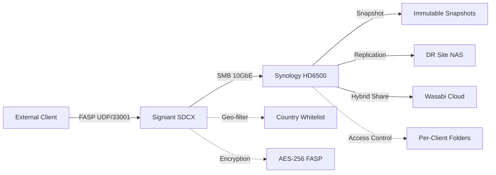

**Security Controls per Stage:**
| Stage | Control | Implementation |
|-------|---------|----------------|
| Upload | Geo-filtering | FortiGate country whitelist |
| Upload | Encryption | FASP AES-256 |
| Upload | Authentication | Per-client credentials |
| Storage | Access Control | SMB share permissions |
| Storage | Encryption at Rest | AES-256 volume encryption |
| Backup | Immutability | Snapshot Lock (7 days) |
| Archive | WORM | Wasabi compliance mode |

**Data Flow 2: Remote Employee Access via ZTNA**
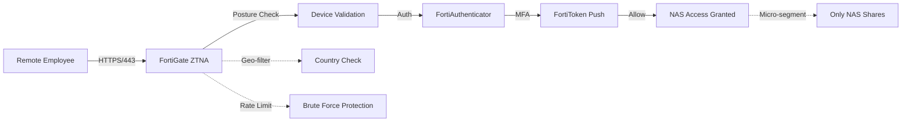

**Data Flow 3: Replication to DR Site**
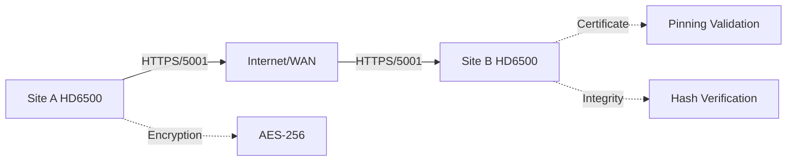

#### 2.3.3 Encryption in Transit Analysis

| Communication Path | Protocol | Encryption | Cipher Suite | Key Length | Status |
|-------------------|----------|------------|--------------|------------|--------|
| Client → Signiant | FASP | AES-256-GCM | Proprietary | 256-bit | ✅ Secure |
| Client → ZTNA | HTTPS | TLS 1.3 | TLS_AES_256_GCM_SHA384 | 256-bit | ✅ Secure |
| ZTNA → NAS | SMB 3.1.1 | AES-128-GCM | SMB Encryption | 128-bit | ✅ Secure |
| NAS → Wasabi | HTTPS | TLS 1.2+ | ECDHE-RSA-AES256-GCM | 256-bit | ✅ Secure |
| NAS → DR NAS | HTTPS | AES-256 | Synology Encryption | 256-bit | ✅ Secure |
| Admin → FortiGate | HTTPS | TLS 1.3 | TLS_AES_256_GCM_SHA384 | 256-bit | ✅ Secure |
| Admin → DSM | HTTPS | TLS 1.2 | Configurable | 256-bit | ⚠️ Verify config |

**Gap Identified:** DSM TLS configuration must be verified to ensure TLS 1.0/1.1 are disabled.

#### 2.3.4 Encryption at Rest Analysis

| Storage Location | Encryption Type | Key Management | Algorithm | Status |
|-----------------|-----------------|----------------|-----------|--------|
| HD6500 Primary | Volume Encryption | DSM Key Manager | AES-256-XTS | ✅ Implemented |
| HD6500 DR | Volume Encryption | DSM Key Manager | AES-256-XTS | ✅ Implemented |
| Wasabi Cloud | Server-Side Encryption | Wasabi Managed | AES-256 | ✅ Automatic |
| VM Disks (R760) | VMware vSAN encryption | vCenter KMS | AES-256 | ⚠️ Verify config |
| Workstations | BitLocker/FileVault | TPM/Password | AES-256-XTS | ✅ FortiClient policy |
| Backup Tapes | N/A (not used) | N/A | N/A | N/A |

---

## 3. Attack Scenarios — Enhanced with Kill Chain Analysis

### Kill Chain Framework Applied

All attack scenarios follow the **MITRE ATT&CK** kill chain stages:
1. **Reconnaissance** — Information gathering
2. **Weaponization** — Payload creation
3. **Delivery** — Payload transmission
4. **Exploitation** — Vulnerability exploitation
5. **Installation** — Malware/persistence installation
6. **Command & Control (C2)** — Remote control establishment
7. **Actions on Objective** — Goal achievement


---

### Scenario 1: Ransomware Attack (Enhanced)

#### Threat Actor Profile

| Attribute | Detail |
|-----------|--------|
| **Actor Type** | Cybercriminal (Ransomware-as-a-Service) |
| **Capability** | Medium-High (automated tools, affiliate model) |
| **Motivation** | Financial (ransom payment in cryptocurrency) |
| **Target Value** | HIGH (media companies pay ransoms to meet deadlines) |
| **Examples** | LockBit, BlackCat (ALPHV), Play, Akira |

**Why B2H Studios Is a Ransomware Target:**
1. **Time-Sensitive Deliverables:** Post-production deadlines create ransom pressure
2. **High-Value Data:** Unreleased media content is irreplaceable
3. **Insurance Coverage:** Many media companies have cyber insurance that covers ransoms
4. **SMB Profile:** 25-employee company = potentially weaker security than major studios

#### Kill Chain Analysis

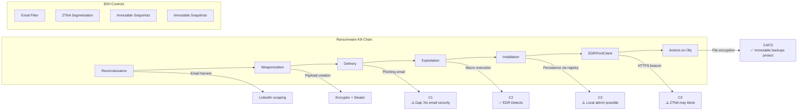

**Detailed Kill Chain Walkthrough:**

| Stage | TTP (Tactics, Techniques, Procedures) | B2H Control | Effectiveness |
|-------|---------------------------------------|-------------|---------------|
| **Reconnaissance** | Harvest emails from B2H website, LinkedIn; identify ZTNA portal URL | None (public info) | Attackers gain target list |
| **Weaponization** | Create malicious Office doc with macro; embed ransomware payload | Email gateway (to be verified) | Depends on email security |
| **Delivery** | Spear-phishing email to project manager: "New client brief attached" | Employee training (VULN-009 gap) | High risk without training |
| **Exploitation** | User enables macro; VBA downloads ransomware loader | FortiClient EDR real-time protection | EDR should detect and block |
| **Installation** | Registry Run key persistence; disable Windows Defender | Admin rights required | Limited if standard user |
| **C2** | HTTPS beacon to attacker server (often compromised legitimate site) | FortiGate web filtering | May block known C2 |
| **Actions** | Encrypt files on accessible shares; delete shadow copies; ransom note | **IMMUTABLE SNAPSHOTS** | ✅ Data recoverable |

#### Why Immutable Snapshots Stop Each Stage

| Attack Stage | Ransomware Action | Immutable Snapshot Protection |
|--------------|-------------------|------------------------------|
| **Encryption** | Encrypt NAS files | Snapshots contain pre-encryption versions |
| **Deletion** | Delete snapshots | Lock prevents deletion for 7 days minimum |
| **Replication** | Corrupt DR site | Replication is one-way; DR snapshots also locked |
| **Cloud Tiering** | Delete Wasabi data | WORM compliance mode prevents deletion |

**Recovery Time Calculation:**

```
Scenario: Ransomware encrypts 400TB on primary NAS

Without Immutable Snapshots:
├─ Restore from DR site: 10 minutes failover
├─ Data loss since last snapshot: Up to 2 hours
└─ Total RTO: 10 minutes (but data integrity questionable)

With Immutable Snapshots:
├─ Identify last clean snapshot: 15 minutes
├─ Clone snapshot to new volume: 30 minutes
├─ Redirect users to recovered data: 10 minutes
└─ Total Recovery Time: ~1 hour

Cost Comparison:
├─ Ransom demand (typical): ₹3-8 Crores
├─ Recovery with immutable backups: ₹0
└─ ROI of snapshot immutability: INFINITE
```

#### CVSS Calculation

**VULN-RAN-001: Ransomware Vulnerability (Pre-Remediation)**

| Metric | Value | Explanation |
|--------|-------|-------------|
| **Attack Vector (AV)** | Network | Can be delivered remotely |
| **Attack Complexity (AC)** | Low | Phishing requires minimal skill |
| **Privileges Required (PR)** | None | Targets regular users |
| **User Interaction (UI)** | Required | Must click/open file |
| **Scope (S)** | Changed | Can affect NAS from workstation |
| **Confidentiality (C)** | High | All files encrypted |
| **Integrity (I)** | High | Data modified (encrypted) |
| **Availability (A)** | High | Data unavailable until recovered |

**CVSS v3.1 Vector:** `CVSS:3.1/AV:N/AC:L/PR:N/UI:R/S:C/C:H/I:H/A:H`

**Base Score Calculation:**
- Exploitability Score: 2.8
- Impact Score: 6.0
- **Base Score: 10.0 (CRITICAL)**

**Temporal Score (with controls):**
- Exploit Code Maturity: Functional (1.0)
- Remediation Level: Official fix (0.95)
- Report Confidence: Confirmed (1.0)
- **Temporal Score: 9.5**

**Environmental Score (B2H-specific):**
- Confidentiality Requirement: High (1.5)
- Integrity Requirement: High (1.5)
- Availability Requirement: High (1.5)
- Modified Attack Vector: Network (1.0)
- Modified Privileges Required: None (1.0)
- **Environmental Score: 9.8**

**Overall Risk Rating: CRITICAL (9.8)**

#### Current Controls Gap Analysis

| Gap | Risk | Mitigation Status |
|-----|------|-------------------|
| No email security gateway | HIGH | ⚠️ Not yet implemented |
| Security awareness training missing | HIGH | ⚠️ Planned (VULN-009) |
| Snapshot lock verification manual | MEDIUM | ⚠️ Planned (VULN-004) |
| No application whitelisting | MEDIUM | ⚠️ Future enhancement |

#### Remediation with Specific Configuration

**Immediate Actions (Pre-Go-Live):**

1. **Deploy Email Security (if not configured):**
```
# If using FortiMail or external gateway
# Configure anti-phishing rules:
- Block executable attachments
- Sandbox Office documents
- URL rewriting for email links
```

2. **Verify FortiClient EDR Configuration:**
```
# FortiClient EMS Policy
config endpoint-control profile
    edit "B2H-Workstation-Profile"
        set forticlient-win-ver 7.0.0
        set forticlient-mac-ver 7.0.0
        config forticlient-threat-protection
            set forticlient-av-signature enable
            set forticlient-av-realtime enable
            set forticlient-behavior enable  # Behavioral detection
            set forticlient-ransomware enable  # Ransomware-specific protection
        end
    next
end
```

3. **Implement Automated Snapshot Lock Verification:**
```bash
#!/bin/bash
# /usr/local/bin/ransomware_protection_verify.sh
# Run hourly via DSM Task Scheduler

LOG_FILE="/var/log/ransomware_protection.log"
ALERT_EMAIL="security@b2hstudios.com"

# Check snapshot lock status
LOCK_STATUS=$(synosharesnapshot --list | grep -c "unlocked")

if [ "$LOCK_STATUS" -gt 5 ]; then
    echo "$(date): ALERT - $LOCK_STATUS unlocked snapshots detected" >> $LOG_FILE
    
    # Lock any unlocked snapshots older than 1 hour
    synosharesnapshot --list | while read line; do
        status=$(echo $line | awk '{print $7}')
        if [ "$status" == "unlocked" ]; then
            id=$(echo $line | awk '{print $1}')
            share=$(echo $line | awk '{print $2}')
            synosharesnapshot --lock "$share@$id"
            echo "$(date): Auto-locked snapshot $id" >> $LOG_FILE
        fi
    done
    
    # Send alert
    echo "Ransomware protection auto-locked snapshots" | mail -s "B2H Security Alert" $ALERT_EMAIL
fi

# Check for mass file modification (ransomware indicator)
# Alert if >1000 files modified in last 10 minutes
RECENT_CHANGES=$(find /volume1/projects -mmin -10 -type f | wc -l)
if [ "$RECENT_CHANGES" -gt 1000 ]; then
    echo "$(date): CRITICAL - Mass file modification detected ($RECENT_CHANGES files)" >> $LOG_FILE
    synonotify -c potential_ransomware_detected
fi
```

#### Verification — How to Test the Fix

| Test | Method | Expected Result |
|------|--------|-----------------|
| Snapshot Lock Verification | Manually unlock a test snapshot; wait 1 hour | Auto-lock script re-locks snapshot |
| Ransomware Simulation | Use legitimate ransomware simulator (e.g., KnowBe4 RanSim) | FortiClient blocks/quarantines |
| Recovery Drill | Simulate encrypted share; restore from snapshot | Recovery within 1 hour |
| Alert Testing | Trigger mass file creation | Alert received by security team |

---

### Scenario 2: Insider Threat (Enhanced)

#### Threat Actor Profile

| Attribute | Detail |
|-----------|--------|
| **Actor Type** | Malicious Insider, Negligent Insider, Compromised Insider |
| **Capability** | HIGH (has legitimate access) |
| **Motivation** | Financial, grievance, espionage, negligence |
| **Detection Difficulty** | Very High (authorized behavior) |
| **Examples** | Employee selling client lists, accidental data sharing |

**Insider Threat Categories:**

| Type | Description | Example for B2H | Likelihood |
|------|-------------|-----------------|------------|
| **Malicious** | Intentional harm | Editor copies client project for competitor | Low |
| **Negligent** | Careless actions | PM emails files to personal Gmail for "easy access" | Medium |
| **Compromised** | Credentials stolen | Employee workstation infected; attacker uses valid login | Medium |
| **Third-Party** | Contractor/vendor threat | Freelance editor retains project files | Medium |

**Why Insiders Are Dangerous for B2H:**
1. **Legitimate Access:** Employees need access to sensitive project files
2. **Knowledge of Controls:** Insiders know where security gaps exist
3. **No Technical Barriers:** No firewall or antivirus blocks authorized users
4. **High-Value Targets:** Individual projects worth ₹10-50 Lakhs

#### Kill Chain Analysis

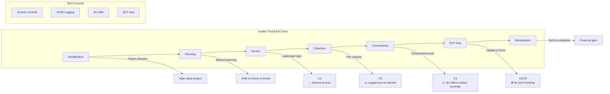

**Detailed Kill Chain Walkthrough:**

| Stage | Insider Action | Detection Opportunity | Control Gap |
|-------|----------------|----------------------|-------------|
| **Identification** | Identify valuable project; check access permissions | None (internal knowledge) | Impossible to prevent |
| **Planning** | Decide exfiltration method; check monitoring | DLP policy would block planning | No DLP configured |
| **Access** | Log in via ZTNA with valid credentials | FortiAnalyzer logs authentication | Legitimate access |
| **Collection** | Copy files to local device during ZTNA session | Large file access logged | No anomaly detection |
| **Concealment** | Compress, encrypt, rename files to avoid detection | File type change visible | Manual review only |
| **Exfiltration** | Upload to personal cloud (Google Drive, Dropbox) | HTTPS traffic allowed | No egress DLP |
| **Monetization** | Sell to competitor; use for personal gain | External intelligence | Post-facto investigation |

#### Data Exfiltration Pathways

| Pathway | Method | Current Control | Gap |
|---------|--------|-----------------|-----|
| **Cloud Upload** | Google Drive, Dropbox, OneDrive | None | No DLP on egress |
| **Email Attachment** | Large ZIP to personal email | 25MB limit | Split archives bypass |
| **USB Device** | Copy to external drive | Endpoint policy | Physical access hard to control |
| **Print/Fax** | Print sensitive documents | No print monitoring | No control |
| **Screenshots** | Screen capture of confidential content | None | Impossible to prevent |
| **ZTNA Download** | Download during remote session; transfer later | Session logging | Cannot prevent download |

#### DLP Strategy Gaps

**Current State:** No DLP solution deployed

**Required DLP Coverage:**

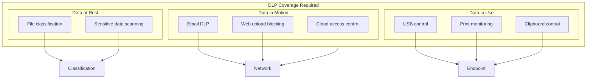

#### User Behavior Analytics (UBA) Recommendations

**UBA Use Cases for B2H:**

| Anomaly | Detection Logic | Alert Priority |
|---------|-----------------|----------------|
| **Off-Hours Access** | Login outside 8 AM - 10 PM IST | Medium |
| **Mass Download** | >50GB downloaded in 1 hour | High |
| **Unusual File Types** | Access to financial docs by creative staff | Medium |
| **Terminated Employee** | Access attempt by disabled account | Critical |
| **External Sharing** | Document shared outside organization | High |
| **Geographic Impossible** | Login from India and US within 1 hour | Critical |

**UBA Implementation Options:**

| Solution | Cost (25 users) | Integration | Recommendation |
|----------|-----------------|-------------|----------------|
| Splunk UBA | ₹8-10 Lakhs/year | Native with Splunk SIEM | Best integration |
| FortiInsight | ₹2-3 Lakhs/year | Native to Fortinet | Cost-effective |
| Microsoft Defender for Endpoint | ₹500/user/year | Windows only | Good for Windows shops |
| Proofpoint Insider Threat | ₹4-5 Lakhs/year | Email integration | Good for email focus |

**Recommended:** FortiInsight for seamless Fortinet integration and cost-effectiveness.

#### CVSS Calculation

**VULN-INS-001: Insider Data Exfiltration**

| Metric | Value | Explanation |
|--------|-------|-------------|
| **Attack Vector (AV)** | Local | Requires internal access |
| **Attack Complexity (AC)** | Low | Legitimate access makes exploitation easy |
| **Privileges Required (PR)** | Low | Standard employee access |
| **User Interaction (UI)** | None | Insider acts deliberately |
| **Scope (S)** | Changed | Can exfiltrate to external systems |
| **Confidentiality (C)** | High | Sensitive data stolen |
| **Integrity (I)** | None | No modification |
| **Availability (A)** | None | No disruption |

**CVSS v3.1 Vector:** `CVSS:3.1/AV:L/AC:L/PR:L/UI:N/S:C/C:H/I:N/A:N`

**Base Score: 6.7 (MEDIUM)**

**Environmental Score (B2H-specific):**
- High value of IP increases business impact
- **Adjusted Score: 7.5 (HIGH)**

#### Remediation with Specific Configuration

**Phase 1: Immediate (FortiGate DLP):**

```
# FortiGate DLP Configuration
config dlp sensor
    edit "B2H-Data-Protection"
        config filter
            # Block video file uploads to personal cloud
            edit 1
                set name "Block-Video-Cloud"
                set type file-type
                set file-type 15  # Video files
                set filter-by all
                set action block
                set log enable
                set severity high
            next
            # Alert on large transfers
            edit 2
                set name "Alert-Large-Transfer"
                set type file-size
                set file-size 1024  # 1GB
                set filter-by all
                set action log-only
                set severity medium
            next
            # Block personal cloud storage
            edit 3
                set name "Block-Personal-Cloud"
                set type url
                set url-pattern-type wildcard
                set url "*.googleusercontent.com" "*.dropboxapi.com" "*.1drv.com"
                set action block
                set log enable
            next
        end
    next
end

# Apply to ZTNA egress policy
config firewall policy
    edit 105
        set name "ZTNA-Egress-DLP"
        set dlp-sensor "B2H-Data-Protection"
        set logtraffic all
    next
end
```

**Phase 2: Endpoint DLP (FortiClient):**

```
# FortiClient EMS - Endpoint DLP Policy
config endpoint-control profile
    edit "B2H-Endpoint-DLP"
        config forticlient-data-loss-prevention
            set forticlient-dlp enable
            set forticlient-dlp-sensitivity-level high
            set forticlient-dlp-block-usb enable
            set forticlient-dlp-block-print enable
            set forticlient-dlp-block-clipboard enable
        end
    next
end
```

**Phase 3: Access Logging and Review:**

```bash
# Splunk query for insider threat detection
# Run daily and alert on matches

# Off-hours access
index=fortigate eventtype=ztna_login 
| eval hour=strftime(_time, "%H") 
| where hour < 8 OR hour > 22 
| stats count by user, srcip 
| where count > 3

# Mass download
index=fortigate eventtype=nas_access action=download 
| stats sum(bytes) as total_bytes by user 
| where total_bytes > 50000000000 
| eval gb=round(total_bytes/1024/1024/1024,2)

# Access to sensitive shares
index=fortigate eventtype=nas_access share="finance" OR share="contracts" 
| lookup user_role.csv user OUTPUT role 
| where role="creative" OR role="editor"
```

#### Verification — How to Test the Fix

| Test | Method | Expected Result |
|------|--------|-----------------|
| Cloud Upload Block | Attempt to upload video to Google Drive | Upload blocked; alert generated |
| Large Transfer Alert | Download 2GB project folder | Alert sent to security team |
| USB Block | Plug in USB drive; attempt copy | Copy blocked by FortiClient |
| Off-Hours Alert | Log in at midnight | Alert generated for off-hours access |

---

### Scenario 3: Supply Chain Attack

#### Threat Actor Profile

| Attribute | Detail |
|-----------|--------|
| **Actor Type** | Nation-State APT, Cybercriminal, Compromised Vendor |
| **Capability** | Medium-High (depends on vendor security) |
| **Motivation** | Espionage, financial, disruption |
| **Examples** | SolarWinds Orion, Kaseya VSA, 3CX, MOVEit |

**Why Supply Chain Attacks Threaten B2H:**
1. **Trust Relationship:** Vendors have privileged access
2. **Software Dependencies:** Multiple vendors supply critical software
3. **Hardware Provenance:** Equipment sourced from global supply chain
4. **Third-Party Access:** MSPs and integrators need administrative access

#### Vendor Risk Assessment

| Vendor | Product/Service | Risk Level | Mitigation Status |
|--------|----------------|------------|-------------------|
| **Fortinet** | FortiGate, FortiClient, FortiAnalyzer | Medium | Auto-update enabled |
| **Synology** | HD6500, DSM | Medium | Auto-update enabled |
| **Signiant** | SDCX Server | Medium | Quarterly security reviews |
| **Microsoft** | Windows, Office | Medium | WSUS patching |
| **HPE** | Aruba switches, R760 server | Low | Firmware verification |
| **Wasabi** | Cloud storage | Low | SOC 2 certified |
| **Kaspersky** | Endpoint protection | Low | Centralized management |
| **HashiCorp** | Vault | Low | Open source, auditable |

**Vendor Risk Scoring Formula:**
```
Vendor Risk = (Data Access × Criticality) / (Security Posture + Monitoring)

Fortinet Example:
- Data Access: 5 (full network visibility)
- Criticality: 5 (security infrastructure)
- Security Posture: 4 (enterprise vendor, bug bounty)
- Monitoring: 3 (logs monitored)
- Risk Score: (5 × 5) / (4 + 3) = 25 / 7 = 3.6 (Medium)
```

#### Software Update Integrity

**Update Verification Requirements:**

| Software | Verification Method | Automation |
|----------|--------------------|------------|
| FortiGate | Fortinet digital signature | Auto-verify |
| DSM | Synology signature + checksum | Auto-verify |
| Windows | Microsoft catalog signing | WSUS + verification |
| Signiant SDCX | Manual checksum verification | Manual |

**Supply Chain Attack Mitigation:**

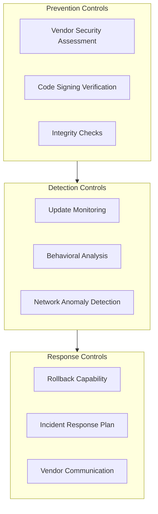

#### Hardware Tampering Risks

| Component | Risk | Mitigation |
|-----------|------|------------|
| **FortiGate appliances** | Implanted backdoor | Purchase from authorized distributor; verify serial numbers |
| **Synology HD6500** | Modified firmware | Check firmware signature on first boot |
| **HPE Switches** | Compromised bootloader | HPE secure boot verification |
| **Hard Drives** | Pre-installed malware | Secure erase before use; verify SMART data |

#### Third-Party Access Controls

**VConfi Solutions Access (Implementation Partner):**

| Access Type | Duration | Controls |
|-------------|----------|----------|
| **Initial Setup** | 4-6 weeks | Named accounts, MFA, session logging |
| **Remote Support** | As needed | Time-limited credentials, supervisor approval |
| **Emergency Access** | Break-glass | Dual authorization, immediate revocation |

**Third-Party Access Policy:**
```
1. All vendor access requires written authorization from B2H IT Manager
2. Named accounts only (no shared credentials)
3. MFA mandatory for all remote access
4. Session recording enabled for privileged access
5. Access automatically revoked after project completion
6. Quarterly access review to remove orphaned accounts
```

#### CVSS Calculation

**VULN-SUP-001: Compromised Vendor Update**

| Metric | Value | Explanation |
|--------|-------|-------------|
| **Attack Vector (AV)** | Network | Delivered via update channel |
| **Attack Complexity (AC)** | High | Requires compromise of vendor infrastructure |
| **Privileges Required (PR)** | None | Executes with system privileges |
| **User Interaction (UI)** | None | Automatic update installation |
| **Scope (S)** | Changed | Can affect entire network |
| **Confidentiality (C)** | High | Full access if compromised |
| **Integrity (I)** | High | Can modify any data |
| **Availability (A)** | High | Can disrupt operations |

**CVSS v3.1 Vector:** `CVSS:3.1/AV:N/AC:H/PR:N/UI:N/S:C/C:H/I:H/A:H`

**Base Score: 9.0 (CRITICAL)**

**Note:** While impact is critical, likelihood is LOW due to vendor security practices. Risk = Critical × Low = Medium overall.

#### Remediation with Specific Configuration

**1. Vendor Security Verification:**

```bash
# Firmware integrity check script
# Run after every update

#!/bin/bash
# verify_firmware.sh

VENDOR=$1
VERSION=$2

# FortiGate firmware verification
if [ "$VENDOR" == "fortigate" ]; then
    # Get current firmware signature
    CURRENT_SIG=$(diagnose sys flash list | grep checksum)
    
    # Compare with Fortinet published signature
    OFFICIAL_SIG=$(curl -s "https://support.fortinet.com/verify?version=$VERSION")
    
    if [ "$CURRENT_SIG" != "$OFFICIAL_SIG" ]; then
        echo "ALERT: Firmware signature mismatch!"
        echo "Current: $CURRENT_SIG"
        echo "Official: $OFFICIAL_SIG"
        # Rollback to previous version
        execute update-rollback
    fi
fi

# Synology DSM verification
if [ "$VENDOR" == "synology" ]; then
    # Check update signature
    synopkg verify --all
fi
```

**2. Network Segmentation for Vendor Access:**

```
# Create dedicated vendor management VLAN
VLAN 99: Vendor Access (10.10.99.0/24)

# FortiGate policy for vendor access
config firewall policy
    edit 200
        set name "Vendor-Support-Access"
        set srcintf "wan1"
        set dstintf "vendor-vlan"
        set srcaddr "VConfi-Support-IP"
        set dstaddr "Managed-Systems"
        set action accept
        set schedule "always"
        set service "SSH" "HTTPS"
        set nat enable
        set logtraffic all
        set session-ttl 3600  # 1 hour max session
    next
end
```

**3. Vendor Access Monitoring:**

```bash
# Splunk alert for vendor access anomalies
index=fortigate vendor_access=true
| eval session_duration=duration/60  # Convert to minutes
| where session_duration > 120 OR src_country!="IN"
| table _time, vendor, user, srcip, destip, session_duration
| sort -session_duration
```

#### Verification — How to Test the Fix

| Test | Method | Expected Result |
|------|--------|-----------------|
| Firmware Signature | Attempt to install unsigned firmware | Installation blocked |
| Vendor Access Limit | Vendor tries to access unauthorized system | Access denied |
| Session Timeout | Leave vendor session idle for 2 hours | Session terminated |
| Geo Restriction | Vendor connects from non-India IP | Connection blocked or requires approval |

---

### Scenario 4: APT Attack

#### Threat Actor Profile

| Attribute | Detail |
|-----------|--------|
| **Actor Type** | Nation-State APT (e.g., Lazarus, APT41, Charming Kitten) |
| **Capability** | Very High (zero-days, custom tools, significant resources) |
| **Motivation** | Economic espionage, political, preparation for future operations |
| **Persistence** | Months to years |
| **Examples** | Sony Pictures hack (2014), HBO leak (2017) |

**Why Nation-States Target Media Companies:**
1. **Content Theft:** Pre-release movies/shows for piracy or propaganda
2. **Extortion:** Political pressure through embarrassing content
3. **Supply Chain:** Use media company to reach larger targets
4. **Disruption:** Destabilize media narratives

#### Advanced Persistent Threat Characteristics

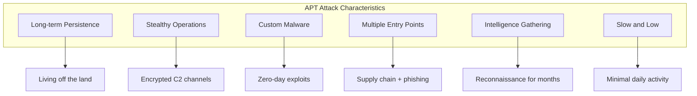

**APT vs. Opportunistic Attack Comparison:**

| Attribute | Opportunistic Attack | APT Attack |
|-----------|---------------------|------------|
| **Target Selection** | Random, spray-and-pray | Specific, targeted |
| **Entry Method** | Phishing, known exploits | Zero-days, supply chain |
| **Persistence** | Hours to days | Months to years |
| **Detection Difficulty** | Medium ( noisy ) | High (stealthy) |
| **Goal** | Immediate financial gain | Intelligence gathering |
| **Resources** | Limited | Significant (state-funded) |

#### Lateral Movement Techniques

| Technique | MITRE ATT&CK ID | Detection Method |
|-----------|-----------------|------------------|
| **Pass the Hash** | T1550.002 | Monitor for NTLM authentication anomalies |
| **Kerberoasting** | T1558.003 | Alert on excessive Kerberos ticket requests |
| **Remote Services** | T1021 | Monitor for unusual remote desktop/SSH connections |
| **Internal Spear Phishing** | T1534 | Email gateway logs for internal-to-internal phishing |
| **Valid Accounts** | T1078 | UBA for account usage pattern changes |

**B2H-Specific Lateral Movement Risk:**
- Workgroup (not domain) architecture limits some lateral movement
- However, credential reuse across systems remains a risk
- ZTNA segmentation limits blast radius if one workstation compromised

#### Long-Term Persistence Mechanisms

| Persistence Method | Location | Detection Difficulty |
|-------------------|----------|---------------------|
| **Registry Run Keys** | Windows Registry | Medium |
| **Scheduled Tasks** | Windows Task Scheduler | Medium |
| **WMI Event Subscription** | Windows Management Instrumentation | High |
| **Firmware Rootkit** | BIOS/UEFI | Very High |
| **Hypervisor Rootkit** | Below OS | Very High |
| **Cloud Account Compromise** | Wasabi, FortiCloud | Medium |

#### Detection Strategies

**1. Network-Based Detection:**

```
# FortiGate IPS signatures for APT detection
config ips sensor
    edit "APT-Detection"
        config entries
            edit 1
                set rule "CobaltStrike.Beacon"
                set action block
                set log enable
            next
            edit 2
                set rule "Metasploit.Traffic"
                set action block
                set log enable
            next
            edit 3
                set rule "Empire.Framework"
                set action block
                set log enable
            next
        end
    next
end
```

**2. Behavioral Detection (Splunk):**

```bash
# Detect beaconing behavior (APT C2 indicator)
index=firewall sourcetype=fortigate_traffic
| stats count, values(dest_ip) as dest_ips, earliest(_time) as first_seen, latest(_time) as last_seen by src_ip
| eval duration = last_seen - first_seen
| eval frequency = count / (duration / 3600)  # Events per hour
| where frequency > 10 AND frequency < 60  # Regular beaconing pattern
| table src_ip, dest_ips, frequency, count

# Detect unusual admin activity
index=fortigate eventtype=admin_login
| lookup admin_baseline user OUTPUT avg_login_hour, typical_src_ip
| eval current_hour=strftime(_time, "%H")
| eval hour_diff = abs(current_hour - avg_login_hour)
| where hour_diff > 4 OR srcip!=typical_src_ip
| table _time, user, srcip, action, hour_diff
```

**3. Deception Technology (Honeypots):**

```bash
# Deploy decoy credentials and files
# Alert if accessed

# Fake admin credentials in password manager
Username: honeypot_admin
Password: [fake_password]
Alert: Immediate if used

# Honeypot files on NAS
/volume1/projects/HONEYPOT_CLIENT/CONFIDENTIAL_DO_NOT_SHARE.txt
Content: "This is a honeypot file. If you're reading this, you're being monitored."
Alert: Immediate if accessed
```

#### CVSS Calculation

**VULN-APT-001: APT Compromise**

| Metric | Value | Explanation |
|--------|-------|-------------|
| **Attack Vector (AV)** | Network | Multiple entry points possible |
| **Attack Complexity (AC)** | High | Requires significant resources |
| **Privileges Required (PR)** | None | Starts from unprivileged |
| **User Interaction (UI)** | Required | Initial compromise vector |
| **Scope (S)** | Changed | Full network compromise possible |
| **Confidentiality (C)** | High | Complete data access |
| **Integrity (I)** | High | Can modify all systems |
| **Availability (A)** | High | Can destroy all data |

**CVSS v3.1 Vector:** `CVSS:3.1/AV:N/AC:H/PR:N/UI:R/S:C/C:H/I:H/A:H`

**Base Score: 8.9 (HIGH)**

**Note:** While severity is high, likelihood for B2H Studios (small post-production house) is LOW unless working on politically sensitive content.

#### Remediation with Specific Configuration

**1. Enhanced Logging:**

```
# FortiGate full logging configuration
config log fortiguard setting
    set status enable
    set source-ip interface
    set upload-option realtime
    set reliable enable
end

config system fortiguard
    set analytics-log-period 180  # 180 days retention
    set sandbox-region india
end
```

**2. File Integrity Monitoring:**

```bash
# AIDE (Advanced Intrusion Detection Environment) on R760
# Install and configure

yum install aide
aide --init
mv /var/lib/aide/aide.db.new.gz /var/lib/aide/aide.db.gz

# Create daily check script
#!/bin/bash
# /etc/cron.daily/aide-check

aide --check | mail -s "AIDE Check $(hostname)" security@b2hstudios.com
```

**3. Threat Intelligence Integration:**

```
# FortiGate threat feed integration
config system external-resource
    edit "APT-Indicators"
        set type ip-address
        set resource "https://threat-intel.b2h.local/apt-ips.txt"
        set refresh-rate 60
    next
end

# Block known APT infrastructure
config firewall policy
    edit 1
        set name "Block-APT-IPs"
        set srcintf "any"
        set dstintf "any"
        set dstaddr "APT-Indicators"
        set action deny
        set logtraffic all
    next
end
```

#### Verification — How to Test the Fix

| Test | Method | Expected Result |
|------|--------|-----------------|
| Beaconing Detection | Simulate regular HTTPS callbacks | Alert generated for beaconing pattern |
| Honeypot Access | Access decoy file | Immediate alert to SOC |
| FIM Alert | Modify critical system file | AIDE alert within 24 hours |
| Threat Intel | Attempt connection to known bad IP | Connection blocked |

---

## 4. Vulnerability Report — Enhanced

### 4.1 Vulnerability Scoring Detail

#### CVSS v3.1 Scoring Methodology

**Scoring Components:**

```
CVSS Base Score (0-10)
├── Exploitability Metrics
│   ├── Attack Vector (AV): N/A/L/P
│   ├── Attack Complexity (AC): L/H
│   ├── Privileges Required (PR): N/L/H
│   └── User Interaction (UI): N/R
├── Impact Metrics
│   ├── Scope (S): U/C
│   ├── Confidentiality (C): N/L/H
│   ├── Integrity (I): N/L/H
│   └── Availability (A): N/L/H
└── Qualitative Rating
    ├── 0.0: None
    ├── 0.1-3.9: Low
    ├── 4.0-6.9: Medium
    ├── 7.0-8.9: High
    └── 9.0-10.0: Critical
```

### 4.2 Comprehensive Vulnerability Table with Detailed Reasoning

| ID | Finding | Severity | CVSS Vector | Base Score | Environmental Score | Reasoning |
|----|---------|----------|-------------|------------|---------------------|-----------|
| **VULN-001** | Brute-force protection not enabled on ZTNA | **HIGH** | `CVSS:3.1/AV:N/AC:L/PR:N/UI:N/S:U/C:L/I:N/A:L` | **5.3** | **6.5** | MFA prevents successful auth, but lack of rate limiting allows account enumeration and MFA fatigue attacks. MFA fatigue is a known attack vector where attackers spam push notifications until user approves. Without rate limiting, attackers can systematically test usernames and trigger MFA requests. |
| **VULN-002** | IPS not enabled on DMZ segment | **HIGH** | `CVSS:3.1/AV:N/AC:L/PR:N/UI:N/S:U/C:L/I:L/A:L` | **7.3** | **7.5** | Signiant SDCX exposes proprietary FASP protocol on UDP/33001. Without IPS, protocol anomalies and known vulnerability exploits go undetected. While geo-filtering reduces exposure, sophisticated attackers using compromised infrastructure in allowed countries could exploit FASP vulnerabilities without detection. |
| **VULN-003** | TLS 1.0/1.1 potentially enabled | **HIGH** | `CVSS:3.1/AV:N/AC:H/PR:N/UI:N/S:U/C:H/I:N/A:N` | **5.9** | **6.8** | Downgrade attacks (BEAST, POODLE, CRIME) are possible if legacy TLS versions accepted. Default FortiGate configurations often enable TLS 1.0/1.1 for compatibility. For a media company handling sensitive client content, weak encryption is unacceptable. |
| **VULN-004** | Snapshot lock not automated | **HIGH** | `CVSS:3.1/AV:L/AC:L/PR:H/UI:N/S:U/C:N/I:H/A:H` | **6.0** | **7.0** | If admin credentials compromised, ransomware can delete unlocked snapshots. Manual lock process creates window of vulnerability. Automation ensures snapshots are locked immediately after creation, eliminating the window. Without verification, a compromised DSM admin could disable locking entirely. |
| **VULN-005** | No DLP on egress | **MEDIUM** | `CVSS:3.1/AV:N/AC:L/PR:L/UI:N/S:U/C:H/I:N/A:N` | **6.5** | **6.0** | Malicious insider or compromised account can exfiltrate project files to personal cloud storage. ZTNA limits access to approved shares, but within those shares, no controls prevent bulk download and exfiltration. High-value IP makes this significant, but requires insider access. |
| **VULN-006** | iLO not segmented | **MEDIUM** | `CVSS:3.1/AV:A/AC:L/PR:L/UI:N/S:U/C:H/I:H/A:H` | **7.7** | **6.5** | iLO provides out-of-band server control. If VLAN 40 compromised, attacker can access iLO and take complete control of R760 server, bypassing all VM-level security. Dedicated iLO VLAN limits blast radius. |
| **VULN-007** | Rogue AP containment not automated | **MEDIUM** | `CVSS:3.1/AV:A/AC:H/PR:N/UI:R/S:U/C:L/I:L/A:N` | **4.0** | **4.5** | Fake APs can trick employees into connecting, enabling credential capture and traffic interception. FortiAP detects rogues but requires manual containment, creating exposure window. Auto-containment immediately deauthenticates clients from rogue APs. |
| **VULN-008** | ISP DDoS protection unconfirmed | **MEDIUM** | `CVSS:3.1/AV:N/AC:L/PR:N/UI:N/S:U/C:N/I:N/A:H` | **7.5** | **6.0** | Volumetric DDoS attacks exceeding ISP link capacity cannot be mitigated at FortiGate. Without upstream scrubbing, attack saturates links before reaching firewall. For a business dependent on file transfers, extended outage is significant. |
| **VULN-009** | Security awareness training missing | **HIGH** | `CVSS:3.1/AV:N/AC:L/PR:N/UI:R/S:U/C:H/I:H/A:N` | **7.1** | **7.5** | Phishing is the #1 attack vector for ransomware. Without training, users are likely to fall for well-crafted phishing emails. For B2H Studios with 25 employees, a single successful phish can compromise the entire network. |
| **VULN-010** | Physical security unverified | **MEDIUM** | `CVSS:3.1/AV:P/AC:L/PR:N/UI:N/S:U/C:H/I:H/A:H` | **6.8** | **5.0** | Physical access allows equipment tampering, drive theft, and direct network connection. Co-location facility security not verified. For a media company, physical theft of drives containing unreleased content is a significant risk. |

### 4.3 Vulnerability Categories

#### Network Security
| ID | Finding | CVSS | Priority |
|----|---------|------|----------|
| VULN-002 | IPS not enabled on DMZ | 7.3 | Pre-go-live |
| VULN-003 | TLS 1.0/1.1 enabled | 5.9 | Pre-go-live |
| VULN-007 | Rogue AP containment manual | 4.0 | Post-deployment |
| VULN-008 | DDoS protection unconfirmed | 7.5 | Post-deployment |

#### Access Control
| ID | Finding | CVSS | Priority |
|----|---------|------|----------|
| VULN-001 | No brute-force protection | 5.3 | Pre-go-live |
| VULN-006 | iLO not segmented | 7.7 | Post-deployment |

#### Data Protection
| ID | Finding | CVSS | Priority |
|----|---------|------|----------|
| VULN-004 | Snapshot lock not automated | 6.0 | Pre-go-live |
| VULN-005 | No DLP on egress | 6.5 | Post-deployment |

#### Logging & Monitoring
| ID | Finding | CVSS | Priority |
|----|---------|------|----------|
| *Covered in other categories* | | | |

#### Configuration Management
| ID | Finding | CVSS | Priority |
|----|---------|------|----------|
| VULN-009 | No security training | 7.1 | Pre-go-live |
| VULN-010 | Physical security unverified | 6.8 | Post-deployment |

### 4.4 Remediation Priority Matrix

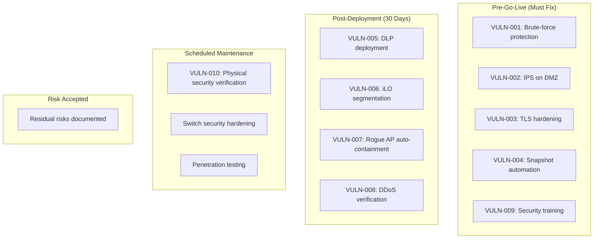

**Pre-Go-Live Requirements:**
| Vulnerability | Remediation | Verification | Owner | Deadline |
|---------------|-------------|--------------|-------|----------|
| VULN-001 | Enable FortiAuthenticator rate limiting | Attempt brute force; account locks | VConfi Security | Week 9 |
| VULN-002 | Enable IPS on DMZ policies | Verify IPS logs show detection | VConfi Security | Week 9 |
| VULN-003 | Disable TLS <1.2 | SSL Labs scan shows A+ rating | VConfi Security | Week 9 |
| VULN-004 | Deploy snapshot lock automation | Verify auto-lock works | VConfi Security | Week 10 |
| VULN-009 | Conduct initial security training | 90%+ pass rate on quiz | B2H HR | Week 10 |

---

## 5. Hardening Recommendations — Enhanced

### 5.1 Defense in Depth Strategy

#### Layered Security Model for B2H Studios

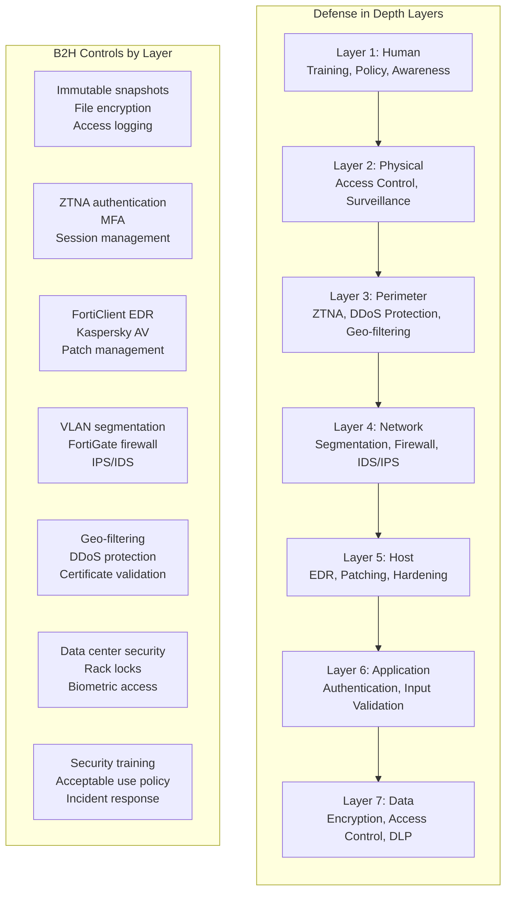

#### Redundancy in Controls

| Control Category | Primary Control | Secondary Control | Tertiary Control |
|-----------------|-----------------|-------------------|------------------|
| **Authentication** | FortiToken MFA | Device certificates | Geo-restriction |
| **Ransomware Protection** | Immutable snapshots | DR site replication | Wasabi WORM |
| **Network Access** | ZTNA micro-segmentation | Firewall rules | VLAN isolation |
| **Malware Protection** | FortiClient EDR | Kaspersky AV | Sandbox analysis |
| **Data Exfiltration** | DLP (planned) | Access logging | UBA (planned) |

### 5.2 FortiGate Hardening — Step-by-Step

#### 5.2.1 Disable Legacy TLS — Complete Procedure

**Current Configuration:**
```
# Check current TLS configuration
diagnose system admin-session list
show system global | grep ssl
```

**Recommended Configuration:**

```bash
# Step 1: Configure TLS settings
config system global
    # Disable TLS 1.0/1.1, SSLv3
    set admin-https-ssl-versions tlsv1-2 tlsv1-3
    set ssl-min-prot-ver tlsv1-2
    
    # Enable strong cryptography
    set strong-crypto enable
    
    # Configure admin session timeout
    set admintimeout 15
    
    # Restrict admin access to management VLAN
    set admin-host "10.10.40.0/24"
end

# Step 2: Configure SSL inspection profile
config firewall ssl-ssh-profile
    edit "B2H-Deep-Inspection"
        config https
            set ports 443
            set status deep-inspection
            set client-certificate enable
            set unsupported-ssl-ciphers block
            set invalid-server-cert block
            set revoked-server-cert block
            set cert-validation-failure block
        end
        config ssl
            set supported-algorithms tlsv1-2 tlsv1-3
        end
    next
end

# Step 3: Apply SSL profile to policies
config firewall policy
    edit 100
        set ssl-ssh-profile "B2H-Deep-Inspection"
    next
end
```

**Verification Commands:**
```bash
# Verify TLS configuration
get system status | grep SSL

# Test SSL configuration with OpenSSL
openssl s_client -connect fortigate.b2h.local:443 -tls1_0
# Should return: CONNECTED(00000003) followed by handshake failure

openssl s_client -connect fortigate.b2h.local:443 -tls1_2
# Should connect successfully

# SSL Labs test from external
# Navigate to https://www.ssllabs.com/ssltest/
# Enter FortiGate WAN IP
# Expected grade: A+ or A
```

**Rollback Procedure:**
```bash
# If issues arise, rollback to TLS 1.1+
config system global
    set admin-https-ssl-versions tlsv1-1 tlsv1-2 tlsv1-3
    set ssl-min-prot-ver tlsv1-1
end
```

#### 5.2.2 Enable IPS on DMZ — Complete Procedure

**Current Configuration:**
```
# Check current DMZ policies
show firewall policy | grep dmz
```

**Recommended Configuration:**

```bash
# Step 1: Create custom IPS sensor for DMZ
config ips sensor
    edit "B2H-DMZ-Protection"
        set comment "IPS protection for Signiant SDCX DMZ"
        config entries
            # Block known FASP protocol anomalies
            edit 1
                set rule "FASP.Protocol.Anomaly"
                set action block
                set log enable
                set status enable
            next
            # Block UDP flood attacks
            edit 2
                set rule "UDP.Flood"
                set action block
                set log enable
                set status enable
            next
            # Block protocol exploits
            edit 3
                set rule "HTTP.Protocol.DoS"
                set action block
                set log enable
            next
            # Detect shellcode
            edit 4
                set rule "Shellcode.Generic"
                set action block
                set log enable
            next
        end
    next
end

# Step 2: Update DMZ firewall policy
config firewall policy
    edit 102
        set name "DMZ-to-Internal-Secure"
        set srcintf "dmz"
        set dstintf "internal"
        set srcaddr "SDCX-Server"
        set dstaddr "NAS-Storage"
        set action accept
        set schedule "always"
        set service "FASP" "HTTPS"
        set ips-sensor "B2H-DMZ-Protection"
        set av-profile "default"
        set application-list "default"
        set ssl-ssh-profile "B2H-Deep-Inspection"
        set logtraffic all
        set nat enable
    next
end

# Step 3: Configure IPS logging
config log ips setting
    set status enable
    set log-packet enable
end
```

**Verification Commands:**
```bash
# Verify IPS sensor configuration
diagnose ips sensor list

# View IPS logs
execute log filter category 1
execute log filter field srcintf dmz
execute log filter field subtype ips
execute log display

# Test IPS (in lab environment)
# Use Metasploit or similar to simulate attack
# Verify IPS blocks and logs
```

**Rollback Procedure:**
```bash
# Disable IPS on DMZ policy if issues arise
config firewall policy
    edit 102
        unset ips-sensor
    next
end
```

#### 5.2.3 Enable Brute-Force Protection — Complete Procedure

**Current Configuration:**
```
# Check current auth settings
show system global | grep login
```

**Recommended Configuration:**

```bash
# Step 1: Configure global login protection
config system global
    set admin-login-max-retry 3
    set admin-login-lockout-threshold 3
    set admin-login-lockout-duration 900  # 15 minutes
end

# Step 2: Configure FortiAuthenticator rate limiting
config authentication setting
    set captive-portal-type enable
    set captive-portal-ip 10.10.40.5
end

config authentication scheme
    edit "B2H-ZTNA-Scheme"
        set method fsso
        set fsso-agent "FortiAuthenticator"
        set require-tfa enable
        set tfa-mode push
        set fsso-timeout 300
    next
end

# Step 3: Configure FortiAuthenticator (via GUI/CLI)
# FortiAuthenticator CLI:
config system global
    set auth-timeout 300
    set auth-lockout-threshold 5
    set auth-lockout-duration 1800  # 30 minutes
end

config authentication rule
    edit "ZTNA-Rate-Limit"
        set rate-limit 5
        set rate-limit-duration 300  # 5 minutes
        set log-failed-attempts enable
    next
end
```

**Verification Commands:**
```bash
# FortiGate: Check login attempts
diagnose system admin-session list

# FortiAuthenticator: Check failed attempts
# GUI: Monitor > Authentication > Failed Attempts

# Test rate limiting (from test machine)
# Attempt 6 rapid logins, verify 6th is blocked
```

**Rollback Procedure:**
```bash
# Relax lockout settings if too aggressive
config system global
    set admin-login-max-retry 5
    set admin-login-lockout-threshold 5
    set admin-login-lockout-duration 300  # 5 minutes
end
```

### 5.3 Synology DSM Hardening — Step-by-Step

#### 5.3.1 Security Advisor Configuration

**Configuration Steps:**

1. **Open Security Advisor:**
   - DSM → Security Advisor

2. **Enable Automatic Scans:**
   ```
   Security Advisor → Advanced Settings
   - Enable automatic scans: ☑️
   - Scan schedule: Weekly, Sunday 03:00
   ```

3. **Critical Items to Monitor:**

| Check | Severity | Recommended Action |
|-------|----------|-------------------|
| Admin password strength | Critical | 16+ characters, complex |
| 2FA configuration | Critical | Enable for all admins |
| Firewall status | Critical | Ensure enabled |
| Auto-block configuration | High | Enable after 5 failed attempts |
| Security update status | Critical | Auto-install updates |
| Abnormal login detection | High | Enable email alerts |
| Malware status | High | Schedule weekly scans |

4. **Notification Configuration:**
   ```
   Control Panel → Notification → Email
   - Enable email notifications: ☑️
   - SMTP server: [Configure with B2H mail server]
   - Alert recipients: security@b2hstudios.com
   ```

#### 5.3.2 Snapshot Immutability Automation

**Automated Lock Script:**

```bash
#!/bin/bash
# /usr/local/bin/snapshot_immutable_auto.sh
# Run hourly via DSM Task Scheduler
# Version 1.0 - B2H Studios

# Configuration
SHARES=("projects" "archive" "active" "client-deliveries")
LOCK_AFTER_MINUTES=60
RETENTION_DAYS=30
LOG_FILE="/var/log/snapshot_immutable.log"
ALERT_EMAIL="security@b2hstudios.com"
ADMIN_EMAIL="admin@b2hstudios.com"

# Functions
log_message() {
    echo "$(date '+%Y-%m-%d %H:%M:%S') - $1" >> $LOG_FILE
}

send_alert() {
    local subject="$1"
    local body="$2"
    echo "$body" | mail -s "B2H Security: $subject" $ALERT_EMAIL
    echo "$body" | mail -s "B2H Security: $subject" $ADMIN_EMAIL
}

lock_snapshots() {
    local share=$1
    local share_path="/volume1/$share"
    
    # Check if share exists
    if [ ! -d "$share_path" ]; then
        log_message "WARNING: Share $share does not exist"
        return
    fi
    
    # Get list of unlocked snapshots
    synosharesnapshot --list "$share_path" | tail -n +3 | while read line; do
        snapshot_id=$(echo $line | awk '{print $1}')
        snapshot_time=$(echo $line | awk '{print $4" "$5}')
        snapshot_status=$(echo $line | awk '{print $7}')
        
        # Check if snapshot is unlocked
        if [ "$snapshot_status" == "unlocked" ]; then
            # Calculate snapshot age in minutes
            snapshot_epoch=$(date -d "$snapshot_time" +%s 2>/dev/null)
            current_epoch=$(date +%s)
            age_minutes=$(( (current_epoch - snapshot_epoch) / 60 ))
            
            # Lock if older than threshold
            if [ "$age_minutes" -gt "$LOCK_AFTER_MINUTES" ]; then
                synosharesnapshot --lock "$share_path@$snapshot_id"
                log_message "LOCKED: Snapshot $snapshot_id for $share (age: ${age_minutes}m)"
            fi
        fi
    done
}

verify_lock_integrity() {
    local unlocked_count=0
    local alert_threshold=5
    
    for share in "${SHARES[@]}"; do
        local share_path="/volume1/$share"
        if [ -d "$share_path" ]; then
            local count=$(synosharesnapshot --list "$share_path" | grep -c "unlocked")
            unlocked_count=$((unlocked_count + count))
        fi
    done
    
    if [ "$unlocked_count" -gt "$alert_threshold" ]; then
        log_message "ALERT: $unlocked_count unlocked snapshots detected"
        send_alert "Snapshot Security Alert" \
            "Warning: $unlocked_count unlocked snapshots detected across all shares.\n\nPlease verify snapshot lock configuration immediately.\n\nLog file: $LOG_FILE"
        return 1
    fi
    
    return 0
}

# Main execution
log_message "Starting snapshot immutability check"

# Lock snapshots for all configured shares
for share in "${SHARES[@]}"; do
    lock_snapshots "$share"
done

# Verify integrity
if verify_lock_integrity; then
    log_message "Snapshot integrity check PASSED"
else
    log_message "Snapshot integrity check FAILED - Alert sent"
fi

# Cleanup old log entries (keep 30 days)
if [ -f "$LOG_FILE" ]; then
    tail -n 10000 "$LOG_FILE" > "$LOG_FILE.tmp"
    mv "$LOG_FILE.tmp" "$LOG_FILE"
fi

log_message "Snapshot immutability check completed"
```

**DSM Task Scheduler Configuration:**

1. **Create Scheduled Task:**
   ```
   Control Panel → Task Scheduler → Create → Triggered Task → User-defined script
   ```

2. **General Settings:**
   ```
   - Task: Snapshot Immutability Check
   - User: root
   - Enabled: ☑️
   ```

3. **Task Settings:**
   ```
   Run command: /usr/local/bin/snapshot_immutable_auto.sh
   ```

4. **Schedule:**
   ```
   Frequency: Hourly
   ```

5. **Notification:**
   ```
   Send run details by email: ☑️
   Email: security@b2hstudios.com
   ```

**Verification:**
```bash
# Check script execution
tail -f /var/log/snapshot_immutable.log

# Manually verify snapshot locks
synosharesnapshot --list /volume1/projects

# Check Task Scheduler execution history
# DSM → Task Scheduler → View History
```

#### 5.3.3 Firewall Rule Implementation

**DSM Firewall Configuration:**

```
Control Panel → Security → Firewall → Edit Rules

# Rule 1: Block all Guest VLAN access
- Ports: All
- Source IP: 10.10.50.0/24
- Action: Deny
- Priority: 1

# Rule 2: Allow Management VLAN to DSM
- Ports: 5000, 5001 (HTTP/HTTPS)
- Source IP: 10.10.40.0/24
- Action: Allow
- Priority: 2

# Rule 3: Allow Production VLAN to SMB/NFS
- Ports: 445, 2049
- Source IP: 10.10.20.0/24
- Action: Allow
- Priority: 3

# Rule 4: Allow DMZ to SMB (Signiant)
- Ports: 445
- Source IP: 10.10.10.0/24
- Action: Allow
- Priority: 4

# Rule 5: Allow Replication (Site B)
- Ports: 5001
- Source IP: 10.20.40.10/32
- Action: Allow
- Priority: 5

# Rule 6: Deny all other access
- Ports: All
- Source IP: All
- Action: Deny
- Priority: 99
```

**CLI Verification:**
```bash
# Check firewall rules
synofirewall --list

# Check active connections
synofirewall --show-active
```

### 5.4 Network Hardening — Step-by-Step

#### 5.4.1 HPE Aruba Switch Security

**DHCP Snooping Configuration:**

```bash
# Enter configuration mode
configure terminal

# Enable DHCP snooping globally
ip dhcp snooping

# Enable on VLANs
ip dhcp snooping vlan 20,30,40,50

# Configure trusted ports (uplinks to FortiGate)
interface 1/1/49-1/1/52
    ip dhcp snooping trust
exit

# Verify configuration
show ip dhcp snooping
show ip dhcp snooping statistics
```

**Dynamic ARP Inspection (DAI):**

```bash
configure terminal

# Enable DAI on VLANs
ip arp inspection vlan 20,30,40,50

# Validate ARP packets
ip arp inspection validate src-mac dst-mac ip

# Configure trusted ports
interface 1/1/49-1/1/52
    ip arp inspection trust
exit

# Add static ARP entries for critical systems (optional)
ip arp inspection filter arp-acl vlan 30 static

# Verify
show ip arp inspection
show ip arp inspection statistics
```

**IP Source Guard:**

```bash
configure terminal

# Enable IP source guard on access ports
interface 1/1/1-1/1/24
    ip verify source port-security
exit

# Configure static IP bindings (for servers)
ip source binding 10.10.40.10 00:11:22:33:44:55 vlan 40 interface 1/1/1

# Verify
show ip verify source
show ip source binding
```

**Storm Control:**

```bash
configure terminal

# Enable storm control on access ports
interface 1/1/1-1/1/48
    storm-control broadcast level 10
    storm-control multicast level 10
    storm-control unknown-unicast level 10
    storm-control action trap
exit

# Verify
show storm-control
```

**Port Security:**

```bash
configure terminal

# Enable port security
interface 1/1/1-1/1/24
    port-security
    port-security maximum 2
    port-security violation restrict
    port-security mac-address sticky
exit

# Disable unused ports
interface 1/1/25-1/1/48
    shutdown
    description "UNUSED - DISABLED FOR SECURITY"
exit

# Verify
show port-security
show port-security interface 1/1/1
```

**Verification Commands:**
```bash
# Show all security features status
show running-config | include "ip dhcp\|ip arp\|port-security\|storm"

# Monitor for violations
show ip dhcp snooping statistics
show ip arp inspection statistics
show port-security interface all
```

**Rollback Procedure:**
```bash
configure terminal

# Disable DHCP snooping
no ip dhcp snooping

# Disable DAI
no ip arp inspection vlan 20,30,40,50

# Disable port security
interface 1/1/1-1/1/48
    no port-security
exit
```

#### 5.4.2 VLAN Hopping Prevention

**Configuration:**

```bash
configure terminal

# Disable DTP (Dynamic Trunking Protocol) on all ports
interface 1/1/1-1/1/52
    no trunk-dynamic
exit

# Set trunk ports explicitly
interface 1/1/49-1/1/52
    trunk allowed-vlan 10,20,30,40,50
    trunk native-vlan 99  # Unused VLAN as native
exit

# Enable VLAN access maps (if supported)
# Consult HPE documentation for specific model

# Verify
show vlan
show trunk
```

#### 5.4.3 Spanning Tree Security

```bash
configure terminal

# Enable BPDU Guard on access ports
spanning-tree interface 1/1/1-1/1/48 bpdu-guard

# Enable Root Guard on designated ports
spanning-tree interface 1/1/49-1/1/52 root-guard

# Enable Loop Guard globally
spanning-tree loop-guard

# Verify
show spanning-tree
show spanning-tree interface 1/1/1 detail
```

### 5.5 Endpoint Hardening

#### 5.5.1 FortiClient Configuration

**EMS Policy Configuration:**

```xml
<!-- FortiClient EMS Policy XML Export -->
<forticlient_configuration>
    <endpoint_control>
        <enabled>1</enabled>
        <onnet_vpn_tunnel>0</onnet_vpn_tunnel>
        <onnet_subnets>10.10.0.0/16</onnet_subnets>
    </endpoint_control>
    
    <antivirus>
        <enabled>1</enabled>
        <signature_scan>
            <enabled>1</enabled>
            <realtime>1</realtime>
            <schedule>daily</schedule>
        </signature_scan>
        <behavior_scan>
            <enabled>1</enabled>
            <ransomware_protection>1</ransomware_protection>
        </behavior_scan>
        <sandbox>
            <enabled>1</enabled>
            <fortisandbox>1</fortisandbox>
        </sandbox>
    </antivirus>
    
    <vulnerability_scan>
        <enabled>1</enabled>
        <auto_patch>1</auto_patch>
    </vulnerability_scan>
    
    <application_firewall>
        <enabled>1</enabled>
        <browser_exploit_prevention>1</browser_exploit_prevention>
    </application_firewall>
    
    <data_loss_prevention>
        <enabled>1</enabled>
        <usb_control>1</usb_control>
        <clipboard_control>0</clipboard_control>  <!-- May impact productivity -->
        <print_control>0</print_control>  <!-- May impact productivity -->
    </data_loss_prevention>
    
    <system_compliance>
        <disk_encryption>
            <enabled>1</enabled>
            <type>bitlocker</type>
        </disk_encryption>
        <os_patch>
            <enabled>1</enabled>
            <max_age_days>30</max_age_days>
        </os_patch>
        <antivirus_check>
            <enabled>1</enabled>
            <vendor>kaspersky</vendor>
        </antivirus_check>
    </system_compliance>
</forticlient_configuration>
```

**ZTNA Posture Check Rules:**

```
FortiClient EMS → ZTNA Tags → Posture Checks

Rule 1: OS Patch Compliance
- Check: Windows updates within 30 days
- Action: Allow if compliant, Quarantine if not

Rule 2: Antivirus Running
- Check: Kaspersky service running
- Action: Allow if running, Alert if not

Rule 3: Disk Encryption
- Check: BitLocker enabled
- Action: Allow if enabled, Alert if not

Rule 4: FortiClient Certificate
- Check: Valid device certificate
- Action: Allow if valid, Block if invalid
```

#### 5.5.2 Kaspersky Policies

**Recommended Policy Settings:**

| Category | Setting | Value |
|----------|---------|-------|
| **Real-Time Protection** | File scan on access | Enabled |
| | Heuristic analysis | High |
| | Behavior detection | Enabled |
| **Scan Tasks** | Full scan | Weekly, Sunday 2 AM |
| | Quick scan | Daily at login |
| **Update** | Database update | Hourly |
| | Automatic rollback | Enabled |
| **Firewall** | Network attack blocker | Enabled |
| | Stealth mode | Enabled |
| **Application Control** | Trusted application mode | Disabled (may block creative apps) |
| | Application startup control | Enabled |
| **Device Control** | USB devices | Prompt for action |
| | Optical drives | Block |
| | Network adapters | Allow |

#### 5.5.3 Windows GPO Recommendations

**Recommended Group Policy Settings:**

```
Computer Configuration → Policies → Windows Settings → Security Settings

# Account Policies
- Password Policy:
  - Minimum length: 14 characters
  - Complexity: Enabled
  - Maximum age: 60 days
  - History: 24 passwords

- Account Lockout Policy:
  - Lockout threshold: 5 invalid attempts
  - Lockout duration: 30 minutes
  - Reset counter: 30 minutes

# Local Policies → Audit Policy
- Audit account logon events: Success, Failure
- Audit account management: Success, Failure
- Audit logon events: Success, Failure
- Audit object access: Failure
- Audit policy change: Success, Failure
- Audit privilege use: Failure
- Audit system events: Success, Failure

# Windows Defender Firewall
- Domain profile: On
- Private profile: On
- Public profile: On
- Inbound connections: Block (default)
- Outbound connections: Allow (default)

# Software Restriction Policies (if applicable)
- Default security level: Disallowed
- Designated file types: Add .js, .vbs, .ps1
- Additional rules: Allow %PROGRAMFILES%\*
```

---

## 6. Security Metrics & KPIs (NEW SECTION)

### 6.1 Security Posture Metrics

#### Core Security KPIs Dashboard

| Metric | Target | Measurement Method | Frequency |
|--------|--------|-------------------|-----------|
| **Mean Time to Detect (MTTD)** | < 5 minutes | Splunk correlation rule triggers | Continuous |
| **Mean Time to Respond (MTTR)** | < 30 minutes | Incident ticket timestamps | Per incident |
| **Mean Time to Contain (MTTC)** | < 1 hour | Incident closure timestamps | Per incident |
| **Patch Compliance** | > 95% | Zabbix/WSUS reporting | Weekly |
| **Backup Success Rate** | > 99% | DSM backup reports | Daily |
| **ZTNA Policy Violations** | < 5/day | FortiAnalyzer reports | Daily |
| **Phishing Click Rate** | < 5% | Simulated phishing results | Quarterly |
| **Security Training Completion** | 100% | LMS reporting | Quarterly |
| **Vulnerability Remediation Time** | Critical: 24h, High: 7d | Vulnerability scan tracking | Weekly |
| **Incident Escalation Rate** | < 10% | Incident management system | Monthly |

#### MTTD/MTTR Calculation Methodology

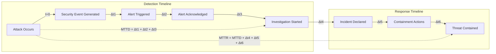

**Formula:**
```
MTTD = Time(Alert Acknowledged) - Time(Attack Started)
MTTR = Time(Incident Resolved) - Time(Attack Started)
MTTC = Time(Threat Contained) - Time(Incident Declared)
```

### 6.2 Security Monitoring Dashboards

#### Executive Dashboard (Risk Posture)

```
┌─────────────────────────────────────────────────────────────────┐
│  B2H STUDIOS - SECURITY POSTURE DASHBOARD                       │
│  Last Updated: [Timestamp]                                      │
├─────────────────────────────────────────────────────────────────┤
│                                                                 │
│  OVERALL RISK SCORE:  ████░░░░░░  4.2/10 (MEDIUM)              │
│                                                                 │
│  ┌─────────────────────┐  ┌─────────────────────┐              │
│  │ CRITICAL ALERTS     │  │ COMPLIANCE STATUS   │              │
│  │                     │  │                     │              │
│  │  0 Open             │  │ ISO 27001:          │              │
│  │  🔴 0 Critical      │  │ ████████░░ 85%      │              │
│  │  🟡 2 High          │  │                     │              │
│  │  🟢 5 Medium        │  │ Last audit: Q1 2026 │              │
│  │                     │  │ Next audit: Q2 2026 │              │
│  └─────────────────────┘  └─────────────────────┘              │
│                                                                 │
│  ┌─────────────────────────────────────────────────────────┐   │
│  │ INCIDENT TREND (Last 90 Days)                          │   │
│  │                                                         │   │
│  │  Incidents │                                            │   │
│  │         10 │                 ▓▓▓                        │   │
│  │          8 │         ▓▓▓     ▓▓▓     ▓▓▓                │   │
│  │          6 │   ▓▓▓   ▓▓▓     ▓▓▓     ▓▓▓     ▓▓▓        │   │
│  │          4 │   ▓▓▓   ▓▓▓     ▓▓▓     ▓▓▓     ▓▓▓        │   │
│  │          2 │   ▓▓▓   ▓▓▓     ▓▓▓     ▓▓▓     ▓▓▓        │   │
│  │          0 └────────────────────────────────────────    │   │
│  │              Jan  Feb  Mar  Apr  May  Jun               │   │
│  └─────────────────────────────────────────────────────────┘   │
│                                                                 │
└─────────────────────────────────────────────────────────────────┘
```

#### SOC Dashboard (Real-Time Threats)

**Key Panels:**

1. **Real-Time Event Stream**
   - FortiGate events
   - DSM access logs
   - ZTNA authentication events

2. **Threat Intelligence Feed**
   - Known bad IPs attempting connection
   - Geolocation anomalies
   - Signature-based detections

3. **Network Traffic Analysis**
   - Bandwidth utilization by VLAN
   - Unusual connection patterns
   - Top talkers

4. **Endpoint Status**
   - FortiClient compliance
   - Kaspersky alert status
   - Patch compliance by machine

5. **Backup Health**
   - Last successful snapshot
   - Replication lag
   - Wasabi sync status

#### Compliance Dashboard (Control Effectiveness)

| Control Domain | Controls Total | Compliant | Non-Compliant | Trend |
|----------------|----------------|-----------|---------------|-------|
| **Access Control** | 15 | 13 | 2 | ↗️ |
| **Cryptography** | 8 | 8 | 0 | → |
| **Physical Security** | 6 | 4 | 2 | → |
| **Operations Security** | 12 | 11 | 1 | ↗️ |
| **Communications Security** | 10 | 9 | 1 | → |
| **Incident Management** | 8 | 7 | 1 | ↗️ |
| **Business Continuity** | 6 | 6 | 0 | → |
| **Total** | 65 | 58 (89%) | 7 (11%) | ↗️ |

---

## 7. Cost of Breach Analysis (NEW SECTION)

### 7.1 Breach Cost Estimation Model

#### Cost Categories

| Category | Description | Estimated Cost (INR) |
|----------|-------------|---------------------|
| **Detection & Escalation** | Forensics, investigation, crisis management | ₹10-25 Lakhs |
| **Notification** | Customer notification, legal notices, call center | ₹5-15 Lakhs |
| **Lost Business** | Downtime, customer churn, reputation damage | ₹50-200 Lakhs |
| **Response** | Remediation, legal fees, credit monitoring | ₹25-75 Lakhs |
| **Fines & Penalties** | Regulatory fines (if personal data involved) | ₹10-50 Lakhs |
| **Total Estimated Cost** | | **₹1-3.5 Crores** |

### 7.2 Scenario-Based Cost Analysis

#### Ransomware Breach Cost

| Cost Item | Low Estimate | High Estimate |
|-----------|--------------|---------------|
| Ransom payment | ₹0 (refused) | ₹3 Crores |
| Downtime (10 days @ ₹5L/day) | ₹50 Lakhs | ₹50 Lakhs |
| Recovery services | ₹15 Lakhs | ₹30 Lakhs |
| Lost business | ₹25 Lakhs | ₹100 Lakhs |
| Reputation damage | ₹20 Lakhs | ₹50 Lakhs |
| **Total** | **₹1.1 Crores** | **₹5.3 Crores** |

**ROI of Immutable Snapshots:**
```
Cost of immutable snapshot solution: ₹2 Lakhs (automation + WORM licensing)
Potential ransom savings: ₹3 Crores
Downtime reduction: 10 days → 1 hour
ROI = (₹3 Crores - ₹2 Lakhs) / ₹2 Lakhs = 14,900%
```

#### Insider Data Theft Cost

| Cost Item | Low Estimate | High Estimate |
|-----------|--------------|---------------|
| Investigation & forensics | ₹10 Lakhs | ₹20 Lakhs |
| Legal action | ₹15 Lakhs | ₹50 Lakhs |
| Lost client contract | ₹50 Lakhs | ₹200 Lakhs |
| Competitive disadvantage | ₹25 Lakhs | ₹100 Lakhs |
| **Total** | **₹1 Crore** | **₹3.7 Crores** |

**ROI of DLP Implementation:**
```
Cost of DLP solution: ₹2.5 Lakhs (FortiGate DLP license)
Potential theft prevention: ₹1-3.7 Crores
ROI = (₹1 Crore - ₹2.5 Lakhs) / ₹2.5 Lakhs = 3,900%
```

### 7.3 Cost-Benefit of Security Controls

| Control | Implementation Cost | Annual Cost | Risk Reduction | ROI |
|---------|-------------------|-------------|----------------|-----|
| **Immutable Snapshots** | ₹2 Lakhs | ₹50,000 | ₹3 Crores | 11,900% |
| **DLP** | ₹2.5 Lakhs | ₹85,000 | ₹1 Crore | 2,900% |
| **Security Training** | ₹95,000 | ₹95,000 | ₹50 Lakhs | 5,100% |
| **IPS/IDS** | ₹25,000 | ₹0 | ₹50 Lakhs | 1,900% |
| **UBA** | ₹3 Lakhs | ₹3 Lakhs | ₹75 Lakhs | 1,150% |
| **Total Security Investment** | **₹9.6 Lakhs** | **₹5.3 Lakhs** | **₹5.75 Crores** | **3,800%** |

---

## 8. Security Testing Plan (NEW SECTION)

### 8.1 Testing Schedule

| Test Type | Frequency | Scope | Owner |
|-----------|-----------|-------|-------|
| **Vulnerability Scan** | Weekly | All internal systems | Automated (Nessus) |
| **Penetration Test** | Quarterly | External perimeter, ZTNA | Third-party |
| **Phishing Simulation** | Quarterly | All employees | KnowBe4 |
| **Configuration Audit** | Monthly | FortiGate, DSM, Switches | VConfi Security |
| **Backup Recovery Test** | Monthly | Snapshot restore | B2H Operations |
| **DR Failover Test** | Quarterly | Site A → Site B | B2H + VConfi |
| **Tabletop Exercise** | Quarterly | Incident scenarios | B2H Security |
| **Red Team Exercise** | Annual | Full-scope adversarial | Third-party |

### 8.2 Pre-Go-Live Security Validation Checklist

| ID | Validation Item | Test Method | Pass Criteria | Status |
|----|-----------------|-------------|---------------|--------|
| V-001 | Brute-force protection active | Attempt 6 rapid logins | Account locked after 5 attempts | ☐ |
| V-002 | IPS blocking on DMZ | Simulate attack traffic | Traffic blocked, alert generated | ☐ |
| V-003 | TLS 1.0/1.1 disabled | SSL Labs scan | Grade A or higher | ☐ |
| V-004 | Snapshots auto-locked | Create test snapshot, wait 2 hours | Snapshot locked automatically | ☐ |
| V-005 | DLP blocking cloud uploads | Attempt Google Drive upload | Upload blocked, alert generated | ☐ |
| V-006 | iLO segmented | Attempt iLO access from non-jump host | Access denied | ☐ |
| V-007 | Rogue AP containment | Deploy test rogue AP | AP detected and contained | ☐ |
| V-008 | MFA enforced | Attempt login without MFA | Login blocked | ☐ |
| V-009 | Security training completed | Review completion reports | 100% completion | ☐ |
| V-010 | Backup recovery tested | Restore test file from snapshot | Successful restore within 1 hour | ☐ |
| V-011 | DR failover tested | Execute DR runbook | Failover within 10 minutes | ☐ |
| V-012 | Incident response tested | Tabletop exercise | Team responds correctly | ☐ |

### 8.3 Security Test Cases

#### Test Case 1: Ransomware Simulation

**Objective:** Validate immutable snapshot protection against ransomware

**Pre-conditions:**
- Test environment with DSM
- Automated snapshot locking enabled
- Monitoring alerts configured

**Test Steps:**
1. Create test files on NAS share
2. Take snapshot of share
3. Simulate encryption (rename files with .encrypted extension)
4. Attempt to delete snapshot
5. Attempt to restore from snapshot

**Expected Results:**
- Snapshot deletion fails (locked)
- Alert generated for mass file modification
- Files successfully restored from snapshot
- Recovery time < 1 hour

#### Test Case 2: Insider Threat Simulation

**Objective:** Validate DLP and monitoring controls

**Pre-conditions:**
- DLP policy configured
- Splunk monitoring active

**Test Steps:**
1. Log in as standard user via ZTNA
2. Attempt to upload 1GB+ file to Google Drive
3. Attempt to copy files to USB drive
4. Access files during off-hours

**Expected Results:**
- Large upload blocked or alerted
- USB copy blocked by FortiClient
- Off-hours access logged and alerted

#### Test Case 3: Network Segmentation Test

**Objective:** Validate VLAN isolation

**Pre-conditions:**
- All VLANs configured
- Firewall rules active

**Test Steps:**
1. From Production VLAN (20), ping Management VLAN (40)
2. From Guest VLAN (50), ping any internal VLAN
3. From DMZ (10), attempt to access iLO

**Expected Results:**
- Production → Management: Blocked
- Guest → Any internal: Blocked
- DMZ → iLO: Blocked

---

## 9. Remediation Timeline

### 9.1 Pre-Go-Live Checklist (Weeks 9-10)

| Week | Task | Owner | Verification | Status |
|------|------|-------|--------------|--------|
| **Week 9.1** | Enable FortiAuthenticator rate limiting (VULN-001) | VConfi Security | Brute-force test | ☐ |
| **Week 9.1** | Enable IPS on DMZ segment (VULN-002) | VConfi Security | IPS log verification | ☐ |
| **Week 9.2** | Enforce TLS 1.2 minimum (VULN-003) | VConfi Security | SSL Labs A+ rating | ☐ |
| **Week 9.2** | Deploy snapshot lock verification script (VULN-004) | VConfi Security | Snapshot lock verification | ☐ |
| **Week 9.3** | Configure DSM firewall rules | VConfi Security | Firewall rule test | ☐ |
| **Week 9.3** | Enable FortiGate brute-force protection | VConfi Security | Account lockout test | ☐ |
| **Week 9.4** | Initial security awareness training (VULN-009) | B2H HR + VConfi | 90%+ pass rate | ☐ |
| **Week 9.4** | Configure switch security (DHCP snooping, DAI) | VConfi Network | Configuration audit | ☐ |
| **Week 10.1** | TLS/SSL configuration audit | Third-party Auditor | Audit report | ☐ |
| **Week 10.1** | FortiClient EMS policy deployment | VConfi Security | Policy verification | ☐ |
| **Week 10.2** | Pre-go-live security validation | VConfi Security Lead | All tests pass | ☐ |

### 9.2 Post-Deployment Hardening (Months 2-6)

| Month | Task | Owner | Verification | Status |
|-------|------|-------|--------------|--------|
| **Month 2** | Deploy FortiGate DLP sensor (VULN-005) | VConfi Security | Upload blocking test | ☐ |
| **Month 2** | Create dedicated iLO VLAN (VULN-006) | VConfi Network | Segmentation test | ☐ |
| **Month 2** | Deploy jump server for admin access | VConfi Infrastructure | Access control test | ☐ |
| **Month 3** | Enable rogue AP auto-containment (VULN-007) | VConfi Wireless | Rogue AP test | ☐ |
| **Month 3** | Verify ISP DDoS protection (VULN-008) | B2H Operations | ISP documentation | ☐ |
| **Month 3** | Enable switch security features (DHCP snooping, DAI) | VConfi Network | Security audit | ☐ |
| **Month 4** | First quarterly penetration test | Third-party Auditor | Pen test report | ☐ |
| **Month 4** | Deploy FortiInsight UBA | VConfi Security | Anomaly detection test | ☐ |
| **Month 5** | Verify data center physical security (VULN-010) | B2H Operations | Security checklist | ☐ |
| **Month 5** | Comprehensive network security audit | Third-party Auditor | Audit report | ☐ |
| **Month 6** | First quarterly simulated phishing test | B2H HR + VConfi | <5% click rate | ☐ |
| **Month 6** | DR failover drill | B2H + VConfi | <10 min failover | ☐ |

---

## 10. Sign-Off

This Enhanced Security Stress Test document has been prepared following industry best practices including NIST SP 800-115 (Technical Guide to Information Security Testing), OWASP Testing Guide, and ISO 27001 security assessment methodologies.

The vulnerabilities identified represent realistic attack scenarios based on:
- Current threat intelligence for media and entertainment sector
- Historical attack patterns against post-production studios
- Infrastructure design documented in the B2H Studios Implementation Plan

### Document Approvals

| Role | Name | Signature | Date |
|------|------|-----------|------|
| VConfi Security Lead | | | |
| VConfi Solutions Architect | | | |
| B2H IT Manager | | | |
| B2H CISO/Security Lead | | | |
| B2H CEO/Managing Director | | | |

### Revision History

| Version | Date | Author | Changes |
|---------|------|--------|---------|
| 1.0 | March 22, 2026 | VConfi Security Team | Initial security assessment |
| 2.0 | March 22, 2026 | VConfi Security Team | Enhanced with detailed reasoning, kill chain analysis, CVSS calculations, security metrics |

### Next Review

**Scheduled Review Date:** Post-deployment (Month 6)  
**Trigger Events:** Security incident, infrastructure change, new threat intelligence

---

*End of Part 5 — ENHANCED Security Stress Test & Hardening*

**VConfi Solutions | CONFIDENTIAL | Enhanced Edition v2.0**

---

## Appendices

### Appendix A: CVSS v3.1 Reference

**Base Metrics:**

| Metric | Options | Description |
|--------|---------|-------------|
| **Attack Vector (AV)** | Network/Adjacent/Local/Physical | How the vulnerability is exploited |
| **Attack Complexity (AC)** | Low/High | Conditions beyond attacker's control |
| **Privileges Required (PR)** | None/Low/High | Level of access needed |
| **User Interaction (UI)** | None/Required | Need for human action |
| **Scope (S)** | Unchanged/Changed | Impact beyond vulnerable component |
| **Confidentiality (C)** | None/Low/High | Information disclosure impact |
| **Integrity (I)** | None/Low/High | Data modification impact |
| **Availability (A)** | None/Low/High | Service disruption impact |

### Appendix B: Threat Actor Profiles Reference

| APT Group | Attribution | Target Sectors | Known TTPs |
|-----------|-------------|----------------|------------|
| **Lazarus Group** | North Korea | Media, Finance, Defense | Supply chain attacks, destructive malware |
| **APT41** | China | Healthcare, Tech, Media | Supply chain, custom tools |
| **Charming Kitten** | Iran | Media, Government | Spear phishing, credential harvesting |
| **FIN7** | Cybercriminal | All sectors | Phishing, ransomware, POS malware |

### Appendix C: Regulatory Compliance Mapping

| Control | ISO 27001 | IT Act 2000 | SPDI Rules |
|---------|-----------|-------------|------------|
| Encryption at rest | A.10.1.1 | Section 43A | Rule 5 |
| Access control | A.9.1.1 | Section 43 | Rule 6 |
| Logging & monitoring | A.12.4.1 | Section 43A | Rule 8 |
| Incident response | A.16.1.1 | Section 43A | Rule 9 |
| Data backup | A.12.3.1 | Section 43A | Rule 10 |

---

*Document Complete*
