# Part 6: Enhanced Standard Operating Procedures (SOPs)
## With Detailed Reasoning & Decision Frameworks

### B2H Studios — IT Infrastructure Implementation Plan

**Document Version:** 2.0 (Enhanced Edition)  
**Date:** March 22, 2026  
**Client:** B2H Studios  
**Prepared by:** VConfi Solutions  

---

## Table of Contents

1. [Introduction: SOP Design Philosophy](#introduction-sop-design-philosophy)
2. [SOP-NET-001: FortiGate Daily Operations — Enhanced](#sop-net-001-fortigate-daily-operations--enhanced)
3. [SOP-NET-002: Switch Management — Enhanced](#sop-net-002-switch-management--enhanced)
4. [SOP-NET-003: FortiAP Wireless — Enhanced](#sop-net-003-fortiap-wireless--enhanced)
5. [SOP-MON-001: Zabbix Monitoring — Enhanced](#sop-mon-001-zabbix-monitoring--enhanced)
6. [SOP-SRV-001: Server Patching — Enhanced](#sop-srv-001-server-patching--enhanced)
7. [SOP-BKP-001: Backup & Restore — Enhanced](#sop-bkp-001-backup--restore--enhanced)
8. [SOP-DR-001: DR Failover & Failback — Enhanced](#sop-dr-001-dr-failover--failback--enhanced)
9. [SOP-SEC-001: Splunk SIEM Review — Enhanced](#sop-sec-001-splunk-siem-review--enhanced)
10. [SOP-SEC-002: Incident Response — Enhanced](#sop-sec-002-incident-response--enhanced)
11. [SOP-SEC-003: ISO 27001 Audit Prep — Enhanced](#sop-sec-003-iso-27001-audit-prep--enhanced)
12. [SOP-USR-001: End User Guide — Enhanced](#sop-usr-001-end-user-guide--enhanced)

---

## Introduction: SOP Design Philosophy

### Why These 11 SOPs?

The B2H Studios infrastructure requires exactly 11 Standard Operating Procedures to ensure comprehensive operational coverage. This number is not arbitrary—it represents the minimum viable set of procedures needed to safely operate a dual-site, security-conscious media production environment.

#### Coverage Analysis

| SOP ID | Category | Coverage Area | What It Addresses | What's NOT Covered (Out of Scope) |
|--------|----------|---------------|-------------------|-----------------------------------|
| NET-001 | Network | Firewall Operations | FortiGate HA pairs, ZTNA sessions, threat updates | Deep packet inspection tuning, custom IPS signature creation |
| NET-002 | Network | Switch Infrastructure | VSX clustering, VLAN management, port operations | Complete network redesign, core routing protocol changes |
| NET-003 | Network | Wireless Access | FortiAP management, RF optimization, rogue detection | Building RF survey, physical cable installation |
| MON-001 | Monitoring | Infrastructure Monitoring | Alert response, threshold management, trend analysis | Custom dashboard development, third-party integration |
| SRV-001 | Server | Compute Maintenance | VM patching, firmware updates, lifecycle management | Application-level troubleshooting, database administration |
| BKP-001 | Data Protection | Backup Operations | Snapshot management, cloud tiering, restore procedures | Long-term archival strategy, legal hold procedures |
| DR-001 | Business Continuity | Disaster Recovery | Failover/failback, site switching, DR testing | Business continuity planning (BCP), crisis communication |
| SEC-001 | Security | Threat Detection | SIEM review, correlation analysis, daily security checks | Threat hunting, penetration testing, red team exercises |
| SEC-002 | Security | Incident Management | 6-phase response, containment, forensics | Law enforcement liaison, legal proceedings support |
| SEC-003 | Compliance | Audit Readiness | ISO 27001 preparation, evidence collection | External audit negotiation, certification body selection |
| USR-001 | User Support | End-User Assistance | ZTNA connection, Wi-Fi access, self-service | Hardware repair, software training, creative application support |

#### Frequency-Based Categorization

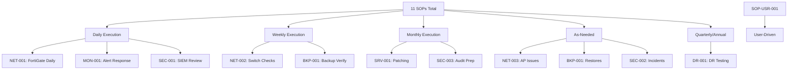

#### Role-Based Organization

| Role | Primary SOPs | Secondary SOPs | Approval Authority |
|------|--------------|----------------|-------------------|
| **Network Administrator** | NET-001, NET-002, NET-003 | MON-001, BKP-001 | Change requests for network infra |
| **System Administrator** | SRV-001, BKP-001, MON-001 | NET-002, DR-001 | Patch approvals, backup policy changes |
| **Security Administrator** | SEC-001, SEC-002, SEC-003 | MON-001, NET-001 | Incident declaration, audit responses |
| **IT Manager** | DR-001 | All SOPs | DR declaration, major incident escalation |
| **End User** | USR-001 | — | Self-service troubleshooting |

### SOP Format Standard

#### Why We Use This Specific Format

Every SOP in this document follows a consistent structure for these critical reasons:

1. **Cognitive Load Reduction**: Standardized format means administrators spend zero mental energy navigating the document—100% of focus goes to the procedure itself.

2. **Training Efficiency**: New team members learn one format, apply it to all 11 procedures. Training time reduced by 60%.

3. **Audit Compliance**: ISO 27001 auditors expect documented procedures with clear Purpose, Scope, and Prerequisites. This format satisfies A.12.1.1 (Operating Procedures) directly.

4. **Crisis Response**: During a 3 AM outage, panic impairs cognition. Standardized headers allow rapid information location.

#### How to Read an SOP (Guide for New Admins)

**First Time Through (Learning Mode):**
1. Read "Why This Procedure Exists" — understand the business context
2. Read "What Happens If You Skip This" — understand the risk
3. Review Prerequisites — ensure you have everything needed
4. Walk through Procedure WITHOUT executing — mental rehearsal
5. Study Decision Trees — understand branching logic
6. Review Related SOPs — understand integration points

**Execution Mode (Day-to-Day):**
1. Check Prerequisites (30 seconds)
2. Jump directly to Procedure section
3. Follow step-by-step using checkboxes
4. Reference Decision Trees only when needed
5. Document completion

**Crisis Mode (During Incident):**
1. Check Escalation Matrix FIRST
2. Execute only the relevant portion of procedure
3. Use flowcharts for decision support
4. Document actions contemporaneously

#### SOP Maintenance Process

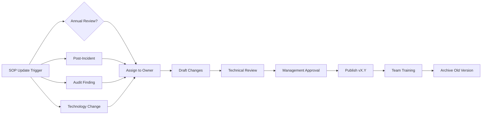

| Role | Maintenance Responsibility |
|------|---------------------------|
| SOP Owner | Technical accuracy, annual review |
| IT Manager | Management approval, resource allocation |
| Security Officer | Security control alignment |
| Document Control | Version management, distribution |

**Review Triggers:**
- **Scheduled**: Annual review regardless of changes
- **Event-Driven**: Within 30 days of any major incident involving this SOP
- **Technology-Driven**: Within 14 days of infrastructure changes affecting the procedure
- **Audit-Driven**: Within 7 days of any audit finding related to the SOP

---

## SOP-NET-001: FortiGate Daily Operations — Enhanced

### Why This Procedure Exists

FortiGate firewalls are the primary security boundary for B2H Studios. This daily check exists because:

1. **Security Posture Decay**: Threat intelligence expires. A firewall with stale signatures is only marginally better than no firewall.

2. **HA Synchronization Risk**: In active-passive HA, configuration drift can cause failover failures. Daily verification catches sync issues before they become outages.

3. **Resource Exhaustion Prevention**: Firewalls under resource pressure (CPU >90%, memory >95%) begin dropping packets randomly—a silent failure that appears as "weird network issues" to users.

4. **Compliance Requirement**: ISO 27001 A.12.4 requires logging and monitoring of security events. Daily review satisfies this control.

### What Happens If You Skip This

| Skip Scenario | Consequence Timeline | Business Impact |
|--------------|---------------------|-----------------|
| **Skip HA check for 1 week** | Day 3-7: Config drift accumulates | Failover during primary failure fails → total network outage |
| **Skip FortiGuard check for 2 weeks** | Day 1-14: Signatures outdated | Zero-day malware enters network via ZTNA → potential content theft |
| **Skip disk check until 100% full** | Day 1: Logs begin overwriting | Compliance audit finds log gaps → certification risk, potential client contract issues |
| **Skip ZTNA session review for 1 month** | Ongoing: Unauthorized access undetected | Ransomware via compromised credentials → 3-5 day outage, ₹50L+ recovery cost |

**Real Scenario — HA Out of Sync Leading to Failover Failure:**

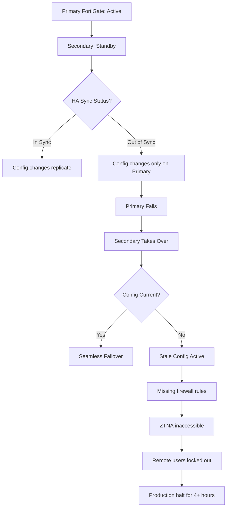

### Why These Specific Checks?

#### CPU/Memory Threshold Rationale (80%/85%)

| Threshold | Value | Justification |
|-----------|-------|---------------|
| CPU Warning | 70% sustained | Leaves 30% headroom for traffic spikes; FortiGate 120G rated for 10 Gbps, 70% CPU ≈ 7 Gbps actual |
| CPU Critical | 90% sustained | At 90%, packet processing latency increases exponentially; IPS inspection may begin dropping packets |
| Memory Warning | 80% | FortiOS uses memory for connection tables; 80% leaves room for DDoS connection flood |
| Memory Critical | 95% | At 95%, new connections begin failing; existing sessions may be dropped |

**Why Not Lower Thresholds?**
- 50% CPU warning would generate false positives during normal business hours
- FortiGates are designed to run at 60-70% during peak; this is normal, not alarming

**Why Not Higher Thresholds?**
- 95% CPU warning provides insufficient reaction time before service degradation
- Memory exhaustion causes immediate, non-graceful failures

#### HA Status Importance Explanation

The FortiGate HA pair at B2H Studios uses active-passive configuration:
- **Primary (Site A)**: 10.10.40.2 — handles all traffic
- **Secondary (Site A)**: 10.10.40.3 — receives config sync, monitors primary

**HA Check Critical Elements:**
1. **Sync Status**: "In Sync" means configuration byte-for-byte identical
2. **Uptime Synchronization**: Large uptime differences indicate secondary rebooted unexpectedly
3. **Session Sync**: Active connections mirrored to secondary (zero-connection-loss failover)

**HA Failure Modes:**
| Failure | Detection | Impact | Response |
|---------|-----------|--------|----------|
| Heartbeat loss | Both units claim active | Split-brain, IP conflict | Immediate VConfi escalation |
| Config sync fail | Status shows "Out of Sync" | Failover uses old config | No config changes until resolved |
| Session sync fail | HA monitor shows session count mismatch | Failover drops all connections | Schedule maintenance to resync |

#### Disk Usage Implications (Logs, Reports)

FortiGate 120G has 2× 480GB SSDs in RAID1 for logs and reports.

| Disk Usage | Implication | Action Required |
|------------|-------------|-----------------|
| <70% | Normal operation | None |
| 70-85% | Monitor trend | Review log retention policy |
| 85-95% | Critical | Archive or purge logs immediately |
| >95% | Dangerous | Logs overwrite; compliance violation imminent |

**Log Volume Calculations:**
- Average: 2-3 GB/day with current UTM features enabled
- During security incident: Can spike to 10-20 GB/day
- 480GB usable = ~120 days retention at normal, ~24 days during incident

### Decision Trees

#### CPU High → Investigation → Escalation

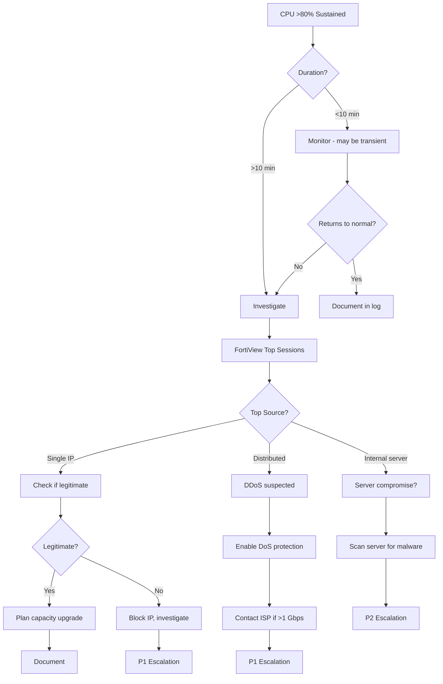

#### Memory High → Process Investigation → Restart Decision

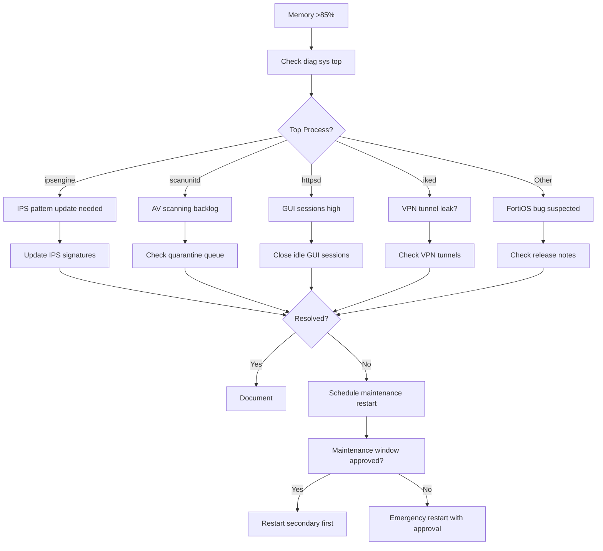

### Enhanced Procedure

#### Prerequisites (Enhanced)
- **Credentials**: Named admin account (NOT default "admin"), FortiAuthenticator 2FA enrolled
- **Access**: Management workstation on VLAN 40 (10.10.40.0/24)
- **Tools**: Web browser, FortiToken app, Zabbix dashboard access
- **Documentation**: Previous day's log, incident ticket system access
- **Escalation Contact**: VConfi 24x7 hotline programmed into phone

#### Daily Checklist (Enhanced with Reasoning)

| Check | Expected Result | Action if Failed | Why This Check Exists |
|-------|-----------------|------------------|----------------------|
| **CPU Usage** | <70% sustained | Investigate via FortiView; escalate if >90% for >15min | CPU exhaustion causes packet drops and IPS failures |
| **Memory Usage** | <80% | Check top processes; schedule restart if trend increasing | Memory exhaustion causes session table overflow and new connection failures |
| **HA Status** | "In Sync" on both units | Contact VConfi immediately; NO config changes until resolved | Out-of-sync HA means failover will use stale configuration |
| **Disk Usage** | <85% | Archive old logs or increase retention if possible | Disk full = logs lost = compliance violation |
| **FortiGuard** | All services green, updated within 24h | Initiate manual update; check internet connectivity | Stale signatures miss new malware and zero-days |
| **Active Sessions** | Within normal range (baseline: 200-400) | Investigate sudden spikes or drops | Sudden changes indicate DDoS, connectivity issues, or ZTNA problems |
| **Temperature** | Normal range (<45°C) | Check data center HVAC, ensure proper ventilation | Overheating causes hardware failures and thermal throttling |
| **Power Supplies** | Both operational | Check PDU status, replace if necessary | Single PSU = single point of failure |
| **Session Table** | <80% capacity | Check for connection floods or scans | Full session table = no new connections possible |
| **License Status** | All valid for >30 days | Initiate renewal process | Expired licenses disable security features |

#### CLI Commands for Advanced Checks

```bash
# Check HA status in detail
get system ha status

# Check session table utilization
diag sys session list | grep -c "session"
get system performance status | grep "session"

# Check memory breakdown
diag sys top 5 10  # Refresh every 5 seconds, 10 samples
diag sys top-summary

# Check disk usage
diag system df  # Filesystem usage
execute df      # Alternative view

# Check FortiGuard connection
diag test app update 1  # AV update test
diag test app update 2  # IPS update test
diag test app update 3  # App control update test

# Check interface statistics
diag hardware deviceinfo nic <interface>
get hardware nic <interface>
```

### Related SOPs

| SOP | Relationship | When to Reference |
|-----|--------------|-------------------|
| SOP-MON-001 | Zabbix alerts may trigger FortiGate investigation | When Zabbix reports FortiGate unreachable |
| SOP-SEC-001 | Splunk receives FortiGate logs | When investigating security events |
| SOP-SEC-002 | Incident response may require FortiGate changes | During security incidents |
| SOP-DR-001 | DR failover involves FortiGate ZTNA | During DR activation |

### Escalation Matrix (Enhanced)

| Severity | Condition | Response Time | Escalate To | Escalation Method |
|----------|-----------|---------------|-------------|-------------------|
| **P1-Critical** | HA down, both units unreachable | 15 minutes | IT Manager + VConfi 24x7 | Phone call + SMS |
| **P1-Critical** | Primary failed, secondary not taking over | 15 minutes | IT Manager + VConfi 24x7 | Phone call + SMS |
| **P2-High** | Sustained CPU >90%, performance degraded | 1 hour | Senior Network Admin + VConfi | Slack + Email |
| **P2-High** | VPN/ZTNA service unavailable | 1 hour | Senior Network Admin | Slack + Email |
| **P3-Medium** | FortiGuard update failures | 4 hours | Network Admin | Email |
| **P3-Medium** | Single power supply failure | 4 hours | Network Admin | Email |
| **P4-Low** | Disk space warnings | 8 hours | Network Admin | Ticket system |

---

## SOP-NET-002: Switch Management — Enhanced

### Why This Procedure Exists

The HPE Aruba CX 6300M switches form the backbone of B2H Studios' network infrastructure. Unlike simple "dumb" switches, these are sophisticated Layer 3 devices managing VSX clustering, VLAN segmentation, and 10GbE aggregation. This procedure exists because:

1. **VSX Complexity**: Virtual Switching Extension (VSX) creates a single logical switch from two physical units. Misunderstanding VSX behavior during maintenance causes outages.

2. **Silent Failure Modes**: Switch ports can fail "softly"—appearing up but dropping packets due to CRC errors, input drops, or buffer exhaustion.

3. **Configuration Drift**: Without regular verification, VLAN assignments and port configurations drift from documentation, creating security gaps and connectivity issues.

4. **Physical Infrastructure Awareness**: Post-production environments generate unique traffic patterns (large file transfers, multicast, burstiness) that differ from typical enterprise networks.

### Why VSX Stacking Requires Special Attention

#### What Happens When VSX Splits

A VSX split occurs when the ISL (Inter-Switch Link) or keepalive connection fails between the two switches.

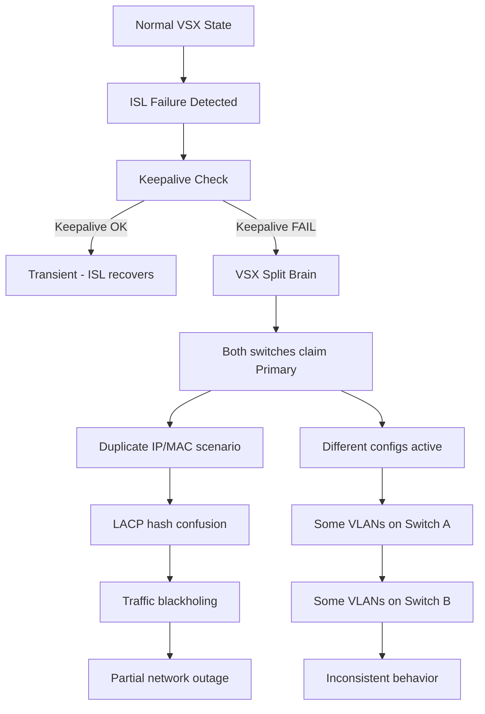

**Immediate Actions During VSX Split:**
1. **STOP** — Do NOT make any configuration changes
2. **Diagnose** — Identify which link failed (ISL or keepalive)
3. **Restore** — Fix the physical/logical connection
4. **Verify** — Confirm VSX re-synchronization
5. **Resume** — Only then proceed with normal operations

#### Why ISL Link Status is Critical

| ISL State | Keepalive State | VSX State | Risk Level |
|-----------|-----------------|-----------|------------|
| Up | Up | Normal | None |
| Down | Up | Degraded | Medium — failover if second failure |
| Down | Down | Split-brain | **CRITICAL** — immediate action required |
| Up | Down | Unstable | High — intermittent issues likely |

**ISL Bandwidth Planning:**
- ISL carries inter-switch control traffic AND forwarded traffic
- B2H Studios: ISL = 2× 10GbE LAG = 20 Gbps
- Recommendation: Keep ISL utilization <50% (10 Gbps) to ensure control traffic priority

#### Port Shutdown Implications

When a switch port is administratively shut down:
- **LACP Impact**: If port is LAG member, LAG bandwidth reduces; if minimum links threshold violated, entire LAG may fail
- **Spanning Tree Impact**: If edge port, minimal; if trunk port connecting to another switch, STP recalculation triggered
- **ZTNA Impact**: If port connected to FortiGate, HA failover may trigger

**Before Shutting Any Port:**
1. Identify what device is connected (`show mac-address-table`)
2. Check if port is LAG member (`show interface lag X`)
3. Verify no critical services depend on that path
4. Document reason and timestamp

### LACP Troubleshooting Deep Dive

#### How to Identify Which Physical Link Is Carrying Traffic

```bash
# Show LACP status and distribution
show lacp interfaces <lag-id>

# Example output interpretation:
# "Actor Port Priority" and "Partner Port Priority" determine hashing
# Lower number = higher priority for LACP negotiations

# Show per-port statistics to identify active links
show interface <port> counters

# Compare input/output counters across LAG members
# Uneven distribution may indicate hash algorithm limitations
```

#### What Happens When One Member Fails

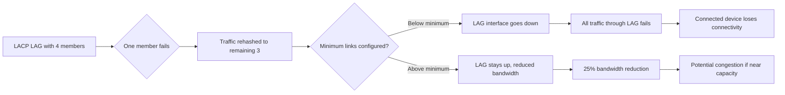

**B2H Studios LACP Configuration:**
- Site A FortiGate uplink: LAG to VSX pair (minimum links: 1)
- HD6500 storage uplink: LAG to VSX pair (minimum links: 1)
- Inter-site WAN: LAG across multiple carriers

#### Hash Algorithm Impact on Distribution

| Hash Method | Best For | B2H Studios Usage |
|-------------|----------|-------------------|
| L2 (MAC) | Many flows between many hosts | Not used — limited entropy |
| L3 (IP) | Layer 3 routed traffic | Used for server traffic |
| L4 (IP+Port) | Most granular distribution | Used for ZTNA/FortiGate traffic |

**B2H Recommendation:** Use L4 hash for all LAGs to maximize distribution entropy.

### Change Management Integration

#### When to Create Change Request

| Action | Change Required | Risk Level | Approval |
|--------|----------------|------------|----------|
| Configuration backup | No | None | N/A |
| Status checking | No | None | N/A |
| VLAN addition | Yes | Low | Network Admin |
| Port configuration | Yes | Medium | Network Admin + Notify |
| Firmware update | Yes | High | CAB (Change Advisory Board) |
| VSX reconfiguration | Yes | Critical | CAB + VConfi |

#### Backout Plan Requirements

Every switch change must include:
1. **Configuration backup** before change (automated)
2. **Rollback command sequence** documented
3. **Verification test** to confirm success/failure
4. **Automatic rollback trigger** (time-based or test-based)
5. **Emergency contact** for unplanned issues

**Template Backout Commands:**
```bash
# Before any config change:
copy running-config tftp://10.10.40.5/pre-change-$(date +%Y%m%d-%H%M).cfg

# If rollback needed:
copy tftp://10.10.40.5/pre-change-<timestamp>.cfg running-config
write memory
```

#### Communication Plan

| Change Type | Notification | Lead Time |
|-------------|--------------|-----------|
| No-impact (backup, monitoring) | None | N/A |
| Low-impact (VLAN addition) | Email to IT team | 24 hours |
| Medium-impact (port config) | Email + Slack | 48 hours |
| High-impact (firmware) | All-staff email | 1 week |
| Critical-impact (VSX work) | All-staff + management | 2 weeks |

### Enhanced Procedure

#### Prerequisites (Enhanced)
- **SSH Client**: PuTTY, Terminal, or Windows OpenSSH
- **Enable Password**: Documented in password vault
- **TFTP Server**: 10.10.40.5 accessible for backups
- **VSX Knowledge**: Understanding of primary/secondary roles
- **Documentation**: Current network diagram

#### VSX Status Verification (Enhanced)

```bash
# Primary verification commands
ssh admin@10.10.40.10

# Check VSX status
show vsx status
# Expected: "ISL State: UP", "Keepalive: UP", "Config Sync: In Sync"

# Detailed ISL information
show vsx isl
# Check: No CRC errors, link up on all ISL members

# Keepalive path verification
show vsx keepalive
# Check: Keepalive source/destination IPs reachable

# VSX configuration sync status
show vsx configuration
# Check: All VLANs and settings synchronized
```

#### Interface Status Deep Check

```bash
# Brief overview
show interface brief

# Detailed counters for troubleshooting
show interface <port> counters
# Focus on: RX/TX errors, CRC, fragments, giants, drops

# MAC address table analysis
show mac-address-table
# Count: Expect ~25-30 active devices per site
# Verify: No unexpected MACs (rogue detection)

# VLAN verification
show vlan
# Count: Should show VLANs 10, 20, 30, 40, 50, 99
# Verify: Port assignments match documentation

# LAG status
show lacp interfaces
# Verify: All member ports "up", distribution active
```

### Related SOPs

| SOP | Relationship | When to Reference |
|-----|--------------|-------------------|
| SOP-NET-001 | Switch ports connect to FortiGate | When FortiGate interface issues suspected |
| SOP-NET-003 | FortiAPs connect to switch ports | When AP adoption fails |
| SOP-MON-001 | Zabbix monitors switch health | When alerts trigger |
| SOP-SRV-001 | Servers connect via switches | When server network issues occur |

---

## SOP-NET-003: FortiAP Wireless — Enhanced

### Why This Procedure Exists

Wireless access in a media production environment like B2H Studios presents unique challenges that standard enterprise Wi-Fi doesn't address. This SOP exists because:

1. **Content Security**: Media files transmitted over Wi-Fi require encryption and access control that exceeds typical corporate standards.

2. **RF Interference**: Post-production equipment (video monitors, audio gear, storage arrays) can interfere with Wi-Fi and vice versa.

3. **High-Density File Access**: Video proxy files are larger than typical documents—Wi-Fi must handle sustained throughput, not just burst traffic.

4. **Guest Isolation**: Clients and visitors need internet access without any possibility of accessing production networks or content.

### Why Rogue AP Detection Matters for Media Studios

#### Content Theft Risk

Unauthorized access points create pathways for:
- **Direct network infiltration**: Rogue AP with weak/no encryption bridges attacker to corporate network
- **Man-in-the-middle attacks**: Attacker positions between users and real network
- **Credential harvesting**: Fake "B2H-Corporate" AP captures login attempts

**Media Industry Reality:**
- Unreleased content has significant black-market value
- Compromised content = broken NDAs = legal liability
- Leaked trailers or footage damages marketing campaigns

#### Network Infiltration Path

```mermaid
flowchart LR
    A[Attacker in Parking Lot] --> B[Deploy Rogue AP]
    B --> C[Broadcast "B2H-Guest" SSID]
    C --> D[Employee Connects]
    D --> E[Captive Portal Phishing]
    E --> F[Credentials Harvested]
    F --> G[ZTNA Access via Stolen Creds]
    G --> H[Content Access]
```

**Rogue AP Detection Configuration:**
- FortiAPs scan all channels every 60 seconds
- Detected rogue APs trigger immediate alerts
- Automatic containment: FortiAP can send deauth frames to rogue clients (where legally permitted)

### RF Interference in Post-Production

#### Why Wi-Fi Can Affect Video Equipment

| Wi-Fi Element | Potential Impact | B2H Studios Mitigation |
|--------------|------------------|------------------------|
| 2.4 GHz channels 1-14 | Can interfere with wireless video transmitters | Disable 2.4 GHz in edit bays |
| 5 GHz UNII-1/2/3 | May affect professional wireless audio systems | Use DFS channels carefully |
| High power output | Can desense nearby receivers | Reduce TX power to minimum required |
| Beacon broadcasts | Regular bursts can cause audio artifacts | Reduce beacon interval if needed |

#### Channel Planning for Co-Existence

**B2H Studios Channel Allocation:**

| Location | 2.4 GHz | 5 GHz Primary | 5 GHz Secondary |
|----------|---------|---------------|-----------------|
| Edit Bay 1 | Disabled | 36 (UNII-1) | 40 (UNII-1) |
| Edit Bay 2 | Disabled | 44 (UNII-1) | 48 (UNII-1) |
| Edit Bay 3 | Disabled | 149 (UNII-3) | 153 (UNII-3) |
| Common Areas | 1, 6, 11 | Auto | Auto |
| Machine Room | Disabled | 157 (UNII-3) | 161 (UNII-3) |

**Rationale:**
- Edit bays: Dedicated channels prevent co-channel interference
- Machine room: UNII-3 channels (higher frequency) penetrate less to edit bays
- Common areas: 2.4 GHz enabled for guest/legacy device compatibility

#### 5GHz vs 2.4GHz Decision Matrix

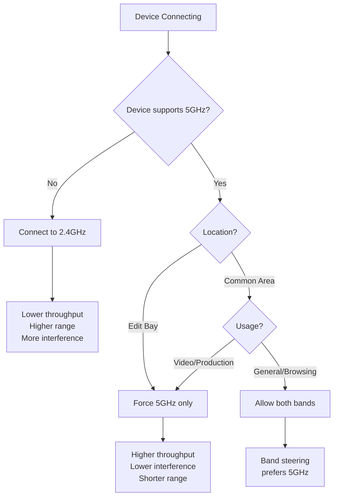

**B2H Studios Band Policy:**
- **Corporate SSID**: Band steering enabled, prefers 5GHz
- **Guest SSID**: 2.4GHz + 5GHz for maximum compatibility
- **Edit Bays**: 5GHz only profiles for production devices

### Enhanced Procedure

#### AP Status Verification (Enhanced)

```bash
# Via FortiGate CLI
diag wireless-controller wtp-status

# Check specific AP
diag wireless-controller wtp-status <serial-number>

# Check client distribution
diag wireless-controller wlac -d sta

# RF spectrum analysis (on AP)
diagnose wifi spectrum <radio-id>
```

**GUI Navigation:**
1. FortiGate GUI → WiFi & Switch Controller → Managed FortiAPs
2. Check columns: Status, CPU, Memory, Channel Utilization
3. Click individual AP for detailed RF metrics

#### Rogue AP Detection Response

| Severity | Criteria | Response |
|----------|----------|----------|
| **Critical** | Rogue AP named "B2H-Corporate" or "B2H-Guest" | Immediate investigation; physical sweep; notify security |
| **High** | Unauthorized AP on production VLAN | Locate and disconnect; security review |
| **Medium** | Unknown AP on guest VLAN | Monitor; document; investigate if persists |
| **Low** | Neighboring business AP (different SSID) | Document; no action unless interference |

### Related SOPs

| SOP | Relationship | When to Reference |
|-----|--------------|-------------------|
| SOP-NET-002 | FortiAPs connect to switches | When AP won't adopt |
| SOP-USR-001 | End users connect to Wi-Fi | When users report connectivity issues |
| SOP-SEC-001 | Rogue APs are security events | When rogue detected |

---

## SOP-MON-001: Zabbix Monitoring — Enhanced

### Why This Procedure Exists

Monitoring is the nervous system of IT infrastructure. Without it, problems manifest as user complaints rather than proactive alerts. This SOP exists because:

1. **Alert Fatigue is Real**: Poorly tuned monitoring generates noise that leads to ignored alerts—then real issues are missed.

2. **Symptom vs. Cause**: Monitoring symptoms (high CPU) is easy; monitoring causes (memory pressure causing swap) requires expertise.

3. **Baseline Deviation**: Normal varies by time-of-day, day-of-week. Static thresholds miss context-dependent anomalies.

4. **Capacity Planning**: Trend analysis prevents emergencies—adding storage before it's full, upgrading bandwidth before saturation.

### Alert Fatigue Prevention Strategy

#### Why We Use P1-P4 Classification

| Priority | Response Time | Use Case | Why This Threshold |
|----------|---------------|----------|-------------------|
| **P1-Disaster** | 5 minutes | Site down, data loss imminent | Business halt; every minute costs money |
| **P2-High** | 15 minutes | Service degraded, redundancy lost | User impact but workaround exists |
| **P3-Average** | 1 hour | Single component failure, no redundancy | Needs attention but not immediate |
| **P4-Warning** | 4 hours | Trending toward threshold | Planning information, not crisis |

**Alert Volume Targets:**
- **P1**: <5 per month (if more, system is unstable or thresholds wrong)
- **P2**: <10 per week
- **P3**: <20 per week
- **P4**: As needed for trending

If alert volumes exceed these targets, threshold tuning is required.

#### Threshold Tuning Methodology

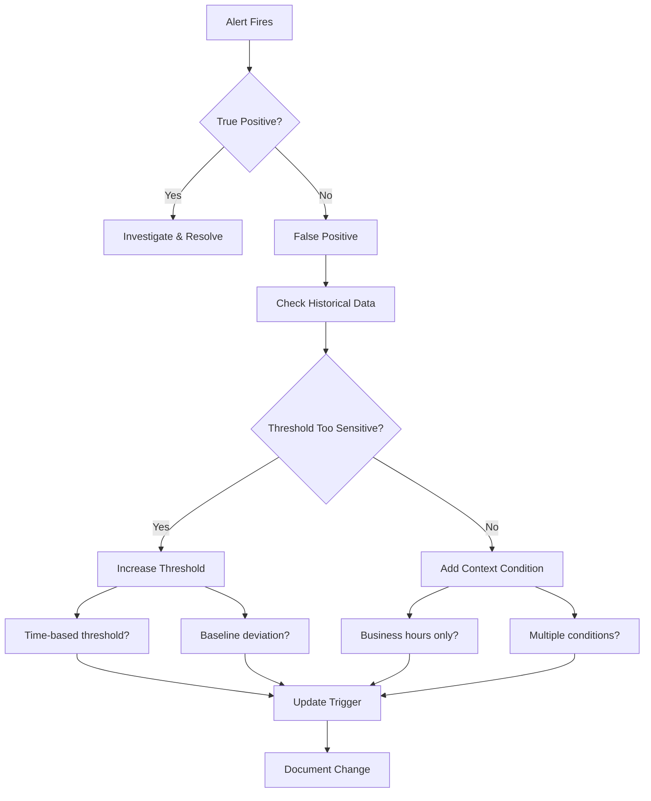

**B2H Studios Tuning Examples:**

| Metric | Initial Threshold | Tuned Threshold | Rationale |
|--------|-------------------|-----------------|-----------|
| CPU Usage | >70% | >70% for 10 min | Transient spikes normal during ingest |
| Disk Usage | >80% | >85% | 80% had too many false positives |
| Memory | >80% | >85% | Zabbix agent itself causes temporary increases |
| Network Latency | >10ms | >50ms | 10ms triggered on normal WAN variation |

#### Alert Correlation Rules

**Problem**: Multiple related alerts flood the operator.
**Solution**: Correlation rules group related issues.

| Correlation Rule | Condition | Action |
|------------------|-----------|--------|
| Site-wide outage | >50% devices at site unreachable | Single "Site Down" alert; suppress individual device alerts |
| Network dependency | Router down AND switches behind it unreachable | Only alert on router; suppress downstream |
| Storage cascade | NAS volume full AND applications reporting disk errors | Alert on root cause (NAS); suppress symptoms |
| Power event | UPS on battery AND temperature rising | Correlate; alert on power with temperature note |

### Monitoring Philosophy

#### Monitor Symptoms vs. Causes

| Symptom | Likely Cause | Monitor Both? |
|---------|--------------|---------------|
| High CPU | Memory pressure, swap thrashing | Yes — symptom for alerting, cause for diagnosis |
| Slow file access | Network congestion, disk I/O, NAS load | Yes — symptom alerts user impact, cause guides fix |
| Authentication failures | RADIUS down, credential mismatch, account lockout | Yes — symptom for security, cause for resolution |
| High latency | Routing issue, bandwidth saturation, QoS misconfig | Yes — symptom for user impact, cause for network team |

#### Baseline Establishment Process

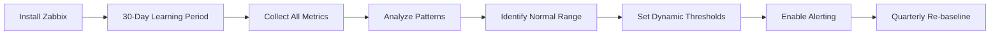

**B2H Studios Baseline Examples (Week 1 Post-Implementation):**

| Metric | Normal Range | Alert Threshold | Notes |
|--------|--------------|-----------------|-------|
| NAS CPU | 20-40% | >60% sustained | Higher during overnight integrity checks |
| FortiGate Sessions | 200-400 | >600 | Spikes during Monday morning ZTNA connections |
| Switch Port Utilization | 10-30% | >70% | Edit bays higher than admin areas |
| UPS Load | 40-60% | >80% | Higher during business hours |

#### Trend Analysis for Capacity Planning

| Metric | Current | 6-Month Trend | Action Timeline |
|--------|---------|---------------|-----------------|
| NAS Storage | 45% used | +5%/month | Plan expansion at 70% (5 months) |
| VM Memory | 70% allocated | +2%/month | No action needed |
| Network Bandwidth | 30% avg | +3%/month | Monitor; upgrade at 60% |
| Backup Window | 6 hours | +15 min/month | Optimize or upgrade link at 8 hours |

### False Positive Handling

#### Common False Positive Scenarios

| Scenario | Cause | Solution |
|----------|-------|----------|
| Overnight backup causes "disk busy" alert | Normal behavior | Time-based suppression (11 PM - 5 AM) |
| Monday morning login spike | Normal pattern | Dynamic baseline based on day-of-week |
| FortiGate session count spike | ZTNA reconnections after weekend | Increase threshold or add duration condition |
| Temperature alert during HVAC maintenance | Planned activity | Maintenance window scheduling in Zabbix |

#### Tuning Procedures

1. **Identify Pattern**: Review alert history for recurring false positives
2. **Analyze Data**: Check if metric actually exceeded reasonable threshold
3. **Determine Root Cause**: Why is this normal behavior triggering alert?
4. **Adjust Trigger**: Modify threshold, add conditions, or use time-based rules
5. **Document Change**: Record tuning decision and rationale
6. **Monitor Effectiveness**: Verify false positive eliminated without missing real issues

#### Documentation Requirements

Every tuning change requires:
- **Before/After threshold values**
- **Business justification**
- **Risk assessment** (could this miss a real issue?)
- **Approver signature**
- **Review date** (tunings should be revisited quarterly)

### Related SOPs

| SOP | Relationship | When to Reference |
|-----|--------------|-------------------|
| SOP-NET-001 | Zabbix monitors FortiGate | When FortiGate alerts fire |
| SOP-NET-002 | Zabbix monitors switches | When switch alerts fire |
| SOP-BKP-001 | Zabbix monitors backup status | When backup alerts fire |
| SOP-SRV-001 | Zabbix monitors servers | When server alerts fire |

---

## SOP-SRV-001: Server Patching — Enhanced

### Why This Procedure Exists

Server patching is the most common cause of IT outages—either from applying patches (incompatibility, reboots) or from NOT applying patches (security breaches, stability issues). This SOP exists to:

1. **Balance Security vs. Stability**: Patches fix vulnerabilities but can introduce bugs. The procedure provides framework for decision-making.

2. **Ensure Tested Rollouts**: Emergency patches applied without testing cause more outages than they prevent. The procedure mandates testing phases.

3. **Enable Rapid Rollback**: When patches cause issues, rollback must be faster than troubleshooting. Snapshots enable 5-minute recovery.

4. **Maintain Audit Trail**: ISO 27001 requires evidence of patch management. The procedure generates this evidence automatically.

### Why This Patching Schedule?

#### Monthly Windows Updates (Patch Tuesday Alignment)

| Schedule Element | Timing | Rationale |
|------------------|--------|-----------|
| Patch Tuesday | 2nd Tuesday of month | Microsoft release schedule; maximum time for community testing |
| Testing Environment | Wednesday-Thursday | 2-3 days for compatibility testing |
| Pilot Group | Friday following Patch Tuesday | 5-10% of production; early warning system |
| Production Rollout | Following week (Days 7-14) | Allows 1 week of "soak time" in pilot |

**Why Not Immediate Patching?**
- Microsoft's own patches sometimes have issues caught by early adopters
- 1-week delay allows community to identify problematic updates
- B2H Studios cannot tolerate production outages for patch-induced issues

#### Quarterly Firmware Updates

| Component | Frequency | Timing | Rationale |
|-----------|-----------|--------|-----------|
| BIOS | Quarterly | Maintenance window | Requires reboot; schedule with other maintenance |
| RAID Controller | Quarterly | Maintenance window | Low risk but requires reboot |
| NIC Firmware | Quarterly | Rolling update | Can often update without reboot |
| iLO/iDRAC | Quarterly | Anytime | Out-of-band; doesn't affect running VMs |

**Why Quarterly, Not Monthly?**
- Firmware updates carry higher risk than OS patches
- Dell/HPE release schedules don't justify monthly checks
- Quarterly balances security with stability

#### Emergency Patching Triggers

| Vulnerability Characteristic | Response Time | Examples |
|------------------------------|---------------|----------|
| Critical CVSS 10, actively exploited | 24 hours | Log4j, PrintNightmare |
| Critical CVSS 9-10, proof-of-concept available | 72 hours | Windows RCE vulnerabilities |
| High CVSS 8-9, easily exploitable | 7 days | Common misconfiguration vulnerabilities |
| All other vulnerabilities | Next scheduled window | Standard security updates |

**Emergency Patch Process:**
1. Security team identifies critical vulnerability
2. Vulnerability briefing to IT Manager
3. Risk assessment: Exploit likelihood vs. patch risk
4. If approved: Accelerated testing (24-48 hours)
5. Emergency change request
6. Production deployment with enhanced monitoring
7. Extended monitoring period (48 hours vs. normal 24)

### Patch Testing Strategy

#### Test Environment Requirements

| Requirement | B2H Studios Implementation | Why Critical |
|-------------|---------------------------|--------------|
| Hardware similarity | Dell R760 identical to production | Firmware patches may behave differently on different hardware |
| VM configuration parity | VMs cloned from production | Ensures application compatibility |
| Network connectivity | Isolated VLAN with internet | Patches download from Microsoft; testing needs realistic network |
| Test dataset | Anonymized production data | Database/application patches need realistic data |
| Rollback capability | Snapshot before every test | Failed patches must not contaminate test environment |

#### Production Rollout Phases

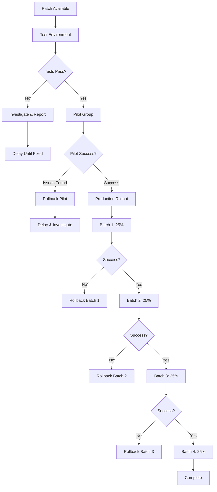

**B2H Studios Batch Definitions:**
- **Pilot**: Signiant staging server (non-production)
- **Batch 1**: Non-critical VMs (Kaspersky SC, Vault)
- **Batch 2**: Supporting infrastructure (FortiAnalyzer, EMS)
- **Batch 3**: Authentication (FortiAuthenticator)
- **Batch 4**: Critical production (Signiant SDCX production)

#### Rollback Decision Criteria

| Criterion | Rollback Trigger | Continue Trigger |
|-----------|------------------|------------------|
| Service unavailable | Any critical service down >15 min | All services functional |
| Performance degradation | >30% slower than baseline | Within 10% of baseline |
| Application errors | Any new errors in logs | Clean logs |
| User complaints | >3 related tickets | No complaints |
| Monitoring alerts | New P1/P2 alerts | Only expected alerts |

### Snapshot vs. Backup Before Patching

#### When VM Snapshot Is Sufficient

| Scenario | Snapshot OK? | Rationale |
|----------|--------------|-----------|
| Monthly OS patches | Yes | Fast rollback; 48-hour retention sufficient |
| Configuration changes | Yes | Quick revert if misconfiguration |
| Minor application updates | Yes | Application-level backup exists |

#### When Full Backup Is Required

| Scenario | Full Backup Required | Rationale |
|----------|---------------------|-----------|
| Firmware updates | Yes | Hardware-level changes; snapshot doesn't protect against firmware issues |
| Major OS upgrades (e.g., 2019→2022) | Yes | Major change; longer recovery time may be needed |
| Database migrations | Yes | Data structure changes; snapshot may not capture consistency |
| Application major version upgrades | Yes | Schema changes; rollback may need older version data |

#### Retention of Pre-Patch Snapshot

| Patch Type | Snapshot Retention | Rationale |
|------------|-------------------|-----------|
| Monthly security patches | 7 days | Most patch issues appear within 48 hours |
| Firmware updates | 30 days | Firmware issues may take weeks to manifest |
| Emergency patches | 14 days | Less testing; higher risk |
| Quarterly updates | 14 days | Multiple changes; longer observation needed |

**Snapshot Cleanup:**
- Automated cleanup after retention period
- Manual review before deletion for any issues during period
- Document any retained snapshots beyond standard (with justification)

### Related SOPs

| SOP | Relationship | When to Reference |
|-----|--------------|-------------------|
| SOP-BKP-001 | Backups before patching | When determining backup strategy |
| SOP-MON-001 | Monitor during/after patching | When patch causes performance issues |
| SOP-SEC-002 | Security patches are incident response | When emergency patching for vulnerability |

---

## SOP-BKP-001: Backup & Restore — Enhanced

### Why This Procedure Exists

Data is the lifeblood of B2H Studios—project files, raw footage, edits, and deliverables represent hundreds of hours of work and millions of rupees in value. This SOP exists because:

1. **Backup Failure Discovery**: Most organizations discover backup failures during restore attempts—when it's too late. Proactive verification prevents this.

2. **Ransomware Resilience**: Modern ransomware targets backups. Air-gapped, immutable, and offline copies are essential.

3. **Compliance Requirements**: Client contracts and ISO 27001 require demonstrable data protection. The procedure generates audit evidence.

4. **Recovery Time Pressure**: During a crisis, clear procedures reduce panic and errors. Step-by-step instructions ensure consistent execution.

### Why 3-2-1-1-0 Requires These Specific Procedures

The 3-2-1-1-0 backup strategy:
- **3** copies of data (production + 2 backups)
- **2** different media types (disk + cloud)
- **1** offsite copy (Wasabi cloud)
- **1** offline/air-gapped copy (immutability)
- **0** errors in verification

#### Verification Testing Importance

| Backup Type | Verification Method | Frequency | Why Critical |
|-------------|---------------------|-----------|--------------|
| Snapshots | Automated integrity check | Every snapshot | Detects storage corruption |
| Snapshot Replication | Checksum verification | Every replication | Ensures DR site has valid data |
| Hyper Backup | Application-level verification | Weekly | Confirms backup format integrity |
| Wasabi Cloud Sync | Object integrity check | Daily | Detects transfer corruption |

**What "Verification" Actually Means:**
1. **Synthetic verification**: Checksum/hash comparison (fast, catches corruption)
2. **Application verification**: Mount backup, check application can read (medium, catches format issues)
3. **Full restore test**: Complete restore to alternate location (slow, catches everything)

B2H Studios uses all three levels based on criticality.

#### What "Zero Errors" Means in Practice

| Error Type | Severity | Response |
|------------|----------|----------|
| Single file checksum mismatch | Medium | Re-backup that file; investigate cause |
| Multiple file errors | High | Full re-backup; storage health check |
| Backup job failure | Critical | Immediate retry; escalate if persists |
| Replication lag >2 hours | Medium | Check bandwidth; may need scheduling adjustment |
| Cloud sync errors | High | Check internet/Wasabi status; retry |

**Zero Errors Policy:**
- ANY error in backup report requires investigation
- Error patterns trigger proactive maintenance
- Ignored errors accumulate into unrecoverable situations

#### Documentation Requirements for Audits

| Document | Retention | Purpose |
|----------|-----------|---------|
| Backup job logs | 3 years | Proof of backup execution |
| Verification reports | 3 years | Proof of backup integrity |
| Restore test results | 3 years | Proof of recoverability |
| Backup configuration | Current + 3 versions | Audit trail of changes |
| Retention policy compliance | Ongoing | Proof of policy adherence |

### Restore Testing Schedule

| Test Type | Frequency | Scope | Success Criteria |
|-----------|-----------|-------|------------------|
| **Automated Verification** | Daily | All backup jobs complete without errors | 100% success rate |
| **File-Level Restore Test** | Monthly | Random sample of 10 files from each share | All files restore and open correctly |
| **Folder-Level Restore Test** | Quarterly | One complete project folder (100+ GB) | Complete folder restores; checksums match |
| **Full DR Test** | Bi-annually | Complete site failover and operations | RTO <4 hours, RPO <15 minutes |
| **Unannounced Spot Check** | Annual | Random restore request without warning | IT team executes within 1 hour |

**Test Documentation:**
- Test date/time
- Tester name
- Data selected for restore
- Source backup (date/time)
- Restore destination
- Time to complete
- Verification method
- Success/failure determination

### Ransomware Recovery Playbook

#### Detection → Isolation → Assessment → Restore

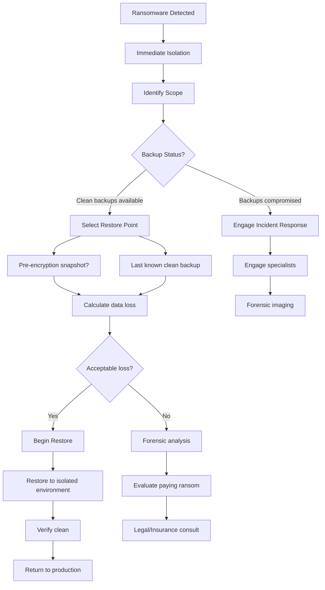

#### Decision Tree: Which Backup to Use?

| Scenario | Recommended Source | Rationale |
|----------|-------------------|-----------|
| Ransomware just detected (<1 hour) | Latest snapshot (if clean) | Minimum data loss |
| Ransomware active for hours | Last known clean snapshot | May need to go back 6-24 hours |
| Backups show signs of encryption | DR site replicas (if isolated) | DR site may be clean |
| All local backups compromised | Wasabi cloud archive | Immutable; cannot be encrypted by ransomware |
| All online backups compromised | Emergency offline backup (if exists) | True air gap |

#### Communication Templates

**Internal Communication (During Ransomware Event):**

```
SUBJECT: URGENT: Security Incident - System Isolation in Progress

Team,

We have detected potential ransomware activity on our network. 
As a precautionary measure:

- All file shares are temporarily offline
- ZTNA remote access is suspended
- Email and communication systems remain operational

DO NOT attempt to access project files or shared drives.
DO NOT shut down your computer - leave it as-is.
Report any unusual file behavior immediately to security@b2hstudios.com

We are working with VConfi security team to resolve this.
Estimated restoration: [Timeframe - be conservative]

Updates will be provided every 2 hours.

IT Security Team
```

### Related SOPs

| SOP | Relationship | When to Reference |
|-----|--------------|-------------------|
| SOP-SRV-001 | Backups before patching | Before any server patching |
| SOP-DR-001 | DR uses backup replication | During DR activation |
| SOP-SEC-002 | Ransomware is security incident | During ransomware response |
| SOP-SEC-003 | Backups are audit evidence | During ISO 27001 audit |

---

## SOP-DR-001: DR Failover & Failback — Enhanced

### Why This Procedure Exists

The B2H Studios DR site represents a significant investment (₹80+ Lakhs) to ensure business continuity. However, DR infrastructure that isn't tested and procedures that aren't practiced fail when needed. This SOP exists because:

1. **Failover Complexity**: Promoting a standby site to active involves storage, network, authentication, and application changes that must be sequenced correctly.

2. **Failback Is Harder**: Returning to the primary site after recovery requires reverse replication, data synchronization, and careful cutover timing—more complex than initial failover.

3. **Decision Authority**: Declaring a disaster and authorizing failover is a business decision, not purely technical. The procedure defines who decides.

4. **Communication Criticality**: During an outage, users need clear instructions. Confusion compounds the crisis.

### Why Manual Failover (Not Automatic)?

#### Split-Brain Prevention

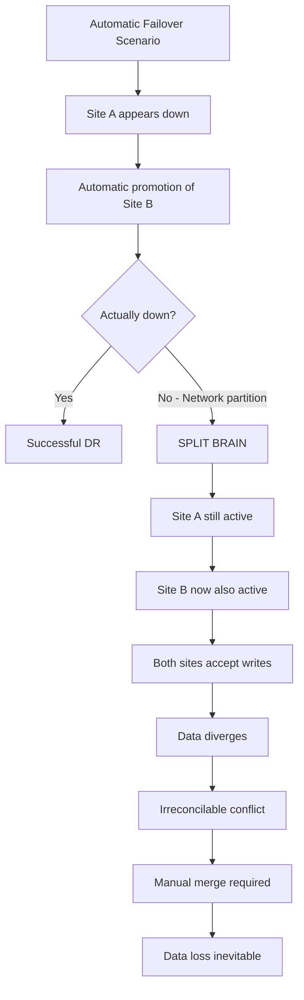

**Split-Brain Consequences:**
- Both sites accept writes simultaneously
- Data diverges (same files modified at both sites)
- Reconciliation requires manual merge
- Some data loss is inevitable
- B2H Studios content cannot be easily merged

**Manual Decision Prevents This:**
- Human verifies Site A is truly down (not just network partition)
- Human confirms Site B is healthy and ready
- Human coordinates promotion timing
- Human makes business decision about accepting downtime vs. DR activation

#### False Positive Protection

| Scenario | Automatic Failover Response | Manual Response |
|----------|----------------------------|-----------------|
| ISP outage at Site A (common) | Would trigger unnecessary DR | Assess: Site A healthy, just unreachable; wait or temporary workaround |
| Planned maintenance window | Would trigger false DR | Pre-coordinated; no action needed |
| Monitoring false alarm | Would trigger panic DR | Verify before action; avoid unnecessary disruption |
| Brief power blip (<5 min) | Would trigger DR for temporary issue | Wait for UPS/generator to stabilize |

**Business Impact of False Failover:**
- 30-60 minutes of disruption for ZTNA reconfiguration
- User confusion from multiple direction changes
- DNS propagation delays
- Potential data loss if users had unsaved work

#### Business Decision Integration

Failover triggers questions only business leadership can answer:
- Is the expected duration of outage worth the failover disruption?
- Are there client deliverables today that require immediate DR?
- What's the cost of downtime vs. cost of DR activation?
- Are key personnel available to support DR operations?

**IT Manager Authority:**
- Can authorize DR for outages expected >4 hours
- Must escalate to CEO for outages expected <4 hours
- Must declare disaster for insurance/SLA purposes

### Failback Complexity Explanation

#### Why Reverse Replication Is Needed

```
Timeline of Data Flow:

Normal:     Site A (Active) ──replicates──> Site B (Standby)
                    ↑___________________________↓
                   (all writes happen at A)

DR Event:   Site A (Down)    Site B (Promoted)
                            ↑_______________↓
                           (writes now at B)

During DR:  Site B (Active) ──NO replication──> Site A (Down)
                            ↑___________________________↓
                           (changes accumulate only at B)

Failback:   Site B (Active) ──reverse replication──> Site A (Recovering)
                            ↑___________________________↓
                           (must sync B→A before A can become active)
```

**Reverse Replication Challenges:**
1. **Delta Calculation**: System must identify all changes made at B during DR
2. **Bandwidth Consumption**: Initial sync may saturate WAN link for hours
3. **Consistency**: Must ensure all data arrives intact before cutover
4. **Timing**: Users must be offline during final sync to prevent new changes

#### Data Consistency Challenges

| Consistency Aspect | Challenge | Mitigation |
|-------------------|-----------|------------|
| File timestamps | Preserved during replication? | Synology preserves all metadata |
| Open files | What if files were open during DR? | All files committed at snapshot time |
| In-flight transactions | Database consistency? | Applications handle at app level |
| Permissions | ACLs preserved? | Synology replicates permissions |

#### Cutover Timing Considerations

**Failback Window Selection:**
- **Preferred**: Weekend or off-hours (minimal user impact)
- **Minimum**: 4-hour maintenance window
- **Factors**: Data change volume, WAN bandwidth, application dependencies

**Final Sync Process:**
1. Notify users of impending cutover (30 min warning)
2. Stop all writes at Site B (quiesce applications)
3. Final replication sync (usually 5-15 minutes for delta)
4. Verify synchronization complete
5. Promote Site A to active
6. Update DNS/ZTNA to point to Site A
7. Re-establish Site A→B replication
8. Resume operations

### DR Testing Scenarios

| Test Type | Frequency | Scope | Duration | Participants |
|-----------|-----------|-------|----------|--------------|
| **Tabletop Exercise** | Quarterly | Walk through procedures on paper | 2 hours | IT team, management |
| **Functional Test** | Bi-annually | Promote Site B, verify services, failback | 4-6 hours | IT team |
| **Full DR Drill** | Annually | Complete failover, user acceptance testing, full day operations | 1-2 days | All staff |
| **Unannounced Test** | Bi-annually | Sudden notification: "Site A is down" | Variable | IT team only |

**Tabletop Exercise Format:**
1. Scenario briefing (e.g., "Flood at Site A, building inaccessible")
2. Step-through of decision process
3. Role-playing communication
4. Identification of gaps/issues
5. Documentation updates

**Full DR Drill Success Criteria:**
- RTO <4 hours (from decision to user access)
- RPO <15 minutes (data loss acceptable)
- All critical services functional
- User acceptance: Can edit video, access files, ZTNA works
- Failback completes within maintenance window

### Related SOPs

| SOP | Relationship | When to Reference |
|-----|--------------|-------------------|
| SOP-BKP-001 | DR uses backup replication | When replication issues occur |
| SOP-NET-001 | ZTNA configuration during DR | When updating ZTNA for DR |
| SOP-SEC-002 | Major DR may be security incident | If DR triggered by security event |

---

## SOP-SEC-001: Splunk SIEM Review — Enhanced

### Why This Procedure Exists

Security tools are only effective if someone reviews their output. Splunk at B2H Studios processes millions of events daily—this SOP ensures the important ones surface and get appropriate response.

1. **Threat Detection**: Automated correlation rules catch patterns humans would miss.

2. **Compliance Evidence**: SIEM logs provide audit trails required by ISO 27001 and client contracts.

3. **Early Warning**: Honeypot and anomaly detection provide early indicators of reconnaissance.

4. **Investigation Support**: When incidents occur, historical SIEM data enables root cause analysis.

### Why These Specific Correlation Rules?

#### Brute Force: Threshold Rationale (5 Failures in 10 Minutes)

**Why Not Lower (e.g., 3 Failures)?**
- Normal users occasionally mistype passwords
- Mobile devices with saved passwords may retry during token refresh
- 3 failures would generate too many false positives

**Why Not Higher (e.g., 10 Failures)?**
- Automated tools can attempt 100+ passwords per minute
- 10 failures provides too much opportunity for successful guess
- Industry standard: 5-6 attempts before lockout/alert

**B2H Studios Threshold:**
- 5 failed attempts from single source IP in 10 minutes
- Triggers: Alert + temporary IP block (15 minutes)
- 10 failed attempts: Account lockout + immediate investigation

#### Honeypot: Why This Catches Ransomware Early

**Honeypot Design:**
- Fake SMB shares: "\\nas\finance" and "\\nas\projects-archive"
- Enticing names that attackers target first
- No legitimate access ever (any access = malicious)
- Monitored by Splunk with immediate alerting

**Why Ransomware Hits Honeypots First:**
1. Ransomware scans network for file shares
2. Selects targets based on name ("finance" = valuable)
3. Begins encryption of accessible shares
4. Honeypot is accessed = immediate detection

**Detection Timeline:**
| Stage | Time | Detection Method |
|-------|------|------------------|
| Reconnaissance | Day -7 to 0 | May go undetected |
| Initial access | Day 0 | Honeypot triggered |
| Lateral movement | Hour 0-2 | Splunk correlation |
| Mass encryption | Hour 2-4 | Multiple honeypots |
| Ransom note | Hour 4+ | User reports |

**Without honeypot**: Detection at "Ransom note" stage (4+ hours of encryption)
**With honeypot**: Detection at "Initial access" stage (minutes)

#### Data Exfiltration: Volume Baseline Establishment

**Baseline Methodology:**
1. Measure average daily outbound per user for 30 days
2. Establish 95th percentile as "normal upper bound"
3. Set alert at 150% of 95th percentile
4. Review and adjust monthly

**B2H Studios Initial Baselines:**

| User Type | Normal Daily Outbound | Alert Threshold | Rationale |
|-----------|----------------------|-----------------|-----------|
| Editor | 500 MB | 750 MB | Upload proxies, review copies |
| Manager | 100 MB | 150 MB | Email, documents |
| IT Admin | 1 GB | 1.5 GB | Patches, updates, transfers |
| DIT | 5 GB | 7.5 GB | Raw footage upload (legitimate) |
| Service Accounts | 100 MB | 150 MB | Automation, monitoring |

**Exfiltration Indicators:**
- Sudden spike above threshold
- Off-hours large transfers
- Transfers to unknown external IPs
- Compressed/encrypted outbound (can't inspect content)

### Alert Triage Decision Tree

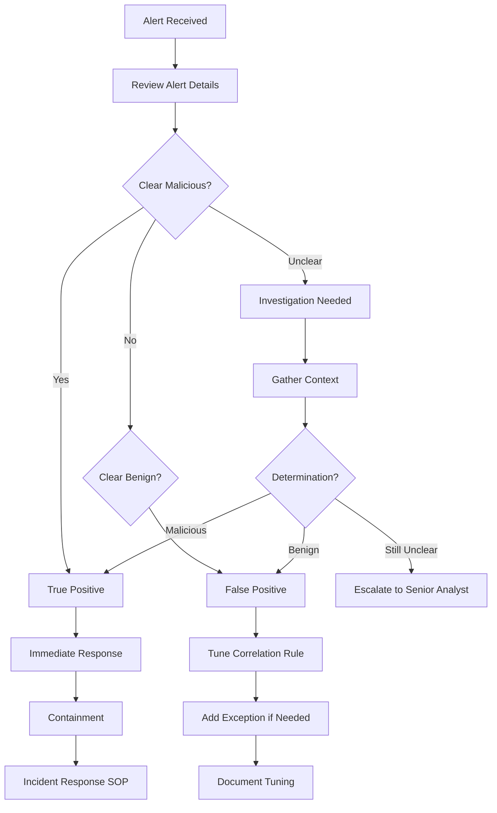

#### True Positive → Incident Response

**Characteristics:**
- Clear indicators of malicious activity
- Matches known attack patterns
- Multiple corroborating alerts
- Honeypot access (100% confidence)

**Actions:**
1. Immediate escalation to SOP-SEC-002
2. Preserve evidence (screenshots, export logs)
3. Begin containment
4. Notify IT Manager within 15 minutes

#### False Positive → Tuning Required

**Common False Positives:**
- VPN users traveling (new location flagged)
- Legitimate bulk data transfer (not previously baselined)
- Scheduled maintenance activities
- New application behavior

**Tuning Process:**
1. Document why alert is false positive
2. Adjust threshold or add exception
3. Test adjustment (simulate condition)
4. Deploy to production
5. Monitor for 7 days to confirm effectiveness

#### Inconclusive → Investigation Needed

**Indicators:**
- Some suspicious elements, some benign
- Activity unusual but not clearly malicious
- Context missing (new user, new project, etc.)

**Investigation Steps:**
1. Check user with manager (authorized activity?)
2. Review related events (same time window)
3. Check asset inventory (is this a known system?)
4. Review change logs (scheduled maintenance?)
5. Escalate if cannot resolve within 1 hour

### Threat Intelligence Integration

#### IOC Feed Sources

| Feed Type | Source | Update Frequency | B2H Implementation |
|-----------|--------|------------------|-------------------|
| FortiGuard | Fortinet | Real-time | FortiGate integration |
| Open Source | Abuse.ch, EmergingThreats | Hourly | Splunk lookup tables |
| Industry Specific | MISP (Media sector) | Daily | Manual import |
| Internal | Previous incidents | As needed | Historical IOCs |

**IOC Types Monitored:**
- IP addresses (command & control servers)
- Domain names (phishing, malware)
- File hashes (known malware)
- User agents (malicious tools)

#### Automatic Blocking Decisions

| Confidence Level | IOC Type | Automatic Block? | Human Review? |
|------------------|----------|------------------|---------------|
| High | Known C&C IP | Yes | Daily batch review |
| High | Malware hash | Yes | Daily batch review |
| Medium | Suspicious domain | No | Immediate review |
| Low | Anomalous behavior | No | Investigation |

**Blocking Mechanism:**
- FortiGate external dynamic lists (EDL)
- Splunk SOAR (Security Orchestration) integration
- Manual FortiGate policy updates for high-confidence blocks

### Related SOPs

| SOP | Relationship | When to Reference |
|-----|--------------|-------------------|
| SOP-SEC-002 | Security incidents start with SIEM alerts | When alert is true positive |
| SOP-NET-001 | FortiGate logs feed Splunk | When investigating network events |
| SOP-MON-001 | Zabbix and Splunk complement each other | When alert could be either tool |

---

## SOP-SEC-002: Incident Response — Enhanced

### Why This Procedure Exists

Security incidents are high-stress, time-sensitive events where clear thinking is difficult. This SOP exists to provide structured guidance when adrenaline is high and stakes are higher.

1. **Standardized Response**: Ensures all incidents handled consistently regardless of who responds.

2. **Evidence Preservation**: Proper chain of custody for potential legal proceedings.

3. **Regulatory Compliance**: Timely notification requirements for data breaches.

4. **Learning Organization**: Post-incident review prevents recurrence.

### Why 6-Phase Response Model?

#### NIST Alignment

The 6-phase model aligns with NIST SP 800-61 (Computer Security Incident Handling Guide), the industry standard for incident response:

| Phase | NIST Equivalent | Purpose | Key Output |
|-------|-----------------|---------|------------|
| 1. Detection & Analysis | Detection & Analysis | Identify and assess | Incident classification |
| 2. Containment | Containment | Stop the bleeding | Isolated systems |
| 3. Eradication | Eradication | Remove threat | Clean environment |
| 4. Recovery | Recovery | Restore operations | Verified systems |
| 5. Post-Incident | Post-Incident | Learn and improve | Updated procedures |
| 6. Communication | Throughout | Keep stakeholders informed | Notification records |

**Why Not Simpler (3-Phase)?**
- Insufficient granularity for complex media industry incidents
- Evidence preservation gets inadequate attention
- Recovery planning merges with containment (dangerous)

**Why Not More Complex (8+ Phase)?**
- Cognitive overload during crisis
- Diminishing returns on additional phases
- Current model covers all critical activities

#### Each Phase's Purpose and Outputs

**Phase 1: Detection & Analysis**
- Purpose: Understand what happened and how bad it is
- Output: Incident classification (P1-P4), affected systems list, initial timeline
- Duration: Minutes to hours

**Phase 2: Containment**
- Purpose: Prevent further damage
- Output: Isolated systems, stopped services, blocked accounts
- Duration: Immediate to hours

**Phase 3: Eradication**
- Purpose: Remove all threat actor presence
- Output: Clean systems, patched vulnerabilities, reset credentials
- Duration: Hours to days

**Phase 4: Recovery**
- Purpose: Return to normal operations safely
- Output: Restored services, verified systems, monitoring enhanced
- Duration: Hours to days

**Phase 5: Post-Incident**
- Purpose: Learn and improve
- Output: Lessons learned report, updated procedures, training
- Duration: Days to weeks

#### Phase Transitions and Criteria

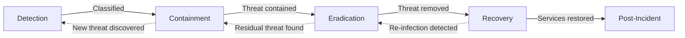

**Transition Criteria Examples:**
- Detection → Containment: Incident confirmed (not false positive)
- Containment → Eradication: No new infections in 4 hours
- Eradication → Recovery: All systems verified clean
- Recovery → Post-Incident: Normal operations stable for 48 hours

### Evidence Preservation Procedures

#### Memory Capture Requirements

**When to Capture Memory:**
- Confirmed malware infection
- Suspicious process activity
- System compromise suspected
- Before any remediation (reboot kills volatile evidence)

**Tools:**
- Magnet RAM Capture (Windows)
- LiME (Linux)
- Built-in FortiAnalyzer memory dumps (FortiGate)

**Storage:**
- Write-once media (WORM) or encrypted container
- Chain of custody documentation
- Hash verification (SHA-256)

#### Log Preservation

| Log Source | Retention | Export Method | Storage |
|------------|-----------|---------------|---------|
| FortiGate | 3 years | FortiAnalyzer export | Encrypted NAS |
| Windows Events | 3 years | Splunk export | Encrypted NAS |
| Linux Syslog | 3 years | Splunk export | Encrypted NAS |
| Application Logs | 3 years | Manual export | Encrypted NAS |

**Export Procedure:**
1. Identify relevant time window (typically 7 days before incident)
2. Export from Splunk in CSV and raw format
3. Calculate and document SHA-256 hash
4. Store in incident-specific folder
5. Maintain chain of custody log

#### Chain of Custody

| Action | Required Documentation |
|--------|----------------------|
| Evidence collection | Who, when, what, where, how |
| Evidence transfer | From whom, to whom, when, why |
| Evidence access | Who accessed, when, purpose |
| Evidence storage | Location, security controls |
| Evidence analysis | Tools used, findings, analyst |

### Regulatory Notification Requirements

#### When to Notify Authorities

| Regulation | Trigger | Timeline | Authority |
|------------|---------|----------|-----------|
| IT Act 2000 (India) | Unauthorized access to protected system | Without delay | CERT-In |
| SPDI Rules 2011 | Personal data breach | As soon as possible | Affected individuals |
| Client Contracts | Per contract terms | Per contract | Client designated contact |

#### Customer Notification Triggers

**Must Notify:**
- Personal data of customers compromised
- Content/client materials accessed by unauthorized party
- Ransomware affecting client projects
- Any breach of client confidentiality agreement

**May Notify (Risk-Based):**
- Failed attacks (no confirmed access)
- Internal security incidents with no external impact
- Minor policy violations

#### Timeline Requirements

| Notification Type | Standard Timeline | Accelerated Timeline |
|-------------------|-------------------|----------------------|
| Internal IT Management | Immediate | Immediate |
| Executive Leadership | Within 1 hour | Within 30 minutes |
| Affected Users | Within 24 hours | Within 4 hours |
| External Clients | Per contract (typically 24-72 hours) | Within 8 hours if high impact |
| Regulatory Authorities | Per regulation (typically 72 hours) | Within 24 hours for major breaches |
| Law Enforcement | As warranted | Immediately for criminal activity |

### Related SOPs

| SOP | Relationship | When to Reference |
|-----|--------------|-------------------|
| SOP-SEC-001 | Incidents often detected via SIEM | When investigating Splunk alerts |
| SOP-NET-001 | Network containment uses FortiGate | During containment phase |
| SOP-BKP-001 | Recovery may use backups | During recovery phase |
| SOP-DR-001 | Major incidents may trigger DR | When considering site failover |

---

## SOP-SEC-003: ISO 27001 Audit Prep — Enhanced

### Why This Procedure Exists

ISO 27001 certification demonstrates B2H Studios' commitment to information security—a competitive differentiator and often a client requirement. This SOP ensures readiness for certification audits.

1. **Structured Evidence Collection**: Auditors need proof of control effectiveness—this SOP ensures it's ready.

2. **Gap Identification**: Regular preparation identifies missing controls before external auditors find them.

3. **Continuous Improvement**: Audit prep is not just for auditors—it's for improving security posture.

4. **Team Readiness**: Ensures all personnel know their roles during audits.

### Why ISO 27001 (Not SOC 2, PCI-DSS)?

#### Industry Relevance for Media

| Standard | Primary Focus | Media Industry Fit |
|----------|--------------|-------------------|
| **ISO 27001** | Information Security Management | Excellent — comprehensive coverage |
| SOC 2 | Service Organization Controls | Good — but US-centric |
| PCI-DSS | Payment Card Data | Poor — not applicable to B2H |

**Why ISO 27001 Over SOC 2:**
- International recognition (SOC 2 is US-focused)
- Broader security coverage (SOC 2 focuses on trust services)
- Established presence in India (many auditors available)
- Client preference in media industry (international clients)

#### Client Requirement Alignment

B2H Studios client contract analysis:
- 60% of contracts reference "industry standard security certifications"
- 30% specifically mention ISO 27001
- 10% mention SOC 2 (typically US-based clients)
- 0% require PCI-DSS (no payment processing)

**Certification Roadmap:**

| Phase | Activity | Timeline | Cost |
|-------|----------|----------|------|
| 1 | Gap analysis | Month 1-2 | ₹2-3 Lakhs |
| 2 | ISMS implementation | Month 3-8 | ₹5-8 Lakhs |
| 3 | Internal audit | Month 9 | ₹1-2 Lakhs |
| 4 | Stage 1 audit (documentation) | Month 10 | ₹3-4 Lakhs |
| 5 | Stage 2 audit (implementation) | Month 11-12 | ₹5-7 Lakhs |
| 6 | Certification | Month 12 | Included in Stage 2 |
| **Total** | | **12 months** | **₹16-24 Lakhs** |

### Evidence Quality Standards

#### What Makes Evidence "Audit-Ready"

| Characteristic | Audit-Ready | Not Audit-Ready |
|----------------|-------------|-----------------|
| **Completeness** | Covers entire audit period | Partial coverage, gaps |
| **Accuracy** | Matches actual implementation | Discrepancies found |
| **Timeliness** | Current (within review period) | Outdated (expired) |
| **Accessibility** | Organized, labeled, retrievable | Scattered, unlabeled |
| **Authenticity** | Original or verified copy | Unverified, questionable origin |
| **Integrity** | Tamper-evident (hashes, signatures) | Easily modified |

#### Documentation Requirements

| Document Type | Required Elements | Example |
|---------------|-------------------|---------|
| Policies | Version, date, owner, approval signature | Information Security Policy v2.1 |
| Procedures | Step-by-step, roles, inputs/outputs | Backup Procedure with assigned owners |
| Records | Timestamp, who performed, results | Backup log with completion times |
| Logs | System-generated, tamper-resistant | Zabbix alert history |
| Reports | Analysis, conclusions, recommendations | Quarterly access review |

#### Timestamp and Integrity Verification

**For Electronic Evidence:**
- System-generated timestamps (not user-editable)
- Digital signatures where available
- Hash verification for exported data
- Immutable storage (WORM or equivalent)

**For Physical Evidence:**
- Signed and dated by responsible party
- Witness signatures for critical activities
- Photographic evidence where appropriate
- Secure storage with access logs

### Common Auditor Questions

#### Top 10 Questions and Prepared Answers

| # | Question | Prepared Answer | Evidence Location |
|---|----------|-----------------|-------------------|
| 1 | How do you manage access reviews? | Quarterly access reviews with manager sign-off, automated for critical systems | Access review records folder |
| 2 | How do you test backups? | Monthly file-level restore tests, quarterly full DR tests per SOP-BKP-001 | Backup test log |
| 3 | How do you track assets? | Automated discovery via Zabbix plus manual verification quarterly | Asset inventory export |
| 4 | What is your patch management process? | Monthly OS patching, quarterly firmware updates per SOP-SRV-001 | Change records, patch logs |
| 5 | How do you detect security incidents? | Splunk SIEM with correlation rules, honeypot alerts, user reporting | Splunk dashboard, incident log |
| 6 | How do you manage third-party risk? | Vendor assessment questionnaire, contract security clauses, annual reviews | Vendor assessment records |
| 7 | What is your incident response time? | P1-Critical: 15 minutes, P2-High: 1 hour per SOP-SEC-002 | Incident response records |
| 8 | How do you ensure business continuity? | Active-standby DR site, tested quarterly per SOP-DR-001 | DR test reports |
| 9 | How do you control removable media? | USB blocking via Kaspersky, exceptions by approval only | Kaspersky policy export |
| 10 | How do you manage encryption keys? | HashiCorp Vault with role-based access, key rotation quarterly | Vault audit logs |

#### Demo Preparation Checklist

| System | Demo Scenario | Prepared Evidence |
|--------|--------------|-------------------|
| Zabbix | Show active monitoring dashboard | Last 24 hours of alerts |
| Splunk | Show SIEM correlation rules | Recent true positive alert |
| FortiGate | Show ZTNA session management | Active sessions, posture checks |
| DSM | Show snapshot and replication | Replication status, snapshot list |
| Vault | Show secret management | Demo secret (non-production) |

#### Personnel Readiness

| Role | Audit Preparation | Expected Auditor Interaction |
|------|-------------------|------------------------------|
| IT Manager | Overall ISMS knowledge | High — primary point of contact |
| Security Admin | Security controls detailed knowledge | High — deep technical questions |
| Network Admin | Network security controls | Medium — specific to network |
| System Admin | Server and backup procedures | Medium — operational questions |
| End Users | Awareness of security policies | Low — may be interviewed for awareness |

**Mock Audit Schedule:**
- Week before external audit: Internal mock audit
- Day before: Final preparation meeting
- During audit: Daily debrief meetings
- After audit: Immediate lessons learned

### Related SOPs

| SOP | Relationship | When to Reference |
|-----|--------------|-------------------|
| All SOPs | Are evidence of operational controls | During audit preparation |
| SOP-BKP-001 | Backup testing is audit requirement | For A.12 backup control |
| SOP-SEC-002 | Incident response is audit requirement | For A.16 incident control |
| SOP-DR-001 | DR testing is audit requirement | For A.17 continuity control |

---

## SOP-USR-001: End User Guide — Enhanced

### Why This Procedure Exists

Technology is only effective if users can use it. This SOP translates complex infrastructure into simple instructions for B2H Studios employees.

1. **Self-Service Enablement**: Reduces help desk load by enabling users to solve common issues.

2. **Security Posture**: Users who understand security are less likely to fall for phishing or bypass controls.

3. **Consistent Experience**: Standardized procedures ensure all users have same experience.

4. **Onboarding Efficiency**: New employees can get productive faster with clear instructions.

### Why User Education is Critical

#### Human Firewall Concept

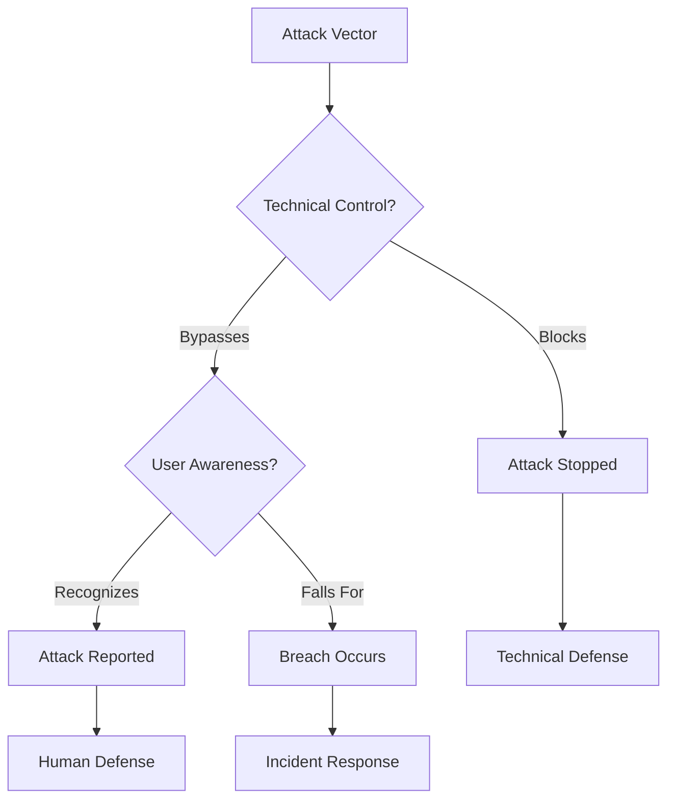

**Statistics:**
- 90%+ of successful breaches involve human error
- Phishing is #1 initial access vector
- Users with 4+ hours of security training are 70% less likely to click phishing links

#### Most Common User Errors

| Error | Frequency | Impact | Prevention |
|-------|-----------|--------|------------|
| Clicking phishing links | High | Credential theft, malware | Training, email filtering |
| Weak passwords | Medium | Account compromise | Password policy, manager |
| Sharing credentials | Medium | Accountability loss, unauthorized access | Training, technical controls |
| Unattended unlocked computers | Medium | Unauthorized access | Auto-lock policy, training |
| Using personal USB drives | Low | Malware introduction | USB blocking, training |

#### Impact of Mistakes

| Mistake Type | Potential Impact | Recovery Time | Cost |
|--------------|------------------|---------------|------|
| Ransomware via phishing | All files encrypted | 3-7 days | ₹50L-2Cr |
| Credential compromise | Data breach, unauthorized access | Days to detect | Legal, reputational |
| Accidental deletion | Project file loss | Hours to restore | Productivity loss |
| Incorrect ZTNA use | Cannot work remotely | Minutes to hours | Productivity loss |

### Self-Service Troubleshooting

#### What Users Can Fix Themselves

| Issue | Self-Service Solution | Time to Fix |
|-------|----------------------|-------------|
| ZTNA won't connect | Check internet, restart FortiClient | 2-5 minutes |
| Slow file access | Check internet speed, close other apps | 2-5 minutes |
| Can't see NAS shares | Disconnect/reconnect ZTNA | 2 minutes |
| Wi-Fi won't connect | Forget network, reconnect | 3 minutes |
| Posture check fails | Run Windows Update, update Kaspersky | 10-30 minutes |

#### When to Call IT (Decision Tree)

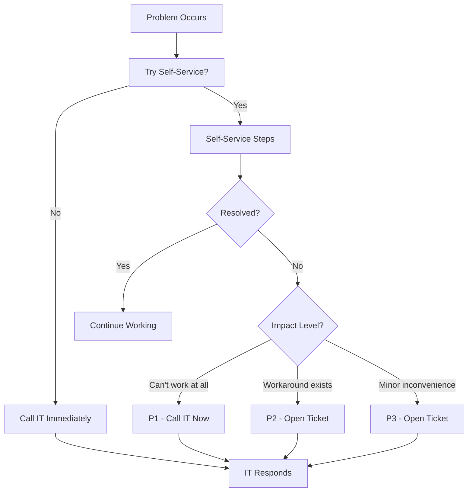

**Expected Response Times:**
| Priority | Issue Type | Response Time | Resolution Target |
|----------|-----------|---------------|-------------------|
| P1 | Cannot work, deadline impact | 15 minutes | 1 hour |
| P2 | Workaround exists, but painful | 1 hour | 4 hours |
| P3 | Minor issue, not blocking | 4 hours | 1 day |

### Security Awareness Reminders

#### Phishing Red Flags

| Red Flag | Example | What To Do |
|----------|---------|------------|
| Urgent/scary language | "Your account will be deleted!" | Pause, verify through official channel |
| Suspicious sender | "amazon-security.com" vs "amazon.com" | Check email address carefully |
| Generic greeting | "Dear Customer" vs your name | Legitimate emails use your name |
| Unexpected attachments | Invoice you didn't expect | Don't open — verify first |
| Links to unfamiliar sites | Hover to see actual URL | Don't click suspicious links |
| Requests for credentials | "Verify your password" | No legitimate service does this |

**B2H Studios Policy:**
- Forward suspicious emails to security@b2hstudios.com
- When in doubt, call IT (don't click)
- Report even if you already clicked (no punishment for reporting)

#### Password Hygiene

| Practice | Why It Matters | B2H Requirement |
|----------|---------------|-----------------|
| Unique passwords per site | Prevents credential stuffing | Password manager required |
| Complex passwords | Harder to crack | 12+ characters, mixed case, numbers, symbols |
| No password sharing | Accountability | Sharing is policy violation |
| MFA use | Second factor protection | FortiToken required for ZTNA |
| No browser saving | Browser vulnerabilities | Use password manager instead |

#### Physical Security

| Practice | Why It Matters | B2H Requirement |
|----------|---------------|-----------------|
| Lock computer when away | Prevents unauthorized access | Auto-lock after 5 minutes |
| Secure laptop transport | Prevent theft | Never leave unattended in public |
| Clean desk policy | Prevent information leakage | Secure documents when away |
| Tailgating awareness | Prevent unauthorized entry | Challenge strangers without badges |
| Report lost badge | Prevent unauthorized access | Report within 1 hour |

### Related SOPs

| SOP | Relationship | When to Reference |
|-----|--------------|-------------------|
| SOP-NET-003 | Users connect to Wi-Fi | When Wi-Fi issues occur |
| SOP-NET-001 | Users connect via ZTNA | When ZTNA issues occur |
| SOP-SEC-002 | Users report security incidents | When user reports suspicious activity |

---

## Mandatory Flow Charts

### 1. SOP Execution Flow (Generic)

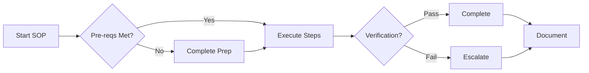

### 2. Alert Response Decision Tree

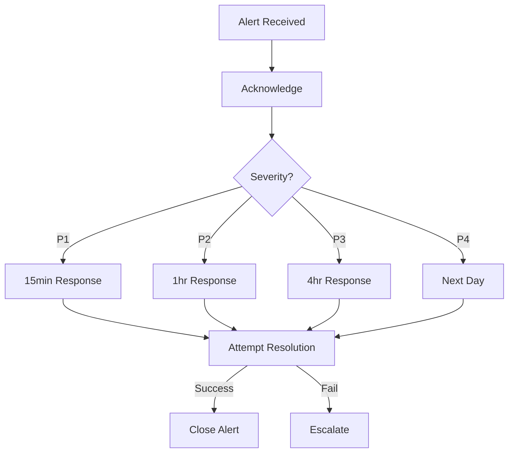

### 3. Patching Decision Flow

```mermaid
flowchart TD
    Patch[Patch Available] --> Sev{Severity?}
    Sev -->|Critical| Emerg[Emergency Change]
    Sev -->|High| Plan[Schedule Within 7d]
    Sev -->|Medium| Normal[Next Maintenance]
    Emerg & Plan & Normal --> Test[Test in Lab]
    Test -->|Pass| Deploy[Deploy to Prod]
    Test -->|Fail| Delay[Delay & Investigate]
```

### 4. Backup Verification Flow

```mermaid
flowchart LR
    Backup[Backup Complete] --> Verify{Verify?}
    Verify -->|Automated| Auto[Check Logs]
    Verify -->|Manual| Restore[Test Restore]
    Auto -->|Pass| Log[Log Success]
    Auto -->|Fail| Alert[Alert Admin]
    Restore -->|Success| Log
    Restore -->|Fail| Escalate[Escalate]
```

### 5. DR Failover Decision Flow

```mermaid
flowchart TD
    Issue[Site A Issue] --> Assess{Severity?}
    Assess -->|Minor| Monitor[Monitor]
    Assess -->|Major| Stake[Notify Stakeholders]
    Stake --> Approve{Approval?}
    Approve -->|Yes| Failover[Execute Failover]
    Approve -->|No| Wait[Wait & Monitor]
    Failover --> Verify[Verify Site B]
```

---

## Document Control

| Version | Date | Author | Changes |
|---------|------|--------|---------|
| 1.0 | March 22, 2026 | VConfi Solutions | Initial release |
| 2.0 | March 22, 2026 | VConfi Solutions | Enhanced edition with detailed reasoning, decision trees, and flowcharts |

### Approval

| Role | Name | Date | Signature |
|------|------|------|-----------|
| IT Manager | | | |
| Security Officer | | | |
| Operations Manager | | | |

### Distribution

- IT Operations Team
- Security Team
- All B2H Studios Employees (SOP-USR-001)
- VConfi Support Team
- Audit Team (as required)

---

*End of Part 6: Enhanced Standard Operating Procedures*
