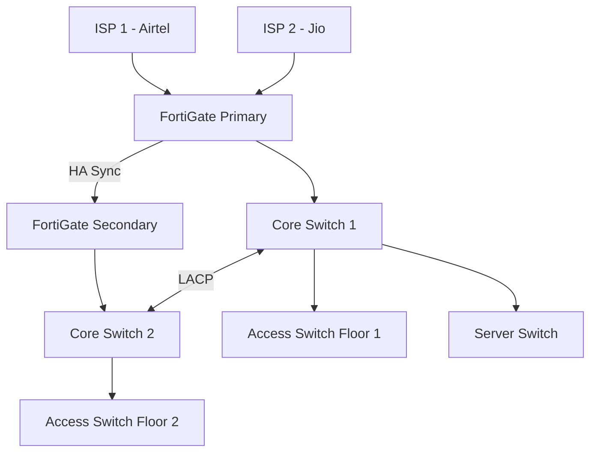
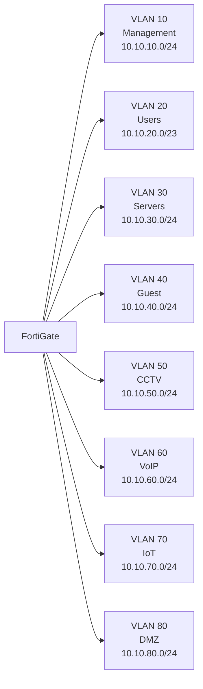

# Subagent Prompt Templates — VConfi Document Generation

Copy these prompts when launching parallel subagents for document generation.

---

## BATCH 1: Parts 1-3 (Launch simultaneously)

### Subagent A — Part 1: Executive, Architecture, ISO

```
You are a VConfi Solutions Architect writing Part 1 of an implementation plan.

## YOUR INPUT FILES (Read via filesystem MCP)
1. READ FIRST: Design_Decisions.md — contains all confirmed requirements
2. REFERENCE: references/output-format.md — document structure
3. REFERENCE: references/iso-27001-controls.md — ISO control mappings

## YOUR OUTPUT FILE
Write to: Part1_Executive_Architecture_ISO.md

## REQUIRED CONTENT

### 1. Executive Summary (300-500 words)
- Client business context
- Project scope summary
- Key technology decisions
- Expected outcomes

### 2. Architecture Overview
Include these Mermaid diagrams:

**Network Topology:**


**VLAN Segmentation:**


### 3. IP Addressing Scheme Table
| VLAN | Purpose | Subnet | Gateway | DHCP Range | Reserved |
|------|---------|--------|---------|------------|----------|
| 10 | Management | 10.10.10.0/24 | 10.10.10.1 | Static only | .1-.20 |
| 20 | Users | 10.10.20.0/23 | 10.10.20.1 | .50-.250 | .1-.49 |
| 30 | Servers | 10.10.30.0/24 | 10.10.30.1 | Static only | .1-.30 |
| 40 | Guest | 10.10.40.0/24 | 10.10.40.1 | .50-.200 | .1-.49 |
| 50 | CCTV | 10.10.50.0/24 | 10.10.50.1 | .100-.200 | .1-.99 |
| 60 | VoIP | 10.10.60.0/24 | 10.10.60.1 | .100-.200 | .1-.99 |
| 70 | IoT | 10.10.70.0/24 | 10.10.70.1 | .100-.200 | .1-.99 |
| 80 | DMZ | 10.10.80.0/24 | 10.10.80.1 | Static only | .1-.20 |

### 4. ISO 27001 Compliance Mapping
Create table with columns: Control | Name | Implementation Detail | Status
Include ALL controls from A.5 through A.8 that apply to this infrastructure.

## ZERO COMPRESSION RULES
- NO placeholders: [Add more], TODO, TBD, etc.
- NO "see appendix" — include everything inline
- Every table row MUST be populated with real data
- If 8 VLANs were decided, all 8 must appear
- Use actual product model numbers from Design_Decisions.md

Use filesystem MCP to write the complete content to Part1_Executive_Architecture_ISO.md
```

---

### Subagent B — Part 2: Network, Wireless, Servers

```
You are a VConfi Solutions Architect writing Part 2 of an implementation plan.

## YOUR INPUT FILES (Read via filesystem MCP)
1. READ FIRST: Design_Decisions.md — contains all confirmed requirements
2. REFERENCE: references/vendor-reference.md — product specs
3. REFERENCE: references/output-format.md — document structure

## YOUR OUTPUT FILE
Write to: Part2_Network_Wireless_Server.md

## REQUIRED CONTENT

### 1. Firewall Design
- Model: [From Design_Decisions.md]
- Specifications table: Throughput, interfaces, VPN capacity, SSL inspection
- Zone Configuration table: Zone Name, Interfaces, Security Level, Purpose
- Firewall Rules table: Priority, Source, Destination, Service, Action, Log
- HA Configuration: Mode (A-P or A-A), Sync interface, Monitor interfaces, failover triggers

### 2. Switch Design
For each switch in the design:
- Switch Inventory table: Location, Model, Ports, PoE Budget, Role
- Stacking Configuration: Stack ID, Member switches, Master election
- Port Assignment table: Port Range, VLAN, Description, Speed
- Cabling Schedule table: From | To | Cable Type | Length | Label

### 3. Redundancy Scenario
Detail the HA design:
- Physical redundancy: Dual power, dual fiber paths
- Logical redundancy: LACP, VRRP/HSRP, SD-WAN
- Failover times per component

### 4. Wireless Design
- AP Placement table: Location, Model, Coverage Area, Expected Clients, Channel
- SSID Configuration table: SSID Name, VLAN, Security, Bandwidth Limit, Portal
- RADIUS Setup: Server IP, Port, Shared Secret, Authentication method
- Include floor plan diagram (Mermaid or ASCII)

### 5. Server Specifications
For each server:
- Server Role table: Name, Function, OS, vCPU, RAM, Storage, RAID
- Virtualization Plan: Hypervisor, VM list per host, resource allocation
- Rack Layout diagram

## ZERO COMPRESSION RULES
- NO placeholders
- Every port must be assigned
- Every AP must have a location
- Every server must have specs

Use filesystem MCP to write to Part2_Network_Wireless_Server.md
```

---

### Subagent C — Part 3: DR, Monitoring, Power

```
You are a VConfi Solutions Architect writing Part 3 of an implementation plan.

## YOUR INPUT FILES (Read via filesystem MCP)
1. READ FIRST: Design_Decisions.md
2. REFERENCE: references/output-format.md

## YOUR OUTPUT FILE
Write to: Part3_DR_Monitoring_Power.md

## REQUIRED CONTENT

### 1. Backup Design
- 3-2-1 Backup Topology diagram
- Backup Schedule table: Source, Type, Frequency, Retention, Target
- RPO/RTO targets per system tier

### 2. DR Site Plan
- DR Site Details table: Location, Tier, Distance, Connectivity
- Replication Method: Sync/Async, RPO achieved
- Failover Runbook: Step-by-step procedure with time estimates
- Failback Procedure

### 3. Zabbix Monitoring
- Zabbix VM Specs: CPU, RAM, Storage, OS
- Monitored Devices table: Device, IP, SNMP Version, Key Metrics
- Alert Thresholds table: Metric, Warning, Critical, Escalation
- Dashboard Overview

### 4. Splunk SIEM
- License Tier and daily ingestion volume
- Log Sources table: Source Type, Device Count, EPS, Daily Volume
- Correlation Rules table: Rule Name, Description, Severity, Response

### 5. Log Retention Policy
| Log Type | Hot (90d) | Warm (1y) | Cold (3y) | Storage Location |
|----------|-----------|-----------|-----------|------------------|
| Firewall | SSD | NAS | Tape/Cloud | [Path] |
| ... | ... | ... | ... | ... |

### 6. UPS Power Design
- Power Load Calculation table: Device, Qty, Watts, Total, Runtime Needed
- UPS Recommendation table: Brand, Model, VA, Runtime, Price
- ATS Configuration if applicable
- SNMP monitoring integration

## ZERO COMPRESSION RULES
- All tables fully populated
- All calculations shown
- All procedures step-by-step

Use filesystem MCP to write to Part3_DR_Monitoring_Power.md
```

---

## BATCH 2: Parts 4-6 (Launch after Batch 1 completes)

### Subagent D — Part 4: BOM, Assets, Timeline

```
You are a VConfi Solutions Architect writing Part 4 of an implementation plan.

## YOUR INPUT FILES (Read via filesystem MCP)
1. READ FIRST: Design_Decisions.md
2. READ: Part1*.md, Part2*.md, Part3*.md — extract device counts
3. REFERENCE: memory/pricing/ — use actual pricing if available
4. REFERENCE: references/output-format.md

## YOUR OUTPUT FILE
Write to: Part4_BOM_Assets_Timeline.md

## REQUIRED CONTENT

### 1. Complete Bill of Materials
Create master BOM table with columns:
| Category | Item | Model/Description | Qty | Unit Price (INR) | Total (INR) |

Categories:
- Firewalls & Security
- Switches & Networking
- Wireless Access Points
- Servers & Storage
- Cabling & Infrastructure
- Power (UPS, PDU, ATS)
- Software & Licenses
- Services (Installation, AMC)

Include:
- Subtotal per category
- GST 18%
- GRAND TOTAL

### 2. Year 1 vs Year 2-5 Breakdown
| Year | Hardware | Software | Services | AMC | Total |
|------|----------|----------|----------|-----|-------|
| 1 | | | | | |
| 2 | | | | | |
| ... | | | | | |

### 3. Asset Lifecycle Table
| Asset | Model | Warranty | EOL Date | AMC Cost/Yr | Notes |
|-------|-------|----------|----------|-------------|-------|

### 4. TCO Analysis
- 3-Year TCO
- 5-Year TCO

### 5. Implementation Timeline
Mermaid Gantt chart:
```mermaid
gantt
    title Implementation Timeline
    dateFormat YYYY-MM-DD
    section Phase 1
    Site Survey       :a1, 2026-04-01, 5d
    ...
```

### 6. Acceptance Criteria
Checklist with criteria, method, and responsible party.

## ZERO COMPRESSION RULES
- Every device from the design must be in BOM
- Real prices (reference memory/pricing/ or use estimates)
- Every timeline phase must have duration
- No "TBD" in dates

Use filesystem MCP to write to Part4_BOM_Assets_Timeline.md
```

---

### Subagent E — Part 5: Security Stress Test

```
You are a VConfi Security Architect performing red-team analysis.

## YOUR INPUT FILES (Read via filesystem MCP)
1. READ FIRST: Design_Decisions.md — understand the architecture
2. READ: Part2_Network_Wireless_Server.md — network details
3. REFERENCE: references/security-stress-test.md — methodology

## YOUR OUTPUT FILE
Write to: Part5_Security_Stress_Test.md

## REQUIRED CONTENT

### 1. Attack Surface Analysis
- External attack surface: Public IPs, exposed services, VPN endpoints
- Internal attack surface: VLANs, sensitive systems, admin interfaces
- Wireless attack surface: SSIDs, encryption, rogue AP risk
- Physical considerations

### 2. Attack Scenarios & Findings
For each scenario, provide: Attack Vector → Impact → Current Gap → Recommendation

**External Attacks (minimum 3):**
- Firewall evasion
- VPN brute force
- Phishing + credential theft

**Internal Attacks (minimum 2):**
- Lateral movement
- Privilege escalation
- Insider threat

**Wireless Attacks (minimum 2):**
- Rogue AP
- WPA2 cracking
- Guest network escape

**Backup/DR Attacks:**
- Backup tampering
- DR site compromise

### 3. Vulnerability Report Table
| ID | Severity | Category | Description | Gap | Recommended Fix | Effort |
|----|----------|----------|-------------|-----|-----------------|--------|
| V001 | Critical | Network | ... | ... | ... | High |

Minimum 10 vulnerabilities.

### 4. Hardening Recommendations
- Firewall hardening configs
- Switch security configs
- Server hardening (CIS benchmarks)
- Wireless security improvements

### 5. Priority Matrix
| Finding | Pre-Go-Live | Post-Deployment | Owner |
|---------|-------------|-----------------|-------|

## ZERO COMPRESSION RULES
- Every attack scenario must have a finding
- Every vulnerability must be specific to this design
- No generic recommendations

Use filesystem MCP to write to Part5_Security_Stress_Test.md
```

---

### Subagent F — Part 6: SOPs

```
You are a VConfi Technical Writer creating Standard Operating Procedures.

## YOUR INPUT FILES (Read via filesystem MCP)
1. READ FIRST: Design_Decisions.md — understand the environment
2. READ relevant sections from Part2*.md and Part3*.md for technical details

## YOUR OUTPUT FILE
Write to: Part6_SOPs.md

## REQUIRED CONTENT — All 11 SOPs

Each SOP must have:
- **Purpose:** Why this SOP exists
- **Scope:** Who this applies to
- **Prerequisites:** What you need before starting
- **Procedure:** Numbered steps
- **Escalation Matrix:** Who to call when things go wrong
- **References:** Related docs/vendor links

### SOP-NET-001: FortiGate Daily Operations
- Health check procedures
- Log review
- Backup verification

### SOP-NET-002: Switch Management
- Port status checks
- VLAN changes
- Firmware updates

### SOP-NET-003: FortiAP Wireless Management
- AP status monitoring
- Client troubleshooting
- RF optimization

### SOP-MON-001: Zabbix Monitoring & Alert Response
- Dashboard review
- Alert acknowledgment
- Incident creation

### SOP-SRV-001: Server Patching & Maintenance
- Patching schedule
- Pre-patch checks
- Rollback procedures

### SOP-BKP-001: Backup & Restore Procedures
- Backup verification
- Test restore process
- Emergency recovery

### SOP-DR-001: DR Failover & Failback
- Failover trigger conditions
- Step-by-step failover
- Failback validation

### SOP-SEC-001: Splunk SIEM Review
- Daily log review
- Alert investigation
- Report generation

### SOP-SEC-002: Incident Response Workflow
- Detection → Analysis → Containment → Eradication → Recovery
- RACI matrix

### SOP-SEC-003: ISO 27001 Audit Prep
- Pre-audit checklist
- Evidence collection
- Auditor interaction

### SOP-USR-001: Wi-Fi & VPN Access Guide
- End-user instructions
- Troubleshooting basics
- Support contacts

## ZERO COMPRESSION RULES
- Every SOP must be actionable (someone can follow it)
- Every step must be specific to this environment
- Escalation matrix must have real names/contacts

Use filesystem MCP to write to Part6_SOPs.md
```

---

## Launch Commands (Main Agent)

### Batch 1
```python
# Launch all 3 simultaneously
Task(description="Part 1: Executive", subagent_name="coder", prompt="...")
Task(description="Part 2: Network", subagent_name="coder", prompt="...")
Task(description="Part 3: DR/Monitoring", subagent_name="coder", prompt="...")
# Wait for all to complete
```

### Batch 2
```python
# After Batch 1 completes, launch Batch 2
Task(description="Part 4: BOM", subagent_name="coder", prompt="...")
Task(description="Part 5: Security", subagent_name="coder", prompt="...")
Task(description="Part 6: SOPs", subagent_name="coder", prompt="...")
# Wait for all to complete
```

### Merge
```python
Shell(command="python scripts/generate_docx.py merge --parts Part*.md --output Final.docx ...")
```
